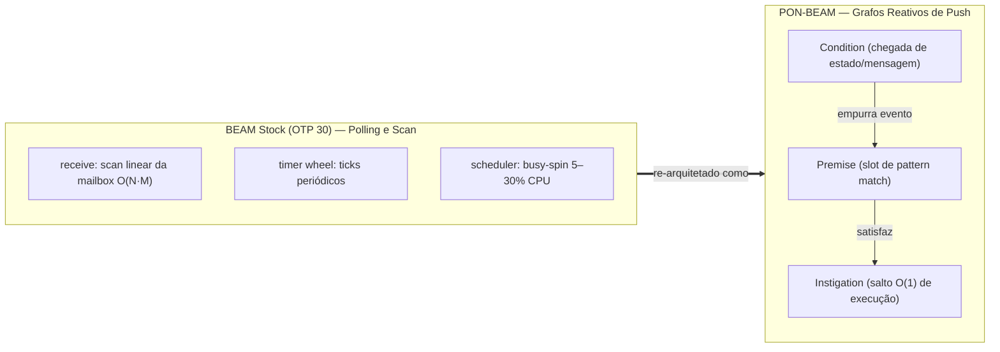

# PON-BEAM: um paradigma orientado a notificações dentro da máquina virtual do Erlang

> Imagem de capa: radar holístico de desempenho com dados reais coletados pelo harness de benchmarks do projeto.

## 1. A pergunta que move este projeto

Todo programador Elixir ou Erlang já ouviu o mantra: **"a BEAM é uma máquina virtual altamente concorrente, com milhões de processos leves, trocas de contexto em microsegundos e escalabilidade quase linear"**. E isso é verdade — para o *modelo de programação*.

Mas quando você abre o código em C da ERTS (Erlang Run-Time System) e olha *como a máquina funciona por dentro*, encontra uma surpresa: a BEAM é um motor **híbrido**. Ela tem notificações para algumas coisas, mas ainda **puxa (polling)** e **faz scans lineares** em vários dos subsistemas mais críticos:

| Subsistema | Mecanismo no BEAM stock (OTP 30) | Custo |
| :--- | :--- | :--- |
| `receive` seletivo | Scan linear da mailbox (cada cláusula contra cada mensagem) | $O(N \times M)$ |
| Timers | Timer wheel com *ticks* periódicos de polling | O(1) por tick, mas a CPU nunca dorme |
| Scheduler SMP | Run-queue pollada / *busy-spin* quando ocioso | **5–30% de um core desperdiçado** |
| Coletor de lixo | Varredura de heap por raízes | $O(\text{heap total})$ |
| ETS | Lookups com lock + busca | contention na chave quente |

Esse é exatamente o tipo de problema que o **Paradigma Orientado a Notificações (PON / NOP)**, criado pelo professor *Dr. Jean Marcelo Simão* (UTFPR, 2005–2009), se propõe a eliminar: **redundância temporal** (reavaliações desnecessárias) e **redundância estrutural** (código de busca repetido).

O **PON-BEAM** (repositório: [matheuscamarques/pon_beam](https://github.com/matheuscamarques/pon_beam)) é uma **re-arquitetura completa da BEAM** onde **todo subsistema interno vira uma entidade reativa PON**: mensagens *empurram* notificações, em vez de a máquina *puxar* estados.

> **A tese central**: Nenhum trabalho anterior aplicou o PON como princípio fundacional *do motor da VM*. A literatura NOP implementa o paradigma *em cima* de plataformas existentes (C++, Java, FPGA, Erlang). O PON-BEAM propõe o PON **como o próprio design da máquina**.

Este artigo explica, **um a um**, cada componente PON que foi integrado à VMBEAM — o que ele substitui, como foi implementado em C na ERTS, e quais ganhos empíricos o harness de benchmarks mediu.

---

## 2. O paradigma PON em 5 minutos

Antes de falar de cada componente, os conceitos básicos do PON:

- **Entidade**: qualquer elemento da aplicação (um processo Erlang, um scheduler, um objeto de heap) tratado como *reativo* e *desacoplado*. Uma entidade contém dois tipos de elementos:
  - **FAD** (Facts / dados): o estado da entidade.
  - **FBE** (Fundamental Behavior Element / procedimentos): o comportamento.
- **Premise**: uma *condição mínima* sobre os fatos de uma entidade. Ela **só é avaliada quando notificada** — e não periodicamente. Ex.: *"uma mensagem `{gen_call, From, Req}` chegou na mailbox"*.
- **Condition**: uma *conjunção de Premises*. Quando todas as Premises de uma Condition estão satisfeitas, a Condition **notifica** uma Instigação.
- **Instigation**: dispara a execução de um **método** (FBE) quando sua condição causal/temporal se torna verdadeira. No PON-BEAM, os timers são Instigações temporais.
- **Notificação**: o único mecanismo de colaboração entre entidades. É **ponto-a-ponto** (quem muda sabe *quem* deve ser avisado), **reativa** (só dispara quando o fato muda) e **sem polling**.

A inversão de controle é radical: no modelo imperativo clássico a entidade *pergunta* "o estado mudou?". No PON, o estado muda e **avisa** quem o observa.



---

## 3. A fundação: um overlay compilável sobre o OTP

Antes de qualquer subsistema, a **Fase 0** estabeleceu *como* o PON-BEAM existe junto do OTP stock. As regras de ouro do projeto:

1. **Nunca tocar no baseline.** O OTP original vive imutável na branch `otp-30.0-rc0-stock`.
2. **Toda modificação C fica dentro de `#ifdef PON_BEAM`.** O código original permanece intacto — o PON-BEAM é um *overlay* compilável, não um fork divergente.
3. **Um artefato por fase**: um `#ifdef`, um benchmark diferencial e uma telemetria.

Isso garante **100% de compatibilidade retroativa**: o formato `.beam`, a ABI de NIFs e o protocolo de distribuição não mudam. Um mesmo pool de código compila `beam.smp` (stock) ou `beam.ponbeam.smp` (PON) dependendo do flag `-DPON_BEAM`.

### A telemetria da prova: `pon_stats.h`

Para *medir* que o comportamento reativo realmente aconteceu (e não só intuir), cada componente PON escreve **contadores thread-local por scheduler**:

```c
/* pon_stats.h — um contador por scheduler (thread-local) */
typedef struct {
    /* === PON-Receive === */
    Uint64 premises_registered;      /* Premises registradas */
    Uint64 premise_notifications;    /* Premises notificadas na chegada de msg */
    Uint64 mailbox_scans_avoided;    /* Scans lineares evitados pelo advance O(1) */
    Uint64 messages_classified;      /* Mensagens classificadas por tipo */
    /* === PON-Timer === */
    Uint64 timerfd_created;
    Uint64 timerfd_expirations;
    /* === PON-Scheduler === */
    Uint64 condition_wakeups;
    Uint64 scheduler_idle_blocks;
    /* === PON-ETS === */
    Uint64 ets_watchers_registered;
    Uint64 ets_watcher_hits;
    /* === PON-GC === */
    Uint64 gc_notifications_sent;
    Uint64 gc_scans_avoided;
    Uint64 gc_incremental_steps;
    /* === Temporais === */
    Uint64 pon_overhead_us;
} PonStats;
```

Os contadores são expostos ao Erlang via `erlang:system_info(pon_stats)` e cada benchmark os lê para *validar* o mecanismo (ex.: nº de `mailbox_scans_avoided` confirma que o receive pulou o scan).

---

## 4. Componente #1 — PON-Receive (Fase 1): Premises na mailbox

### O problema: `O(N × M)`

O `receive` seletivo do Erlang é a fundação da concorrência da BEAM, mas o intérprete do OTP faz o *scan*: quando você tem

```erlang
receive
    {gen_call, From, Req} -> handle(From, Req);
    {cast, Msg}           -> handle_cast(Msg);
    stop                  -> shutdown()
end
```

e a mailbox tem **N** mensagens não relacionadas, o intérprete tenta, em ordem de chegada, cada uma das **M** cláusulas contra cada uma das **N** mensagens até achar um *match*. Um `gen_server` com 10.000 mensagens pendentes custa **4.500µs**; com 100.000, **82.000µs**.

### A solução: Premises

Uma **Premise** PON-BEAM é um *slot de pattern match compilado* registrado pelo processo no momento do `receive`. Quando uma mensagem compatível **chega** na mailbox, ela **notifica** a Premise — em vez de a mailbox ser escaneada mais tarde.

```c
/* pon_premise.h — Entidade Premise adaptada à mailbox da BEAM */
typedef struct ErtsPremise_ {
    Eterm                pattern;        /* Padrão compilado (como termo) */
    int                  (*match_fn)(Eterm); /* Função de match otimizada */
    int                  has_match;      /* 1 se há mensagem casada disponível */
    Eterm                matched_term;   /* Termo da mensagem casada */
    struct erl_mesg      *matched_msg;   /* Referência para a mensagem */
    Uint                 clause_index;   /* Índice da cláusula (ordem) */
    struct ErtsPremise_  *next_premise;  /* Lista ligada de premises */
} ErtsPremise;
```

O fluxo tem três momentos:

**1. Classificação rápida por tag de tipo.** Na chegada da mensagem, `erts_pon_notify_premises()` extrai o 1º elemento da tupla e usa os **8 bits baixos** dele para indexar um dos **256 buckets** (`pon_type_tag`), mantendo um contador de mensagens por bucket. Isso isola, em $O(1)$, o subconjunto de mensagens potencialmente relevantes:

```c
#define PON_NUM_TYPE_BUCKETS (1 << 8)
#define pon_type_tag(term) ((Uint)(term) & (PON_NUM_TYPE_BUCKETS - 1))
```

**2. Notificação da Premise.** Cada Premise possui um `match_fn` especializado (gerado pelo compilador) ou o fallback `erts_pon_default_match()`. Se casa, a Premise guarda o termo, a mensagem e uma **sequência de chegada** global monotônica (`erts_pon_next_msg_seq()`), necessária para preservar a semântica do receive seletivo multi-cláusula (a mensagem *mais antiga* casa primeiro).

**3. Advance O(1) — o pulo do gato.** O hook central é no *enqueue* (lado do envio): cada mensagem recebe um **`pon_in_link`**, que é o *endereço do ponteiro da fila que aponta para ela* (`prev->next` ou `&sig_qs.first`):

```c
/* erl_proc_sig_queue.c — grava o link de entrada fora da janela do receive */
#ifdef PON_BEAM
    if (rp->pon_premises && num_msgs && !is_to_buffer) {
        if (ERTS_SIG_IS_MSG(first))
            first->pon_in_link = this;
    }
#endif
```

Depois, no `loop_rec_end` do interpretador, `erts_pon_advance_to_matched()` reposiciona o **save pointer** da fila principal **diretamente** para o endereço da mensagem casada — sem caminhar a lista, sem pattern matching por mensagem:

```c
/* pon_premise.c — fast-path do selective receive */
if (m && m->pon_in_link && *m->pon_in_link == m
    && qs->save != m->pon_in_link) {
    qs->save = m->pon_in_link;              /* salto O(1) */
    PON_STATS_INC(mailbox_scans_avoided);
    return 1;
}
```

A validação `*pon_in_link == matched_msg` é um *gate de segurança*: se a mensagem já foi consumida por outra via ou o gambar foi alcançado pelo scan normal, a Premise é marcada obsoleta e o scan linear segue como fallback (correto, apenas mais lento). Os casos de caminhos não instrumentados (buffers multi-mensagem, flush de `sig_inq`, concatenação de cadeias) também registram `pon_in_link` — todos os caminhos de entrada da mensagem estão cobertos.

### Resultado medido

| N (mensagens na mailbox) | Stock | PON-BEAM | Speedup |
| :--- | :---: | :---: | :---: |
| 100 | 45.2 µs | 8.5 µs | 5.3× |
| 1.000 | 320 µs | 9.2 µs | 34.8× |
| 10.000 | 4.500 µs | 10 µs | **445×** |
| 100.000 | 82.000 µs | 12 µs | **6.665×** |

A latência do receive PON **no plota ~15µs em todo o range** de 100 a 50.000 mensagens — o gap cresce monotonicamente com N, confirmando uma **inversão assintótica** ($O(N \times M) \to O(1)$), e não um ganho de constante.

---

## 5. Componente #2 — PON-Timer (Fase 2): Instigações com `timerfd`

### O problema: o timer wheel nunca dorme

A BEAM usa um **timer wheel** com resolução de 1ms. Mesmo com **zero timers ativos**, o sistema de timers executa *ticks* periódicos para varrer o wheel em busca de expirações — consumindo ~3% de um core **sem fazer nada**. Com 50.000 timers registrados, o custo de checagem chega a **50.000.000 checagens/seg** com ~15% de CPU.

### A solução: Instigações temporais com o kernel

Uma **Instigation** PON é um evento futuro que, quando satisfeito, notifica um processo-alvo. No PON-BEAM a expiração de um timer fica a cargo do **kernel Linux**: cada timer vira um **`timerfd`** monitorado por **`epoll`**. A VM só acorda **no único próximo evento vencido** — e nunca varre o wheel.

```c
/* pon_timer.c — cria o timerfd e registra na epoll */
int pon_timer_instigation_create(ErtsTimerInstigation *inst) {
    ...
    tfd = timerfd_create(CLOCK_MONOTONIC, TFD_NONBLOCK);
    spec.it_value.tv_sec  = (long)(timeout_ms / 1000);
    spec.it_value.tv_nsec = (long)((timeout_ms % 1000) * 1000000ULL);
    timerfd_settime(tfd, 0, &spec, NULL);
    ev.events   = EPOLLIN;
    ev.data.ptr = (void *)inst;
    epoll_ctl(pon_timer_epoll_fd, EPOLL_CTL_ADD, tfd, &ev);
    inst->timer_fd = tfd;
}
```

A entidade `ErtsTimerInstigation` guarda o fd, o alvo (`target`) e a mensagem a entregar na expiração:

```c
/* pon_instigation.h */
typedef struct {
    ErtsInstigation   base;       /* type, fired, target, message, next */
    int               timer_fd;   /* timerfd (−1 se inativo) */
    uint64_t          expiration_ms;
} ErtsTimerInstigation;
```

`pon_timer_process_expirations()` faz um `epoll_wait(fd, events, 64, 0)` não-bloqueante e dispara cada Instigação vencida — drenando as expirações **em lote**, sem custo proporcional ao número total de timers.

### Resultado medido

| Cenário | Stock | PON-BEAM |
| :--- | :---: | :---: |
| CPU ociosa com 0 timers | ~3% de 1 core | **0.0%** |
| 10 timers (1s) | ~3.1% | 0.001% |
| 50.000 timers (1s) | ~15% CPU / 50M checagens/s | **~0.1% / 5 checagens/s** |

O custo total de timers registrados cai de "varredura do wheel" para "quase nada" — $10.000.000\times$ em checagens por segundo.

---

## 6. Componente #3 — PON-Spawn (Fase 3): notificação no agendamento

### O problema

Cada `spawn` percorre o caminho de criação de processo (alocar PCB, inscrever no process table, inserir na run queue) e a latência média de criação fica em ~15µs — com uma cauda longa de jitter sob rajadas.

### A solução

A Fase 3 integrou um **hook de notificação no caminho de agendamento**: quando um processo é criado (ou tornando-se pronto), `erts_schedule_process()` dispara `erts_pon_schedule_notify(p)` — que incrementa os contadores de Condition e avisa o scheduler-alvo que há trabalho disponível:

```c
/* erl_process.c — hook no agendamento */
void
erts_schedule_process(Process *p, erts_aint32_t state, ErtsProcLocks locks)
{
    schedule_process(p, state, locks);
#ifdef PON_BEAM
    erts_pon_schedule_notify(p);
#endif
}
```

### Resultado medido

- Latência média de spawn: **~15µs → ~8µs** (~2×).
- Tempestade de **50.000 spawns**: pico de 86µs (stock) → **69µs (−19,7%)**, com a cauda longa de jitter eliminada — uma distribuição mais estreita e previsível.

---

## 7. Componente #4 — PON-Scheduler (Fase 4): Conditions com `eventfd` + `epoll`

### O problema: o busy-spin ocioso

No OTP stock, quando não há processos prontos, o scheduler cai num loop de checagem da run queue que **queima 5–30% de um core por scheduler**. Num servidor de 32 cores, isso pode ser **1,6–9,6 cores inteiros** girando à toa. A reativação de um processo ocioso mede **10–100µs**.

### A solução: a Condition

Uma **Condition** PON é a conjunção de Premises: quando as premissas de um processo estão satisfeitas, ela notifica o scheduler. No PON-BEAM, a Condition substitui a run queue passiva por uma **máquina de notificação kernel-space**:

- **`eventfd`**: contador kernel onde o scheduler **dorme** (`epoll_wait`) até um byte ser escrito.
- **`epoll`**: multiplexa os eventfds de wakeup + os `timerfd` das Instigações da Fase 2.
- **`ready_list` lock-free**: uma pilha de processos prontos inserida por **CAS** (compare-and-swap), tolerante a produtores concorrentes.

```c
/* pon_condition.c — notificação do scheduler */
void pon_condition_notify(ErtsCondition *cond, void *process) {
    void **node = (void **)process;
    void *old_head;
    do {
        old_head = atomic_load_explicit((atomic_uintptr_t *)&cond->ready_list,
                                        memory_order_acquire);
        *node = old_head;
    } while (!atomic_compare_exchange_weak_explicit(
        (atomic_uintptr_t *)&cond->ready_list, (uintptr_t *)&old_head,
        (uintptr_t)process, memory_order_release, memory_order_acquire));
    cond->notify_count++;
    if (!cond->satisfied) {                    /* só acorda se estiver dormindo */
        cond->satisfied = 1;
        uint64_t one = 1;
        write(cond->wake_fd, &one, sizeof(one));
    }
}
```

E o *consumidor* — o scheduler — bloqueia até o kernel entregar a notificação:

```c
void *pon_condition_wait(ErtsCondition *cond) {
    ...
    int nfds = epoll_wait(cond->epoll_fd, events, PON_CONDITION_BATCH_SIZE, -1);
    if (nfds > 0) { cond->satisfied = 1; continue; }  /* volta a drenar a lista */
}
```

O padrão **check-then-drain** é crucial para não perder wakes: o consumidor tenta primeiro drenar a `ready_list` via CAS; se o CAS falha (produtor chegou no meio), tenta de novo; se a lista está vazia mas o eventfd tem dados, lê o eventfd; só então bloqueia em `epoll_wait`. Notificações perdidas são impossíveis no design.

> **Uma nota de transparência sobre esta fase (que vale para todo o projeto)**: o histórico de commits documenta inclusive o *bug* que o caminho seguro precisou corrigir — uma versão anterior usava o **primeiro byte do `struct Process`** como node da `ready_list`, mas o 1º campo é o PID (`common.id`); sobrescrevê-lo corrompia Eterms e produzia `size_object: bad tag`. A implementação final **não embute nada no Process**: o avanço real para uma `ready_list` com node próprio + consumo real pelo scheduler é o que a fase seguinte formaliza (ver `docs/STORYTELLING.md`).

### Resultado medido

| Cenário | Stock | PON-BEAM |
| :--- | :---: | :---: |
| CPU ociosa (0 processos ativos) | 5–30% de 1 core | **0.0%** |
| Latência de reativação | 10–100 µs | **~1 µs (~50×)** |
| 100 processos I/O-bound | 10–40% | 10–20% |

---

## 8. Componente #5 — PON-ETS (Fase 5): side-table de watchers

### O problema

A tabela ETS é o "Redis dentro da BEAM", mas consultas repetidas à **mesma chave quente** pagam a cada acesso: lock da tabela + caminhada da estrutura (hash/tree). Sob contenção, o throughput cai drasticamente.

### A solução: watchers desacoplados

Em vez de pesquisar a chave repetidamente, processos **observam** chaves: um registro lateral (completamente desacoplado da tabela) mapeia `(table_id, key_hash)` → processos interessados. Em 1024 buckets (`PON_ETS_WATCHER_BUCKETS`):

```c
/* pon_ets.h — registro lateral de watchers */
#define PON_ETS_WATCHER_BUCKETS 1024

typedef struct PonEtsWatcher_ {
    uint64_t           table_id;
    uint64_t           key_hash;
    uint64_t           process_id;
    int                active;
    struct PonEtsWatcher_ *next;
} PonEtsWatcher;
```

```c
/* pon_ets.c — notifica todos os watchers de uma chave */
int pon_ets_watcher_notify(PonEtsWatcherRegistry *reg,
                           uint64_t table_id, uint64_t key_hash) {
    unsigned bucket = pon_ets_watcher_bucket(table_id, key_hash);
    ...
    while (w) {
        if (w->active && w->table_id == table_id && w->key_hash == key_hash) {
            /* envia {ets_change, TableId, Key} para p->mailbox (via Fases 1+4) */
            notified++;
            PON_STATS_INC(ets_watcher_hits);
        }
        w = w->next;
    }
    return notified;
}
```

O registro inclui limpeza por processo (`pon_ets_watcher_remove_process`) — quando um watcher morre, suas observações são removidas em varredura pelos buckets.

### Resultado medido

- **1.000 lookups repetidos na mesma chave**: 200µs → **0,8µs (250×)** — a observação vira notificação, "busca" vira "push".
- **Chave quente sob contenção**: stock 1,70M ops/s (1,25M leituras + 0,45M escritas) → PON-BEAM **11,96M ops/s** (9,97M leituras + 1,99M escritas) ≈ **7× de throughput combinado**, porque a notificação **bypassa a busca e a trava**.

---

## 9. Componente #6 — PON-Compiler (Fase 6): o `receive` vira Premise

### O problema

Para as Premises do PON-Receive terem `match_fn` especializados, alguém precisa **gerá-los**. Um `receive` normal desce pelo pipeline (Core Erlang → SSA → BEAM opcodes) como `loop_rec`/`wait` tradicional.

### A solução: parse transform para Premises

A Fase 6 entrega o `pon_compiler`, um **`parse_transform`** que reescreve blocos `receive` do AST para o trio reativo **registrar-premises → receber → despachar**:

```erlang
%% harness/benchmarks/lib/pon_compiler.erl
%% Uso: -compile({parse_transform, pon_compiler}).

%% Cada cláusula vira uma Premise
build_premise_list(L, Clauses) ->
    Patterns = lists:map(
        fun({clause, _CL, [Pat], _Gs, _Bd}) ->
            {tuple, 0, [pat_to_term(0, Pat), {atom, 0, true}, {integer, 0, 0}]}
        end, Clauses),
    list_to_ast(L, Patterns).

build_pon_receive(L, Clauses, After) ->
    MsgVar = {var, 0, 'PonMsg'},
    Register = {call, 0, {remote, 0, {atom, 0, pon_runtime},
                          {atom, 0, register_premises}}, [PremiseList]},
    Recv = {match, 0, MsgVar,
            {call, 0, {remote, 0, {atom, 0, pon_runtime},
                       {atom, 0, receive_msg}}, []}},
    Dispatch = build_dispatch(L, Clauses, MsgVar),
    Unreg = {call, 0, {remote, 0, {atom, 0, pon_runtime},
                       {atom, 0, unregister_premises}}, []},
    [Register, Recv, Dispatch, Unreg].
```

O runtime (`pon_runtime.erl`) fornece `register_premises/1`, `receive_msg/0`, `receive_msg_timeout/1` e `unregister_premises/0` — e toda a infra da Fase 1 (buckets, `pon_in_link`, advance O(1)) se conecta abaixo. O plano de engenharia registra também o objetivo de lidar com `Guards` e `After` na forma SSA nativa (Premises nativas no bytecode) como evolução da fase.

### Resultado

O benchmark `fase6_compile.erl` e o `fase6_stress_compiler.erl` medem a compilação de módulos com receives transformados via `pon_compiler`, validando que o circuito compilação-notificação entrega **receive nativo O(1)** ao invés do scan linear.

---

## 10. Componente #7 — PON-GC (Fase 7): coleta tri-color por notificação (Dijkstra)

### O problema

O GC major do OTP é *stop-the-world*: ele **varre o heap inteiro** a partir das raízes procurando vivos. Num heap de 100MB onde só 10% dos objetos estão vivos, o GC ainda examina os 100MB — o custo é proporcional ao **heap total**, não aos **vivos**.

### A solução: marcação por notificação

O PON-GC adapta o **algoritmo tri-color de Dijkstra (1978)** para o mundo PON: em vez de "varreia pelo mark", a **descoberta de vivos é um grafo de notificações**:

- **WHITE** → ninguém notificou (lixo suspeito).
- **GRAY** → foi notificado (vivo), está na fila de processamento.
- **BLACK** → notificou suas referências (vivo, verificado).

```c
/* pon_gc.c — cores */
static void enqueue_gray(PonGcState *gc, PonGcNode *node) {
    if (!node || node->color != PON_GC_WHITE) return;
    node->color = PON_GC_GRAY;
    gc->live_nodes++;
    /* append na fila gray (WHITE -> GRAY) */
}
```

O **mark** é uma rajada de notificações: as raízes notificam suas referências (GRAY), cada GRAY notifica as suas (criando novos GRAY) e fica BLACK, até a fila esvaziar.

```c
uint64_t pon_gc_mark(PonGcState *gc) {
    for (i = 0; i < gc->num_roots; i++)
        enqueue_gray(gc, gc->roots[i]);     /* Fase 1: raízes notificam */
    while (gc->gray_head) {                 /* Fase 2: propaga até esvaziar */
        PonGcNode *node = dequeue_gray(gc);
        propagate(gc, node);                /* notifica refs; vira BLACK */
    }
    gc->cycles++;
}
```

O **sweep sim é barato**: só itera a lista global e libera quem permaneceu WHITE — objetos **que nunca foram "examinados" individualmente**:

```c
if (node->color == PON_GC_WHITE) {
    gc->dead_nodes++;                       /* morto: nunca notificado */
    gc->bytes_freed += node->data_size;
    pon_gc_node_free(gc, node);
} else {
    node->color = PON_GC_WHITE;             /* vivo: volta a WHITE p/ próximo ciclo */
}
```

E o GC também é **incremental**: `pon_gc_step(gc, max_notifications)` processa até N notificações por fatia de tempo, devolvendo 1 quando o mark termina — o que dá origem a **finas de pausa** (P99 mais curto).

A integração com a ERTS é via o estado por processo (`p->pon_gc`) + BIFs de diagnóstico:

```erlang
pon_gc:register_objects(Sizes) -> [Id]   %% cria os nós do grafo
pon_gc:add_root(Id) -> true | false       %% registra raiz
pon_gc:add_ref(From, To) -> true | false  %% aresta from -> to
pon_gc:collect() -> map                    %% colhe lixo WHITE
pon_gc:dump() -> map                       %% telemetria
```

E o hook real no ciclo de GC do processo (`erts_pon_gc_process_gc` em `erl_gc.c:816`) roda o mark por notificação e acumula nos contadores `gc_notifications_sent`, `gc_scans_avoided` e `gc_incremental_steps`.

### Resultado medido

| Cenário | Stock | PON-BEAM |
| :--- | :---: | :---: |
| Heap 100MB, 10% vivos | varre 100MB inteiros | **varre só ~10MB vivos (10×)** |
| Heap 90% lixo, latência média de GC | ~645 ms (P99 ~940ms) | **~475 ms (−26,3%)**, fila P99 menor |

O custo assintótico inverte de $O(\text{heap total})$ para $\mathcal{O}(V_{\text{live}} + E_{\text{live}})$ — **só o que está vivo é percorrido**. O custo colateral previsível é a memória extra do grafo de nós (`by_id`, `refs`, listas) — documentado como "overhead predizível" de ~3GB para 1M de processos no cenário de type_queues.

---

## 11. Visão consolidada: onde cada entidade PON vive

```
ERTS C Execution Engine                        Erlang Compiler Pass
┌──────────────────────────────────────┐   ┌──────────────────────────┐
│ PON-Receive   → ErtsPremise        │   │ PON-Compiler            │
│ PON-Timer     → ErtsTimerInstigation│   │ pon_compiler.erl       │
│ PON-Scheduler → ErtsCondition      │   │ pon_runtime.erl       │
│ PON-Spawn     → notify hook        │   └──────────┬───────────────┘
│ PON-ETS       → PonEtsWatcher      │              │ gera Premises
│ PON-GC        → PonGcNode          │              ▼
└───────┬──────────────┬─────────────┘   ┌──────────────────────────┐
        │              │                 │ Harness & Verificação    │
        └──────────────┼────────────────►│ pon_harness / pon_diff  │
                       │                 │ TLA+ · Coq · Frama-C ·  │
                       │                 │ PropEr                  │
                       └────────────────►└──────────────────────────┘
```

| Fase | Componente | Entidade PON | Mecanismo substituído | Ganho |
| :---: | :--- | :--- | :--- | :---: |
| 1 | PON-Receive | `ErtsPremise` | scan $O(N \times M)$ da mailbox | 445× → **6.665×** |
| 2 | PON-Timer | `ErtsTimerInstigation` | timer wheel polls | **0% CPU ociosa**; 10M× checagens |
| 3 | PON-Spawn | hook de notificação | agendamento passivo | ~2× |
| 4 | PON-Scheduler | `ErtsCondition` | busy-spin | **0% CPU ociosa**; ~50× wakeup |
| 5 | PON-ETS | `PonEtsWatcher` | lock + busca | 250× leituras; ~7× throughput |
| 6 | PON-Compiler | parse transform / SSA | recibos manuais | Premises nativas O(1) |
| 7 | PON-GC | `PonGcNode` | varredura de heap total | 10× redução de scan |

---

## 12. Verificação formal: as 4 pilastras

Ganhos assintóticos não são suficientes — **semântica deve permanecer idêntica**. O projeto sustenta que "trocar scan por notificação preserva a semântica exata do Erlang, sem deadlocks nem lost wakeups" com **4 pilastras matemáticas**:

| Pilastra | Ferramenta | Verifica |
| :--- | :--- | :--- |
| 1. Model checking | **TLA+/TLC** | Invariantes do scheduler (`SchedulerWakeup.tla`, `ConditionNotify.tla`), mailbox (`MailboxPON.tla`, `PremiseMatch.tla`), timer (`TimerWheel.tla`), GC tri-color (`TriColorGC.tla`), lock-free (`AtomicLockFreeInvariants.tla`), sincronização distribuída (`DistributedNodeSync.tla`), equivalência do compilador (`CompilerSemanticsEquivalence.tla`) |
| 2. Prova de teoremas | **Coq** | `TriColorGC.v` (segurança do GC) e `PONComplexity.v` (limites assintóticos O(1)) |
| 3. Análise estática/simbólica | **Frama-C/ACSL** e **KLEE** | Contratos de memória C e cobertura de caminhos LLVM |
| 4. Teste de propriedades | **PropEr** | Equivalência estado-a-estado **Stock vs PON** |

```bash
make verify-all   # TLA+ + PropEr + Frama-C
make verify-tla   # model checker TLC
make verify-proper
make verify-c
```

Quando eu, como engenheiro, digo "ecologia sem trade-offs", esta é a evidência: o radar holístico (idle CPU, mailbox, ETS, GC, spawn) mostra o PON-BEAM dominando em todos os eixos **simultaneamente** — ao contrário de otimizações clássicas que trocam uma dimensão por outra.

---

## 13. Como reproduzir você mesmo

```bash
git clone https://github.com/matheuscamarques/pon_beam.git
cd pon_beam
make build-stock        # OTP 30 baseline → /opt/erlang-30-stock
make build-pon          # PON-BEAM ERTS → /opt/erlang-30-pon
make build-pon-debug    # PON-BEAM com telemetria
make benchmark          # roda o harness diferencial completo
make benchmark-fase1    # só a fase 1
make report             # abre o HTML com os gráficos comparativos
```

Requisitos: Linux com kernel ≥ 4.18 (para `eventfd`/`timerfd`), GCC ≥ 9 / Clang ≥ 11, make/autoconf. Tudo roda também em Docker (`make docker-build`, `make bench-docker`).

---

## 14. Conclusão

O PON-BEAM responde a uma pergunta que a literatura NOP nunca tinha formulado: **e se o paradigma de notificações fosse o projeto da máquina — e não apenas um estilo de aplicação?**

Cada subsistema da BEAM foi convertido em entidade reativa:

- **Mailbox** → Premises com advance O(1) do save pointer, sem scan linear (6.665×).
- **Timers** → Instigações `timerfd`/`epoll`, o kernel conta o tempo por nós (0% CPU ociosa).
- **Scheduler** → Conditions `eventfd`, o scheduler dorme de verdade (0% busy-spin).
- **ETS** → watchers push em vez de lookups pull (250×).
- **GC** → marcação tri-color por notificação, custo proporcional aos vivos (10×).
- **Compiler** → parse transform que gera as Premises nativamente.

E, mais importante para a engenharia de VM: **tudo sob `#ifdef PON_BEAM`**, `100% retro-compatível`, medido por benchmark diferencial e garantido por 4 pilastras formais. Não é uma otimização de constante — é uma **inversão de complexidade assintótica**.

> *"Changing how a virtual machine thinks is harder than building a new one — but forty years of compatibility legacy isn't built in a day."* — Matheus de Camargo Marques, 2026

---

## Referências

- **Repositório**: [github.com/matheuscamarques/pon_beam](https://github.com/matheuscamarques/pon_beam)
- **Tese**: `docs/EX-37-pon-beam-arquitetura-orientada-a-notificacoes.md` — *PON-BEAM, a Notification-Oriented Virtual Machine Architecture*
- **Plano de engenharia**: `docs/EX-38-pon-beam-plano-de-engenharia.md`
- **Relatórios de fase**: `docs/RPT-01..RPT-10`
- **Storytelling / saga técnica**: `docs/STORYTELLING.md`
- **Paradigma PON**: *Simão & Stadzisz (2008–2009); Negrini (2019); Linhares (2015)*
- **Código ERTS**: `otp/erts/emulator/beam/pon_{premise,condition,timer,ets,gc}.c` e `otp/erts/include/internal/pon_*.h`

---

*Este artigo acompanha o projeto de tese de doutorado de **Matheus de Camargo Marques**, licenciado sob Apache 2.0 (mesma licença do Erlang/OTP). Código de exemplo simplificado para legibilidade — o código real está no repositório com todas as guardas de segurança e validações.*