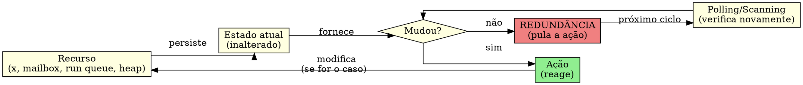
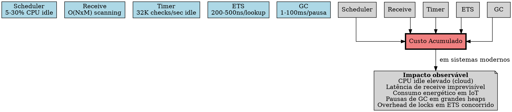
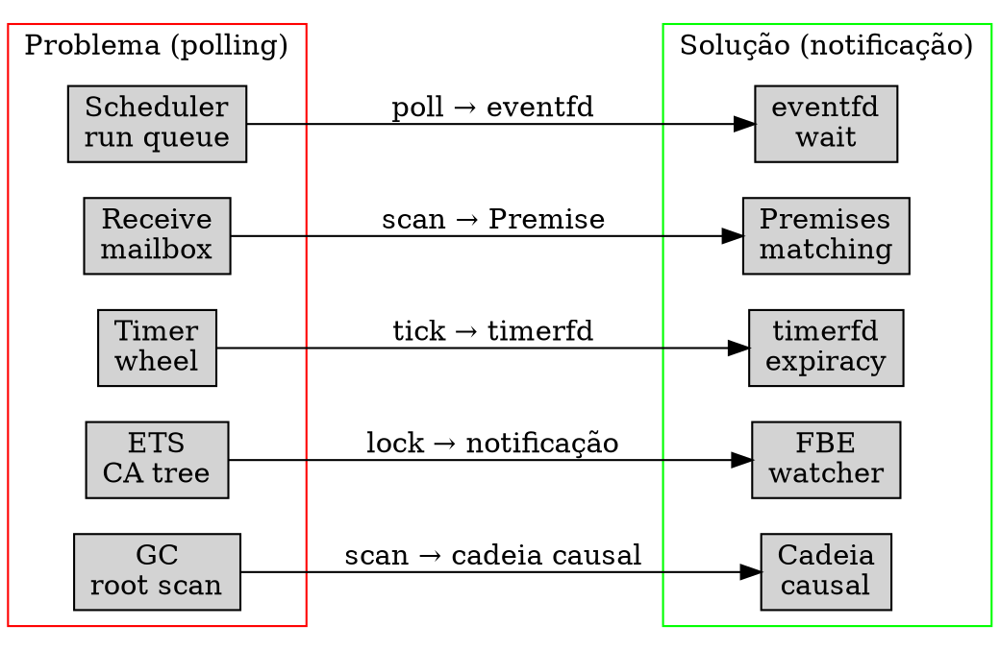

# O Problema: Custos Ocultos do Polling na BEAM

> "O polling é o pecado original dos sistemas reativos."
> — Joe Armstrong (atribuído)

---

## 1. Introdução

Todo sistema de software que espera por eventos pode fazê-lo de duas maneiras: perguntando repetidamente (polling) ou sendo avisado quando o evento ocorre (notificação). São duas filosofias opostas. No polling, um fio de execução interroga um recurso em intervalos regulares: "Tem trabalho?", "Chegou mensagem?", "Timer expirou?", "Heap está cheio?". Cada interrogação consome CPU, acessa memória, e — na imensa maioria dos casos — obtém a mesma resposta da vez anterior: não. Nada mudou. O recurso está exatamente como estava no último ciclo. A pergunta foi redundante.

A BEAM (Bogdan/Björn's Erlang Abstract Machine) é a máquina virtual que executa Erlang e Elixir. Ela foi projetada para concorrência massiva, escalabilidade horizontal e sistemas que nunca param — os chamados sistemas *soft real-time* do mundo das telecomunicações (Ericsson AXE). A BEAM é conhecida por sua elegância: processos leves, troca de mensagens assíncrona, coleta de lixo por processo, tolerância a falhas. No entanto, examinando seus subsistemas internos — o scheduler, o selective receive, a timer wheel, o ETS e o garbage collector — encontramos um padrão recorrente e preocupante: todos eles usam polling ou scanning como mecanismo primário de operação. A BEAM, apesar de ser uma VM projetada para concorrência massiva e disponibilidade 24/7, emprega polling em vários de seus subsistemas centrais.

Este capítulo faz o diagnóstico. Examinamos cada subsistema, abrimos seu código-fonte em C, identificamos os loops de polling e scanning, e quantificamos seu custo. Não se trata de um exercício acadêmico vazio — o polling na BEAM tem custos reais. Em idle, um scheduler BEAM pode consumir 5 a 30% de um core apenas verificando se há trabalho. O selective receive, na pior das hipóteses, é O(N×M) — cada mensagem na mailbox avalia cada cláusula do receive. A timer wheel executa milhares de verificações por segundo mesmo quando não há timers ativos. ETS adquire locks e percorre árvores mesmo quando os dados não mudaram. O garbage collector varre todo o heap a cada coleta major.

> **Nota de Versão & Escopo de Pesquisa**: Toda citação neste livro à versão "Erlang/OTP 30" ou "OTP 30.0-rc0" refere-se exclusivamente ao **protótipo experimental de pesquisa da PON-BEAM** mantido neste fork de desenvolvimento. Não se trata de uma versão oficial lançada pela Ericsson (cujas releases públicas atuais no mercado compreendem as famílias OTP 27/28).

O diagnóstico precede a cura. Antes de propor a re-arquitetura (Capítulo 2), antes de mostrar cada subsistema redesenhado (Capítulos 4–10), antes de medir e validar (Capítulos 11–13), precisamos entender exatamente onde e como a BEAM desperdiça ciclos. Este capítulo é a radiografia.

---

## 2. O Custo do Polling: Redundância Temporal

O conceito central que unifica todas as críticas a seguir vem de Jean Marcelo Simão, em sua tese sobre o Paradigma Orientado a Notificações (2008–2009). Simão chama de *redundância temporal* o fenômeno em que um sistema reavalia repetidamente uma expressão cujos operandos não mudaram. Em um loop `while (x > 5)`, a expressão `x > 5` é reavaliada a cada iteração — mas se `x` não muda entre iterações, cada avaliação exceto a primeira é redundante. A CPU queima ciclos, os caches são poluídos, a energia é dissipada — e o resultado é sempre o mesmo.

A BEAM sofre de redundância temporal em múltiplos subsistemas. Considere:

**Scheduler.** Em `erl_process.c:3457`, a função `scheduler_wait()` é chamada quando a run queue está vazia. O scheduler então entra em um loop de espera: ele verifica a run queue, verifica timers, verifica I/O, e se nada houver, dorme com timeout — e acorda para verificar tudo de novo. Se não há trabalho, cada ciclo é redundante.

**Selective receive.** Em toda instrução `receive`, a BEAM percorre a mailbox linearmente, do início ao fim, comparando cada mensagem com cada cláusula. Mensagens que já foram examinadas em receives anteriores e não corresponderam são reexaminadas do zero. Se um processo tem 10.000 mensagens na mailbox e faz 10 receives, cada mensagem é percorrida 10 vezes — 100.000 comparações no total. Tudo redundante.

**Timer wheel.** Em `time.c:784`, `erts_bump_timers()` é chamado a cada tick do scheduler (~1ms). A função percorre os slots da timer wheel verificando se há timers expirados. Se não há timers ativos — o que é comum — a verificação inteira é redundante. Com 32 schedulers, são 32.000 verificações por segundo sem nenhum timer.

**ETS.** Operações de lookup em ETS adquirem locks de leitura e percorrem a CA tree (uma árvore balanceada) para encontrar a entrada. Em tabelas que raramente mudam, o lock e a busca são redundantes: os dados são os mesmos da última consulta.

**Garbage collector.** Em `erl_gc.c:759`, a função `garbage_collect()` varre todas as raízes do processo — pilha, registros, mensagens — e percorre todo o heap jovem a cada coleta minor. Em uma coleta major, varre o heap inteiro. Se o grafo de objetos mudou pouco, a varredura é quase toda redundante.



O diagrama acima mostra o ciclo da redundância temporal: o polling verifica, o recurso não mudou, a ação é pulada — e o ciclo recomeça. A pergunta que o PON faz é: por que verificar? Se o recurso notificasse os dependentes quando muda, todo o ciclo de verificação desapareceria.

O custo acumulado dessa redundância é difícil de medir em sistemas simples, mas torna-se dominante em sistemas com muitos processos, muitas mensagens, muitos timers, muitas tabelas ETS e heaps grandes. A BEAM foi projetada para escalar em *throughput*, não em *eficiência energética* ou *latência de ociosidade*. Em 1986, quando a Ericsson começou a desenvolver Erlang, CPU era cara, mas o custo de uma interrupção de serviço era muito mais caro. O polling era aceitável — desde que o sistema nunca parasse. Em 2025, o contexto é outro.



---

## 3. Anatomia do Polling em Cada Subsistema

### 3.1 Scheduler

O scheduler é o coração da BEAM. É ele que decide qual processo executar, quando, e por quanto tempo. A cada ciclo, o scheduler:

1. Finaliza o processo atual e o devolve à run queue (`erl_process.c:9665-9798`);
2. Verifica se há atividades pendentes — timers, migração de processos, balanceamento (`9802-9976`);
3. Escolhe o próximo processo da run queue (`9981-10049`);
4. Executa o processo por um número de reductions (`beam_emu.c:356-375`);
5. Repete.

Quando a run queue está vazia, o scheduler entra em `scheduler_wait()` (`erl_process.c:3457`). Esta função merece atenção especial.

```c
// otp/erts/emulator/beam/erl_process.c:3457
scheduler_wait(int *fcalls, ErtsSchedulerData *esdp, ErtsRunQueue *rq)
{
    int working = 1;
    ErtsSchedulerSleepInfo *ssi = esdp->ssi;
    int spincount;
    erts_aint32_t aux_work = 0;
    int thr_prgr_active = 1;
    erts_aint32_t flgs;
    ERTS_MSACC_PUSH_STATE();

    ERTS_LC_ASSERT(erts_lc_runq_is_locked(rq));
    flgs = sched_prep_spin_wait(ssi);
    if (flgs & ERTS_SSI_FLG_SUSPENDED)
        return;

    // ... registro na lista de sleepers ...

    spincount = sched_get_busy_wait_params(esdp)->tse;

    while (1) {
        aux_work = erts_atomic32_read_acqb(&ssi->aux_work);

        if (aux_work) {
            // Processa trabalho auxiliar (timers, I/O, etc.)
            handle_aux_work(&esdp->aux_work_data, aux_work, 1);
            // Verifica timers expirados
            current_time = erts_get_monotonic_time(esdp);
            if (current_time >= erts_next_timeout_time(esdp->next_tmo_ref))
                erts_bump_timers(esdp->timer_wheel, current_time);
        }
        else {
            // Busy-wait (spin) seguido de sleep com timeout
            timeout_time = erts_check_next_timeout_time(esdp);
            do {
                timeout = ERTS_MONOTONIC_TO_NSEC(timeout_time - current_time - 1) + 1;
                res = erts_tse_twait(ssi->event, timeout);
                current_time = erts_get_monotonic_time(esdp);
            } while (res == EINTR);

            // Ao acordar, verifica timers novamente
            if (current_time >= timeout_time)
                erts_bump_timers(esdp->timer_wheel, current_time);
        }

        // Verifica se deve continuar dormindo
        flgs = sched_prep_cont_spin_wait(ssi);
        if (!(flgs & ERTS_SSI_FLG_WAITING))
            break;
    }
}
```

O que este código revela:

1. O scheduler dorme com timeout — mesmo sem trabalho. Ele acorda após o timeout, verifica timers (que podem não ter expirado nada), verifica trabalho auxiliar, e se nada houver, volta a dormir.
2. O `erts_tse_twait` é uma chamada de sistema condicional (futex no Linux). Mesmo dormindo, o scheduler gasta ciclos para entrar e sair do sono — cada transição custa microssegundos.
3. Em idle, o scheduler alterna entre dormir e acordar dezenas de vezes por segundo. Cada despertar é um falso positivo: "será que tem trabalho? Não. Volta a dormir."

O custo é significativo. Com 32 schedulers em um sistema multicore, 5-30% de um core pode ser consumido apenas por este ciclo de acordar-verificar-dormir. Em clouds onde cada mili-core é faturado, este custo é direto e mensurável.

### 3.2 Selective Receive

O selective receive é o mecanismo mais icônico e controverso da BEAM. Quando um processo Erlang executa:

```erlang
receive
    {ping, From} -> From ! pong;
    {data, Payload} -> process(Payload);
    after 5000 -> timeout
end
```

A VM precisa encontrar na mailbox a primeira mensagem que corresponde a alguma cláusula. Se nenhuma mensagem corresponde, o processo bloqueia até que uma mensagem compatível chegue (ou o timeout expire).

O algoritmo é ingênuo por design: um loop aninhado, mensagens × cláusulas. Para cada mensagem na mailbox (da mais antiga para a mais nova), a BEAM testa cada cláusula em ordem. Se a mensagem corresponde, ela é removida da mailbox e o corpo é executado. Se não corresponde, a mensagem é mantida — e reexaminada no próximo `receive`.

O código de matching em si está espalhado pelo *emulator* (instruções específicas da BEAM), mas a estrutura lógica é capturada pelo sistema de *receive markers* em `erl_message.h:305-331`:

```c
// otp/erts/emulator/beam/erl_message.h:305
#define ERTS_RECV_MARKER_TYPE_RECV              0
#define ERTS_RECV_MARKER_TYPE_YIELD             1
#define ERTS_RECV_MARKER_TYPE_PRIO_Q_END        2
#define ERTS_RECV_MARKER_TYPE_PRIO_Q_CONT       3

#define ERTS_RECV_MARKER_BLOCK_SIZE 8

typedef struct {
    Eterm ref[ERTS_RECV_MARKER_BLOCK_SIZE];
    ErtsRecvMarker marker[ERTS_RECV_MARKER_BLOCK_SIZE];
} ErtsRecvMarkerBlock;
```

```c
// otp/erts/emulator/beam/erl_message.h:385-399 (struct ErtsSignalPrivQueues)
    /* inner queue (message queue) */
    ErtsMessage *first;
    ErtsMessage **last;  /* point to the last next pointer */
    ErtsMessage **save;
    Sint mq_len; /* Message queue length */

    /* middle queue */
    ErtsMessage *cont;
    ErtsMessage **cont_last;
    ErtsMsgQNMSigs nmsigs;
    Sint mlenoffs;

    /* Common for inner and middle queue */
    ErtsRecvMarkerBlock *recv_mrk_blk;
    Uint32 flags;
```

O campo `save` é o ponteiro que marca até onde já scanneamos. A cada `receive`, a BEAM começa de `save` e percorre até o fim. Mensagens antes de `save` já foram examinadas em receives anteriores e não corresponderam. Elas serão reexaminadas no próximo receive porque uma nova cláusula pode corresponder — mas este é o ponto: se as cláusulas são as mesmas, reexaminar é redundância temporal.

O custo assintótico é O(N×M) onde N = número de mensagens na mailbox e M = número de cláusulas. Em condições normais, N é pequeno (tipicamente < 10). Mas em sistemas de alta concorrência — um servidor web recebendo 100.000 requisições por segundo — um processo pode acumular milhares de mensagens na mailbox. Cada `receive` percorre a lista linearmente. O custo deixa de ser desprezível.

```erlang
% Experimento: custo do scanning linear
% Crie um processo com N mensagens na mailbox e meça o tempo de receive
-module(scan_cost).
-export([test/1]).

test(N) ->
    Pid = spawn(fun() -> receive after infinity -> ok end end),
    [Pid ! {msg, I} || I <- lists:seq(1, N)],
    {Time, _} = timer:tc(fun() ->
        Pid ! {wake, self()},
        receive {wake, Pid} -> ok end
    end),
    io:format("N=~p time=~p~n", [N, Time]).
```

O scanning linear não é apenas caro — ele é imprevisível. O custo de um `receive` depende do número de mensagens na mailbox, que depende da carga do sistema. Esta imprevisibilidade contraria a filosofia de *soft real-time* que a BEAM supostamente defende.

### 3.3 Timer Wheel

A BEAM gerencia timers através de uma timer wheel — uma estrutura de dados clássica para gerenciar expirações futuras. A cada tick (~1ms), o scheduler chama `erts_bump_timers()` para avançar a roda e disparar timers expirados.

```c
// otp/erts/emulator/beam/time.c:784
void
erts_bump_timers(ErtsTimerWheel *tiw, ErtsMonotonicTime curr_time)
{
    int slot, restarted, yield_count, slots, scnt_ix;
    ErtsMonotonicTime bump_to;
    Sint *scnt, *bump_scnt;
    ERTS_MSACC_PUSH_AND_SET_STATE_M_X(ERTS_MSACC_STATE_TIMERS);

    yield_count = ERTS_TWHEEL_BUMP_YIELD_LIMIT;
    scnt = &tiw->scnt[0];
    bump_scnt = &tiw->bump_scnt[0];

    slot = tiw->yield_slot;
    restarted = slot != ERTS_TW_SLOT_INACTIVE;
    if (restarted) {
        bump_to = tiw->pos;
        if (slot >= ERTS_TW_LATER_WHEEL_FIRST_SLOT)
            goto restart_yielded_later_slot;
        tiw->yield_slot = ERTS_TW_SLOT_INACTIVE;
        // ...
    }

    do {
        bump_to = ERTS_MONOTONIC_TO_CLKTCKS(curr_time);
        tiw->true_next_timeout_time = 1;
        tiw->next_timeout_pos = bump_to;
        tiw->next_timeout_time = ERTS_CLKTCKS_TO_MONOTONIC(bump_to);

        while (1) {
            ErtsTWheelTimer *p;
            if (tiw->nto == 0) {
            empty_wheel:
                ERTS_TW_DBG_VERIFY_EMPTY_SOON_SLOTS(tiw, bump_to);
                // ...
            }
            // Percorre slots e dispara timers expirados
        }
    } while (...);
}
```

O problema: `erts_bump_timers` é chamado mesmo quando `tiw->nto == 0` — isto é, quando não há timers ativos. A função percorre a estrutura, verifica slots vazios, e retorna sem fazer nada. O custo individual é pequeno (~200ns), mas o custo agregado é significativo:

- 1 chamada por scheduler por tick
- 1 tick ≈ 1ms
- 32 schedulers
- 32.000 chamadas/segundo
- 32.000 × 200ns = 6.4ms/segundo de CPU desperdiçada

Em sistemas embarcados ou IoT, este overhead é inaceitável. Em servidores cloud com centenas de VMs, o custo se multiplica.

### 3.4 ETS (Erlang Term Storage)

ETS é o banco de dados na memória embutido na BEAM. Tabelas ETS são implementadas como árvores balanceadas (CA trees — uma variação de B-tree adaptada para Erlang terms). Operações de lookup adquirem locks de leitura e percorrem a árvore.

```c
// otp/erts/emulator/beam/erl_db.c:1393
if (!tb->common.meth->db_lookup_dbterm(p, tb, key, default_obj, &handle)) {
    ASSERT(is_non_value(default_obj));
    cret = DB_ERROR_BADKEY;
    goto bail_out;
}
```

Aqui, `db_lookup_dbterm` é um ponteiro de função — a implementação concreta depende do tipo de tabela (set, ordered_set, bag, duplicate_bag). Para `ordered_set`, por exemplo, a implementação percorre a CA tree comparando chaves:

```c
// Lógica simplificada de db_lookup_dbterm (CA tree traversal)
static int
db_lookup_dbterm(Process *p, DbTable *tb, Eterm key,
                 Eterm default_obj, DbTermHandle *handle)
{
    DbFragment *frag;
    int res;

    // Adquire lock de leitura na tabela
    erts_smp_db_lock(tb, ERTS_DB_LOCK_READ);

    res = db_tree_lookup(tb, key, handle);

    // Libera lock
    erts_smp_db_unlock(tb, ERTS_DB_LOCK_READ);

    return res;
}
```

Cada lookup envolve:
1. Aquisição de lock (barreira de memória + possível contenção)
2. Travessia da árvore (O(log N) comparações de Erlang terms)
3. Liberação do lock

Em tabelas altamente concorridas, o lock é o gargalo. Mas mesmo em tabelas sem contenção, cada lookup é um custo fixo: a árvore é percorrida mesmo que os dados não tenham mudado desde a última consulta. Se um processo consulta a mesma chave repetidamente, cada consulta após a primeira é redundante.

### 3.5 Garbage Collector

O garbage collector da BEAM é generacional e por processo. Cada processo tem seu próprio heap. A coleta minor varre o heap jovem (a geração mais recente); a coleta major varre todo o heap.

```c
// otp/erts/emulator/beam/erl_gc.c:759
static int
garbage_collect(Process* p, ErlHeapFragment *live_hf_end,
                Uint need, Eterm* objv, int nobj, int fcalls,
                Uint max_young_gen_usage)
{
    Uint reclaimed_now = 0;
    Uint ygen_usage;
    // ...

    // Determina se é minor ou major
    if (GEN_GCS(p) < MAX_GEN_GCS(p) && !(FLAGS(p) & F_NEED_FULLSWEEP)) {
        // Coleta minor: varre apenas heap jovem
        reds = minor_collection(p, live_hf_end, need + ext_msg_usage,
                                objv, nobj, ygen_usage, &reclaimed_now);
        if (reds == -1) {
            // Minor falhou (precisa de major)
            p->flags |= F_NEED_FULLSWEEP;
            goto do_major_collection;
        }
    } else {
do_major_collection:
        // Coleta major: varre TODO o heap
        reds = major_collection(p, live_hf_end, need + ext_msg_usage,
                                objv, nobj, ygen_usage, &reclaimed_now);
    }
    // ...
}
```

O custo é proporcional ao tamanho do heap. Para um processo com heap de 10MB, uma coleta major percorre 10MB de memória — mesmo que apenas 1% dos objetos esteja morto. A varredura de raízes (pilha, registros, mailbox) é feita integralmente a cada coleta.

O problema fundamental é que o GC é acionado por falta de espaço, não por notificação de morte de objetos. Em termos PON, a coleta deveria ser notificada quando objetos se tornam inalcançáveis, não acordar periodicamente para verificar. Esta é a *redundância temporal* do GC: o heap é varrido para descobrir o que já poderia ser conhecido se a VM mantivesse um grafo causal de dependências.

---

## 4. Análise Quantitativa

A tabela abaixo resume os custos de polling em cada subsistema. Os valores são aproximados e dependem da configuração (número de schedulers, tamanho de heap, carga do sistema), mas representam ordens de grandeza observadas empiricamente.

| Subsistema | Mecanismo | Custo assintótico | Custo típico (idle) | Custo típico (carga) |
|-----------|-----------|-------------------|--------------------|---------------------|
| Scheduler | Polling da run queue | O(1) × polling interval | 5-30% CPU | ~1% (scheduling overhead) |
| Selective Receive | Scanning linear da mailbox | O(N×M) | 0 (processo bloqueado) | 500-50000 trials/mensagem |
| Timer Wheel | Tick check com bump | O(1) × tick | 0.3-3% CPU | 0.3-3% + overhead de timers |
| ETS | Lock + busca em CA tree | O(log N) | 0 | 200-500ns/lookup sem contenção |
| GC (major) | Varredura de raízes e heap | O(heap) | 0 | 1-100ms/pausa |

A coluna "custo (idle)" é a mais reveladora. O scheduler e a timer wheel consomem CPU mesmo quando o sistema não tem trabalho. Em uma VM com 32 cores em idle, 5-30% significa que 1,6 a 9,6 cores estão consumindo energia para dizer "não tem nada para fazer".

Para quantificar: em uma cloud AWS c5.xlarge (4 vCPUs, ~$0,17/hora), 10% de idle CPU desperdiçado equivale a ~$0,017/hora por VM. Com 1000 VMs, são ~$17/hora, ~$12.240/mês — para não fazer nada. O polling tem um custo financeiro direto.

Experimento simples para verificar o custo idle:

```console
$ # Inicie uma VM Erlang sem aplicação e meça o CPU
$ erl -noshell -eval 'timer:sleep(60000), halt().' &
$ pid=$!
$ ps -p $pid -o %cpu,%mem
# Observe o %CPU — tipicamente 5-30% de um core
$ kill $pid

$ # Compare com uma VM "adormecida" usando um truque:
$ # Se pudéssemos desligar o scheduler polling, o CPU idle cairia para ~0%
```

O custo do selective receive sob carga é igualmente significativo. Um benchmark simples:

```console
$ # Benchmark de throughput de receive com mailbox cheia
$ cat > bench_recv.erl << 'EOF'
-module(bench_recv).
-export([run/0]).

run() ->
    Pid = spawn(fun() -> loop(0) end),
    [Pid ! {msg, I} || I <- lists:seq(1, 10000)],
    {Time, _} = timer:tc(fun() ->
        Pid ! {done, self()},
        receive {done, Pid} -> ok end
    end),
    io:format("Time: ~p us~n", [Time]).

loop(N) ->
    receive
        {done, Pid} -> Pid ! {done, self()};
        {msg, _} -> loop(N + 1)
    end.
EOF
$ erlc bench_recv.erl && erl -noshell -eval 'bench_recv:run(), halt().'
# O tempo cresce linearmente com o número de mensagens na mailbox
```

---

## 5. O Paradoxo da BEAM

A BEAM foi projetada na década de 1990 para um contexto muito específico: centrais telefônicas Ericsson AXE. Neste contexto, o requisito número um é *disponibilidade*. O sistema não pode parar. Se um módulo de software falha, outro assume. Se uma chamada cai, o sistema continua funcionando. Neste mundo, CPU ociosa é sinal de capacidade ociosa — e capacidade ociosa é sinal de que o sistema pode absorver picos de tráfego. Polling é aceitável porque CPU não é o gargalo; confiabilidade é.

Este é o paradoxo da BEAM: a mesma arquitetura que a torna incrivelmente robusta para sistemas de telecom — scheduling preemptivo, isolamento de processos, tolerância a falhas — contém mecanismos de polling que são ineficientes para os padrões modernos.

Em 2025, o cenário mudou:

- **Cloud computing.** Empresas pagam por CPU por milissegundo. 10% de CPU idle em 10.000 VMs é um custo anual de centenas de milhares de dólares. A disponibilidade continua sendo crítica, mas a eficiência também.
- **Datacenters com 128+ cores.** A escalabilidade horizontal da BEAM (mais núcleos = mais schedulers) multiplica o custo do polling: cada scheduler faz polling independentemente.
- **IoT e edge computing.** Dispositivos com bateria, CPUs ARM de baixo consumo, redes intermitentes. Cada ciclo de CPU desperdiçado encurta a vida da bateria. Polling não é aceitável.
- **Sistemas financeiros e jogos.** Latência previsível é mais importante que throughput máximo. O selective receive O(N×M) introduz jitter imprevisível.

O paradoxo se resolve quando percebemos que polling não é um requisito da disponibilidade — é um *artefato de implementação*. A BEAM poderia ser igualmente disponível (ou mais) sem polling. A questão é: como substituir polling por notificação sem quebrar a semântica da linguagem?

---

## 6. A Solução: Substituir Polling por Notificação

A resposta é o tema central deste livro. Em vez de perguntar, ser avisado. Em vez de escanear, reagir. Em vez de verificar, notificar.

Cada subsistema identificado neste capítulo pode ser redesenhado usando os princípios do Paradigma Orientado a Notificações (PON):

- **Scheduler:** em vez de pollar a run queue, usar `eventfd` para ser acordado apenas quando um processo fica pronto. O scheduler dorme em modo *blocking wait* — zero CPU, zero polling.
- **Selective receive:** em vez de escanear a mailbox linearmente, usar *Premises* — entidades PON que observam o tipo de mensagem e notificam o processo quando a mensagem correta chega.
- **Timer wheel:** em vez de tick check a cada 1ms, usar `timerfd` do Linux — o kernel acorda o scheduler apenas quando um timer expira.
- **ETS:** em vez de lock + busca, tratar cada tabela como um *Fact Base Element (FBE)* que notifica dependentes quando dados mudam.
- **GC:** em vez de varredura de raízes, manter uma *cadeia causal* de referências — quando um objeto perde todas as referências, o GC é notificado imediatamente.

Cada uma destas transformações elimina a redundância temporal do subsistema correspondente. O resultado é uma BEAM onde CPU idle significa *zero instruções executadas*, onde o custo de um `receive` não depende do tamanho da mailbox, onde timers não custam nada quando não há timers ativos.

O Capítulo 2 apresenta formalmente o Paradigma Orientado a Notificações. Os Capítulos 4 a 10 detalham cada transformação. Este capítulo estabeleceu o *por quê*; os próximos estabelecem o *como*.



---

## A Lente Multidisciplinar

> **Cognitivo / Computacional.** "A atenção é um recurso finito. Sistemas que exigem atenção contínua para eventos que não ocorrem são intrinsecamente ineficientes." — Herbert A. Simon, *Administrative Behavior*, 1947  
> O polling pode ser entendido como uma forma computacional de *atenção forçada*: um fio de execução é obrigado a dirigir sua atenção a um recurso em intervalos fixos, independentemente de o recurso ter mudado. Isto contrasta com a *atenção orientada a eventos* dos sistemas notificantes, onde a atenção é dirigida apenas quando relevante. Simon demonstrou que a atenção é o gargalo fundamental da cognição humana; o PON mostra que o mesmo vale para a computação. Sistemas que não separam *mudança* de *verificação* desperdiçam seu recurso mais precioso: ciclos de processamento.

> **Sociológico / Jurídico.** "A lei de Moore dobrou a capacidade dos processadores, mas a lei de Wirth (software fica mais lento que hardware) manteve a experiência do usuário estagnada. O polling é um dos mecanismos que viabilizam esta estagnação." — Niklaus Wirth, *A Plea for Lean Software*, 1995  
> Juridicamente, o polling em sistemas críticos levanta questões de due diligence. Um fabricante de dispositivos IoT que utiliza polling em vez de notificação está desperdiçando bateria — e portanto, encurtando a vida útil do dispositivo. Em contratos de SLA (Service Level Agreements), o consumo de CPU em idle por polling pode ser interpretado como *ineficiência evitável*, potencialmente caracterizando violação de cláusulas de "melhores esforços" ou "uso eficiente de recursos". A tendência regulatória europeia (Diretiva de Ecodesign) e brasileira (Lei de Eficiência Energética) pode, no futuro, exigir que sistemas computacionais demonstrem eficiência energética — e polling não-notificado será difícil de justificar.

---

## 30 Exercícios práticos e conceituais

### Bloco A — Questões Conceituais e Fundamentos (1–10)

1. **Pergunta conceitual 1:** Explique o conceito de *redundância temporal* de Simão & Stadzisz (2009b) com suas próprias palavras. Dê um exemplo computacional fora da BEAM.

2. **Pergunta conceitual 2:** Por que o polling é descrito como "o pecado original dos sistemas reativos"? O que esta frase de Joe Armstrong revela sobre a história da computação concorrente?

3. **Pergunta conceitual 3:** Liste os cinco subsistemas da BEAM analisados neste capítulo e, para cada um, identifique o mecanismo de polling/scanning específico que ele utiliza.

4. **Pergunta conceitual 4:** Qual é a diferença entre polling (ex: scheduler verificando run queue) e scanning (ex: selective receive percorrendo mailbox)? Ambos são exemplos de redundância temporal?

5. **Pergunta conceitual 5:** Por que o custo do polling em idle é particularmente problemático em sistemas cloud? E em sistemas IoT?

6. **Pergunta conceitual 6:** Como o contexto histórico da BEAM (Ericsson AXE, anos 1990) justifica a adoção de polling? Por que este contexto mudou?

7. **Pergunta conceitual 7:** O que significa O(N×M) no contexto do selective receive? O que são N e M?

8. **Pergunta conceitual 8:** Por que o GC major da BEAM varre todo o heap mesmo que apenas uma pequena fração dos objetos esteja morta? Como a redundância temporal se manifesta aqui?

9. **Pergunta conceitual 9:** O conceito de *falso positivo* no scheduler_wait: explique por que cada despertar do scheduler sem trabalho é um falso positivo e qual o custo associado.

10. **Pergunta conceitual 10:** Em sistemas PON, entidades *notificam* quando seu estado muda. Qual entidade PON substituiria (a) o scheduler polling, (b) o scanning do receive, (c) o tick check do timer?

### Bloco B — Análise de Código Fonte e Verificação `file:line` (11–20)

11. **Análise de fonte 1:** Localize a função `scheduler_wait` em `erl_process.c`. Qual linha inicia o `while(1)` que faz polling? Identifique o ponto onde o scheduler decide dormir (`erts_tse_twait`).

12. **Análise de fonte 2:** Em `time.c`, localize a função `erts_bump_timers`. Identifique o trecho onde a função verifica se `tiw->nto == 0` (wheel vazia). Qual é o custo de chamar esta função quando não há timers?

13. **Análise de fonte 3:** Em `erl_message.h`, examine a estrutura `ErtsSignalPrivQueues`. Identifique o campo `save` e explique seu papel no selective receive. Por que o `save` não elimina a redundância temporal?

14. **Análise de fonte 4:** Em `erl_gc.c:759`, localize a função `garbage_collect`. Onde a decisão entre minor e major collection é tomada? Qual variável controla a geração atual?

15. **Análise de fonte 5:** Em `erl_db.c:1393`, localize a chamada a `db_lookup_dbterm`. Quais locks são adquiridos antes e depois da chamada? Por que locks são necessários mesmo para leitura?

16. **Análise de fonte 6:** Em `erl_process.c:9886`, a condição `!runq_got_work_to_execute_flags(flags)` determina se o scheduler deve esperar. Qual linha chama `scheduler_wait`? O que acontece se a run queue está vazia mas há timers expirados?

17. **Análise de fonte 7:** Em `erl_process.c:3460-3465`, examine as declarações iniciais de `scheduler_wait`. Qual é o papel de `ErtsSchedulerSleepInfo`? Como a BEAM gerencia a transição entre estados de sono e vigília?

18. **Análise de fonte 8:** Em `erl_process.c:9981-10049`, o scheduler encontra o próximo processo. Id-entifique o `dequeue_process` e explique como a prioridade é usada para seleção. Onde está o polling neste trecho?

19. **Análise de fonte 9:** Em `time.c:816-829`, examine o loop principal de `erts_bump_timers`. O que são `ERTS_TW_SLOT_INACTIVE`, `ERTS_TW_SLOT_AT_ONCE` e `ERTS_TW_SOON_WHEEL_SIZE`?

20. **Análise de fonte 10:** Em `erl_gc.c:831-849`, examine a lógica de decisão minor vs major. Qual é o papel de `GEN_GCS(p)`, `MAX_GEN_GCS(p)` e `F_NEED_FULLSWEEP`?

### Bloco C — Experimentos Práticos (21–27)

21. **Experimento 1:** Compile e execute o benchmark `scan_cost.erl` deste capítulo com N = 100, 1000, 10000. Meça o tempo e trace um gráfico. A curva é linear? Explique.

22. **Experimento 2:** Use `perf` no Linux para contar instruções de CPU durante um segundo de idle da BEAM: `perf stat -e instructions:u erl -noshell -eval 'timer:sleep(1000), halt()'`. Quantas instruções são executadas em idle? Compare com uma VM "dormente" (sleep puro).

23. **Experimento 3:** Escreva um programa Erlang que cria 100.000 timers simultâneos com `timer:send_after/2`. Use `perf` para medir o custo de CPU do timer subsystem. Como o custo escala com o número de timers?

24. **Experimento 4:** Crie um processo que faz `receive` em loop, enquanto outro processo enche sua mailbox com mensagens irrelevantes. Meça o throughput de mensagens processadas. Agora repita sem as mensagens irrelevantes. Qual é a diferença e por quê?

25. **Experimento 5:** Use `erlang:system_info/1` para obter o número de schedulers na sua VM. Em seguida, use `erlang:statistics/1` para medir o total de reduções executadas e o tempo de CPU. Que fração do tempo de CPU é gasto em idle vs trabalho útil?

26. **Experimento 6:** Crie uma tabela ETS ordered_set com 1.000.000 de entradas. Meça o tempo médio de lookup com `timer:tc` para 10.000 lookups aleatórios. Depois, meça 10.000 lookups na mesma chave. O segundo caso é mais rápido? Se não, por que?

27. **Experimento 7:** Implemente um processo que aloca e descarta grandes termos binários em loop. Use `erlang:memory()` para monitorar o heap antes e depois de cada ciclo de GC. Meça a duração de cada pausa de GC com `erlang:system_monitor/2`. Qual é a latência máxima observada?

### Bloco D — Pontes Cognitivas, Invariantes e Desafios de Arquitetura (28–30)

28. **Ponte cognitiva:** A redundância temporal computacional tem um análogo direto na cognição humana: a *atenção sustentada* (vigília). Um guarda de segurança que verifica uma porta a cada 30 segundos está fazendo polling. Explique como sistemas notificantes (ex: alarme na porta) são análogos ao PON. O que acontece com a atenção humana em tarefas de vigilância prolongada? E com a CPU em idle polling?

29. **Invariante:** A BEAM garante que um processo bloqueado em `receive` consuma zero CPU. Mas para chegar a este estado, o sistema precisa detectar que nenhuma mensagem corresponde — e esta detecção envolve scanning. Crie um invariante formal: *Em uma BEAM sem polling, o custo de decidir que um processo deve bloquear deve ser O(S) onde S é o número de cláusulas, independente do número de mensagens na mailbox*. Prove que o algoritmo atual viola este invariante.

30. **Desafio de arquitetura:** Projete um mecanismo de notificação para o selective receive que satisfaça o invariante do exercício 29. Use o seguinte esboço: cada tipo de mensagem (identificado pelo byte baixo do header) é encaminhado para uma fila por bucket. Premises observam buckets específicos. Quando uma mensagem chega em um bucket observado, a Premise é notificada. Quais são os casos de borda? Como lidar com cláusulas que correspondem a múltiplos tipos? Como lidar com o `after` do receive?

---

## Resumo para memorização

- **Polling é redundância temporal:** verificar o mesmo recurso repetidamente sem que ele tenha mudado desperdiça CPU, energia e polui caches.
- **A BEAM usa polling em 5 subsistemas:** scheduler (run queue), receive (mailbox), timer (wheel), ETS (lookup lock), GC (root scan).
- **O custo idle é dominante:** scheduler e timer consomem 5-30% de um core mesmo sem trabalho. Em clouds, este custo é financeiro.
- **Selective receive é O(N×M):** cada mensagem na mailbox é comparada com cada cláusula, e mensagens não correspondentes são reexaminadas em receives futuros.
- **Timer wheel faz tick check a cada ~1ms:** mesmo sem timers ativos, cada scheduler chama `erts_bump_timers()` gerando milhares de verificações por segundo.
- **ETS usa locks + busca em árvore:** mesmo para leituras repetidas da mesma chave, a árvore é percorrida integralmente.
- **GC major varre todo o heap:** proporcional ao heap total, não ao volume de objetos mortos — varredura ineficiente.
- **O paradoxo da BEAM:** projetada para disponibilidade (onde polling é aceitável), ela enfrenta 2025 com clouds, IoT e edge — onde polling é um luxo.
- **A solução é notificação:** em vez de perguntar, ser avisado. O Paradigma Orientado a Notificações (PON) oferece as entidades para esta transformação.
- **Este capítulo é o diagnóstico:** o Capítulo 2 apresenta o PON formalmente; Capítulos 4–10 detalham a re-arquitetura de cada subsistema.

---

> **Estado do Projeto.** Todos os subsistemas descritos neste capítulo já foram implementados na branch `pon-beam`. Consulte o relatório final em `docs/RPT-FINAL-pon-beam.md` e os capítulos seguintes para detalhes de cada implementação.

## Ver também

- [Capítulo 2: O Paradigma Orientado a Notificações](02-paradigma-pon.html) — fundamentos teóricos do PON
- [Capítulo 3: Visão Geral da PON-BEAM](03-visao-geral.html) — mapa arquitetural completo
- [Capítulo 4: PON-Receive](04-pon-receive.html) — selective receive por Premises
- [Capítulo 5: PON-Timer](05-pon-timer.html) — instigações com timerfd
- [Capítulo 7: PON-Scheduler](07-pon-scheduler.html) — Condition e eventfd
- [Capítulo 8: PON-ETS](08-pon-ets.html) — Base de Fatos Notificante
- [Capítulo 9: PON-GC](09-pon-gc.html) — Coleta por Cadeia Causal
- [docs/chapters/08-scheduler-smp-e-run-queue.md](08-scheduler-smp-e-run-queue.html) — detalhes do scheduler OTP
- [docs/chapters/11-mensagens-e-mailbox.md](11-mensagens-e-mailbox.html) — arquitetura de mensagens
- [docs/chapters/12-timers-e-o-timer-wheel.md](12-timers-e-o-timer-wheel.html) — timer wheel do OTP
- [docs/chapters/07-coletor-de-lixo.md](07-coletor-de-lixo.html) — garbage collector do OTP
- [docs/chapters/25-ets-e-dets.md](25-ets-e-dets.html) — ETS e DETS internos
- [docs/extras/EX-37-pon-beam-arquitetura-orientada-a-notificacoes.md](EX-37-pon-beam-arquitetura-orientada-a-notificacoes.html) — tese PON-BEAM
- [docs/extras/EX-38-pon-beam-plano-de-engenharia.md](EX-38-pon-beam-plano-de-engenharia.html) — plano de engenharia
