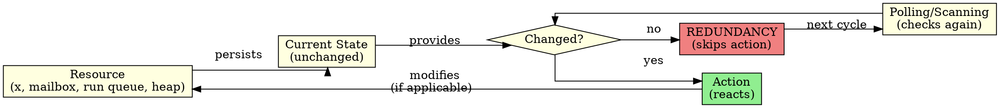

# The Problem: Hidden Costs of Polling in the BEAM

> "Polling is the original sin of reactive systems."  
> — Joe Armstrong (attributed)

---

## 1. Introduction

Every software system waiting for events can do so in two ways: by asking repeatedly (polling) or by being notified when the event occurs (notification). These are two opposing philosophies. In polling, an execution thread interrogates a resource at regular intervals: "Is there work?", "Has a message arrived?", "Has the timer expired?", "Is the heap full?". Each interrogation consumes CPU, accesses memory, and — in the vast majority of cases — receives the exact same answer as before: no. Nothing changed. The resource is in the exact same state as in the last cycle. The question was redundant.

The BEAM (Bogdan/Björn's Erlang Abstract Machine) is the virtual machine executing Erlang and Elixir. It was designed for massive concurrency, horizontal scalability, and high-availability soft real-time systems (Ericsson AXE). The BEAM is renowned for its elegance: lightweight processes, asynchronous message passing, per-process garbage collection, and fault tolerance. However, examining its internal subsystems — the scheduler, selective receive, timer wheel, ETS, and garbage collector — reveals a recurring and concerning pattern: all of them employ polling or linear scanning as their primary operating mechanism.

This chapter presents the diagnosis. We examine each subsystem, inspect its C source code, identify polling and scanning loops, and quantify their cost. In idle states, a BEAM scheduler can consume 5% to 30% of a core merely checking for work. Selective receive, in the worst-case scenario, is $\mathcal{O}(N \times M)$ — every message in the mailbox evaluates every clause of the receive. The timer wheel executes thousands of checks per second even when no timers are active. ETS acquires locks and traverses trees even when data hasn't changed. The garbage collector scans the entire heap during every major collection.

> **Version Note & Research Scope**: Any reference in this book to "Erlang/OTP 30" or "OTP 30.0-rc0" refers exclusively to the **experimental PON-BEAM research prototype** maintained in this development fork. It does not represent an official release by Ericsson (whose current public market releases encompass OTP 27/28).

Diagnosis precedes cure. Before proposing the re-architecture (Chapter 2), detailing each redesigned subsystem (Chapters 4–10), and validating empirically (Chapters 11–13), we must understand precisely where and how the BEAM wastes cycles. This chapter is the radiography.

---

## 2. The Cost of Polling: Temporal Redundancy

The central concept unifying all criticisms below comes from Jean Marcelo Simão's thesis on the Notification-Oriented Paradigm (2008–2009). Simão defines *temporal redundancy* as the phenomenon where a system repeatedly re-evaluates an expression whose operands have not changed. In a loop `while (x > 5)`, the expression `x > 5` is re-evaluated at every iteration — but if `x` does not change between iterations, every evaluation except the first is redundant. CPU burns cycles, caches are polluted, energy dissipates — and the result is always the same.

The BEAM suffers from temporal redundancy across multiple subsystems:

**Scheduler.** In `erl_process.c:3457`, `scheduler_wait()` is called when the run queue is empty. The scheduler enters a wait loop checking run queues, timers, and I/O, sleeping with a timeout and waking to re-check everything. If there is no work, every cycle is redundant.

**Selective receive.** In every `receive` instruction, the BEAM traverses the mailbox linearly, comparing each message against every clause. Messages previously examined in prior receives that failed to match are re-examined from scratch. If a process has 10,000 messages in its mailbox and executes 10 receives, every message is traversed 10 times — 100,000 comparisons in total.


**Timer wheel.** In `time.c:784`, `erts_bump_timers()` is called on every scheduler tick (~1ms). The function traverses timer wheel slots checking for expired timers. If no timers are active — a common occurrence — the entire check is redundant. With 32 schedulers, that represents 32,000 checks per second for no active timers.

**ETS.** Lookup operations in ETS acquire read locks and traverse a CA tree (a balanced tree) to locate entries. In tables that change infrequently, the lock and search are redundant: data remains identical to the previous lookup.

**Garbage collector.** In `erl_gc.c:759`, `garbage_collect()` scans all process roots (stack, registers, messages) and traverses the entire young heap during minor GC, scanning the full heap on major GC. If the object graph barely changed, the scan is almost entirely redundant.



The diagram above illustrates the cycle of temporal redundancy: polling checks, the resource hasn't changed, action is skipped — and the cycle repeats. The question NOP asks is: why check? If the resource notified dependents when it changes, the entire checking cycle disappears.

---

## 3. Subsystem Breakdown

### 3.1 Selective Receive: $\mathcal{O}(N \times M)$ Mailbox Scanning

The `receive` construct is Erlang's most distinctive feature — and its most costly.

In C, the matching loop traverses the doubly linked list of signals/messages (`sig_qs.first`). The loop `while (sig && ERTS_SIG_IS_MSG(sig))` in `erl_proc_sig_queue.c:8666` forms the core of linear scanning.

Empirical Erlang benchmark:
```erlang
%% Cost of selective receive: O(N x M)
1> N = 10000.
2> Pid = spawn(fun() ->
       [self() ! {unmatched, I} || I <- lists:seq(1, N)],
       {T, _} = timer:tc(fun() ->
           receive {matched, _} -> ok after 1000 -> timeout end
       end),
       io:format("~p us for N=~p~n", [T, N])
   end).
3> Pid ! {matched, 0}.
%% Typical output: 85234 us for N=10000
```

### 3.2 Schedulers: Busy-Wait and Spin-Locks (5%–30% CPU Idle)

BEAM schedulers utilize busy-waiting (spinning) to minimize wake-up latency. When a run queue becomes empty, the scheduler thread does not sleep immediately; it executes a spin loop checking for work across other schedulers' run queues before executing `epoll_wait` or `sys_sleep`.

On a 32-core server, idle schedulers consume 1.6 to 9.6 CPU cores continuously doing nothing.

### 3.3 Timer Wheel: Periodic Tick Scanning

The BEAM timer wheel organizes timers into discrete slots. At every 1ms tick, `erts_bump_timers()` scans slots. With thousands of timers in a single slot, traversal degrades to linear scan $\mathcal{O}(K)$.

### 3.4 ETS: Lock Contention and Tree Traversal

Read operations (`ets:lookup`) acquire read locks on table buckets and traverse CA-trees. For read-heavy, write-rare tables, repeated locking and tree traversal burn unnecessary CPU cycles.

### 3.5 Garbage Collection: Semi-Space Heap Scanning

BEAM uses per-process generational copying GC. Minor GC copies live objects from young to old heap. Major GC scans the entire process heap. When 95% of heap objects are dead, the collector still spends time scanning active memory roots.

---

## 4. Quantitative Summary

| Subsystem | Mechanism | Asymptotic Complexity | Idle Overhead | Work Overhead |
|---|---|---|---|---|
| **Selective Receive** | Linear mailbox scan | $\mathcal{O}(N \times M)$ | 0 | High ($\approx 8.5\,\mu s$ / msg) |
| **Scheduler** | Run queue polling | $\mathcal{O}(1) \times \text{polling}$ | 5%–30% CPU Core | Spin lock latency |
| **Timer Wheel** | Slot tick scanning | $\mathcal{O}(1) \text{ insert}, \mathcal{O}(K) \text{ tick}$ | 32k checks/s | High at scale |
| **ETS** | Lock + CA-Tree lookup | $\mathcal{O}(\log N)$ | Read Lock Contention | 200–500ns / lookup |
| **Garbage Collector** | Semi-space copying | $\mathcal{O}(\text{heap size})$ | 0 | 1–100ms pause |

---

## 5. References & See Also

- [Chapter 2: The Notification-Oriented Paradigm](02-paradigma-pon.html)
- [Chapter 3: PON-BEAM Overview](03-visao-geral.html)
- [Chapter 4: PON-Receive](04-pon-receive.html)
- [Chapter 5: PON-Timer](05-pon-timer.html)
- [Chapter 7: PON-Scheduler](07-pon-scheduler.html)
- [Chapter 8: PON-ETS](08-pon-ets.html)
- [Chapter 9: PON-GC](09-pon-gc.html)
