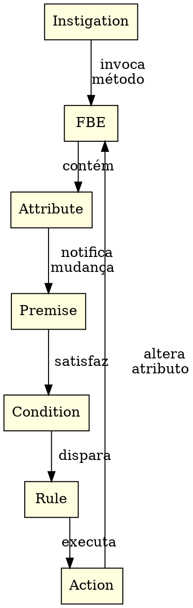
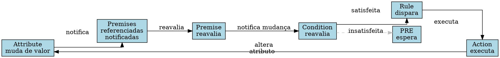
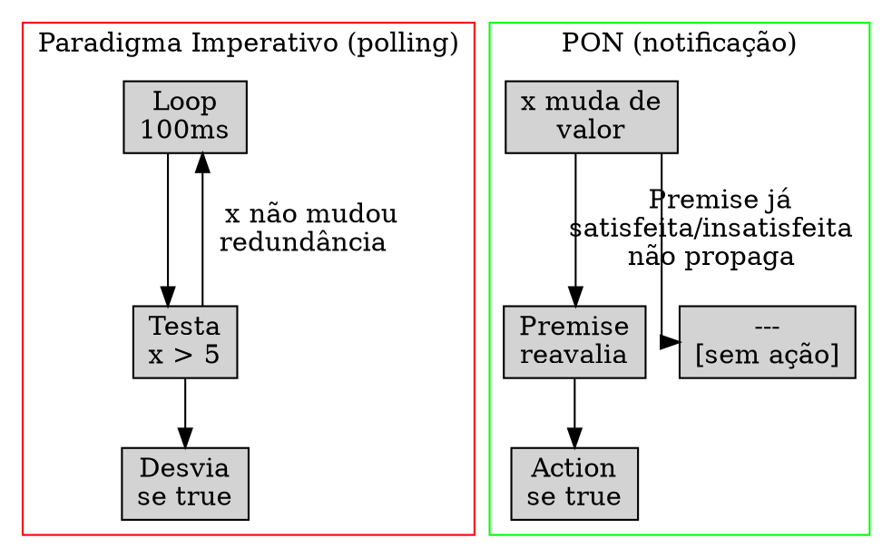

# 2. O Paradigma Orientado a Notificações

> "Entidades mínimas, reativas e desacopladas que colaboram exclusivamente por notificações pontuais."
> — Jean Marcelo Simão, 2008

---

## 2.1 Introdução

O Paradigma Orientado a Notificações (PON) foi proposto por Jean Marcelo Simão em sua tese de doutorado (2005–2009) como uma terceira via aos paradigmas Imperativo e Declarativo. A tese central é simples e profunda: nos paradigmas tradicionais, entidades passivas são percorridas em busca a cada ciclo de execução — o que Simão chama de *redundância temporal*. Um loop `while` que testa repetidamente `x > 5` está reavaliando uma expressão mesmo quando `x` não mudou. A CPU queima ciclos, a memória é acessada sem necessidade, e a latência de reação é limitada pela frequência do polling, não pela relevância do evento.

O PON inverte essa arquitetura. Em vez de entidades passivas que são *consultadas*, ele propõe entidades ativas que *notificam*. Uma entidade computacional não espera ser percorrida por um fio de execução central — ela mesma dispara notificações quando seu estado interno muda. O resultado é um sistema onde o processamento só ocorre quando há trabalho real a fazer. Não há polling, não há scanning linear, não há reavaliação cíclica de expressões inalteradas. A computação torna-se um encadeamento de notificações pontuais, cada uma disparada por uma mudança relevante de estado.

---

## 2.2 As Entidades Estruturais do PON

O PON define sete tipos de entidades estruturais. Cada entidade é mínima, tem uma responsabilidade única e se comunica exclusivamente por notificações. Juntas, formam um grafo reativo onde nenhuma entidade jamais é percorrida sem motivo.



### 2.2.1 Fact Base Element (FBE)

O FBE é a unidade computacional fundamental do PON. Ele encapsula estado (na forma de Attributes) e comportamento (na forma de Methods). É conceitualmente análogo a um objeto da programação orientada a objetos, mas com diferenças cruciais: não há herança, não há polimorfismo por subtipo, e — o mais importante — seus atributos não são campos passivos. Um FBE é uma entidade ativa. Quando um de seus métodos executa e altera um Attribute, o FBE não apenas armazena o novo valor: ele notifica todas as entidades que dependem daquele Attribute. O FBE não sabe quem são essas entidades — ele apenas publica a notificação.

### 2.2.2 Attribute

O Attribute é a unidade de estado do PON. Todo Attribute possui um valor corrente e uma lista de referências — as Premises que o observam. Quando seu valor é alterado, o Attribute percorre essa lista e notifica cada Premise. Esta é a mudança de paradigma fundamental: em um sistema Imperativo, um campo `x` é mera memória; no PON, um Attribute é uma entidade reativa que carrega consigo o conhecimento de quem precisa ser avisado quando seu valor muda. Não existe "verificar se x mudou" — x mesmo avisa que mudou.

### 2.2.3 Premise

A Premise é a entidade de matching do PON. Uma Premise encapsula uma expressão lógica sobre um ou mais Attributes — por exemplo, `x > 5`, `status == ready AND buffer >= 10`, `sender in [alice, bob]`. Cada Premise mantém referências para os Attributes que avalia. Quando todos os Attributes referenciados notificam, a Premise reavalia sua expressão. Se o resultado lógico mudou (de `false` para `true` ou de `true` para `false`), a Premise notifica sua Condition.

É importante notar: a Premise só processa quando notificada. Se `x` permanece em 10 por uma hora, a Premise que testa `x > 5` não gasta um único ciclo nessa hora. Em um paradigma Imperativo, o teste `if (x > 5)` seria reavaliado a cada iteração de um loop — milhares, milhões de vezes sem necessidade. Esta é a essência da eliminação da redundância temporal.

### 2.2.4 Condition

A Condition é uma conjunção de Premises. Uma Condition só é considerada satisfeita quando todas as suas Premises estão satisfeitas — o equivalente ao AND lógico. Opcionalmente, uma Condition pode definir limiares: "3 de 5 Premises satisfeitas", "pelo menos 2 Premises críticas mais quaisquer 3 das demais". Quando uma Condition muda de estado (de insatisfeita para satisfeita ou vice-versa), ela dispara sua Rule.

A Condition funciona como um *gate*: enquanto nem todas as Premises estão verdes, a Rule permanece dormente. Não há polling, não há verificação de "será que já podemos executar?". Quando a última Premise faltante é satisfeita, a notificação propaga-se instantaneamente pela Condition até a Rule.

### 2.2.5 Rule

A Rule é o par (Condition → Action). Uma Rule associa uma Condition a uma Action. Quando a Condition torna-se satisfeita, a Rule dispara automaticamente sua Action. Quando a Condition torna-se insatisfeita (porque alguma Premise deixou de valer), a Rule também pode disparar uma Action de rollback ou compensação — decisão de projeto do modelador.

A Rule é a entidade que fecha o ciclo causal do PON: uma mudança de estado em um Attribute propaga-se por Premises e Conditions até disparar uma Rule, que executa uma Action, que pode alterar Attributes de outros FBEs, reiniciando o ciclo.

### 2.2.6 Action

A Action é a entidade de efeito colateral do PON. Toda ação executável no sistema — alterar um Attribute, invocar um método de FBE, enviar uma mensagem, escrever em um arquivo, disparar um evento de rede — é encapsulada em uma Action. A Action é invocada por sua Rule quando a Condition associada é satisfeita.

Actions podem alterar Attributes de FBEs distintos. Quando isso ocorre, o ciclo de notificação recomeça: os Attributes alterados notificam suas Premises, que podem satisfazer novas Conditions, que disparam novas Rules. O sistema inteiro funciona como uma cascata de notificações — sem um fio de execução central decidindo o que processar em seguida.

### 2.2.7 Instigation

A Instigation é o mecanismo de entrada do sistema PON. Enquanto as demais entidades reagem a mudanças internas, a Instigation introduz estímulos externos: timers que disparam periodicamente, eventos de I/O, mensagens recebidas da rede, sinais do sistema operacional. Uma Instigation invoca um método de um FBE, que por sua vez pode alterar Attributes e iniciar uma cascata de notificações.

Sem a Instigation, o sistema PON é um grafo reativo fechado, respondendo apenas a mudanças internas. A Instigation é a janela para o mundo externo — é o que permite que um sistema PON reaja a tempo, a eventos de usuário, a mensagens de outros sistemas.

---

## 2.3 O Ciclo de Notificação

O ciclo de notificação do PON é o coração do paradigma. Toda computação no PON reduz-se a uma sequência de notificações propagadas por este ciclo. Não há loop principal, não há scheduler escalonando tarefas, não há dispatcher percorrendo filas. Há apenas entidades notificando entidades.



O ciclo opera em sete passos:

1. **Um Attribute muda de valor.** Isto pode ocorrer por ação de um método de FBE (invocado por uma Instigation ou por uma Action) ou por alteração direta via API externa.

2. **A Attribute notifica todas as Premises que o referenciam.** Cada Premise mantém uma lista de Attributes observados. O Attribute percorre esta lista e envia a notificação.

3. **Cada Premise notificada reavalia sua expressão lógica.** A Premise computa sua expressão booleana sobre os novos valores dos Attributes. Se o resultado for igual ao estado anterior, a Premise não propaga a notificação — o ciclo termina ali. Se o resultado mudou, a Premise notifica sua Condition.

4. **A Condition, ao receber notificação de uma Premise, reavalia seu estado.** Se a Condition é uma conjunção de N Premises, ela verifica se todas estão satisfeitas (ou se o limiar configurado foi atingido). Se o estado da Condition não mudou, não há propagação.

5. **Se a Condition mudou de estado (de insatisfeita para satisfeita), ela dispara sua Rule.** A Rule é notificada.

6. **A Rule executa sua Action associada.** A Action pode alterar Attributes, invocar métodos, enviar mensagens — qualquer efeito colateral.

7. **Se a Action alterou Attributes de FBEs, o ciclo recomeça do passo 1.** A cascata continua até que nenhuma Premise mude de estado — ou seja, até que o sistema atinja um ponto fixo.

Observe o que *não* acontece neste ciclo: não há fila de tarefas a processar, não há scheduler decidindo qual entidade executar, não há polling, não há reavaliação periódica de expressões. A computação flui naturalmente pela topologia do grafo de dependências.

---

## 2.4 Redundância Temporal vs Notificação Pontual

A principal contribuição do PON é a eliminação da *redundância temporal*. Para entender o conceito, compare dois trechos que implementam a mesma lógica.

**Paradigma Imperativo (com polling):**

```c
while (1) {
    if (sensor.temperatura > 100 && valvula.status == FECHADA) {
        abrir_valvula(&valvula);
    }
    sleep(100); // polling a cada 100ms
}
```

Neste código, a expressão `sensor.temperatura > 100 && valvula.status == FECHADA` é reavaliada a cada 100ms — mesmo quando ambos os valores permanecem inalterados por horas. Se a temperatura mudar no milissegundo seguinte ao polling, o sistema leva até 100ms para reagir. A latência de reação é inversamente proporcional à frequência de polling, mas a sobrecarga computacional é diretamente proporcional. Há um *trade-off* fundamental entre latência e eficiência.

**PON (com notificação):**

```pon
FBESensor {
    Attribute temperatura: number
    Method atualizar(valor) {
        temperatura := valor  // notifica automaticamente
    }
}

FBEValvula {
    Attribute status: {ABERTA, FECHADA}
    Method abrir() { status := ABERTA }
    Method fechar() { status := FECHADA }
}

Premise p1: sensor.temperatura > 100
Premise p2: valvula.status == FECHADA
Condition c1: p1 AND p2
Rule r1: c1 -> Action { valvula.abrir() }
```

No PON, a Premise `p1` só reavalia quando `sensor.temperatura` muda. A Premise `p2` só reavalia quando `valvula.status` muda. A `Condition c1` só reavalia quando `p1` ou `p2` mudam. Se a temperatura permanece em 80 por uma semana, nenhuma entidade deste sistema desperdiça um ciclo. Quando a temperatura sobe para 101, a notificação propaga-se instantaneamente: sensor.notifica → p1.reavalia → c1.reavalia → r1.dispara → valvula.abre(). A latência é limitada apenas pelo tempo de processamento da cascata — não por um intervalo de polling.



A diferença é quantitativa e qualitativa:
- **Quantitativa:** sistemas com polling desperdiçam CPU proporcionalmente à frequência de polling × número de expressões. Em uma VM BEAM com milhares de processos e timers, essa sobrecarga é imensa.
- **Qualitativa:** o polling impõe um *acoplamento temporal* — o fio de execução precisa estar presente para consultar as entidades. No PON, as entidades são autônomas; o fio de execução é apenas um veículo para as notificações, não um controlador central.

Simão e Stadzisz (2009) formalizaram este conceito: em um sistema com polling, o custo computacional é `O(n × f)` onde `n` é o número de expressões e `f` a frequência de polling. No PON, o custo é `O(m)` onde `m` é o número de mudanças relevantes — tipicamente várias ordens de magnitude menor. Em sistemas reativos com estado majoritariamente estável (como uma VM aguardando mensagens), a diferença é dramática.

---

## 2.5 Implementações do PON

O PON, embora proposto academicamente em 2005–2009, tem visto implementações práticas ao longo das últimas duas décadas:

**PON Framework C++** (Banaszewski, 2009). A primeira implementação concreta do paradigma, desenvolvida em colaboração com Simão. O framework fornece classes C++ para cada entidade PON: `FBE`, `Attribute`, `Premise`, `Condition`, `Rule`, `Action`, `Instigation`. O programador define a topologia do grafo reativo em tempo de compilação ou de execução. Foi usado em aplicações de automação industrial e robótica, demonstrando ganhos de até 100× em latência de reação comparado a soluções com polling.

**NOPL-Erlang** (Negrini, 2019). Uma implementação do PON como uma DSL em Erlang, com um compilador que traduz NOPL (Notification-Oriented Programming Language) para código BEAM. Negrini demonstrou que é possível compilar entidades PON para processos Erlang, usando a mailbox como canal de notificação. Esta implementação serve como base técnica para o presente projeto PON-BEAM.

**ARQPON** (Linhares, 2015). Uma arquitetura de hardware dedicado para execução PON. Linhares projetou circuitos lógicos onde cada entidade PON corresponde a um bloco de hardware. As notificações propagam-se em paralelo físico, sem contenção de barramento. O ARQPON demonstrou que o PON não é apenas um paradigma de software — ele tem uma interpretação natural em hardware, onde a reatividade é inerente ao meio físico.

**tec0301_pon** (Marques, 2025). Uma biblioteca Elixir que implementa entidades PON sobre a BEAM. Usa GenServers como FBEs, com notificações via `send`. Embora a implementação sobreponha-se à BEAM existente (herdando suas ineficiências), serve como prova de conceito de que o paradigma pode ser expresso em Ecossistema Erlang/Elixir.

**pon_feature_flag** (Marques, 2025). Um experimento de compilação dinâmica reativa usando PON. Feature flags são modeladas como Premises; quando uma flag muda, as funcionalidades impactadas são recompiladas ou reconfiguradas automaticamente. Ilustra o uso do PON fora do domínio de sistemas reativos tradicionais, em engenharia de software adaptativa.

---

## 2.6 Por que o PON é Adequado para uma VM?

A BEAM é, em sua essência, um sistema reativo. Ela recebe mensagens de rede, temporizadores disparam, processos são escalonados, ETS tables são consultadas. Tudo na BEAM é evento — mas a implementação atual da BEAM processa esses eventos de forma imperativa, com polling e scanning.

Considere: o scheduler da BEAM percorre a run queue em busca de processos prontos. O timer wheel é verificado a cada redução de contagem. A mailbox scan percorre mensagens uma a uma em busca de um padrão matching. Cada subsistema implementa seu próprio mecanismo de busca — e todos operam por polling cíclico. A BEAM é uma máquina reativa construída com ferramentas imperativas.

O PON oferece um formalismo unificado para todos esses subsistemas:
- **Processos** tornam-se FBEs, com Attributes representando seu estado (mailbox size, timer, reductions).
- **Mailbox matching** torna-se uma Premise sobre os Attributes da mailbox.
- **Timers** tornam-se Instigations.
- **Scheduling** torna-se uma Condition sobre Premises de disponibilidade de processos.
- **ETS** torna-se Attributes de FBEs de tabela.

A vantagem não é apenas conceitual — é prática. Uma BEAM arquitetada com PON elimina:
- O scanning linear da mailbox (Fase 1 — PON-Receive)
- O polling do timer wheel (Fase 2 — PON-Timer)
- A run queue percorrida pelo scheduler (Fase 4 — PON-Scheduler)
- A busca em tabelas ETS (Fase 5 — PON-ETS)

Em cada caso, a substituição de polling cíclico por notificação pontual produz ganhos projetados de uma a três ordens de magnitude. Uma mailbox scan que hoje é O(n) — onde n é o número de mensagens na mailbox — torna-se O(1): a Premise de matching já sabe se a mensagem relevante chegou. Um timer wheel que hoje é O(t) — onde t é o número de timers ativos — torna-se O(1): a Instigation dispara exatamente no instante devido.

O PON não é apenas mais um paradigma de programação. É uma lente através da qual toda a arquitetura da VM pode ser redesenhada para eliminar a redundância temporal em cada subsistema.

---

## 2.7 A Lente Multidisciplinar

> **Cognitivo / Computacional.** "Perception is not a passive reception of stimuli, but an active process of hypothesis testing and selective attention." — Oliver Sacks / Alan Turing

O cérebro humano não processa todos os estímulos sensoriais disponíveis. A retina recebe bilhões de fótons por segundo, mas apenas uma fração ínfima é transmitida ao córtex visual via nervo óptico. O que chega à consciência é ainda menor — apenas *mudanças* relevantes: um movimento repentino, uma diferença de contraste, um som inesperado. O cérebro opera por notificação, não por polling. Se o cérebro reavaliasse ciclicamente todo o campo sensorial a cada milissegundo, o custo energético seria insustentável — e de fato, estima-se que o cérebro consuma apenas ~20W para operações que um supercomputador consumiria megawatts.

O PON aplica o mesmo princípio: processar apenas quando algo *muda*. Um sistema PON que monitora 10.000 sensores não gasta energia processando leituras de sensores inalterados. A redundância temporal no cérebro seria energeticamente insustentável — e em software, é computacionalmente insustentável. O PON é a formalização computacional deste princípio biológico fundamental.

> **Sociológico / Jurídico.** "A burocracia opera por notificação, não por vigilância constante." — Max Weber

Max Weber, em sua análise da burocracia racional-legal, observou que organizações eficientes operam por *exceção*. Um gerente não supervisiona cada decisão de cada funcionário a cada momento — ele é notificado quando algo foge ao padrão. Uma agência reguladora não inspeciona toda transação financeira — ela é notificada quando um limiar de alerta é atingido. A vigilância constante (polling) é ineficiente, cara e humana e institucionalmente insustentável.

O PON aplica este princípio à arquitetura de software. Em vez de um scheduler que percorre constantemente a run queue ("vigilância constante"), o scheduler PON é notificado apenas quando um processo torna-se executável ("operação por exceção"). A analogia não é metafórica — é estrutural. Weber diagnosticou o problema da redundância temporal em organizações humanas seis décadas antes de Simão diagnosticá-lo em software. O PON é a formalização computacional deste insight weberiano.

---

## 2.8 Exercícios

### Bloco A — Conceituais sobre PON

1. Defina, em suas próprias palavras, o que é redundância temporal. Dê um exemplo concreto fora da computação.

2. Liste as sete entidades estruturais do PON e, para cada uma, escreva uma frase que capture sua responsabilidade única.

3. Explique por que, no PON, um Attribute não é um campo passivo. Qual a diferença fundamental entre um campo `int x` em C e um `Attribute x` no PON?

4. O que acontece em um sistema PON quando uma Premise reavalia sua expressão e o resultado não mudou? Por que isso é importante para a eficiência do sistema?

5. Desenhe à mão o grafo de entidades PON para o seguinte problema: "Um alarme deve disparar quando a temperatura exceder 100°C e a válvula de segurança estiver fechada."

6. Uma Condition pode ter um limiar (ex: "3 de 5 Premises satisfeitas"). Dê um exemplo de sistema onde isso seria útil.

7. Qual a diferença entre uma Instigation e uma Action? Ambas executam métodos de FBE — quando usar cada uma?

8. O PON elimina o loop principal (`while(1)`). Como o sistema continua processando se não há um loop principal? Explique o mecanismo.

### Bloco B — Análise de Código

9. O código abaixo implementa polling. Identifique a redundância temporal:

```erlang
check_alarm(Sensor, Valve) ->
    case Sensor#sensor.temp > 100 andalso
         Valve#valve.status == closed of
        true -> open_valve(Valve);
        false -> timer:sleep(50), check_alarm(Sensor, Valve)
    end.
```

10. Reescreva o código do exercício 9 como um sistema PON, identificando cada entidade (FBE, Attribute, Premise, Condition, Rule, Action).

11. O scheduler da BEAM opera com polling? Explique, referindo-se ao código de `erl_process.c:1000-1200`.

12. O matching de mensagens no `receive` da BEAM é polling ou notificação? Justifique.

13. Um timer `timer:send_after(5000, self(), msg)` no Erlang/OTP é uma Instigation PON? Por que sim ou por que não?

14. Compare `gen_server:call` (síncrono) com uma notificação PON entre Attributes de dois FBEs. Qual a diferença no acoplamento temporal?

15. No código abaixo, identifique quantas expressões são reavaliadas desnecessariamente se `X` e `Y` não mudam:

```c
while (1) {
    if (x > 0) { a += b; }
    if (y < 10) { c -= d; }
    if (x > 0 && y < 10) { e = f; }
    sleep(10);
}
```

16. Em um sistema com 1.000 sensores monitorados por polling a 100Hz, cada avaliação de sensor custa 50 instruções de CPU. Qual o custo por segundo? Se apenas 5 sensores mudam por segundo, qual seria o custo em um sistema PON equivalente?

### Bloco C — Experimentos Práticos

17. Instale a biblioteca `tec0301_pon` (Hex.pm). Modele um FBE `Contador` com Attribute `valor` e um método `incrementar`. Defina uma Premise que notifica quando `valor` atinge 10.

18. Usando o framework do exercício 17, modele um sistema termostato: um FBE `Sensor` com Attribute `temperatura`, um FBE `Valvula` com Attribute `status`, e uma Rule que abre a válvula quando temperatura > 100.

19. Estenda o exercício 18: adicione uma segunda Premise que desliga o sistema se temperatura > 200 (override de segurança). Modele usando Condition com prioridade.

20. Usando NOPL-Erlang (Negrini, 2019), compile um programa que reage a mensagens de rede usando Premises. Compare o número de linhas com uma implementação `gen_server` equivalente.

21. Modele um jogo Pong PON: a posição da bola é um Attribute, a raquete do jogador é outro. A colisão é uma Premise. Dispare uma Action que inverte a direção da bola.

22. No sistema do exercício 21, adicione um placar (FBE `Placar` com Attributes `pontos_jogador`, `pontos_adversario`) e uma Premise que detecta ponto (bola na borda). A Action incrementa o placar.

23. Modele um sistema de fila de tarefas PON: FBEs `Tarefa` com Attribute `prioridade`. Uma Condition que dispara quando há pelo menos uma tarefa com prioridade > 5. A Action executa a tarefa e a remove da fila.

24. No sistema do exercício 23, adicione uma métrica: meça o tempo entre a inserção de uma tarefa na fila e o disparo de sua execução. Compare com uma fila implementada com `gen_server:call`.

### Bloco D — Pontes Cognitivas, Invariantes, Desafios

25. **Invariante PON**: "Uma entidade PON nunca é consultada — ela é sempre notificada." Formalize esta invariante como uma propriedade temporal (LTL ou CTL).

26. **Ponte cognitiva**: O olho humano tem um ponto cego no disco óptico, mas não percebemos porque o cérebro preenche a lacuna com informação contextual. Existe análogo no PON? O que acontece se uma notificação é perdida?

27. **Desafio de escalabilidade**: Em um sistema PON com 10⁶ Attributes, cada Attribute referenciado por 10 Premises em média, quantas notificações são geradas por uma atualização de Attribute? E se 10⁵ Attributes são atualizados no mesmo instante? Há risco de avalanche de notificações?

28. **Prova**: Mostre que, em um sistema PON sem ciclos (grafo acíclico), toda computação termina. Dica: use indução no comprimento do caminho mais longo do Attribute à Action.

29. **Desafio de implementação**: Em um sistema PON com ciclos (grafo com realimentação), como evitar loops infinitos de notificação? Proponha um mecanismo de supressão.

30. **Redação**: Em 500 palavras, compare o PON com o modelo de Actores (Hewitt, 1973; Agha, 1986). Ambos têm entidades autônomas que se comunicam por mensagens. Quais as diferenças fundamentais? O PON pode ser visto como uma especialização ou uma generalização do modelo de Actores?

---

## 2.9 Resumo para Memorização

- **PON** é um paradigma computacional onde entidades ativas notificam mudanças, eliminando a redundância temporal do polling cíclico.
- **Sete entidades estruturais**: FBE, Attribute, Premise, Condition, Rule, Action, Instigation.
- **Ciclo de notificação**: Attribute muda → Premises reavaliam → Condition avalia → Rule dispara → Action executa (possivelmente alterando outros Attributes).
- **Atributos não são campos passivos**: cada Attribute mantém a lista de Premises que o observam e as notifica em toda mudança.
- **Premises só reavaliam quando notificadas**: se um valor não muda, sua Premise não gasta CPU.
- **PON elimina o trade-off latência × eficiência** presente em sistemas com polling: a reação é instantânea e o custo é proporcional apenas às mudanças.
- **O PON é um formalismo unificador para a BEAM**: processos, timers, scheduler, ETS, mailbox podem todos ser modelados como entidades PON.
- **Implementações existentes**: PON Framework C++, NOPL-Erlang, ARQPON (hardware), tec0301_pon (Elixir), pon_feature_flag.

---

> **Estado do Projeto.** Todas as entidades PON descritas neste capítulo foram mapeadas para subsistemas da BEAM e implementadas em C no ERTS. Consulte os capítulos 4-10 para detalhes de cada implementação e `docs/RPT-FINAL-pon-beam.md` para o relatório consolidado.

## 2.10 Ver Também

- Simão, J. M.; Stadzisz, P. C. "Paradigma Orientado a Notificações: Uma Nova Abordagem para Sistemas Reativos." (2008–2009). — Os artigos fundadores do PON.
- Banaszewski, R. F. "PON Framework: Uma Implementação C++ do Paradigma Orientado a Notificações." Dissertação de mestrado, UTFPR, 2009.
- Negrini, G. "NOPL-Erlang: Um Compilador NOPL para a Máquina Virtual BEAM." Dissertação de mestrado, UTFPR, 2019.
- Linhares, R. "ARQPON: Uma Arquitetura de Hardware para o Paradigma Orientado a Notificações." Tese de doutorado, UTFPR, 2015.
- Marques, L. "tec0301_pon: PON em Elixir/BEAM." (2025). — https://hex.pm/packages/tec0301_pon
- Marques, L. "pon_feature_flag: Compilação Dinâmica Reativa." (2025).
- Hewitt, C.; Bishop, P.; Steiger, R. "A Universal Modular ACTOR Formalism for Artificial Intelligence." IJCAI, 1973.
- Agha, G. "Actors: A Model of Concurrent Computation in Distributed Systems." MIT Press, 1986.
- Weber, M. "Economia e Sociedade: Fundamentos da Sociologia Compreensiva." (1922). — Especialmente o capítulo sobre burocracia e operação por exceção.
