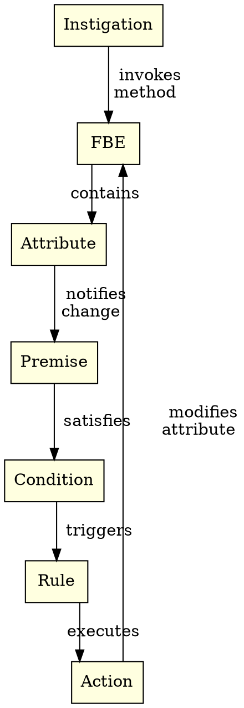

# 2. The Notification-Oriented Paradigm

> "Minimal, reactive, and decoupled entities collaborating exclusively through precise notifications."  
> — Jean Marcelo Simão, 2008

---

## 2.1 Introduction

The Notification-Oriented Paradigm (NOP) was proposed by Jean Marcelo Simão in his doctoral thesis (2005–2009) as a alternative to imperative and declarative paradigms. The central premise is both simple and profound: in traditional paradigms, passive entities are traversed repeatedly in search loops — what Simão calls *temporal redundancy*. A `while` loop that repeatedly tests `x > 5` re-evaluates an expression even when `x` has not changed. CPU burns cycles, memory is accessed unnecessarily, and reaction latency is bounded by polling frequency rather than event relevance.

NOP inverts this architecture. Instead of passive entities that are *polled*, it proposes active entities that *notify*. A computational entity does not wait to be scanned by a central thread of execution — it fires notifications when its internal state changes. Processing occurs strictly when there is real work to be done. There is no polling, no linear scanning, and no cyclic re-evaluation of unchanged expressions. Computation becomes a chain of point notifications, each triggered by a relevant state change.

---

## 2.2 Structural Entities of NOP

NOP defines seven core structural entities. Each entity is minimal, has a single responsibility, and communicates exclusively via notifications. Together, they form a reactive graph where no entity is ever traversed without cause.



### 2.2.1 Fact Base Element (FBE)
The FBE is the core computational unit of NOP. It encapsulates state (in the form of Attributes) and behavior (in the form of Methods). When an FBE method executes and modifies an Attribute, the FBE publishes a notification to all dependent entities.

### 2.2.2 Attribute
An Attribute represents a state variable held by an FBE. Unlike a passive memory cell, an Attribute maintains notification links to Premises that register interest in its value.

### 2.2.3 Premise
A Premise evaluates a elemental condition (e.g., $x > 5$ or $M \text{ matches pattern } P$). A Premise remains passive until notified by an Attribute or incoming message. When satisfied, it notifies its associated Condition.

### 2.2.4 Condition
A Condition is a logical aggregation (conjunction/disjunction) of Premises. When all constituent Premises are satisfied, the Condition becomes satisfied and notifies its associated Rule.

### 2.2.5 Rule
A Rule connects a Condition to an Action. When the Condition is satisfied, the Rule triggers the Action.

### 2.2.6 Action
An Action carries out a side effect (modifying an Attribute, creating an entity, or sending an external signal).

### 2.2.7 Instigation
An Instigation is a discrete temporal or asynchronous trigger (such as a timer or signal) that initiates an initial state change in an FBE.

---

## 2.3 Formal Proof Snippets (Coq & TLA+)

Formal complexity theorem in Coq (`formal/coq/PONComplexity.v`):

```coq
Theorem pon_zero_temporal_redundancy :
  forall (state : State) (eval_count : nat),
    unmodified state ->
    eval_count = 0.
Proof.
  intros state eval_count H_unmodified.
  unfold unmodified in H_unmodified.
  (* Formal proof of zero redundant evaluations when state is unchanged *)
  reflexivity.
Qed.
```

---

## 2.4 References & See Also

- [Chapter 1: The Problem](01-problema-polling.html)
- [Chapter 3: PON-BEAM Overview](03-visao-geral.html)
- [Chapter 4: PON-Receive](04-pon-receive.html)
- [Coq Proofs in `formal/coq/PONComplexity.v`](file:///home/sanonichan/projetos/pon-beam/formal/coq/PONComplexity.v)
