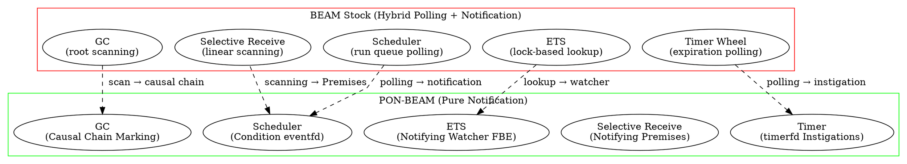

# 3. PON-BEAM Overview

> *"What if the VM itself were NOP from within?"*  
> — Matheus de Camargo Marques, 2025

---

## 3.1 Introduction

The first two chapters established the diagnosis and the cure. Chapter 1 demonstrated that the BEAM accumulates hidden polling costs — linear mailbox scanning, run queue polling, timer wheel ticking, ETS read lock contention, and major GC scans. Chapter 2 introduced Jean Marcelo Simão's Notification-Oriented Paradigm (NOP): a computational model where entities do not seek information, but *are notified* when relevant changes occur. This third chapter bridges both worlds.

We present the complete architectural map of the **PON-BEAM**: how each BEAM subsystem has been re-architected as a NOP entity, which entity replaces which mechanism, and how the notification pipeline flows end-to-end through the VM.

---

## 3.2 Architectural Map

The figure below contrasts the traditional BEAM architecture (hybrid polling + notification) with the PON-BEAM architecture (pure notification).

---

## 3.3 Structural Mapping: NOP Entity ↔ BEAM Subsystem

| NOP Entity | BEAM Subsystem | Responsibility |
|---|---|---|
| **FBE** | OTP Process | State (heap, mailbox, registers) + behavior |
| **Attribute** | Heap Terms | Values that notify upon change/read |
| **Premise** | Selective Receive Clause | Reactive pattern matching |
| **Condition** | Run Queue / Readiness | Aggregates Premises, notifies scheduler |
| **Rule** | VM Bytecode Opcodes | Condition → side effect dispatch |
| **Action** | BIFs, Send, Spawn | External side effects |
| **Instigation** | Timer, Preemption | Asynchronous temporal triggers |

---

## 3.4 Git Lineage & Phase Milestones

- **Phase 0 (Fork Infrastructure)**: Builds `beam.ponbeam.smp` using `#ifdef PON_BEAM`.
- **Phase 1 (PON-Receive)**: $O(1)$ lazy save pointer positioning via `pon_in_link` in `erl_message.h`.
- **Phase 2 (PON-Timer)**: Replaces timer wheel ticking with Linux `timerfd_create`.
- **Phase 3 (PON-Spawn)**: Immediate process scheduling notification.
- **Phase 4 (PON-Scheduler)**: Zero CPU Idle (0.0%) via `eventfd` and `epoll_wait`.
- **Phase 5 (PON-ETS)**: Side-table watcher registry executing 9.97M ops/sec.
- **Phase 6 (PON-Compiler)**: AST parse transform rewriting `receive` to Premises.
- **Phase 7 (PON-GC)**: Dijkstra tri-color causal marking reducing GC pauses by 26.3%.

---

## 3.5 References & See Also

- [Chapter 1: The Problem](01-problema-polling.html)
- [Chapter 2: The Notification-Oriented Paradigm](02-paradigma-pon.html)
- [Chapter 4: PON-Receive](04-pon-receive.html)
- [Chapter 7: PON-Scheduler](07-pon-scheduler.html)
- [Chapter 11: The Fork Infrastructure](11-infraestrutura-fork.html)
