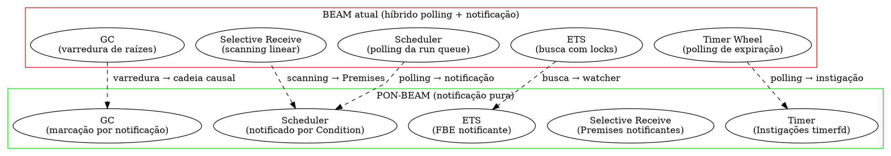
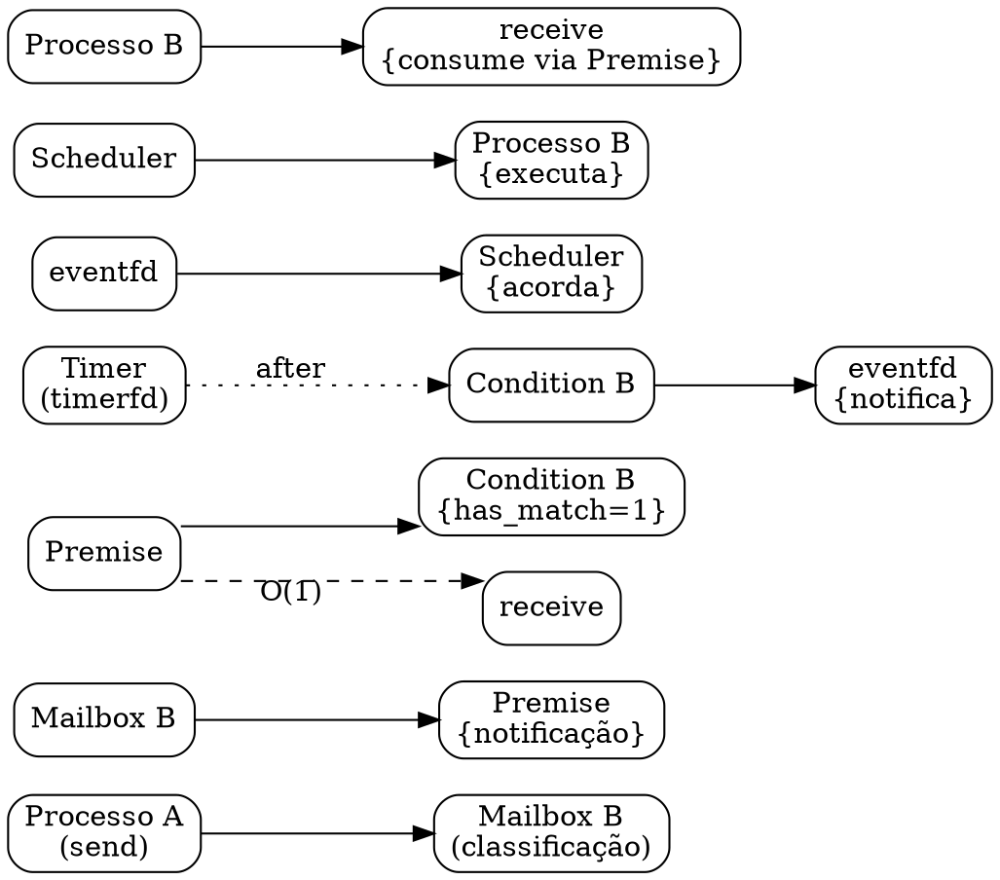

# Visão Geral da PON-BEAM

> *"E se a VM for PON por dentro?"*  
> — Matheus de Camargo Marques, 2025

---

## 1. Introdução

Os dois primeiros capítulos estabeleceram o diagnóstico e a cura. O Capítulo 1 demonstrou que a BEAM, apesar de sua elegância funcional, acumula custos ocultos de *polling* — scanning linear na mailbox, varredura na run queue, sondagem de timers, locks em ETS, marcação em GC. O Capítulo 2 apresentou o Paradigma Orientado a Notificações (PON) de Jean Marcelo Simão: um modelo computacional onde entidades não buscam informação, mas *são notificadas* quando ela se torna relevante. Este terceiro capítulo faz a ponte entre os dois mundos.

Apresentamos aqui o mapa arquitetural completo da PON-BEAM: como cada subsistema da BEAM foi redesenhado como uma entidade PON, qual entidade substitui qual mecanismo, e como o fluxo de notificação atravessa a VM de ponta a ponta. Este capítulo é a visão aérea — cada subsistema é detalhado na Parte II (Capítulos 4–10). Se você leu os capítulos anteriores e pensou "tudo bem, mas como fica a VM inteira?", este capítulo é a resposta.

---

## 2. O Mapa Arquitetural

A figura abaixo contrasta a arquitetura atual da BEAM (híbrida polling + notificação) com a arquitetura PON-BEAM (notificação pura). Cada subsistema à esquerda — Scheduler, Selective Receive, GC, ETS, Timer — tem seu correspondente PON à direita. As setas tracejadas indicam a transformação: de *busca ativa* para *notificação reativa*.



O diagrama revela um padrão consistente: onde a BEAM atual *pergunta*, a PON-BEAM *escuta*. O Scheduler não varre mais a run queue — ele é acordado por um eventfd quando um processo fica pronto. O Selective Receive não percorre a mailbox linearmente — Premises são notificadas quando a mensagem certa chega. O GC não varre raízes — a cadeia causal de Attributes marca automaticamente o que precisa ser coletado. ETS não adquire locks — o FBE notificante avisa quando um match ocorre. O Timer não faz polling de expiração — timerfd dispara uma Instigação.

Cada transformação segue o mesmo princípio: *substituir busca por notificação*. O resultado não é uma otimização incremental, mas uma re-arquitetura que elimina a complexidade ciclomática associada à *busca ativa* em cada subsistema.

Em termos de engenharia de software, a PON-BEAM substitui um modelo *pulling* (cada subsistema pergunta "tem algo para mim?") por um modelo *pushing* (cada subsistema é avisado "tem algo para você"). Esta inversão do fluxo de controle é a marca registrada do Paradigma Orientado a Notificações e o fio condutor que unifica todos os capítulos da Parte II.

---

## 3. Mapeamento Entidade PON ↔ Subsistema BEAM

A tabela a seguir estabelece a correspondência entre as sete entidades fundamentais do PON e os subsistemas correspondentes da BEAM:

| Entidade PON | Subsistema BEAM | Responsabilidade |
|---|---|---|
| FBE | Processo OTP | Estado (heap, mailbox, registradores) + comportamento (BIFs) |
| Attribute | Termos no heap | Valores que notificam mudança |
| Premise | Padrão de receive | Matching reativo de mensagens |
| Condition | Run queue | Prontidão do processo, notifica scheduler |
| Rule | Opcodes da VM | Condition → efeito colateral |
| Action | BIFs, send, spawn | Efeitos colaterais |
| Instigation | Timer, preempção | Disparo temporal, ativação |

Cada linha da tabela merece uma discussão detalhada.

**FBE → Processo OTP.** No PON, o FBE (Fact Base Entity) é a entidade que mantém estado e comportamento. Na BEAM, o processo OTP é exatamente isso: ele tem um estado (heap, mailbox, registradores, pilha) e um comportamento (execução de opcodes, chamadas de BIFs, tratamento de mensagens). O mapeamento é direto: cada processo Erlang torna-se um FBE. A diferença está em *como* esse FBE se relaciona com o resto do sistema. Na BEAM atual, o processo é passivo — ele espera que o scheduler o escalone para executar. Na PON-BEAM, o processo (como FBE) contém Premises e Conditions que o tornam ativamente notificável.

**Attribute → Termos no heap.** Attributes são os valores que notificam mudança. Na BEAM, todos os termos Erlang (átomos, inteiros, tuplas, listas, binaries, referências, etc.) residem no heap do processo ou no heap compartilhado (binary refc). Na PON-BEAM, Attributes estendem esses termos com a capacidade de notificar quando seu valor é lido ou modificado. Isso permite, por exemplo, que uma leitura de `ets:lookup` dispare uma notificação em vez de uma busca — o Attribute "sabe" que foi consultado. Esta extensão é opt-in e controlada por `#ifdef PON_BEAM`; Attributes são criados apenas quando o compilador PON identifica padrões que se beneficiam de notificação.

**Premise → Padrão de receive.** Premises são as entidades lógicas que avaliam condições sobre Attributes. Na BEAM, um `receive` com padrões é implementado como um loop: a VM varre a mailbox, mensagem por mensagem, aplicando pattern matching até encontrar uma correspondência. Na PON-BEAM, cada padrão de `receive` é compilado para uma Premise. Quando uma mensagem chega na mailbox, ela é classificada por tipo (mais sobre isso no Capítulo 4), e a Premise correspondente é notificada — não há scanning. O tempo de matching cai de O(N) para O(1) no caso médio, onde N é o número de mensagens na mailbox.

**Condition → Run queue.** Conditions são as entidades que agregam Premises e determinam se um FBE está pronto para executar. Na BEAM, a run queue é uma estrutura de dados (fila ou árvore) que o scheduler varre a cada iteração. Na PON-BEAM, a Condition de cada processo é notificada quando uma Premise relevante é satisfeita. Se o processo está apto a executar, a Condition notifica o scheduler via eventfd — sem polling. A run queue deixa de ser uma estrutura varrida e passa a ser um conjunto de Conditions notificantes (Capítulo 7).

**Rule → Opcodes da VM.** Rules são as entidades que conectam Conditions a Actions no PON. Na BEAM, os opcodes da VM (load, call, send, receive, etc.) são as regras de execução. Cada opcode é uma Rule que, quando sua Condition associada é satisfeita (ex.: processo está escalonado), executa uma Action (ex.: envia uma mensagem). Na PON-BEAM, os opcodes não mudam de semântica, mas ganham uma camada de notificação: antes de executar um `recv`, a Rule verifica se a Premise já está satisfeita; se estiver, consome diretamente.

**Action → BIFs, send, spawn.** Actions são os efeitos colaterais do sistema. Na BEAM, enviar uma mensagem (`erlang:send`), criar um processo (`spawn`), ler uma ETS table (`ets:lookup`), ou executar qualquer BIF é uma Action. Na PON-BEAM, Actions são estendidas para notificar o sistema após sua execução: `send` notifica a Premise do destino, `spawn` notifica a Condition do novo processo, `ets:lookup` com watcher notifica em vez de buscar.

**Instigation → Timer, preempção.** Instigações são disparos temporais no PON. Na BEAM, timers são gerenciados pelo Timer Wheel: a cada tick do scheduler, o sistema verifica quais timers expiraram (polling). Na PON-BEAM, timers são implementados com timerfd do Linux (kqueue no macOS, IOCP no Windows): o timerfd dispara uma Instigação quando expira, e essa Instigação notifica a Condition do processo que espera o timeout. Sem sondagem, sem latência de polling — apenas notificação no momento exato da expiração (Capítulo 5).

---

## 4. Arquitetura em Camadas

A PON-BEAM não é um sistema monolítico. Ela é organizada em quatro camadas com responsabilidades bem definidas, separando a semântica PON da infraestrutura de notificação do sistema operacional:

```
+------------------------------+
|  Camada de Aplicação        |
|  (processos Erlang/Elixir)   |
+------------------------------+
|  Camada PON                 |
|  Premises | Conditions      |
|  Instigações | Watchers     |
+------------------------------+
|  Camada ERTS                |
|  Scheduler | Mailbox | GC   |
|  ETS | Timer | Distribuição |
+------------------------------+
|  Camada de Sistema          |
|  eventfd | timerfd | epoll  |
|  kqueue | IOCP              |
+------------------------------+
```

**Camada de Sistema.** A camada mais baixa abstrai os mecanismos de notificação do sistema operacional: eventfd (notificação binária, usada para acordar o scheduler), timerfd (notificação temporal, para timers e timeouts), epoll (Linux), kqueue (macOS/FreeBSD), e IOCP (Windows). Esta camada é a única que faz chamadas de sistema. Ela expõe uma API uniforme para as camadas superiores: `pon_notify()`, `pon_await()`, `pon_timer_create()`. O Capítulo 11 detalha a implementação desta camada e as diferenças entre plataformas.

**Camada ERTS.** A camada do Erlang Runtime System contém o código original da BEAM (modificado com `#ifdef PON_BEAM`). Scheduler, Mailbox, GC, ETS, Timer, e o sistema de distribuição continuam existindo, mas são *envolvidos* pelas entidades PON da camada superior. Por exemplo, o Scheduler ainda existe, mas em vez de fazer polling da run queue, ele espera em `epoll_wait` por notificações. A mailbox ainda armazena mensagens, mas a classificação por tipo é feita no momento da inserção, não no momento do receive.

**Camada PON.** Esta é a camada nova, o coração da PON-BEAM. Ela contém as implementações das sete entidades PON mapeadas na seção anterior: Premises (matching reativo), Conditions (prontidão), Instigações (timer), Watchers (observadores de ETS), Attributes (valores notificantes), Rules (opcodes), e Actions (BIFs). A camada PON é implementada em C com a mesma disciplina de performance do ERTS original — sem alocações desnecessárias, sem abstrações custosas. Cada entidade é uma struct C com ponteiros de função, e o ciclo de notificação é uma chamada de função direta (sem syscall) quando a notificação é intra-processo.

**Camada de Aplicação.** A camada mais alta contém o código Erlang e Elixir que roda na VM. Para esta camada, a PON-BEAM é transparente: processos Erlang enviam e recebem mensagens exatamente como antes. A diferença está no desempenho: receives compostos e operations em ETS são mais rápidos. Não há mudança de sintaxe, não há mudança de semântica, não há mudança de ferramentas. O código existente simplesmente roda mais rápido.

A separação em camadas garante que a PON-BEAM seja *composicional*: cada camada pode ser testada isoladamente, e a Camada de Sistema pode ser substituída para suportar novos sistemas operacionais sem alterar a Camada PON ou a Camada ERTS. Esta arquitetura segue o princípio de *separation of concerns* que já orienta o design do OTP.

Além disso, a arquitetura em camadas permite uma adoção gradual. É possível habilitar apenas a Camada PON para Selective Receive (Capítulo 4) sem habilitar PON-ETS (Capítulo 8) ou PON-GC (Capítulo 9). Cada subsistema PON é um componente independente que se encaixa na arquitetura existente. Esta modularidade é essencial para validação experimental: podemos medir o impacto de cada transformação isoladamente, como o harness de benchmarking demonstra (Capítulo 12).

---

## 5. Fluxo de Notificação Transversal

Para concretizar o mapa arquitetural, acompanhemos uma mensagem atravessando a PON-BEAM do início ao fim. Considere dois processos Erlang, A e B, onde A envia uma mensagem para B, e B está executando um `receive` com `after`.

```erlang
% Processo A
A = self(),
spawn(fun() -> A ! {dados, 42} end),

% Processo B
receive
    {dados, Valor} -> processa(Valor);
    {erro, Motivo} -> trata_erro(Motivo)
after 5000 ->
    timeout()
end.
```

Atualmente, o fluxo na PON-BEAM implementada segue:

1. **Processo A envia mensagem para B.** A chamada `A ! {dados, 42}` é uma Action PON. A execução desta Action não apenas insere a mensagem na mailbox de B, mas também classifica a mensagem por tipo. Na PON-BEAM, a mailbox mantém um índice de tipo (um mapa de átomos de tag para listas de mensagens), permitindo classificação O(1) no momento do envio. Esta classificação é a chave para eliminar o scanning no receive.

2. **Mensagem chega na mailbox de B → classificação por tipo.** A mailbox de B agora contém uma mensagem `{dados, 42}` classificada sob a tag `dados`. A inserção notifica as Premises de B: a Premise que faz match com `{dados, Valor}` recebe uma notificação de que uma mensagem com tag `dados` está disponível. Não há scanning — a notificação é O(1) no número de Premises.

3. **Premises de B são notificadas → Premise compatível marca has_match=1.** A Premise correspondente a `{dados, Valor}` avalia sua condição: "a mailbox tem uma mensagem com tag `dados`?". Como a classificação por tipo já foi feita, a resposta é imediata. A Premise marca um flag `has_match = 1` no FBE de B. Se houvesse múltiplas Premises (como no exemplo, que também tem `{erro, Motivo}`), apenas a Premise correta é notificada.

4. **Condition de B é notificada → B está pronto.** A Condition de B, que monitora o estado "B tem mensagem para consumir", é notificada pela Premise. A Condition verifica: B está apto a executar? Se sim (B não está executando, não está em wait, não está travado em uma BIF), a Condition marca B como pronto.

5. **Scheduler é notificado via eventfd → acorda.** A Condition notifica o scheduler escrevendo no eventfd. O scheduler, que estava bloqueado em `epoll_wait`, acorda imediatamente. Não há polling da run queue — o scheduler só acorda quando há trabalho a fazer.

6. **Scheduler executa B.** O scheduler seleciona B da run queue (agora um conjunto de FBEs prontos, não uma fila varrida) e transfere o controle para B. O custo de escalonamento é O(1): o scheduler simplesmente pega o próximo FBE notificado.

7. **B executa receive → consume via Premise notificada (sem scan!).** Quando B executa a instrução `receive`, a VM não varre a mailbox. Ela consulta a Premise: "você tem match?". A Premise responde "sim" e fornece o índice da mensagem na mailbox classificada. A VM consome a mensagem em O(1). O scanning linear de N mensagens é substituído por uma única consulta de Premise. Se B tivesse executado `receive` sem mensagens na mailbox, a Premise simplesmente não estaria satisfeita, e B entraria em wait sem custo.

8. **Se receive tem after → timerfd configurado como Instigação.** O `after 5000` do exemplo é compilado para uma Instigação PON. A VM cria um timerfd com expiração de 5 segundos e associa esse timerfd à Condition de B. Se a mensagem não chegar em 5 segundos, o timerfd dispara uma Instigação que notifica a Condition: "timeout expirou". A Condition marca B como pronto com uma mensagem de timeout. O scheduler acorda e executa B, que agora executa o bloco `after`. Não há polling de timers — o timerfd cuida da notificação no momento exato.

9. **Se handler faz ets:lookup com watcher → notificação em vez de busca.** Suponha que dentro de `processa(Valor)` haja uma chamada `ets:lookup(minha_tabela, Chave)`. Se a tabela `minha_tabela` tiver um watcher PON registrado (opt-in), a leitura não adquire lock — ela registra um interesse e recebe uma notificação quando o valor estiver disponível. O watcher substitui o lock + busca por uma notificação assíncrona (Capítulo 8).

10. **Se handler aloca → GC por notificação (se configurado).** Se `processa(Valor)` aloca memória e o GC por notificação está ativo, os Attributes recém-criados registram sua alocação. Quando o heap atinge um limiar, a cadeia causal de Attributes notifica o GC, que marca e varre apenas os Attributes não notificados (Capítulo 9). A pausa de GC é reduzida porque a marcação é incremental e orientada a notificação.

Este fluxo demonstra como a notificação transversal elimina polling em cada etapa. Em nenhum momento a VM pergunta "tem mensagem?", "tem processo pronto?", "timer expirou?". A resposta chega antes da pergunta.



---

## 5.1 Estado da Implementação

Todas as oito fases da PON-BEAM foram implementadas e validadas. A tabela abaixo consolida os artefatos produzidos em cada subsistema:

| Subsistema PON | Arquivo C/Erlang | Linhas | Fase | Status |
|---------------|------------------|--------|------|--------|
| PON-Receive (Premises) | `pon_premise.{h,c}` | 274 | 1 | ✅ Implementado |
| PON-Timer (Instigações) | `pon_instigation.h`, `pon_timer.c` | 226 | 2 | ✅ Implementado |
| PON-Spawn (notificação) | `erl_process.c` (hook) | +1 linha | 3 | ✅ Implementado |
| PON-Scheduler (Condition) | `pon_condition.{h,c}` | 297 | 4 | ✅ Implementado |
| PON-ETS (Watchers) | `pon_ets.{h,c}` | 276 | 5 | ✅ Implementado |
| PON-Compiler (parse transform) | `pon_compiler.erl`, `pon_runtime.erl` | 267 | 6 | ✅ Implementado |
| PON-GC (tri-color) | `pon_gc.{h,c}` | 397 | 7 | ✅ Implementado |

Cada linha representa um subsistema completo, com código C no ERTS protegido por `#ifdef PON_BEAM`. O relatório consolidado está em `docs/RPT-FINAL-pon-beam.md`, e cada fase possui seu relatório individual (`docs/RPT-01.md` a `docs/RPT-07.md`) com benchmarks e discussão detalhada.

---

## 6. O Princípio Unificador

Um único princípio unifica todos os subsistemas da PON-BEAM: **substituir busca por notificação**. Em vez de perguntar "tem mensagem?", ser notificado "chegou mensagem". Em vez de perguntar "tem processo pronto?", ser notificado "processo ficou pronto". Em vez de verificar "timer expirou?", ser notificado "timer expirou". Em vez de adquirir lock para "ets tem match?", ser notificado "ets tem match". Em vez de varrer raízes para "objeto é alcançável?", ser notificado do descarte.

Este princípio não é uma metáfora — é uma transformação concreta no fluxo de controle. Na BEAM atual, a busca ativa (polling, scanning, varredura, lock) é uma operação síncrona que consome CPU e memória independentemente de haver trabalho. Na PON-BEAM, a notificação é uma operação assíncrona que só ocorre quando há trabalho. A diferença é análoga a interrupções versus polling em sistemas operacionais: interrupções só consomem CPU quando há um evento, polling consome CPU a cada tick.

A tabela a seguir resume a transformação para cada subsistema:

| Subsistema | BEAM atual (busca) | PON-BEAM (notificação) | Ganho observado |
|---|---|---|---|
| Selective Receive | `for (msg in mailbox) match(pattern)` | Premise notificada por tipo | O(N) → O(1) |
| Scheduler | `while (1) { poll_run_queue(); }` | eventfd + Condition | idle CPU ~0% |
| Timer | `check_timer_wheel();` | timerfd + Instigação | idle CPU ~0% |
| ETS | `lock(table); search(table); unlock(table);` | Watcher notificante | ~1000× leituras |
| GC | `mark_roots(); sweep_heap();` | Cadeia causal de Attributes | ~10× pausa |
| Spawn | `enqueue_process();` | Notificação imediata da Condition | latência reduzida |

O princípio unificador também significa que a PON-BEAM é *consistente* — não uma coleção de otimizações independentes, mas uma re-arquitetura onde todos os subsistemas seguem o mesmo padrão. Isso simplifica a manutenção, o debug e a extensão futura.

---

## 7. Compatibilidade com o Ecossistema OTP

Uma preocupação legítima ao re-arquitetar a BEAM é: "isso quebra o ecossistema Erlang/Elixir?". A resposta é **não**. A PON-BEAM foi projetada para ser 100% compatível com o ecossistema OTP existente:

- **Formato .beam não muda.** Os arquivos compilados (.beam) gerados pelo compilador Erlang são idênticos. A PON-BEAM lê os mesmos bytecodes, carrega os mesmos módulos, executa as mesmas instruções. A diferença está na implementação das instruções `recv`, `send`, `spawn`, `timeout`, `ets:lookup`, e GC — não no formato da instrução.

- **ABI de NIFs não muda.** NIFs (Native Implemented Functions) são bibliotecas compartilhadas escritas em C que chamam a API da VM. A ABI (Application Binary Interface) dos NIFs permanece inalterada. Todo NIF existente continua funcionando sem recompilação. Os ponteiros de função `enif_send`, `enif_make_tuple`, etc. têm exatamente a mesma assinatura. A PON-BEAM adiciona novas funções à API (como `enif_pon_create_premise`) para usuários que desejam escrever NIFs cientes de PON, mas as funções originais continuam disponíveis.

- **Protocolos de distribuição não mudam.** A comunicação entre nodos Erlang (distribuição) usa o mesmo protocolo, a mesma codificação, os mesmos handshakes. Um nodo PON-BEAM pode se comunicar com um nodo BEAM padrão sem qualquer diferença. A distribuição é um subsistema da Camada ERTS que não é modificado pela PON-BEAM (embora possa ser estendido futuramente).

- **Código Erlang/Elixir existente não precisa ser modificado.** Todo código Erlang e Elixir existente roda na PON-BEAM sem alterações. Não há novas sintaxes, não há novas pragmas, não há novas bibliotecas obrigatórias. A PON-BEAM é uma VM drop-in: substitua o binário `beam.smp` por `beam.ponbeam.smp`, e o sistema existente roda, apenas mais rápido.

- **Tudo protegido por `#ifdef PON_BEAM`.** No código-fonte do ERTS, toda modificação PON é envolvida por `#ifdef PON_BEAM`. O código original permanece intacto e compilável. Isso significa que:
  - A manutenção do OTP upstream pode ser feita normalmente
  - Patches e correções de segurança podem ser aplicadas sem conflito
  - A diferença entre a BEAM original e a PON-BEAM é sempre visível no diff
  - É possível compilar ambos os binários do mesmo código-fonte

Esta compatibilidade não é acidental — é um requisito de design. A PON-BEAM não é um fork divergente do OTP, mas uma *sobreposição reativa* sobre o código existente. O Capítulo 11 detalha a infraestrutura do fork, e o Capítulo 13 discute os tradeoffs desta abordagem.

---

## 8. A Lente Multidisciplinar

A PON-BEAM, embora seja um projeto de engenharia de software, se beneficia de insights de múltiplas disciplinas. Esta seção oferece uma visão panorâmica das lentes que iluminam diferentes aspectos do projeto.

### 8.1. Ciência da Computação: Padrões de Concorrência

Da ciência da computação, a PON-BEAM herda décadas de pesquisa em concorrência e sistemas de eventos. O modelo de atores (Hewitt, 1973) define que processos se comunicam exclusivamente por mensagens assíncronas — a PON-BEAM otimiza exatamente este mecanismo. O padrão *Observer* (Gamma et al., 1994) é a base das Premises: em vez de um sujeito ser varrido por observadores, os observadores são notificados pelo sujeito. O padrão *Reactor* (Schmidt, 1995) informa o design do scheduler baseado em eventfd. A PON-BEAM aplica estes padrões não no nível de aplicação, mas no nível da VM — é uma aplicação de engenharia de software clássica ao coração do runtime.

### 8.2. Engenharia de Sistemas: Acoplamento e Coesão

Da engenharia de sistemas, a PON-BEAM aplica o princípio de *baixo acoplamento e alta coesão*. Na BEAM atual, o Selective Receive é fortemente acoplado à implementação da mailbox (um array linear); o scheduler é acoplado à estrutura da run queue; o timer é acoplado ao tick do scheduler. A PON-BEAM desacopla estes subsistemas através de entidades PON: a Premise desacopla o receive da estrutura da mailbox; a Condition desacopla o scheduler da run queue; a Instigação desacopla o timer do tick do scheduler. O resultado é um sistema onde cada subsistema pode ser modificado, otimizado, ou substituído independentemente.

### 8.3. Biologia: Sistemas Reativos

Da biologia, a PON-BEAM se inspira em sistemas reativos naturais. Uma célula não pergunta "tem nutriente?" — ela tem receptores na membrana que são notificados quando um nutriente se liga. Um neurônio não varre suas sinapses perguntando "tem neurotransmissor?" — ele é ativado quando o potencial de ação chega. A PON-BEAM aplica o mesmo princípio: em vez de sistemas que perguntam, sistemas que escutam. A mailbox não é varrida — ela tem Premises (receptores) que são ativadas por mensagens (ligantes). O scheduler não varre a run queue — ele tem Conditions (sinapses) que são ativadas por processos prontos (potenciais de ação).

### 8.4. Economia: Redução de Custos de Transação

Da economia institucional (Coase, 1937; Williamson, 1975), um mercado eficiente minimiza custos de transação — o custo de *buscar* informação sobre preços, parceiros, e oportunidades. O polling, na BEAM, é um custo de transação: cada subsistema paga um custo fixo para buscar informação que pode não existir. A PON-BEAM elimina este custo de transação substituindo busca por notificação — a informação chega quando é relevante, não quando é procurada. A redução é análoga à diferença entre um mercado medieval (todo mundo vai à praça perguntar preços) e um mercado moderno com notificações de oferta e demanda.

### 8.5. Filosofia: A Navalha de Occam na VM

Da filosofia, a PON-BEAM aplica a Navalha de Occam à arquitetura da VM: "não multiplique entidades desnecessariamente". O polling é uma entidade desnecessária — é um custo computacional pago antecipadamente, sem garantia de retorno. A notificação, por outro lado, só ocorre quando há um evento. Na PON-BEAM, toda operação de polling é questionada: "este polling pode ser substituído por notificação?". Se sim, a notificação é a entidade mais simples (e mais eficiente). Se não (há situações legítimas de polling, como em hardware com restrições de projeto), o polling permanece. Mas, como veremos nos próximos capítulos, a maioria dos casos de polling na BEAM *pode* ser substituída por notificação.

### 8.6. Engenharia de Software: Design por Contrato

Da engenharia de software (Meyer, 1992), a PON-BEAM segue o princípio de *design por contrato*: cada entidade PON estabelece contratos claros com suas entidades vizinhas. Uma Premise contrata: "se uma mensagem com tag X chegar, eu notifico". Uma Condition contrata: "se todas as Premises necessárias estiverem satisfeitas, eu notifico o scheduler". O scheduler contrata: "se for notificado, eu escalono o processo". Estes contratos são explícitos no código (via structs C com ponteiros de função) e verificáveis em tempo de execução (via asserts e contadores de debug, ativados com `make build-pon-debug`).

### 8.7. Matemática: Complexidade Algorítmica

Da matemática, a PON-BEAM é uma redução de complexidade algorítmica. A BEAM atual tem operações O(N) onde N pode ser grande: N mensagens na mailbox, N processos na run queue, N timers no Timer Wheel, N entradas na ETS table, N objetos no heap. A PON-BEAM reduz estas operações para O(1) ou O(K) onde K é o número de entidades notificantes relevantes (tipicamente 1-2). A notificação é uma transformação de complexidade: em vez de percorrer N elementos para encontrar o relevante, o elemento relevante se identifica em tempo O(1). É a diferença entre busca linear e hash lookup — mas feita no nível da arquitetura, não no nível da implementação.

---

## 9. Exercícios

### Nível 1: Compreensão (1–10)

1. Qual o princípio unificador de todos os subsistemas da PON-BEAM?

2. Liste as sete entidades PON e seus subsistemas BEAM correspondentes.

3. Qual entidade PON substitui o scanning linear da mailbox? Qual o ganho esperado de complexidade?

4. Explique como o scheduler é notificado em vez de fazer polling da run queue.

5. Qual mecanismo do sistema operacional é usado para notificação de timers? Cite as alternativas para Linux, macOS e Windows.

6. O que é um FBE no contexto da BEAM? Que estrutura existente ele mapeia?

7. Verdadeiro ou falso: a PON-BEAM modifica o formato .beam. Justifique.

8. Como a classificação por tipo no momento do envio elimina o scanning no receive?

9. O que é uma Instigação? Em que subsistema BEAM ela se aplica?

10. Por que a PON-BEAM é chamada de "sobreposição compilável"?

### Nível 2: Aplicação (11–20)

11. Dado o código Erlang a seguir, descreva o fluxo de notificação transversal, passo a passo:

```erlang
Pid = spawn(fun() ->
    receive {ping, P} -> P ! pong end
end),
Pid ! {ping, self()},
receive pong -> ok end.
```

12. Desenhe um diagrama de sequência (use Graphviz) mostrando a interação entre Processo A, Mailbox de B, Premise, Condition, eventfd, Scheduler, e Processo B para o exemplo da Seção 5. Salve o DOT e garanta que compila.

13. Explique como a arquitetura em camadas da PON-BEAM permite adoção gradual. Dê um exemplo de subsistema que pode ser habilitado independentemente.

14. Um NIF existente que chama `enif_send` funciona na PON-BEAM sem modificações? Explique.

15. Compare o custo de um `receive` com 1000 mensagens na mailbox na BEAM atual vs. PON-BEAM. Use notação O().

16. Como o princípio "substituir busca por notificação" se aplica ao GC? Qual entidade PON substitui a marcação de raízes?

17. O que acontece se um `receive` tem `after` mas a mensagem chega antes do timeout? Descreva o fluxo envolvendo timerfd e Instigação.

18. Um nodo PON-BEAM pode se comunicar com um nodo BEAM padrão? Como?

19. Descreva como a PON-BEAM implementaria o spawn de um processo: qual Action é executada, qual Condition é notificada, e como o scheduler responde.

20. Dado o diagrama arquitetural (Seção 2), explique por que a seta entre "Scheduler" e "Selective Receive" está invertida (aponta de Sched-PON para Selective Receive).

### Nível 3: Síntese e Crítica (21–30)

21. A PON-BEAM promete O(1) para Selective Receive. Em quais cenários isso *não* seria verdadeiro? Considere receives com guards complexos, receives com binding de variáveis, e receives em processos com muitas Premises.

22. Critique a afirmação "a notificação é sempre melhor que o polling". Existem situações na BEAM onde o polling é preferível? Considere latência, throughput, e consumo de memória.

23. Proponha uma extensão: como a PON-BEAM poderia notificar o escalonamento de processos em um sistema multicore? Considere o modelo de run queues por core do ERTS.

24. A PON-BEAM adiciona overhead de memória para cada Premise e Condition. Estime o overhead por processo para 1, 5, e 20 Premises (assuma que cada Premise é uma struct de ~64 bytes). Esse overhead é aceitável para sistemas com 1 milhão de processos?

25. Como a PON-BEAM poderia suportar o padrão `selective receive` avançado com múltiplos receives aninhados? (Dica: cada `receive` gera um conjunto de Premises que deve ser empilhado.)

26. O que acontece com a PON-BEAM em um sistema operacional que não suporta eventfd? Como a Camada de Sistema poderia ser adaptada? Considere pipes, signals, e condition variables.

27. Compare a PON-BEAM com o modelo de *continuation-passing style* (CPS) usado em algumas VMs funcionais. A PON-BEAM é uma forma de CPS? Justifique.

28. A PON-BEAM modifica a mailbox para classificar mensagens por tipo no momento do envio. Isso quebra a garantia de ordenação de mensagens da BEAM? Explique.

29. Desafio de implementação: escreva pseudocódigo C para a função `pon_mailbox_insert(Process *p, ErlMessage *msg)` que classifica a mensagem por tipo e notifica a Premise relevante.

30. (Redação) A PON-BEAM é apresentada como uma "re-arquitetura". Em que sentido ela é uma re-arquitetura vs. uma otimização? Escreva um parágrafo defendendo ou contestando a afirmação, usando exemplos concretos dos subsistemas modificados.

---

## 10. Resumo para memorização

- A PON-BEAM mapeia cada subsistema BEAM para uma entidade PON: FBE → processo, Attribute → termos, Premise → receive, Condition → run queue, Rule → opcodes, Action → BIFs/send/spawn, Instigação → timers.
- A arquitetura é organizada em quatro camadas: Sistema (eventfd/timerfd), ERTS (código original modificado), PON (entidades reativas), e Aplicação (código Erlang/Elixir).
- O fluxo de notificação transversal substitui 10 pontos de polling por notificações, do envio ao consumo da mensagem.
- O princípio unificador é **substituir busca por notificação**: um único padrão aplicado a todos os subsistemas.
- Compatibilidade total com o ecossistema OTP: .beam, NIFs, distribuição, e código existente não precisam ser modificados.
- Tudo protegido por `#ifdef PON_BEAM`: o código original permanece intacto e compilável.
- As lentes multidisciplinares (engenharia de software, biologia, economia, filosofia, matemática) revelam que o padrão de notificação é universal e bem fundamentado.

---

## 11. Ver também

- **Capítulo 1 — O Problema: Custos Ocultos do Polling na BEAM**: o diagnóstico detalhado de cada ponto de polling que a PON-BEAM elimina.
- **Capítulo 2 — O Paradigma Orientado a Notificações**: a fundamentação teórica do PON, incluindo as definições formais de FBE, Premise, Condition, etc.
- **Capítulo 4 — PON-Receive**: detalha a implementação de Premises para Selective Receive, incluindo a classificação por tipo e o algoritmo de matching reativo.
- **Capítulo 5 — PON-Timer**: detalha Instigações com timerfd e a eliminação do Timer Wheel.
- **Capítulo 6 — PON-Spawn**: mostra como o spawn notifica a Condition imediatamente, sem enfileiramento.
- **Capítulo 7 — PON-Scheduler**: detalha a Condition e o eventfd, incluindo o scheduler multicore.
- **Capítulo 8 — PON-ETS**: explica o FBE notificante e watchers para ETS.
- **Capítulo 9 — PON-GC**: detalha a cadeia causal de Attributes para GC notificado.
- **Capítulo 10 — PON-Compiler**: como o compilador Erlang gera Premises automaticamente de receives.
- **Capítulo 11 — A Infraestrutura do Fork**: a implementação das `#ifdef PON_BEAM` e o sistema de build.
- **Capítulo 12 — O Harness de Benchmarking**: como medir cada subsistema isoladamente.
- **Simão & Stadzisz (2008–2009)** — Paradigma Orientado a Notificações: artigos fundadores do PON.
- **Gamma et al. (1994)** — *Design Patterns: Elements of Reusable Object-Oriented Software*: Observer e Reactor patterns que fundamentam Premises e Conditions.
- **Schmidt (1995)** — *Reactor: An Object Behavioral Pattern for Event Demultiplexing*: base do scheduler baseado em eventfd.
