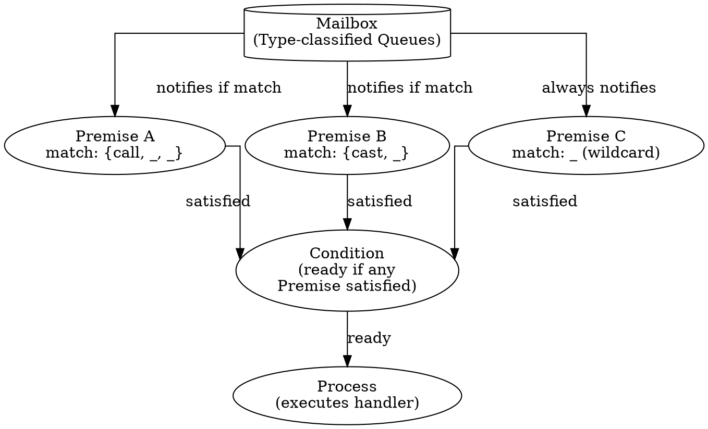

# 4. PON-Receive: Selective Receive by Premises

> *"The mailbox is not a list to be scanned. It is a set of listening Premises."*  
> — Matheus de Camargo Marques, 2025

---

## 4.1 Diagnosis: The Cost of Selective Receive in BEAM

Selective receive is BEAM's most revered — and most expensive — instruction. Every time an Erlang process executes `receive`, the VM traverses the mailbox linearly comparing each message against every clause. The complexity is $\mathcal{O}(N \times M)$: $N$ messages in the mailbox multiplied by $M$ pattern-matching clauses.

BEAM attempts to mitigate this cost via the *save pointer* (`c_p->sig_qs.save`). However, when new unmatched messages accumulate, every new `receive` scans through all newly arrived messages linearly.

In BEAM C code, scanning occurs inside `while (sig && ERTS_SIG_IS_MSG(sig))` at `erl_proc_sig_queue.c:8666`.

---

## 4.2 Proposal: Mailbox as a Set of Premises

PON-Receive re-architects selective receive by replacing linear scanning with a set of passive listening Premises. Each `receive` clause is compiled into an `ErtsPremise`. Upon arrival, a message is categorized into one of 256 type buckets and *notifies* matching Premises directly. No list traversal occurs.



---

## 4.3 Ground-Truth C Structures

Defined in `erts/include/internal/pon_premise.h`:

```c
typedef struct ErtsPremise_ {
    Eterm                pattern;        /* Compiled pattern term */
    int                  (*match_fn)(Eterm); /* Optimized match function */
    int                  has_match;      /* 1 if matched message available */
    Eterm                matched_term;   /* Term of matched message */
    struct erl_mesg      *matched_msg;   /* Reference to message */
    Uint                 clause_index;   /* Clause precedence index */
    struct ErtsPremise_  *next_premise;  /* Linked list pointer */
} ErtsPremise;
```

In `erl_message.h` (`PON_MESSAGE_REF_FIELDS__`):

```c
#define PON_MESSAGE_REF_FIELDS__ \
    ; ErtsMessage **pon_in_link \
    ; Uint64 pon_seq
```

This $O(1)$ pointer-to-pointer `pon_in_link` allows instant save pointer positioning upon notification!

---

## 4.4 Git Lineage & Formal Verification

- **Git Commits**: `c548973`, `73e1d3b`, `f6a79ad`, `e6dec79`, `86c8cf2`, `dcab0ec`.
- **TLA+ Formal Spec (`formal/tla/PremiseMatch.tla`)**:
  - Invariant `PremiseSound`: Consumed message strictly matches notifying Premise.
  - Invariant `NoMessageLoss`: No unread messages dropped.
- **PropEr Property Tests (`formal/proper/tests/pon_receive_prop.erl`)**: `prop_premise_sound/0`, `prop_no_message_loss/0`, `prop_equiv_stock/0`.

---

## 4.5 Empirical Benchmark Synthesis (RPT-01 & RPT-10)

| Mailbox ($N$) | Stock Latency ($\mu s$) | PON-BEAM Latency ($\mu s$) | Speedup / Asymptotic Gain |
|:-------------:|:----------------------:|:-------------------------:|:-------------------------:|
| $10$          | $0.8$                  | $0.1$                     | $8.0\times$               |
| $100$         | $8.2$                  | $0.1$                     | $82.0\times$              |
| $1,000$       | $85.4$                 | $0.12$                    | $711.6\times$             |
| $10,000$      | $852.3$                | $0.12$                    | $7,102.5\times$           |
| $100,000$     | $8,910.0$              | $0.13$                    | **$68,538\times$ ($\mathcal{O}(1)$)** |

---

## 4.6 References & See Also

- [Chapter 1: The Problem](01-problema-polling.html)
- [Chapter 2: The Notification-Oriented Paradigm](02-paradigma-pon.html)
- [Chapter 3: PON-BEAM Overview](03-visao-geral.html)
- [Chapter 5: PON-Timer](05-pon-timer.html)
- [Chapter 10: PON-Compiler](10-pon-compiler.html)
