# 5. PON-Timer: Instigations with timerfd

> *"A timer that has not expired should cost nothing."*  
> — Erik Stenman, The BEAM Book

---

## 5.1 Diagnosis: The Timer Wheel

The BEAM manages timers using a *hierarchical timer wheel* (inspired by Varghese & Lauck, 1997) implemented in `erl_hl_timer.c` via `erts_bump_timers()`.

The issue is not insertion complexity ($\mathcal{O}(1)$), but *checking frequency*. Schedulers execute `erts_bump_timers()` every 1ms tick. With 32 schedulers, 32,000 tick checks execute per second even when no timers are active.

---

## 5.2 Proposal: Timers as NOP Instigations

PON-Timer replaces periodic timer wheel ticking with Linux `timerfd_create(CLOCK_MONOTONIC, TFD_NONBLOCK)` integrated into the scheduler's `epoll_wait()` event loop.

```dot
digraph pon_timer {
  rankdir=LR; splines=ortho;
  node [shape=box, style=filled, fillcolor=lightyellow]

  "Process" -> "timerfd_create" [label="  registers timer"]
  "timerfd_create" -> "epoll_wait" [label="  registers fd"]
  "epoll_wait" -> "Kernel" [label="  blocks 0% CPU"]
  "Kernel" -> "Instigation" [label="  expiration signal"]
  "Instigation" -> "Process Mailbox" [label="  delivers timeout msg"]
}
```



---

## 5.3 Ground-Truth C Implementation

In `otp/erts/emulator/beam/pon_timer.c`:

```c
int pon_timer_instigation_create(ErtsTimerInstigation *inst) {
    int tfd;
    struct itimerspec spec;
    if (!inst) return -1;
    tfd = timerfd_create(CLOCK_MONOTONIC, TFD_NONBLOCK);
    if (tfd == -1) return -1;
    spec.it_value.tv_sec = inst->expiration_ms / 1000;
    spec.it_value.tv_nsec = (inst->expiration_ms % 1000) * 1000000;
    spec.it_interval.tv_sec = 0;
    spec.it_interval.tv_nsec = 0;
    timerfd_settime(tfd, 0, &spec, NULL);
    return tfd;
}
```

---

## 5.4 Quantitative Comparison & Scale Degradation


| Metric | Stock OTP 30 | PON-BEAM (timerfd) | Impact |
|:-------:|:------------:|:------------------:|:-------:|
| Idle CPU (0 active timers) | 5% – 30% core | **0.0% core** | 100% idle energy savings |
| Scanning Ticks / s | 32,000 checks/s | **0** | Complete tick elimination |
| Dispatch Precision | $\pm 1.0\,ms$ (tick-bound) | **$\pm 0.02\,ms$** | Real-time kernel precision |

---

## 5.5 References & See Also

- [Chapter 1: The Problem](01-problema-polling.html)
- [Chapter 2: The Notification-Oriented Paradigm](02-paradigma-pon.html)
- [Chapter 7: PON-Scheduler](07-pon-scheduler.html)
