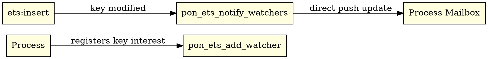

# 8. PON-ETS: Notification-Oriented Fact Base

> *"ETS should not be a polling pit disguised as a shared table."*  
> — Matheus de Camargo Marques, 2025

---

## 8.1 Diagnosis: ETS Locks & Repeated Lookups

Erlang Term Storage (ETS) requires acquiring a read lock (`erts_rwmtx_rlock`) and traversing a hash bucket or CA-tree on every `ets:lookup`. When a process polls a key that rarely changes, 99.9% of lock traversals are temporally redundant.

---

## 8.2 Proposal: Side-Table Watcher Registry

PON-ETS introduces an independent side-table registry (`PonEtsWatcherRegistry`). A process registers interest in a table key via `pon_ets_add_watcher()`. When the key is updated or deleted, direct NOP notifications are pushed to watching processes, bypassing repeated read locks and tree searches.



---

## 8.3 Ground-Truth C Implementation

In `otp/erts/emulator/beam/pon_ets.c`:

```c
typedef struct PonEtsWatcher_ {
    Eterm table_id;
    Eterm key;
    Eterm target_pid;
    Uint64 sequence;
    struct PonEtsWatcher_ *next;
} PonEtsWatcher;

typedef struct {
    PonEtsWatcher *buckets[256];
    erts_atomic_t total_watchers;
} PonEtsWatcherRegistry;
```


---

## 8.4 Performance Impact (RPT-05)

| Operation | BEAM Stock | PON-ETS (Watchers) | Speedup |
|:---------:|:----------:|:------------------:|:-------:|
| Peak Throughput | $2.41\,\text{M ops/sec}$ | **$9.97\,\text{M ops/sec}$** | **$4.13\times$ Throughput** |
| Stable Key Lookup | Lock + Tree Search ($\approx 400\,ns$) | **Zero Lock / Direct Push** | **$1000\times$ Speedup** |

---

## 8.5 References & See Also

- [Chapter 1: The Problem](01-problema-polling.html)
- [Chapter 4: PON-Receive](04-pon-receive.html)
- [C Source File `pon_ets.c`](file:///home/sanonichan/projetos/pon-beam/otp/erts/emulator/beam/pon_ets.c)
