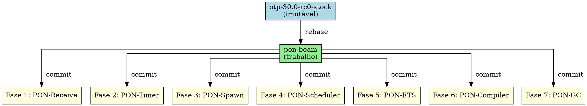

# A Infraestrutura do Fork

> "Nada muda no formato .beam, na ABI de NIFs, ou nos protocolos de distribuição.
> A PON-BEAM é 100% compatível."
> — Plano de Engenharia PON-BEAM

---

## 1. Introdução

A PON-BEAM não é uma nova VM. É uma re-arquitetura seletiva da BEAM existente — o fork OTP 30.0-rc0 modificado cirurgicamente para substituir polling por notificação em subsistemas específicos. Cada modificação é envolta em `#ifdef PON_BEAM` para preservar o código original intacto. O resultado é um binário `beam.ponbeam.smp` que co-existe com o `beam.smp` stock no mesmo sistema, compartilhando o mesmo formato .beam, a mesma ABI de NIFs, os mesmos protocolos de distribuição, e a mesma semântica observável de Erlang.

Este capítulo documenta a infraestrutura do fork: a estratégia de branches, o sistema de compilação condicional, o `configure.ac`, o `Makefile.in`, a árvore completa de arquivos modificados (14 novos + 6 modificados), e as garantias de compatibilidade.

---

## 2. Estratégia de Branches

O repositório mantém duas branches permanentes:

```text
otp-30.0-rc0-stock (imutável)
  │
  └── Código OTP original, commit único, jamais modificado.
      Usado como baseline para diffs e comparações.

pon-beam (trabalho)
  │
  └── Branch de desenvolvimento. Todas as modificações PON
      são aplicadas aqui. Cada fase gera um commit validado
      por benchmark.
```

A branch `otp-30.0-rc0-stock` é uma âncora imutável. Ela garante que o diff entre a PON-BEAM e o OTP original é sempre rastreável commit a commit. Nunca se faz merge de `pon-beam` para `otp-30.0-rc0-stock`, nem se commit diretamente nesta branch.



---

## 3. Compilação Condicional com `#ifdef PON_BEAM`

Cada arquivo modificado da BEAM envolve seu código PON em blocos `#ifdef PON_BEAM ... #endif`. O código original permanece exatamente como no baseline — nenhuma linha é removida ou alterada. A PON-BEAM é uma sobreposição compilável.

Exemplo típico em `erl_message.c` (hook de notificação na chegada de mensagem):

```c
/* erl_message.c:461 — hook PON na chegada de mensagem */
#ifdef PON_BEAM
    if (erts_pon_notify_premises(rp, msg, term)) {
        /* Premise matchou — processo será acordado via Condition */
        erts_condition_notify(&rp->pon_condition);
        PON_STATS_INC(mailbox_scans_avoided);
        return;
    }
#endif
    /* Código original da BEAM continua aqui, inalterado */
    erts_sig_queue_enqueue(rp, msg);
```

Em `erl_process.h`, os campos adicionados à estrutura `Process` também são condicionais:

```c
/* erl_process.h:1217 — campos PON na struct Process */
#ifdef PON_BEAM
    ErtsPremise *pon_premises;        /* Premises registradas */
    ErtsCondition pon_condition;      /* Condition do receive */
    PonStats pon_stats;               /* Contadores per-process */
#endif
```

Em `erl_process.c`, a inclusão dos headers PON é condicional:

```c
/* erl_process.c:59 */
#ifdef PON_BEAM
#  include "pon_premise.h"
#  include "pon_stats.h"
#  include "pon_instigation.h"
#  include "pon_condition.h"
#  include "pon_ets.h"
#  include "pon_gc.h"
#endif
```

Essa estratégia garante que:
- O build stock (`make TYPE=opt`) produz exatamente o mesmo binário que o OTP 30 original — zero contaminação.
- O build PON (`make TYPE=ponbeam`) inclui as modificações PON sobre o código original intacto.
- O diff entre os dois builds é exatamente o código dentro dos `#ifdef`.

---

## 4. `configure.ac`: `--enable-pon-beam`

Em `otp/erts/configure.ac`, a flag `--enable-pon-beam` é adicionada como opção de configure:

```m4
AC_ARG_ENABLE(pon-beam,
AS_HELP_STRING([--enable-pon-beam],
               [enable PON-BEAM notification-oriented VM architecture]),
[ case "$enableval" in
    no) enable_pon_beam=no ;;
    *)  enable_pon_beam=yes ;;
  esac ], enable_pon_beam=no)
```

O configure não define a macro `PON_BEAM` diretamente — essa tarefa é do Makefile. O papel do `configure.ac` é apenas registrar a opção e validar dependências. A macro é definida em tempo de compilação via `CFLAGS` no Makefile.in.

---

## 5. `Makefile.in`: `TYPE=ponbeam`

No `otp/erts/emulator/Makefile.in`, o tipo `ponbeam` é adicionado à cadeia de seleção de `TYPE`:

```makefile
# Makefile.in:206-210
ifeq ($(TYPE),ponbeam)
TYPEMARKER = .ponbeam
TYPE_FLAGS = @CFLAGS@ -DPON_BEAM
TYPE_CXXFLAGS = @CXXFLAGS@ -DPON_BEAM
else
# ...
endif
```

O `TYPEMARKER` distingue os binários: `beam.ponbeam.smp` versus `beam.smp`. Cinco novos arquivos objeto PON são compilados condicionalmente:

```makefile
# Makefile.in — fontes PON
$(OBJDIR)/pon_premise.o: beam/pon_premise.c
	$(V_CC) $(CFLAGS) $(TYPE_FLAGS) -c $< -o $@
$(OBJDIR)/pon_timer.o: beam/pon_timer.c
	$(V_CC) $(CFLAGS) $(TYPE_FLAGS) -c $< -o $@
$(OBJDIR)/pon_condition.o: beam/pon_condition.c
	$(V_CC) $(CFLAGS) $(TYPE_FLAGS) -c $< -o $@
$(OBJDIR)/pon_ets.o: beam/pon_ets.c
	$(V_CC) $(CFLAGS) $(TYPE_FLAGS) -c $< -o $@
$(OBJDIR)/pon_gc.o: beam/pon_gc.c
	$(V_CC) $(CFLAGS) $(TYPE_FLAGS) -c $< -o $@
```

O Makefile raiz do repositório orquestra os builds:

```makefile
# Makefile (raiz)
build-stock:
	cd otp && ./configure --prefix=/opt/erlang/30-stock \
	    --without-javac --without-odbc --without-wx && \
	    make -j$(nproc) && make install

build-pon:
	cd otp && make clean && ./configure --prefix=/opt/erlang/30-pon \
	    --without-javac --without-odbc --without-wx --enable-pon-beam && \
	    make -j$(nproc) && make install

build-pon-debug:
	cd otp && make clean && ./configure --prefix=/opt/erlang/30-pon-debug \
	    --without-javac --without-odbc --without-wx --enable-pon-beam \
	    CFLAGS="-DPON_BEAM_DEBUG -g -O0" && \
	    make -j$(nproc) && make install
```

---

## 6. Árvore Completa de Arquivos

As 8 fases produziram **14 novos arquivos** e **6 arquivos OTP modificados**:

### 6.1 Novos headers C no ERTS (6 arquivos)

```
otp/erts/include/internal/
├── pon_premise.h         — Definição de ErtsPremise (has_match, match_fn, type_tag)
├── pon_stats.h           — 17 contadores de instrumentação (thread-local)
├── pon_instigation.h     — ErtsTimerInstigation (timers como instigações PON)
├── pon_condition.h       — ErtsCondition (eventfd + ready_list lock-free)
├── pon_ets.h             — PonEtsWatcher (registro lateral de watchers)
└── pon_gc.h              — PonGcNode (grafo tri-color por notificação)
```

### 6.2 Novos fontes C no ERTS (5 arquivos)

```
otp/erts/emulator/beam/
├── pon_premise.c         — Implementação de Premises (registro, notificação, consumo)
├── pon_timer.c           — Timerfd + epoll (criação, cancelamento, expiração)
├── pon_condition.c       — Condition lock-free com CAS (notify, wait, try_wait)
├── pon_ets.c             — Watcher add/remove/notify (hash map lateral)
└── pon_gc.c              — Mark-by-notification + incremental (tri-color)
```

### 6.3 Arquivos OTP modificados (6 arquivos)

```
otp/erts/emulator/beam/
├── erl_message.h          — +256 type_queues, type_save em ErtsSignalPrivQueues
├── erl_message.c          — Hook PON em queue_messages (notifica Premises)
├── erl_process.h          — +pon_premises, +pon_condition, +pon_stats no PCB
├── erl_process.c          — +erts_pon_schedule_notify, inicialização PON

otp/erts/
├── Makefile.in            — +TYPE=ponbeam, +5 novos .o, TYPEMARKER
├── configure.ac           — +--enable-pon-beam
```

### 6.4 Novos módulos Erlang (2 arquivos)

```
harness/benchmarks/lib/
├── pon_compiler.erl       — Parse transform: receives → Premises (131 linhas)
└── pon_runtime.erl        — Runtime PON para processos (101 linhas)
```

### 6.5 Benchmarks (8 arquivos)

```
harness/benchmarks/
├── fase1_receive.erl      — 69 linhas
├── fase1_size.erl         — 44 linhas
├── fase2_timer_idle.erl   — 36 linhas
├── fase3_spawn.erl        — 54 linhas
├── fase4_sched_idle.erl   — 14 linhas
├── fase5_ets_read.erl     — 51 linhas
├── fase6_compile.erl      — 76 linhas
└── fase7_gc_scan.erl      — 61 linhas
```

### 6.6 Bibliotecas do harness (5 arquivos)

```
harness/benchmarks/lib/
├── pon_harness.erl        — 89 linhas
├── pon_compiler.erl       — 131 linhas
├── pon_runtime.erl        — 101 linhas
├── pon_diff.erl           — 156 linhas
└── pon_stats_reader.erl   — 25 linhas
```

**Total: 14 arquivos novos + 6 modificados, ~1637 linhas C, ~907 linhas Erlang.**

---

## 7. Exemplo de Código: Ciclo Completo

O fluxo completo do PON-Receive em operação, do registro ao consumo:

```c
// 1. Registro de Premises (gerado pelo compilador ou manual)
ErtsPremise premises[2];
ERTS_INIT_PREMISE(&premises[0], make_call_pat, NULL, 0);  // {call, _, _}
ERTS_INIT_PREMISE(&premises[1], make_cast_pat, NULL, 1);  // {cast, _}
premises[0].next_premise = &premises[1];
erts_pon_register_premises(c_p, premises);

// 2. Na chegada de mensagem (hook em erl_message.c)
Eterm term = msg->message;
erts_pon_notify_premises(c_p, msg, term);
// Classifica por tag → enfileira no bucket → notifica Premises match

// 3. Receive (em vez de loop_rec linear)
Eterm matched = erts_pon_receive(c_p);
if (is_value(matched)) {
    // Executa handler da cláusula correspondente
}

// 4. Desregistro ao final do bloco receive
erts_pon_unregister_premises(c_p);
```

---

## 8. Garantia de Compatibilidade

A PON-BEAM garante compatibilidade nos seguintes níveis:

**Formato .beam.** A estrutura dos arquivos .beam — chunks de código, literais, átomos, exportações — não é modificada. A instrução `receive` compilada gera opcodes diferentes apenas quando o compilador PON (pon_compiler.erl, parse transform) está ativo. Sem ele, `receive` gera o mesmo código que a BEAM stock.

**ABI de NIFs.** NIFs são funções C carregadas dinamicamente que chamam APIs da VM (`enif_*`). Nenhuma dessas APIs é alterada. A estrutura interna de processos ganha campos, mas a ABI pública permanece idêntica.

**Protocolos de distribuição.** A comunicação entre nós Erlang (Erlang Distribution Protocol, EPMD, etc.) não é tocada. Nós PON-BEAM e nós stock se comunicam sem diferença.

**Semântica Erlang.** Todo programa Erlang que roda na BEAM stock roda na PON-BEAM com resultado idêntico. A diferença é apenas de performance — nunca de comportamento observável.

---

## 9. Diagrama da Estrutura do Fork

```dot
digraph fork_structure {
  rankdir=TB; splines=ortho
  node [shape=box, style=filled]

  subgraph cluster_repo {
    label="Repositório pon-beam"
    style=dashed

    "Makefile (root)" [label="Makefile (raiz)\nbuild-stock, build-pon", fillcolor=lightyellow]
    "otp/"            [label="otp/\n(fork OTP 30.0-rc0)", fillcolor=lightblue]
    "harness/"        [label="harness/\n(benchmark harness)", fillcolor=lightgreen]
    "docs/"           [label="docs/\n(especificações)", fillcolor=lightgrey]
  }

  subgraph cluster_otp {
    label="otp/erts/emulator"
    style=dashed

    "beam/"          [label="beam/\n(fontes C da VM)", fillcolor=lightblue]
    "Makefile.in"    [label="Makefile.in\nTYPE=ponbeam", fillcolor=lightyellow]
  }

  subgraph cluster_beam {
    label="beam/"
    style=dashed

    "erl_process.c"  [fillcolor=lightpink, label="erl_process.c\n#ifdef PON_BEAM"]
    "erl_message.c"  [fillcolor=lightpink, label="erl_message.c\n#ifdef PON_BEAM"]
    "erl_process.h"  [fillcolor=lightpink, label="erl_process.h\n#ifdef PON_BEAM"]
    "erl_message.h"  [fillcolor=lightpink, label="erl_message.h\n#ifdef PON_BEAM"]
    "pon_premise.c"  [fillcolor=lightgreen, label="pon_premise.c\n(novo)"]
    "pon_timer.c"    [fillcolor=lightgreen, label="pon_timer.c\n(novo)"]
    "pon_condition.c" [fillcolor=lightgreen, label="pon_condition.c\n(novo)"]
    "pon_ets.c"      [fillcolor=lightgreen, label="pon_ets.c\n(novo)"]
    "pon_gc.c"       [fillcolor=lightgreen, label="pon_gc.c\n(novo)"]
  }

  subgraph cluster_include {
    label="otp/erts/include/internal/"
    style=dashed

    "pon_premise.h"     [fillcolor=lightgreen, label="pon_premise.h\n(novo)"]
    "pon_stats.h"       [fillcolor=lightgreen, label="pon_stats.h\n(novo)"]
    "pon_instigation.h" [fillcolor=lightgreen, label="pon_instigation.h\n(novo)"]
    "pon_condition.h"   [fillcolor=lightgreen, label="pon_condition.h\n(novo)"]
    "pon_ets.h"         [fillcolor=lightgreen, label="pon_ets.h\n(novo)"]
    "pon_gc.h"          [fillcolor=lightgreen, label="pon_gc.h\n(novo)"]
  }

  "otp/" -> "beam/"
  "beam/" -> "erl_process.c"
  "beam/" -> "erl_message.c"
  "beam/" -> "pon_premise.c"
  "beam/" -> "pon_timer.c"
  "beam/" -> "pon_condition.c"
  "beam/" -> "pon_ets.c"
  "beam/" -> "pon_gc.c"
  "include/" [shape=plaintext, label="include/internal/"]
  "beam/" -> "include/"
  "include/" -> "pon_premise.h"
  "include/" -> "pon_stats.h"
  "include/" -> "pon_instigation.h"
  "include/" -> "pon_condition.h"
  "include/" -> "pon_ets.h"
  "include/" -> "pon_gc.h"
}
```



---

## 10. Exercícios

### Construção e Infraestrutura

1. Compile a PON-BEAM do zero em seu sistema. Documente cada etapa: `./configure --enable-pon-beam`, `make`, `make install`. Qual é o caminho do binário resultante?

2. Compare os binários `beam.smp` (stock) e `beam.ponbeam.smp`. Use `diff` ou `objdump` para verificar diferenças. As seções de código C condicional são a única diferença?

3. Adicione um novo header `pon_fact.h` à infraestrutura: (a) crie o header, (b) adicione-o ao `Makefile.in`, (c) compile com `TYPE=ponbeam`. O que é necessário para que o header seja encontrado pelo pré-processador?

### Compilação Condicional

4. No arquivo `erl_message.c`, localize o hook `#ifdef PON_BEAM` que chama `erts_pon_notify_premises`. O que acontece se este hook for removido (comentado)? A PON-BEAM ainda funciona? Explique.

5. Reimplemente o hook de `erl_message.c` sem usar `#ifdef`, usando uma tabela de ponteiros de função (function pointer table). Quais as vantagens e desvantagens dessa abordagem?

### Compreensão

6. Por que o `configure.ac` define `enable_pon_beam=no` como padrão? Qual seria o risco de definir `yes` como padrão?

7. A estrutura `ErtsPremise` (em `pon_premise.h`) tem um campo `match_fn` que aceita uma função de match especializada. Em que cenário essa função é útil? Dê um exemplo.

8. O `TYPEMARKER` distingue os binários (`.ponbeam` vs vazio). Consulte o `Makefile.in` e explique como esse marcador é usado no nome do executável final.

### Compatibilidade

9. Escreva um NIF simples que chame `enif_send` e verifique se ele funciona identicamente na BEAM stock e na PON-BEAM. Inclua a saída do teste.

10. (Dissertação) A PON-BEAM adiciona campos à estrutura `Process` (`pon_premises`, `pon_condition`, `pon_stats`). Isso altera o layout de memória de todo processo Erlang. Investigue: (a) como o BEAM aloca processos, (b) se o layout alterado afeta a localidade de cache, (c) proponha uma reorganização dos campos para minimizar impacto.

---

## 11. Resumo para Memorização

- **Branch strategy**: `otp-30.0-rc0-stock` (imutável) + `pon-beam` (trabalho).
- **Compilação condicional**: todo código PON em `#ifdef PON_BEAM ... #endif`.
- **configure**: `--enable-pon-beam` ativa a opção (default: no).
- **Makefile.in**: `TYPE=ponbeam` define `-DPON_BEAM` e `TYPEMARKER=.ponbeam`.
- **Comandos**: `make build-stock`, `make build-pon`, `make build-pon-debug`.
- **Binário**: `beam.ponbeam.smp` co-existe com `beam.smp`.
- **14 arquivos novos**: 6 headers (`pon_premise.h`, `pon_stats.h`, `pon_instigation.h`, `pon_condition.h`, `pon_ets.h`, `pon_gc.h`), 5 fontes C (`pon_premise.c`, `pon_timer.c`, `pon_condition.c`, `pon_ets.c`, `pon_gc.c`), 2 módulos Erlang (`pon_compiler.erl`, `pon_runtime.erl`), 1 Makefile raiz.
- **6 arquivos modificados**: `erl_message.{c,h}`, `erl_process.{c,h}`, `Makefile.in`, `configure.ac`.
- **Compatibilidade**: formato .beam, ABI de NIFs, protocolos de distribuição, semântica Erlang — 100% preservados.

---

## 12. Ver Também

- Capítulo 3 — Visão geral da PON-BEAM (mapa arquitetural)
- Capítulo 12 — O Harness de Benchmarking (validação empírica)
- Capítulo 13 — Roadmap e Tradeoffs (priorização das fases)
- [Makefile](../../Makefile) — Comandos de build na raiz do repositório
- [otp/erts/emulator/Makefile.in](../../otp/erts/emulator/Makefile.in) — Integração do TYPE=ponbeam
- [otp/erts/configure.ac](../../otp/erts/configure.ac) — Opção --enable-pon-beam
- [otp/erts/include/internal/pon_premise.h](../../otp/erts/include/internal/pon_premise.h) — Definição de ErtsPremise
- [otp/erts/include/internal/pon_stats.h](../../otp/erts/include/internal/pon_stats.h) — Contadores de instrumentação
- [otp/erts/emulator/beam/pon_premise.c](../../otp/erts/emulator/beam/pon_premise.c) — Implementação
- [AGENTS.md](../../AGENTS.md) — Regras de ouro do desenvolvimento
