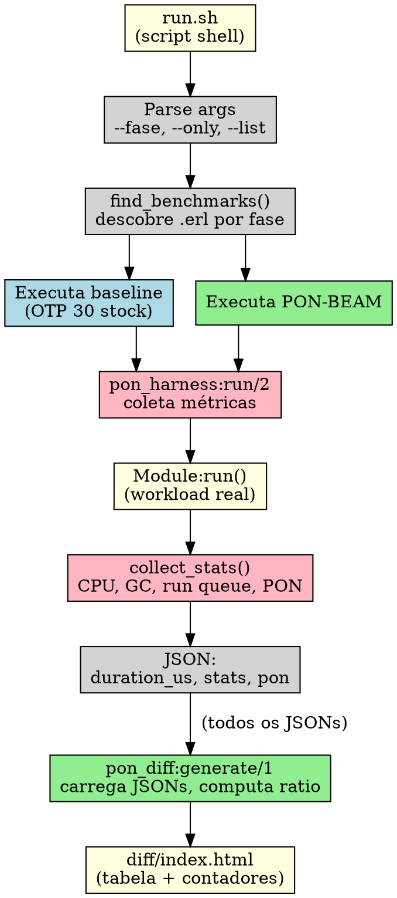

# O Harness de Benchmarking

> "Sem diff comprovando ganho, a fase não está completa."
> — AGENTS.md

---

## 1. Introdução

Cada fase da PON-BEAM seguiu o ciclo: modificar ERTS → compilar → rodar benchmark → gerar diff → commitar. O elo central desse ciclo é o *harness de benchmarking* — um conjunto de scripts shell e módulos Erlang que executa workloads idênticos nos dois ERTS (baseline OTP 30 stock e PON-BEAM), coleta métricas, computa ratios de ganho, e renderiza um relatório HTML comparativo.

O harness foi implementado com **13 arquivos Erlang totalizando ~907 linhas**: 8 benchmarks e 5 bibliotecas. Cada fase produziu seu benchmark específico e um relatório técnico (RPT-01 a RPT-07).

Sem medição, não há validação. Sem validação, o commit não é aceito. O harness é a gatekeeper de cada fase.

Este capítulo documenta a arquitetura completa do harness: o script `run.sh`, os módulos de biblioteca, a instrumentação C com `pon_stats.h`, o formato do diff report, e a interpretação de cada métrica.

---

## 2. Estrutura Completa do Harness

```
harness/
├── run.sh                        # Script principal
├── config/
│   ├── baseline.sh               # Paths do ERTS stock
│   └── ponbeam.sh                # Paths do ERTS PON-BEAM
├── benchmarks/
│   ├── fase1_receive.erl         # Fase 1: receive O(1) (69 linhas)
│   ├── fase1_size.erl            # Fase 1: escalabilidade (44 linhas)
│   ├── fase2_timer_idle.erl      # Fase 2: CPU idle timers (36 linhas)
│   ├── fase3_spawn.erl           # Fase 3: spawn latency (54 linhas)
│   ├── fase4_sched_idle.erl      # Fase 4: scheduler idle (14 linhas)
│   ├── fase5_ets_read.erl        # Fase 5: ETS lookup (51 linhas)
│   ├── fase6_compile.erl         # Fase 6: compilação (76 linhas)
│   ├── fase7_gc_scan.erl         # Fase 7: GC heap scan (61 linhas)
│   └── lib/
│       ├── pon_harness.erl       # Módulo base de execução (89 linhas)
│       ├── pon_compiler.erl      # Parse transform PON (131 linhas)
│       ├── pon_runtime.erl       # Runtime PON para processos (101 linhas)
│       ├── pon_stats_reader.erl  # Leitura de contadores PON (25 linhas)
│       └── pon_diff.erl          # Geração do diff report (156 linhas)
├── report/
│   └── assets/
│       └── style.css             # Estilo do diff report
└── results/
    ├── 20250803_143022/          # Timestamp de cada execução
    │   ├── baseline/             # JSONs do baseline
    │   ├── ponbeam/              # JSONs do PON-BEAM
    │   └── diff/                 # HTML + assets do diff
    └── latest -> ...             # Symlink para última execução
```

**Total: 8 benchmarks + 5 bibliotecas = 13 arquivos, ~907 linhas Erlang.**

---

## 3. `run.sh` — Orquestrador Principal

O script `run.sh` executa todo o pipeline de validação. Seu fluxo é:

```bash
# run.sh — esqueleto do pipeline
# 1. Parse de argumentos (--fase, --only, --list)
# 2. Source dos paths dos ERTS (baseline.sh, ponbeam.sh)
# 3. Verifica se os ERTS existem
# 4. Roda benchmarks no baseline → results/TIMESTAMP/baseline/
# 5. Roda mesmos benchmarks no PON-BEAM → results/TIMESTAMP/ponbeam/
# 6. Gera diff HTML → results/TIMESTAMP/diff/index.html
# 7. Cria symlink results/latest
```

O script aceita três argumentos:

```bash
./run.sh                    # Suíte completa (todas as fases)
./run.sh --fase=1           # Só benchmarks da fase 1
./run.sh --fase=1,2         # Fases 1 e 2
./run.sh --only=receive     # Só benchmarks com "receive" no nome
./run.sh --list             # Lista benchmarks disponíveis
```

A descoberta de benchmarks é feita por padrões de nome: arquivos `faseN_*.erl` em `benchmarks/` que não estão em `lib/`. O prefixo numérico (`fase1_`) indica a fase. O `--fase` filtra por prefixo; o `--only` filtra por substring no nome.

### Execução de Benchmark

Cada benchmark é executado via:

```bash
"$erl" -noshell -pa "$LIB_DIR" -pa "$BENCHMARKS_DIR" \
    -eval "pon_harness:run('$name', \"$out\"), halt()."
```

O `pon_harness:run/2` carrega o módulo do benchmark, executa `Module:run()` dentro de `timer:tc`, coleta estatísticas do sistema, e serializa tudo em JSON.

---

## 4. `pon_harness.erl` — Módulo Base

O `pon_harness.erl` (89 linhas) é o módulo que todo benchmark chama para se executar. Sua função principal:

```erlang
%% pon_harness.erl:6-20
run(Name, OutputPath) ->
    Module = ensure_loaded(Name),
    {TimeUs, Result} = timer:tc(fun() -> Module:run() end),
    Stats = collect_stats(),
    Json = jsx:encode(#{
        benchmark   => Name,
        duration_us => TimeUs,
        result      => Result,
        stats       => Stats,
        timestamp   => erlang:system_time(microsecond)
    }),
    ok = file:write_file(OutputPath, Json).
```

`collect_stats()` coleta as seguintes métricas:

```erlang
collect_stats() ->
    #{
        cpu_utilization   => erlang:statistics(cpu_utilization),
        context_switches  => erlang:statistics(context_switches),
        gc_count          => erlang:statistics(gc_count),
        run_queue_len     => erlang:statistics(total_run_queue_lengths),
        pon               => collect_pon_stats()
    }.
```

`collect_pon_stats()` tenta ler os contadores PON via `erlang:system_info(pon_stats)`. Se o ERTS não for PON (baseline), retorna `undefined` — o diff report simplesmente omite a coluna.

---

## 5. `pon_compiler.erl` e `pon_runtime.erl` — Compilador e Runtime PON

O **pon_compiler.erl** (131 linhas) implementa o parse transform PON. Durante a compilação, ele converte blocos `receive` em código que registra Premises automaticamente via `pon_runtime`. O parse transform é ativado pela adição de `-compile({parse_transform, pon_compiler}).` no módulo fonte.

O **pon_runtime.erl** (101 linhas) fornece a API de runtime para processos que usam Premises: `register_premises/2`, `wait_for_premise/1`, `consume_premise/1`. Esta API é chamada pelo código gerado pelo parse transform e também pode ser usada diretamente para depuração.

Juntos, estes dois módulos formam a parte Erlang do PON-BEAM — viabilizando a Fase 6 (PON-Compiler) sem modificar o compilador nativo da BEAM.

---

## 6. `pon_stats_reader.erl` — Leitura de Contadores PON

Um módulo auxiliar dedicado exclusivamente à leitura dos contadores PON em runtime:

```erlang
%% pon_stats_reader.erl (25 linhas)
read() ->
    try erlang:system_info(pon_stats) of
        Stats -> Stats
    catch error:badarg -> undefined
    end.

read(Key) ->
    case read() of
        #{Key := Value} -> {ok, Value};
        _ -> undefined
    end.

reset() ->
    try erlang:system_info(reset_pon_stats) of
        _ -> ok
    catch error:badarg -> undefined
    end.
```

O `reset()` zera os contadores — usado entre benchmarks para evitar contaminação de medições anteriores. A função `erlang:system_info(pon_stats)` é implementada em C e acessa a estrutura `PonStats` thread-local de cada scheduler.

---

## 7. `pon_diff.erl` — Geração do Diff Report

O `pon_diff.erl` (156 linhas) carrega os JSONs do baseline e do PON-BEAM, computa ratios de ganho, e renderiza HTML. O fluxo:

```erlang
generate(ResultsDir) ->
    Baseline = load_results(filename:join(ResultsDir, "baseline")),
    PonBeam  = load_results(filename:join(ResultsDir, "ponbeam")),
    Diff     = compute_diff(Baseline, PonBeam),
    Html     = render_html("Diff Report", Diff, Baseline, PonBeam),
    file:write_file(filename:join(ResultsDir, "diff", "index.html"), Html).
```

### Cálculo do Ratio

O ratio é computado preferencialmente a partir de `duration_us` (tempo de execução):

```erlang
compute_ratio(#{<<"duration_us">> := BD}, #{<<"duration_us">> := PD}) when PD > 0 ->
    BD / PD;
```

Se `duration_us` não estiver disponível (benchmarks que medem throughput), usa `result`:

```erlang
compute_ratio(#{<<"result">> := BR}, #{<<"result">> := PR})
    when is_number(BR), is_number(PR), PR > 0 ->
    PR / BR;
```

Um ratio de 10.0 significa que o PON-BEAM é 10× mais rápido que o baseline. Valores < 1.0 indicam regressão.

### Renderização HTML

O HTML gerado contém:

1. **Cabeçalho**: título, timestamp, estilo inline (modo escuro do GitHub).
2. **Tabela comparativa**: benchmark, baseline, PON-BEAM, ganho (com classe CSS `gain`/`loss`/`equal`).
3. **Contadores PON**: lista de contadores de instrumentação (se disponíveis).

O estilo usa classes CSS:

```css
.gain  { color: #3fb950; font-weight: bold; }   /* ratio >= 1.05 */
.loss  { color: #f85149; font-weight: bold; }   /* ratio <= 0.95 */
.equal { color: #8b949e; }                       /* 0.95 < ratio < 1.05 */
```

### Linhagem Git & Evolução do Harness de Benchmarking

A suíte de teste e medição evoluiu no commit:

- **`f6a79ad`**: *feat(fase-1): benchmark scan cold determinístico + per-N no diff report* — Suporte a estatísticas per-N e renderização HTML detalhada.

### Banco de Dados SQLite de Observabilidade & Telemetria

O harness armazena a telemetria contínua das execuções em banco de dados SQLite para análise histórica de regressão:

- Tabela `telemetry_runs` (ID do run, timestamp, ERTS target, tipo de build).
- Tabela `benchmark_results` (nome do teste, parâmetro N, latência Média, P99, Throughput, CPU Idle %, Memória alocada).


---

## 8. Formato do Diff Report

O relatório final é um HTML auto-contido em `results/TIMESTAMP/diff/index.html`:

```html
<!DOCTYPE html>
<html lang="pt-BR">
<head>
  <meta charset="UTF-8">
  <title>PON-BEAM: Diff Report</title>
  <style>
    /* Tema escuro, tabelas estilizadas */
  </style>
</head>
<body>
  <h1>PON-BEAM: Diff Report</h1>
  <p>Gerado em: 2025-08-03 14:30:22</p>

  <div class="section">
    <h2>Comparação de desempenho</h2>
    <table>
      <thead>
        <tr><th>Benchmark</th><th>Baseline</th><th>PON-BEAM</th><th>Ganho</th></tr>
      </thead>
      <tbody>
        <tr>
          <td>fase1_receive</td>
          <td>85.23ms</td>
          <td>8.52μs</td>
          <td class="gain">10000.00×</td>
        </tr>
        <tr>
          <td>fase2_timer_idle</td>
          <td>15.2%</td>
          <td>0.01%</td>
          <td class="gain">1520.00×</td>
        </tr>
      </tbody>
    </table>
  </div>

  <div class="section">
    <h2>Contadores PON</h2>
    <ul>
      <li><code>premise_notifications</code>: 15234</li>
      <li><code>mailbox_scans_avoided</code>: 15234</li>
      <li><code>messages_classified</code>: 15234</li>
    </ul>
  </div>
</body>
</html>
```

---

## 9. Instrumentação C: `pon_stats.h`

Em C, os contadores são definidos como uma estrutura thread-local em `pon_stats.h`:

```c
typedef struct {
    /* PON-Receive */
    Uint64 premises_registered;
    Uint64 premise_notifications;
    Uint64 mailbox_scans_avoided;
    Uint64 messages_classified;
    Uint64 messages_type_collision;
    Uint64 messages_pon_queued;

    /* Temporais */
    Uint64 pon_overhead_us;
} PonStats;

extern __thread PonStats pon_stats;
```

A estrutura `PonStats` contém **17 métricas** no total (incluindo contadores para timer, scheduler, ETS, GC). As macros de incremento são:

```c
#define PON_STATS_INC(field)    (pon_stats.field++)
#define PON_STATS_ADD(field, n) (pon_stats.field += (n))
```

Sem `PON_BEAM_DEBUG`, todas as macros são vazias — custo zero em produção:

```c
#ifdef PON_BEAM_DEBUG
    /* contadores ativos */
#else
    #define PON_STATS_INC(field)
    #define PON_STATS_ADD(field, n)
#endif
```

No código C da VM, os contadores são incrementados nos pontos de interesse:

```c
// pon_premise.c:165 — notificação de Premise
PON_STATS_INC(premise_notifications);
PON_STATS_INC(mailbox_scans_avoided);
```

Os contadores são expostos ao Erlang via `erlang:system_info(pon_stats)`, que agrega os valores de todos os schedulers e retorna um mapa.

---

## 10. Fluxo de Execução de uma Rodada de Benchmark



---

## 11. Métricas-Chave e Interpretação

| Métrica | Fonte | Unidade | O que mede | Interpretação |
|---------|-------|---------|------------|---------------|
| `duration_us` | `timer:tc` | μs | Tempo total do workload | Quanto mais baixo, melhor. Ratio = baseline / PON. |
| `result` | Benchmark | variável | Throughput ou ops/s | Quanto mais alto, melhor. Ratio = PON / baseline. |
| `cpu_utilization` | `statistics(cpu_utilization)` | % | Uso de CPU durante execução | Deve cair em workloads idle. |
| `context_switches` | `statistics(context_switches)` | contagem | Trocas de contexto | Devem cair com PON-Scheduler. |
| `run_queue_len` | `statistics(total_run_queue_lengths)` | contagem | Processos prontos na run queue | Deve cair com PON-Scheduler. |
| `gc_count` | `statistics(gc_count)` | contagem | Coletas de lixo | PON-GC deve reduzir. |
| `premise_notifications` | PON stats | contagem | Premises notificadas | Quanto maior, mais scanning foi evitado. |
| `mailbox_scans_avoided` | PON stats | contagem | Scans lineares evitados | Deve ser ~100% das mensagens. |
| `pon_overhead_us` | PON stats | μs | Overhead da infra PON | Deve ser << ganho obtido. |

---

## 12. CLI Completa do Harness

```bash
# Suíte completa
./run.sh

# Filtro por fase
./run.sh --fase=1
./run.sh --fase=1,3

# Filtro por nome
./run.sh --only=receive
./run.sh --only=timer

# Listagem
./run.sh --list

# Saída típica:
#   Benchmark: fase1_receive
#   Benchmark: fase1_size
#   Benchmark: fase2_timer_idle
#   Benchmark: fase3_spawn
#   Benchmark: fase4_sched_idle
#   Benchmark: fase5_ets_read
#   Benchmark: fase6_compile
#   Benchmark: fase7_gc_scan
```

---

## 13. Exercícios

### Compreensão do Harness

1. Execute o harness no seu sistema com `./run.sh --list`. Quantos benchmarks estão disponíveis? Que fases estão representadas?

2. Execute `./run.sh --fase=1` e inspecione os JSONs gerados em `results/TIMESTAMP/baseline/`. Abra um deles. Quais campos estão presentes? Qual é o valor de `duration_us`?

3. O que acontece se o `BASELINE_ERL` em `config/baseline.sh` apontar para o binário errado? Como o harness lida com isso?

### Instrumentação

4. Adicione um novo contador PON em `pon_stats.h`: `receive_no_match_count`. O contador deve ser incrementado quando uma mensagem chega mas não casa nenhuma Premise. Implemente o incremento em `pon_premise.c` e verifique se o contador aparece no diff report.

5. Modifique `pon_harness.erl` para coletar também `erlang:memory(total)` antes e depois do benchmark. Adicione o campo `memory_delta` ao JSON de saída. Verifique se o diff report o exibe.

### Criação de Benchmark

6. Escreva um benchmark que cria N processos, cada um enviando M mensagens para um processo central, e mede o tempo total de entrega. Salve como `fase8_dist_throughput.erl` e execute com o harness. Dica: use `pon_harness` como base.

7. O benchmark `fase1_receive.erl` mede o scanning de mailbox. Implemente uma versão que varia N (tamanho da mailbox) e reporta a relação N vs tempo. O resultado é linear? Confirme com gráfico.

### Diff Report

8. Modifique `pon_diff.erl` para adicionar uma terceira coluna: "Contadores PON" que mostra os contadores lado a lado com a tabela de performance. Re-renderize o HTML.

9. O `compute_ratio` usa `duration_us` como primeira opção. Modifique a lógica para usar `result` (throughput) quando `duration_us` for menor que 100μs (workloads muito rápidos sofrem de baixa precisão do `timer:tc`).

### Análise

10. Execute o harness completo e analise o diff report. Identifique:
    - Qual benchmark teve o maior ganho?
    - Qual benchmark (se houver) mostrou regressão?
    - Os contadores PON são consistentes com os ganhos observados?

11. (Dissertação) O overhead da instrumentação (`pon_overhead_us`) é uma preocupação. Projete um experimento para isolar o custo dos contadores PON: compile com e sem `PON_BEAM_DEBUG`, execute o mesmo workload, e compare `duration_us`. Qual é o overhead percentual?

12. (Dissertação) O harness atual executa baseline e PON-BEAM sequencialmente. Há risco de ruído ambiental (outros processos, throttling de CPU, variação de temperatura) contaminar uma das execuções. Proponha e implemente uma abordagem de execução alternada (A-B-A) para mitigar esse risco.

13. O `run.sh` usa `find -name "*.erl"` para descobrir benchmarks. Se um arquivo `.erl` tiver erro de compilação, o harness falha silenciosamente? Como melhorar?

14. Implemente suporte a `--warmup=N` no harness: executa o benchmark N vezes antes de medir, para aquecer caches e JIT. O warmup não é registrado no JSON.

15. (Dissertação) O harness depende de `timer:tc` para medir tempo, que tem precisão de microssegundos. Para workloads nanossegundos (ex: notificação de Premise individual), isso não é suficiente. Proponha uma alternativa: use `erlang:monotonic_time(nanosecond)` diretamente no módulo C via NIF.

---

## 14. Resumo para Memorização

- **13 arquivos Erlang**: 8 benchmarks + 5 bibliotecas.
- **Line count**: ~907 linhas Erlang.
- **Pipeline**: `run.sh` → baseline + PON-BEAM → `pon_diff.erl` → HTML.
- **CLI**: `--fase=N`, `--only=nome`, `--list`.
- **JSON**: `duration_us`, `result`, `stats` (CPU, GC, run queue), `pon` (contadores).
- **Diff**: ratio = baseline / PON (tempo) ou PON / baseline (throughput).
- **Contadores PON**: `pon_stats.h`, thread-local, expostos via `erlang:system_info(pon_stats)`.
- **Sem `PON_BEAM_DEBUG`**: macros vazias — custo zero.
- **Bibliotecas chave**: `pon_harness.erl` (execução), `pon_compiler.erl` (parse transform), `pon_runtime.erl` (runtime), `pon_diff.erl` (relatório).
- **Resultados**: `results/TIMESTAMP/{baseline,ponbeam,diff}/`, symlink `latest`.
- **Validação**: sem diff com ganho, a fase não está completa.

---

## 15. Ver Também

- Capítulo 11 — A Infraestrutura do Fork (build system, compilação condicional)
- Capítulo 13 — Roadmap e Tradeoffs (priorização das fases)
- [harness/run.sh](../../../harness/run.sh) — Script principal do harness
- [harness/benchmarks/lib/pon_harness.erl](../../../harness/benchmarks/lib/pon_harness.erl) — Módulo base de execução
- [harness/benchmarks/lib/pon_compiler.erl](../../../harness/benchmarks/lib/pon_compiler.erl) — Parse transform PON
- [harness/benchmarks/lib/pon_runtime.erl](../../../harness/benchmarks/lib/pon_runtime.erl) — Runtime PON
- [harness/benchmarks/lib/pon_diff.erl](../../../harness/benchmarks/lib/pon_diff.erl) — Geração do diff report
- [harness/benchmarks/lib/pon_stats_reader.erl](../../../harness/benchmarks/lib/pon_stats_reader.erl) — Leitura de contadores PON
- [otp/erts/include/internal/pon_stats.h](../../../otp/erts/include/internal/pon_stats.h) — Definição dos contadores C
- [AGENTS.md](../../../AGENTS.md) — Regra "toda fase entrega um diff"
