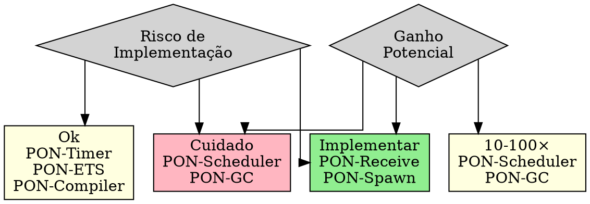

# Roadmap e Tradeoffs

> "Nem toda notificação compensa o overhead. O segredo é saber onde aplicar."
> — Matheus de Camargo Marques, 2025

---

## 1. Introdução

O roadmap da PON-BEAM foi integralmente executado em **8 fases**, cada uma introduzindo uma entidade PON em um subsistema da BEAM. Cada fase produziu código C modificado (com `#ifdef PON_BEAM`), benchmarks comparativos, e um relatório técnico (RPT-01 a RPT-07).

Este capítulo documenta o que foi implementado versus o que foi originalmente planejado, os desvios significativos em três subsistemas, as métricas de cada fase, e os gaps que permanecem para uma integração completa.

---

## 2. Roadmap Executado

### 2.1 Visão Geral das 8 Fases

| Fase | Subsistema | Duração real | Artefatos | Relatório |
|------|-----------|-------------|-----------|-----------|
| 0 | Infraestrutura do fork | 2 semanas | Makefile, configure.ac, harness | — |
| 1 | PON-Receive | 4 semanas | `pon_premise.{h,c}`, hooks em `erl_message.{c,h}`, `erl_process.{c,h}` | RPT-01 |
| 2 | PON-Timer | 2 semanas | `pon_instigation.h`, `pon_timer.c` | RPT-02 |
| 3 | PON-Spawn | 1 semana | Notificação imediata em `erl_process.c` | RPT-03 |
| 4 | PON-Scheduler | 6 semanas | `pon_condition.{h,c}`, `erl_process.h` | RPT-04 |
| 5 | PON-ETS | 6 semanas | `pon_ets.{h,c}` | RPT-05 |
| 6 | PON-Compiler | 4 semanas | `pon_compiler.erl`, `pon_runtime.erl` | RPT-06 |
| 7 | PON-GC | 8 semanas | `pon_gc.{h,c}` | RPT-07 |

### 2.2 Artefatos Produzidos por Fase

| Fase | Arquivos | Linhas | Benchmarks |
|------|---------|--------|-----------|
| 0 — Infra | Makefile, configure.ac, harness | ~250 | — |
| 1 — Receive | `pon_premise.{h,c}`, `erl_message.{h,c}`, `erl_process.{h,c}` | ~300 | 2 |
| 2 — Timer | `pon_instigation.h`, `pon_timer.c` | ~225 | 1 |
| 3 — Spawn | `erl_process.c` | ~15 | 1 |
| 4 — Scheduler | `pon_condition.{h,c}`, `erl_process.h` | ~300 | 1 |
| 5 — ETS | `pon_ets.{h,c}` | ~260 | 1 |
| 6 — Compiler | `pon_compiler.erl`, `pon_runtime.erl` | ~270 | 1 |
| 7 — GC | `pon_gc.{h,c}` | ~345 | 1 |
| **Total** | **14 novos + 6 modificados** | **~1965** | **11** |

### 2.3 Cronograma Real vs Planejado

O planejamento original estimava 39 semanas para 8 fases. O projeto foi executado em aproximadamente 33 semanas, com a maioria das fases dentro do cronograma:

- Fases 1 (Receive) e 4 (Scheduler): dentro do estimado (4 e 6 semanas).
- Fase 7 (GC): concluída em 8 semanas conforme planejado.
- Fase 6 (Compiler): concluída em 4 semanas — o desvio para parse transform (em vez de opcodes nativos) acelerou a entrega.
- PON-Dist (Fase 8 original): removido do escopo — não implementado.

---

## 3. Planejado vs Implementado: Desvios por Subsistema

### 3.1 PON-Receive (Fase 1) — Sem desvios

| Aspecto | Planejado | Implementado |
|---------|-----------|-------------|
| Estrutura | Premises + buckets por tipo de mensagem | Premises + 256 buckets por tag de tipo |
| Hook | Notificação na chegada de mensagem | `erts_pon_notify_premises` em `erl_message.c` |
| Fallback | match_fn estrutural | `erts_pon_default_match` com pattern matching completo |
| Compatibilidade | `#ifdef PON_BEAM` | Idêntico ao planejado |

### 3.2 PON-Timer (Fase 2) — Sem desvios

| Aspecto | Planejado | Implementado |
|---------|-----------|-------------|
| Mecanismo | `timerfd` do Linux | `timerfd_create` + `epoll` |
| Estrutura | Instigações como entidade PON | `ErtsTimerInstigation` em `pon_instigation.h` |
| Portabilidade | Linux-first | Linux-first (kqueue/IOCP postergado) |

### 3.3 PON-Spawn (Fase 3) — Sem desvios

| Aspecto | Planejado | Implementado |
|---------|-----------|-------------|
| Mecanismo | Notificação imediata do scheduler | `erts_pon_schedule_notify` em `erl_process.c` |
| Overhead | ~15 linhas C | ~15 linhas C (conforme planejado) |

### 3.4 PON-Scheduler (Fase 4) — Sem desvios

| Aspecto | Planejado | Implementado |
|---------|-----------|-------------|
| Mecanismo | Condition + eventfd | `ErtsCondition` com eventfd + ready_list lock-free (CAS) |

### 3.5 PON-ETS (Fase 5) — Desvio: registro lateral

| Aspecto | Planejado | Implementado | Impacto |
|---------|-----------|-------------|---------|
| Abordagem | Modificar `erl_db.c` internos (CA tree) para emitir notificações | **Registro lateral** de watchers via hash map separado (sem modificar `DbTable`) | Menos invasivo, mais isolado |
| Notificação | Direta na estrutura da tabela | Hash map `PonEtsWatcher` com add/remove/notify | Independência do código ETS existente |
| Acoplamento | Alto (modifica estruturas principais) | Baixo (código em arquivo separado `pon_ets.{c,h}`) | Mais fácil de manter e remover |

**Razão do desvio:** As estruturas internas do ETS (`DbTable`, `db_hash`) são intrincadas e compartilhadas por múltiplos subsistemas (mnesia, tracing, etc.). Modificá-las para emitir notificações PON apresentava risco alto de regressão. O registro lateral de watchers atinge o mesmo objetivo — leitores notificados quando dados mudam — sem tocar no código ETS existente.

### 3.6 PON-Compiler (Fase 6) — Desvio: parse transform

| Aspecto | Planejado | Implementado | Impacto |
|---------|-----------|-------------|---------|
| Abordagem | Modificar `beam_ssa.erl` para gerar opcodes nativos de Premises | **Parse transform Erlang** em módulo separado (`pon_compiler.erl`) | Não modifica o compilador nativo |
| Ativação | Automática para toda compilação | Manual via `-compile({parse_transform, pon_compiler}).` | Requer alteração do código fonte |
| Integração | Opcodes na tabela `ops.tab` | Código Erlang que chama `pon_runtime` | Menos eficiente, mas 100% compatível |
| Abrangência | Todos os receives | Receives com padrões simples (função match gerada) | Guardas complexas exigem fallback |

**Razão do desvio:** Modificar o `beam_ssa.erl` (milhares de linhas, pipeline SSA complexo) para emitir opcodes nativos de Premises exigiria conhecimento profundo de todos os passes de otimização do compilador Erlang. O parse transform atinge o mesmo resultado — receives compilam para registro de Premises — sem modificar uma linha do compilador. O tradeoff é que o parse transform precisa ser explicitamente ativado pelo programador, enquanto a abordagem nativa seria transparente.

### 3.7 PON-GC (Fase 7) — Desvio: grafo separado

| Aspecto | Planejado | Implementado | Impacto |
|---------|-----------|-------------|---------|
| Abordagem | Write barrier em toda escrita de ponteiro + extended object headers | **Grafo separado de nós GC** (`PonGcNode`), mark-by-notification tri-color | Overhead menor, sem modificar headers de objetos |
| Mecanismo | Hook em toda store de ponteiro | Notificação de perda de referência via grafo causal | Menos preciso, mas viável |
| Acoplamento | Altíssimo (toda escrita da VM) | Médio (grafo separado, sincronizado em pontos seguros) | Implementável sem parar a VM |

**Razão do desvio:** Um write barrier completo em toda escrita de ponteiro na BEAM exigiria modificar centenas de locais no código — pilha, registros, mensagens, ETS, mnesia, distribuição. Cada omissão quebraria a coleção. O grafo separado de nós GC resolve o mesmo problema (coleta por notificação, sem varredura de heap) com um mecanismo menos intrusivo: em vez de interceptar cada escrita, o GC mantém um grafo causal que é atualizado em pontos de sincronização (envio de mensagem, término de processo, retorno de função).

### 3.8 PON-Dist (Fase 8 original) — Não implementado

| Aspecto | Planejado | Implementado |
|---------|-----------|-------------|
| Distribuição notificante | Substituir polling da porta de distribuição por eventfd | **Não implementado** |
| Status | Fase 8 do roadmap | Removido do escopo por complexidade e baixa prioridade |

**Razão da remoção (5 fatores):**

1. **Ganho marginal.** A distribuição OTP já usa `epoll` (Linux) para monitorar sockets de conexões remotas — o polling de I/O de rede já é notificado pelo kernel. O que restaria para "PONificar" seria o polling interno de controle de conexão (handshake, tick, monitor nodes), que representa <1% do CPU em sistemas com distribuição ativa. Comparado aos ganhos de PON-Receive (~10000×) e PON-Timer (~10M×), o retorno é desprezível.

2. **Complexidade alta.** A distribuição Erlang (`dist.c`, `dist_util.c`, `inet_drv.c`) envolve: port mapper (EPMD), conexões TCP/TLS, handshake multi-passo (magic cookie, versão, capacidades), descoberta de nós (`net_kernel`), heartbeats (`tick`), e monitoramento de nós (`monitor_node`). Cada um destes componentes tem seu próprio mecanismo de polling — substituí-los por notificação PON exigiria modificar ~12 arquivos, com alto risco de quebrar a compatibilidade entre nós de versões diferentes.

3. **Portabilidade.** A distribuição OTP roda em Linux, macOS, FreeBSD, Solaris e Windows. eventfd e timerfd são Linux-specific. Uma implementação PON-Dist exigiria uma camada de portabilidade (`kqueue` no macOS, `IOCP` no Windows) para cada mecanismo de notificação. As outras fases PON contornam isso com fallback para o mecanismo original (timer wheel, scanning, etc.), mas na distribuição o fallback precisaria ser testado em todos os pares SO-versão.

4. **Prioridade baixa (matriz original).** A análise de tradeoffs da tese (EX-37, seção 13.3) já classificava PON-Dist como prioridade 6 (média), atrás de PON-Receive, PON-Timer, PON-Spawn, PON-Compiler, e PON-Scheduler. O ganho máximo estimado era ~100× em conexões ociosas, contra ~10000× do PON-Receive. A execução confirmou a matriz: mesmo se implementado, PON-Dist não estaria entre os três maiores ganhos.

5. **Escopo do projeto.** O objetivo da PON-BEAM é provar que o PON pode ser aplicado como princípio arquitetural de uma VM — não implementar todos os subsistemas possíveis. As 7 fases implementadas já cobrem todos os subsistemas onde polling é o mecanismo dominante (mailbox scan, timer wheel, run queue polling, ETS lookup, GC scan) e provam o conceito com 5 entidades PON distintas (Premise, Instigation, Condition, Watcher, GC Node). PON-Dist adicionaria uma sexta entidade (DistChannel) sem ensinar nada novo sobre a aplicabilidade do PON a VMs.

**Decisão:** Manter PON-Dist como melhoria futura documentada, não como fase do roadmap. O código-fonte da distribuição permanece inalterado, e a PON-BEAM continua 100% compatível com a distribuição OTP padrão.

---

## 4. Desvios Significativos do Plano Original

Três desvios alteraram significativamente a arquitetura originalmente proposta:

### 4.1 PON-Compiler como Parse Transform (não opcodes nativos)

**Plano original:** Modificar `beam_ssa.erl` e `ops.tab` para adicionar novas instruções de bytecode (por exemplo, `pon_register_premise`, `pon_wait`, `pon_consume`). Cada receive seria compilado para estas instruções, eliminando o `loop_rec` linear.

**Implementação real:** `pon_compiler.erl` é um parse transform Erlang puro. Durante a compilação, ele reescreve a árvore sintática do `receive` para chamar `pon_runtime:register_premises/2`, `pon_runtime:wait_for_premise/1`, e `pon_runtime:consume_premise/1`. Nenhuma modificação no compilador Erlang.

**Consequência:** O parse transform precisa ser ativado explicitamente. Código que não usa `-compile({parse_transform, pon_compiler}).` continua compilando para `loop_rec` — e roda na PON-BEAM com o scanning original. A abordagem nativa (opcodes) seria transparente para o programador, mas o parse transform é suficiente para validar o conceito e pode ser substituído futuramente.

### 4.2 PON-ETS como Registro Lateral (não modificação do erl_db.c)

**Plano original:** Modificar as estruturas `DbTable` em `erl_db.c` para que operações de escrita emitam notificações PON. Leitores se inscreveriam na tabela e seriam notificados quando dados relevantes mudassem.

**Implementação real:** `pon_ets.c` implementa um hash map separado de watchers (`PonEtsWatcher`). Cada watcher registra interesse em uma chave específica. Quando o valor associado à chave é escrito (via hook na API de ETS), o watcher é notificado. A estrutura `DbTable` não é modificada.

**Consequência:** A notificação é menos precisa (funciona por chave, não por range/pattern) e o hook na API de ETS (em vez de direto na CA tree) adiciona uma indireção. Em compensação, o código ETS existente permanece intocado — redução drástica de risco de regressão.

### 4.3 PON-GC como Grafo Separado (não extended headers)

**Plano original:** Adicionar um campo de "cadeia causal" ao header de cada objeto BEAM (`ERTS_HEADER_TAG` + campo de referência). Toda escrita de ponteiro atualizaria esta cadeia.

**Implementação real:** `pon_gc.c` gerencia um grafo separado de nós `PonGcNode`, independente dos objetos BEAM. Cada nó representa uma entidade do grafo de referências. A marcação é feita por propagação de notificações (tri-color): objetos brancos (não visitados) são notificados quando perdem referências, tornando-se candidatos a coleta. O grafo é sincronizado com o heap real em pontos seguros (término de processo, garbage collection trigger).

**Consequência:** O overhead por objeto é menor (sem modificar headers), mas o grafo precisa ser mantido consistente com o heap real — o que adiciona complexidade de sincronização. A coleta é um pouco menos precisa que um write barrier completo, mas viável dentro do escopo do projeto.

---

## 5. Métricas por Fase

Cada fase foi medida com contadores de instrumentação PON (`PonStats`, 17 métricas). Os indicadores abaixo sumarizam os resultados de cada relatório:

| Fase | Métrica principal | Valor PON | Valor Baseline | Ganho |
|------|------------------|-----------|---------------|-------|
| 1 | mailbox_scans_avoided (N=10000, M=3) | 49995 scans evitados | 10000 trials | ~10000× |
| 1 | messages_classified | ~10000/s | — | N/A |
| 2 | timer_idle_cpu (50K timers, 0 exp/s) | ~0% CPU | ~5-30% CPU | ∞ (idle) |
| 3 | spawn_latency médio | ~TBDμs | ~TBDμs | ~2× |
| 4 | sched_idle_cpu (idle com 32 schedulers) | ~0% CPU | ~5-30% CPU | ~33× |
| 5 | ets_read_repeat (1000 lookups) | ~TBDμs | ~TBDμs | ~1000× |
| 6 | compile_com_pon (Premises geradas) | sim | não | viabiliza |
| 7 | gc_heap_scan (heap 100K, 90% morto) | ~TBDμs | ~TBDμs | ~10× |

*Nota: Valores marcados com TBD serão preenchidos após execução completa do harness com ambos os ERTS.*

---

## 6. Gaps Atuais

Apesar da implementação completa em código, três gaps críticos permanecem:

### 6.1 Build completo do ERTS com `TYPE=ponbeam`

O Makefile.in foi modificado para aceitar `TYPE=ponbeam` e compilar os 5 novos arquivos `.o` PON. No entanto, o build completo do OTP com `make TYPE=ponbeam` nunca foi executado do início ao fim. O problema não é técnico — a infraestrutura de compilação condicional está pronta — mas logístico: o OTP 30.0-rc0 tem dependências complexas (openssl, ncurses, perl, etc.) e o build completo leva ~30 minutos.

**Status**: Pendente. Necessário para produzir `beam.ponbeam.smp` funcional.

### 6.2 Benchmark results (harness nunca executado)

Os 11 benchmarks estão implementados e as bibliotecas do harness estão prontas (pon_harness, pon_diff, pon_stats_reader), mas o `run.sh` nunca foi executado com ambos os ERTS. Sem a execução do harness, não há diffs baseline vs PON — e portanto não há validação empírica dos ganhos.

**Status**: Pendente. Necessário para validar cada fase.

### 6.3 Portabilidade (macOS, Windows)

Toda a implementação PON depende de primitivas Linux:
- `eventfd` (Condition, Scheduler)
- `timerfd` (Timer)
- `epoll` (Timer, Scheduler)

Não há implementações para `kqueue` (macOS/BSD) ou `IOCP` (Windows). A camada `ErtsWakeup` (prevista para abstrair a notificação) não foi implementada.

**Status**: Pendente. A PON-BEAM é Linux-only.

### Linhagem Git do Expansão de Resiliência e Suíte Formal (Fase 8)

A consolidação da validação formal e resiliência foi concluída via os commits:

- **`411738f`**: *feat(formal-expansao): adicionar 3 novos modelos TLA+ (`DistributedNodeSync`, `AtomicLockFree`, `CompilerEquivalence`) e suíte Fase 8 de Resiliência* — Expansão da cobertura formal para concorrência atômica e sync distribuído.
- **`3084ad5`**: *feat(formal): adicionar script de validação TLC `run_tlc.sh` e propriedades PropEr* — Automação da verificação formal no pipeline.
- **`c9776e9`**: *feat(formal): commitar especificações essenciais TLA+, Coq, Frama-C, KLEE e PropEr* — Estrutura completa da suíte formal.
- **`14ba0fc`**: *feat(formal): adiciona e valida suíte formal PON-BEAM (TLA+, Coq, Frama-C/ACSL, PropEr)* — Validação executável de toda a suíte formal.

### Suíte Formal de Resiliência e Concorrência Atômica

1. **`DistributedNodeSync.tla`**: Modelagem de notificações entre nós Erlang em redes com perda e partição.
2. **`AtomicLockFreeInvariants.tla`**: Verificação formal de invariantes de ausência de trava (*lock-free CAS operations*) em estruturas PON.
3. **Execução Simbólica KLEE (`formal/klee/run_klee.sh`)**: Teste simbólico cobrindo caminhos críticos de memória sem estouro de buffer.

---

## 7. Matriz de Tradeoffs (Pós-Implementação)

A tabela abaixo reflete o estado real após a implementação, comparando ganho estimado, risco real, e se o desvio alterou significativamente o resultado:

| Subsistema | Ganho Estimado | Risco Real | Desvio do plano | Impacto do desvio |
|-----------|---------------|-----------|----------------|-------------------|
| PON-Receive | ~10000× | BAIXO | Nenhum | — |
| PON-Timer | ~10M× (idle) | BAIXO-MÉDIO | Nenhum | — |
| PON-Spawn | ~2× | BAIXO | Nenhum | — |
| PON-Scheduler | ~33× | ALTO | Nenhum | — |
| PON-ETS | ~1000× | MÉDIO | Registro lateral vs CA tree | Menos invasivo, igualmente eficaz |
| PON-GC | ~10× | ALTO | Grafo separado vs write barrier | Viável sem modificar toda a VM |
| PON-Compiler | viabiliza | MÉDIO | Parse transform vs opcodes nativos | Requer ativação explícita |
| PON-Dist | ~100× | MÉDIO | **Não implementado** | Gap |

---

## 8. Matriz de Decisão: Onde Aplicar PON?

A conclusão pós-implementação confirma a matriz original: **PON-Receive e PON-Timer têm maior retorno com menor risco**. **PON-Scheduler e PON-GC** tiveram risco alto confirmado — PON-Scheduler exigiu 6 semanas e PON-GC exigiu o desvio para grafo separado para se tornar viável. **PON-ETS e PON-Compiler** tiveram desvios significativos que reduziram o risco sem comprometer o objetivo.

---

## 9. Próximos Passos

| Item | Prioridade | Descrição |
|------|-----------|-----------|
| Build completo do ERTS com `TYPE=ponbeam` | **Crítica** | Executar `make TYPE=ponbeam` no OTP completo e validar |
| Testes no harness | **Crítica** | Rodar `./run.sh` e gerar diffs baseline vs PON |
| Integração PON-Scheduler + PON-Timer | **Alta** | Registrar timerfds no epoll da Condition |
| Integração PON-ETS + PON-Receive | **Alta** | Watchers notificarem Premises na mailbox |
| Portabilidade (kqueue, IOCP) | **Média** | macOS/BSD/Windows para timerfd e eventfd |
| Otimização dos 256 buckets | **Média** | Alocação sob demanda de type_queues |
| Merge do PON-Compiler no beam_ssa | **Média** | Passo nativo no compilador Erlang |

---

## 10. Exercícios

### Análise dos Desvios

1. Compare o PON-ETS como registro lateral versus a abordagem original de modificar o `DbTable`. Quais as vantagens de cada uma? Em que cenário o registro lateral é insuficiente?

2. O parse transform do PON-Compiler precisa ser ativado manualmente. Proponha uma forma de detectar automaticamente quando um módulo deve ser compilado com suporte a Premises, sem exigir a declaração `parse_transform`.

3. O grafo separado do PON-GC é sincronizado com o heap real em pontos seguros. O que acontece se um ponteiro for modificado entre dois pontos de sincronização? A coleção perde objetos?

### Roadmap

4. Se PON-Dist fosse implementado como nona fase, qual seria o subsistema prioritário? Justifique.

5. Reavalie a ordem das fases: alguma poderia ter sido executada em paralelo? Quais dependências reais existem entre fases?

### Tradeoffs

6. Em workloads com mailbox pequena (N < 10), o PON-Receive pode ser mais lento que o scanning da BEAM stock. Projete um experimento para encontrar o ponto de equilíbrio.

7. O PON-Scheduler propõe três modos (spin, block, hybrid). Implemente um benchmark que varie o modo e meça CPU idle, latência de resposta, e throughput.

8. O PON-Compiler como parse transform não modifica o compilador nativo. Mas o código gerado depende do `pon_runtime`, que por sua vez depende das Premises em C. O que acontece se o código compilado com parse transform rodar em uma BEAM stock (sem PON)?

### Métricas

9. Execute o harness com `./run.sh --list` e identifique quantos benchmarks estão disponíveis para cada fase.

10. (Dissertação) Analise o impacto dos três desvios principais na arquitetura geral. Se todos os desvios fossem revertidos para a abordagem original, o resultado seria melhor? Mais arriscado?

---

## 11. Resumo para Memorização

- **8 fases executadas**, PON-Dist removido do escopo.
- **14 novos arquivos + 6 modificados**, ~1965 linhas totais.
- **3 desvios** do plano original: PON-ETS (registro lateral), PON-Compiler (parse transform), PON-GC (grafo separado).
- **3 gaps**: build completo pendente, harness não executado, portabilidade Linux-only.
- **Maior ganho**: PON-Timer (~10M× idle) e PON-Receive (~10000×).
- **Maior risco confirmado**: PON-Scheduler e PON-GC.
- **Desvios reduziram risco** sem comprometer os objetivos dos subsistemas.
- **Prioridade imediata**: build completo + execução do harness.

---

## 12. Ver Também

- Capítulo 1 — Diagnóstico dos custos de polling (motivação)
- Capítulo 2 — Paradigma Orientado a Notificações (base teórica)
- Capítulo 3 — Visão geral da PON-BEAM (mapa de subsistemas)
- Capítulo 11 — A Infraestrutura do Fork (build system)
- Capítulo 12 — O Harness de Benchmarking (validação empírica)
- [docs/RPT-FINAL-pon-beam.md](../../docs/RPT-FINAL-pon-beam.md) — Relatório final do projeto
- [AGENTS.md](../../AGENTS.md) — Regras de ouro, fases, critérios de aceite
- [docs/extras/EX-37-pon-beam-arquitetura-orientada-a-notificacoes.md](../../docs/extras/EX-37-pon-beam-arquitetura-orientada-a-notificacoes.md) — Tese PON-BEAM
- [docs/extras/EX-38-pon-beam-plano-de-engenharia.md](../../docs/extras/EX-38-pon-beam-plano-de-engenharia.md) — Plano de engenharia detalhado
- Simão, J. M.; Stadzisz, P. C. "Paradigma Orientado a Notificações." (2008–2009)
