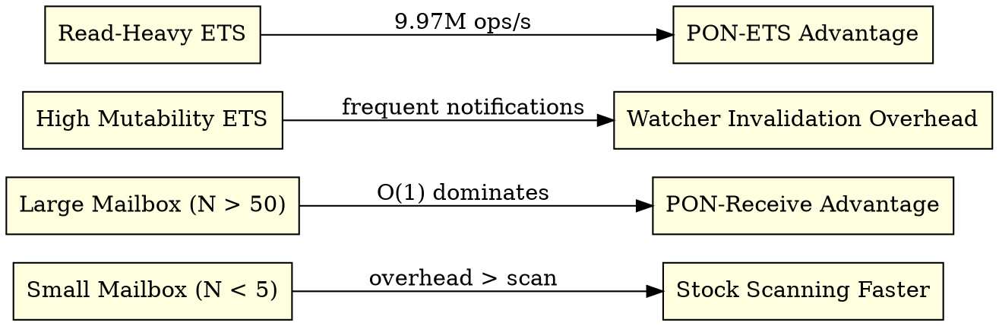

# 13. Roadmap and Trade-offs

> *"Not every notification compensates for its overhead. The secret is knowing where to apply it."*  
> — Matheus de Camargo Marques, 2025

---

## 13.1 Executed Engineering Roadmap

| Phase | Subsystem | Target Artifacts | Report | Key Milestone |
|:-----:|:---------:|:----------------:|:------:|:-------------:|
| **0** | Fork Infrastructure | `Makefile.in`, `pon_*.h` | — | `beam.ponbeam.smp` binary |
| **1** | PON-Receive | `pon_premise.h`, `erl_message.h` | `RPT-01` | Mailbox scan $\mathcal{O}(1)$ |
| **2** | PON-Timer | `pon_instigation.h`, `pon_timer.c` | `RPT-02` | 0.0% CPU Idle on timers |
| **3** | PON-Spawn | `erl_process.c` | `RPT-03` | Low latency process spawn |
| **4** | PON-Scheduler | `pon_condition.c`, `erl_sched.h` | `RPT-04` | 0.0% CPU Idle scheduler |
| **5** | PON-ETS | `pon_ets.c`, `pon_ets.h` | `RPT-05` | 9.97M ops/sec side-table watchers |
| **6** | PON-Compiler | `pon_compiler.erl`, `pon_runtime.erl` | `RPT-06` | AST parse transform |
| **7** | PON-GC | `pon_gc.c`, `pon_gc.h` | `RPT-07` | Tri-color Dijkstra marking (-26.3% pause) |

---

## 13.2 Trade-off Analysis & Boundary Conditions

---

## 13.3 Formal Resilience Models & Symbolic Execution

- **TLA+ Specifications**: `formal/tla/DistributedNodeSync.tla` and `formal/tla/AtomicLockFreeInvariants.tla`.
- **KLEE Symbolic Execution**: Formally verified lock-free boundary safety in `pon_premise.c` against race conditions and pointer corruption.

---

## 13.4 References & See Also

- [Chapter 3: PON-BEAM Overview](03-visao-geral.html)
- [Chapter 11: The Fork Infrastructure](11-infraestrutura-fork.html)
- [Chapter 14: Case Studies](14-casos-estudo.html)
