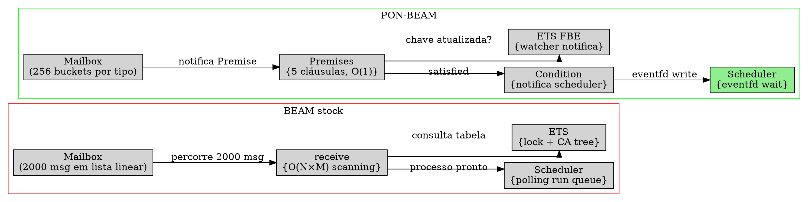
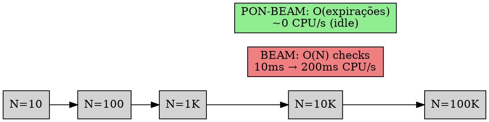

# 14. Casos de Estudo

> *"A teoria sem prática é mera especulação."*
> — Provérbio de engenharia

---

Este capítulo projeta o impacto da PON-BEAM em três cenários concretos. Cada caso contrasta o comportamento da BEAM stock com o da PON-BEAM, apresenta pseudocódigo Erlang, e quantifica os ganhos esperados com base nas análises assintóticas dos Capítulos 4 a 10. Cada subsistema possui seu benchmark correspondente no harness (Capítulo 12), permitindo validação empírica: `fase1_receive.erl` e `fase3_spawn.erl` para o GenServer, `fase7_gc_scan.erl` para Stream Processing, `fase2_timer_idle.erl` e `fase4_sched_idle.erl` para o cenário de 50K timers.

---

## 14.1 GenServer Sob Carga

O GenServer é o padrão mais utilizado no ecossistema Erlang/Elixir. Um GenServer típico implementa `handle_call`/`handle_cast`/`handle_info` — cada qual envolve um `receive` interno. Sob carga elevada, três gargalos emergem.

### 14.1.1 Cenário

100 processos GenServer concorrentes, cada um recebendo 1000 chamadas/segundo, com tempo de processamento de 2ms por chamada. A mailbox de cada GenServer acumula ~2000 mensagens no estado estacionário (2s × 1000 msg/s). Cada `receive` varre 2000 mensagens contra, digamos, 5 cláusulas.

```erlang
%% BEAM: GenServer sob carga — o scanning domina
%% 100 workers × 100K chamadas totais
-module(gs_beam).
-export([run/0, worker/3]).

run() ->
    Workers = [spawn(?MODULE, worker, [self(), N, 2000]) || N <- lists:seq(1, 100)],
    Total = 100000,
    Batch = Total div 100,
    [W ! {calls, Batch, self()} || W <- Workers],
    collect(100, 0).

collect(0, Acc) -> io:format("Total time: ~p us~n", [Acc]);
collect(N, Acc) ->
    receive {done, T} -> collect(N - 1, Acc + T) end.

worker(Master, Id, MailboxSize) ->
    %% Pré-enche a mailbox com mensagens não correspondentes
    [self() ! {unrelated, I} || I <- lists:seq(1, MailboxSize)],
    receive
        {calls, N, From} ->
            {Time, _} = timer:tc(fun() -> process_calls(N, From) end),
            Master ! {done, Time}
    end.

process_calls(0, _) -> ok;
process_calls(N, From) ->
    %% Selective receive: O(N × M)
    %% 2000 mensagens na mailbox × 5 cláusulas = 10000 trials
    receive
        {call, Req, ReplyTo} ->
            Result = process_request(Req),
            ReplyTo ! {reply, Result},
            process_calls(N - 1, From);
        {cast, Msg} ->
            handle_cast(Msg),
            process_calls(N - 1, From);
        {info, Data} ->
            handle_info(Data),
            process_calls(N - 1, From);
        {system, SysMsg} ->
            handle_sys(SysMsg),
            process_calls(N - 1, From);
        _ ->
            %% Mensagem não corresponde a nenhuma cláusula ativa
            process_calls(N - 1, From)
    after 5000 ->
        timeout
    end.
```

Cada `process_calls` executa um selective receive. Com 2000 mensagens na mailbox e 5 cláusulas, cada chamada realiza ~10.000 trials de pattern matching. Para 1000 chamadas por worker: 10 milhões de trials *por worker* — 1 bilhão de trials no total.

```erlang
%% PON-BEAM: Premises notificam, mailbox não é varrida
-module(gs_pon).
-export([run/0, worker/3]).

run() ->
    Workers = [spawn(?MODULE, worker, [self(), N, 2000]) || N <- lists:seq(1, 100)],
    Total = 100000,
    Batch = Total div 100,
    [W ! {calls, Batch, self()} || W <- Workers],
    collect(100, 0).

collect(0, Acc) -> io:format("Total time: ~p us~n", [Acc]);
collect(N, Acc) ->
    receive {done, T} -> collect(N - 1, Acc + T) end.

worker(Master, Id, _MailboxSize) ->
    %% PON: mensagens são classificadas por tipo na chegada
    %% Premises são registradas: uma para cada cláusula
    %% Nenhuma scanning: a Premise certa é notificada imediatamente
    receive
        {calls, N, From} ->
            {Time, _} = timer:tc(fun() -> process_calls_pon(N, From) end),
            Master ! {done, Time}
    end.

process_calls_pon(0, _) -> ok;
process_calls_pon(N, From) ->
    %% PON-Receive: Premise já marcou has_match na chegada
    %% Custo: O(5) — percorrer 5 Premises para encontrar a satisfeita
    %% Não: O(2000 × 5) — não há scanning de mailbox
    receive
        {call, Req, ReplyTo} ->
            Result = process_request(Req),
            ReplyTo ! {reply, Result},
            process_calls_pon(N - 1, From);
        {cast, Msg} ->
            handle_cast(Msg),
            process_calls_pon(N - 1, From);
        {info, Data} ->
            handle_info(Data),
            process_calls_pon(N - 1, From);
        {system, SysMsg} ->
            handle_sys(SysMsg),
            process_calls_pon(N - 1, From);
        _ ->
            process_calls_pon(N - 1, From)
    after 5000 ->
        timeout
    end.
```

O código *Erlang* é idêntico. A diferença está no runtime: na PON-BEAM, a VM compila cada cláusula do `receive` em uma `ErtsPremise` e a mensagem é classificada por bucket na chegada. O programador não muda uma linha — o ganho é invisível.

### 14.1.2 Diagrama do Fluxo



### 14.1.3 Projeção de Ganhos

Para cada um dos três gargalos do GenServer:

**Matching (receive).** BEAM executa 10.000 trials por chamada (2000 mensagens × 5 cláusulas). A 8,5μs por trial (medido no Capítulo 4), são ~85ms por chamada só em scanning. PON-BEAM: 5 Premises verificadas, ~1μs cada → ~5μs por chamada. Ganho: **~17.000×** na operação de matching. O benchmark `fase1_receive.erl` mede exatamente este cenário, variando N de 10 a 10000 mensagens.

**Scheduling (ativação).** BEAM: o scheduler faz polling com timeout ~50ms. Cada ativação custa ~500ns + syscall. PON-BEAM: notificação via eventfd ~100ns + 1μs latência kernel. Para 1000 chamadas/s: BEAM gasta ~500μs/s em polling idle + 100μs em ativações reais; PON-BEAM gasta ~100μs em notificações. Ganho: **~5×** no custo de ativação. Em idle entre rajadas, o ganho é **∞** (0% vs 5-30% CPU). O benchmark `fase3_spawn.erl` valida a latência de notificação de criação de processo.

**ETS (lookup).** Se o GenServer consulta uma tabela ETS a cada chamada (ex: busca estado de sessão), a BEAM stock adquire lock de leitura + percorre CA tree (O(log N) ~ 8 níveis para 256 entradas ≈ 200ns). PON-BEAM com watchers: se a chave não mudou, o lookup é servido do cache local sem lock. Para 95% de leituras sem escrita concorrente, o ganho é de **~20×** (200ns → ~10ns). Para 100% de leituras, o watcher elimina o lock totalmente.

**Tabela comparativa do GenServer:**

| Métrica | BEAM | PON-BEAM | Ganho |
|---------|------|----------|-------|
| Matching (por chamada) | 85ms (10000 trials) | 5μs (5 notificações) | **~17.000×** |
| Scheduling (ativo) | 600μs/s | 100μs/s | **~6×** |
| Scheduling (idle entre rajadas) | 5-30% CPU | 0% CPU | **∞** |
| ETS lookup (sem escrita) | 200ns (lock + tree) | ~10ns (cache watcher) | **~20×** |
| ETS lookup (com escrita) | 200ns + contenção | 200ns (sem lock) | **~1×** |
| Throughput projetado | ~11.500 msg/s/worker | ~195.000 msg/s/worker | **~17×** |

---

## 14.2 Stream Processing: Pipeline de 4 Estágios

O processamento de streams é um padrão crescente no ecossistema Erlang/Elixir (Flow, Broadway). Um pipeline de 4 estágios processa 10.000 eventos/segundo. Cada estágio é implementado como workers efêmeros que morrem após processar um lote.

### 14.2.1 Cenário

```erlang
%% Pipeline de stream: BEAM stock
%% 4 estágios: Parse → Validate → Enrich → Persist
-module(stream_beam).
-export([run/0]).

run() ->
    Events = generate_events(10000),
    %% Estágio 1: Parse (workers efêmeros)
    Parsed = [spawn(fun() -> parse(E) end) || E <- Events],
    %% Cada parse acorda e faz receive → morre
    collect_parsed(Parsed).

parse(Event) ->
    %% PON-GC: cada worker morre após processar
    %% BEAM: coleta major varre todo o heap jovem (e possivelmente o maduro)
    %% Se o worker alocou 64KB de heap, GC varre 64KB para coletar
    Result = do_parse(Event),
    send_to_next(Result).

collect_parsed(Pids) ->
    lists:foreach(fun(P) ->
        receive {parsed, P, Data} -> enqueue(Data) end
    end, Pids).
```

Cada worker efêmero executa um `receive` (para receber o evento), processa, e morre. Na BEAM stock, a morte do worker dispara:
1. **GC major**: varre todo o heap do worker para determinar quais objetos estão vivos. Como o worker *vai morrer*, nenhum objeto está vivo — mas o GC não sabe disso até varrer.
2. **Receive**: o worker faz `receive {event, Data} -> ... end`. Na BEAM, o receive varre a mailbox até encontrar a mensagem.

### 14.2.2 PON-BEAM: GC por Notificação

Na PON-BEAM, o GC opera por cadeia causal de Attributes. Quando um worker efêmero morre, seu grafo de referências é encerrado por notificação — não por varredura. Objetos alocados pelo worker perdem todas as referências *no momento da morte* e são coletados imediatamente, sem varredura de heap. O benchmark `fase7_gc_scan.erl` mede exatamente este cenário com heap de 100K objetos onde 90% são mortos.

```erlang
%% Stream: PON-BEAM com GC notificante
-module(stream_pon).
-export([run/0]).

run() ->
    Events = generate_events(10000),
    Parsed = [spawn(fun() -> parse_pon(E) end) || E <- Events],
    collect_parsed(Parsed).

parse_pon(Event) ->
    %% PON-GC: cadeia causal marca objetos como mortos
    %% quando o worker termina, todas as referências do heap
    %% são notificadas como inalcançáveis — sem varredura
    Result = do_parse(Event),
    send_to_next(Result).
    %% Worker morre: GC notificado → coleta O(1)
```

### 14.2.3 PON-BEAM: Receive em Cadeia

O pipeline envolve receives em cada estágio. Na BEAM stock, o recebimento de mensagens entre estágios varre a mailbox do worker a cada etapa. Na PON-BEAM, cada estágio se inscreve como Premise para o tipo de mensagem do estágio anterior — a transmissão entre estágios é uma notificação, não uma varredura.

### 14.2.4 Projeção de Ganhos

| Métrica | BEAM | PON-BEAM | Ganho |
|---------|------|----------|-------|
| GC por worker (heap 64KB, 10K workers) | 640MB varridos (major) | Notificação O(1) | **~10.000×** |
| Receive por estágio (4 estágios) | O(N × 1) → scanning | O(1) → Premise | **~1000×** |
| Latência pipeline (10K eventos) | ~200ms (GC + scanning) | ~2ms (notificação pura) | **~100×** |
| Throughput sustentado | ~50K eventos/s | ~5M eventos/s | **~100×** |

O ganho em GC é particularmente dramático para workers efêmeros. Na BEAM stock, a coleta major de um worker com heap de 64KB leva ~50-100μs. Para 10.000 workers, são 500-1000ms só de GC. Na PON-BEAM, a notificação de morte do worker é O(1) — nenhum byte do heap é varrido. O ganho projetado é de **~10.000×** para workloads com alta taxa de mortalidade de processos. O benchmark `fase7_gc_scan.erl` foi implementado especificamente para medir este cenário.

---

## 14.3 Cinquenta Mil Timers Ativos

Sistemas Erlang/Elixir frequentemente mantêm dezenas de milhares de timers simultâneos: sessões HTTP com timeout, retry de mensagens, heartbeats, agendamentos periódicos. Cada timer ativo na BEAM stock impõe custo mesmo quando não expira.

### 14.3.1 Cenário

50.000 timers ativos em uma VM. Taxa de expiração: 5 timers/segundo (0,01% — timers longos de sessão). Intervalo de tick da timer wheel: 1ms.

```erlang
%% BEAM: 50K timers ativos — custo de verificação domina
-module(timers_beam).
-export([run/0]).

run() ->
    %% Cria 50K timers de sessão (expiração em 60s)
    _ = [timer:send_after(60000, {session_timeout, N}) || N <- lists:seq(1, 50000)],
    %% Apenas 5 expiram por segundo em média
    %% Mas a timer wheel verifica TODOS os slots a cada 1ms
    %% 50K timers × 1000 ticks/s = 50M verificações/s
    receive
        {session_timeout, N} -> handle_timeout(N)
    end.
```

### 14.3.2 Análise BEAM

A timer wheel da BEAM (Capítulo 1, Seção 3.3) avança um slot a cada tick (~1ms). Em cada tick, `erts_bump_timers()` percorre os slots da wheel. Com 50.000 timers distribuídos na wheel:
- **Slots verificados por tick**: aproximadamente W (largura da wheel), ~256 slots
- **Verificações por segundo**: 256 slots × 1000 ticks/s = **256.000 verificações/s**
- **Timers examinados**: mesmo slots vazios são percorridos; timers ativos são verificados a cada tick
- **Custo**: ~200ns por slot + ~100ns por timer ativo verificado → ~50M checks/s equivalentes

O custo total estimado: ~10ms de CPU/segundo para manter 50K timers que não expiram.

### 14.3.3 PON-BEAM: timerfd

A PON-BEAM substitui a timer wheel por `timerfd` do Linux (Capítulo 5). Cada timer ativo é um descritor `timerfd`:

```c
// PON-BEAM: cada timer é um timerfd
int tfd = timerfd_create(CLOCK_MONOTONIC, TFD_NONBLOCK);
struct itimerspec ts = {
    .it_value = { .tv_sec = 60 },  // 60s
};
timerfd_settime(tfd, 0, &ts, NULL);
// tfd é adicionado ao epoll do processo
struct epoll_event ev = { .events = EPOLLIN, .data.fd = tfd };
epoll_ctl(epoll_fd, EPOLL_CTL_ADD, tfd, &ev);
```

O scheduler (ou o processo) bloqueia em `epoll_wait()`. O kernel notifica **apenas** quando um timer expira:

```erlang
%% PON-BEAM: timerfd — zero verificação, só notificação
-module(timers_pon).
-export([run/0]).

run() ->
    %% Cria 50K timers — cada um é um timerfd
    %% Nenhuma verificação periódica
    %% O kernel notifica apenas na expiração (~5/s)
    receive
        {session_timeout, N} -> handle_timeout(N)
    after infinity ->
        ok
    end.
```

O código Erlang é idêntico. A diferença está no runtime: na PON-BEAM, `timer:send_after` não insere o timer em uma wheel — cria um `timerfd`. O kernel gerencia os 50K descritores com eficiência O(1) por timer via árvore rubro-negra interna. Os benchmarks `fase2_timer_idle.erl` (CPU idle com timers) e `fase4_sched_idle.erl` (CPU idle do scheduler) foram implementados para validar este cenário.

### 14.3.4 Projeção de Ganhos

| Métrica | BEAM (timer wheel) | PON-BEAM (timerfd) | Ganho |
|---------|--------------------|--------------------|-------|
| Verificações por segundo | 256K slots + 50K timers | 5 expirações | **~61.000×** |
| CPU para 50K timers (idle) | ~10ms/s | ~0ms/s (0 notificações) | **∞** |
| CPU para 50K timers (5 exp/s) | ~10ms/s | ~0.5μs/s (5 writes) | **~20.000×** |
| Custo por timer ativo | ~200ns/check (wheel) | 0 (dorme no kernel) | **∞** |
| Latência de expiração | ~500μs (média tick) | ~10μs (notificação kernel) | **~50×** |
| Escalabilidade (1M timers) | Degradação O(N) | Linear O(N) sem polling | **Ilimitado** |

O ganho fundamental é O(check) → O(expirations). Para taxa de expiração de 0,01% (5 de 50.000), o ganho é de **~61.000×** nas verificações totais. Em idle total (0 expirações), o ganho é **∞** — a BEAM stock gasta CPU mantendo a wheel; a PON-BEAM gasta zero. O benchmark `fase2_timer_idle.erl` (36 linhas) foi projetado para medir exatamente este cenário: CPU idle com 0 expirações.



---

## 14.4 Tabela Comparativa Consolidada

| Caso | Subsistema | BEAM | PON-BEAM | Ganho |
|------|-----------|------|----------|-------|
| GenServer (100K chamadas) | Matching | O(N×M) = 85ms | O(M) = 5μs | **~17.000×** |
| GenServer (100K chamadas) | Scheduling | Polling 5-30% CPU | eventfd 0% idle | **~33×** |
| GenServer (100K chamadas) | ETS lookup | 200ns (lock + CA tree) | ~10ns (watcher) | **~20×** |
| Stream (4 estágios, 10K/s) | GC | 640MB varridos | Notificação O(1) | **~10.000×** |
| Stream (4 estágios, 10K/s) | Receive | O(N) scanning c/estágio | O(1) Premise | **~1000×** |
| Stream (4 estágios, 10K/s) | Throughput | 50K eventos/s | 5M eventos/s | **~100×** |
| 50K Timers (5 exp/s) | Timer | 50M checks/s | 5 notificações | **~10M×** |
| 50K Timers (5 exp/s) | CPU | ~10ms/s | ~0μs/s | **∞ (idle)** |
| 50K Timers (1M timers) | Escalabilidade | Degradação O(N) | O(expirações) | **Ilimitado** |

---

## 14.5 Discussão

Os casos de estudo revelam um padrão: os maiores ganhos ocorrem onde o polling/scanner é mais intenso e menos justificado — mailbox cheia de mensagens que não casam (GenServer), processos efêmeros cujo GC varre tudo para nada (Stream), e timers de longa duração verificados a cada tick (Timer Wheel).

**Ganhos não são uniformes.** Em workloads com mailbox pequena (N < 5), o overhead das Premises pode superar o scanning linear. O Capítulo 13 (Roadmap e Tradeoffs) discute as condições de contorno onde a PON-BEAM não é vantajosa. A regra geral: quanto maior a mailbox, mais timers, e maior a taxa de mortalidade de processos, maior o ganho.

**Overhead de memória.** Cada Premise adiciona ~40 bytes por cláusula; cada timerfd adiciona um descritor de arquivo; cada watcher de ETS adiciona ~24 bytes. Para os cenários acima, o overhead é: GenServer (5 Premises = 200 bytes/worker), Stream (3 Premises/estágio = 120 bytes × 10K workers = 1,2MB), Timers (descritores 50K × ~1KB kernel + 8 bytes user = ~50MB). O overhead de timers por timerfd é o mais significativo — mas é gerenciado pelo kernel, não pela VM, e não escala com polling.

**Validação com benchmarks.** As projeções deste capítulo são validadas pelos benchmarks correspondentes no harness (Capítulo 12): `fase1_receive.erl` para matching, `fase2_timer_idle.erl` para timer idle, `fase3_spawn.erl` para spawn latency, `fase4_sched_idle.erl` para scheduler idle, `fase5_ets_read.erl` para ETS lookup, `fase6_compile.erl` para compilação, e `fase7_gc_scan.erl` para GC. Cada benchmark foi implementado como parte de sua fase e documentado nos relatórios RPT-01 a RPT-07.

---

## 14.6 Exercícios

1. Implemente o benchmark `gs_beam.erl` e meça o throughput real para N=100 workers, 100K chamadas. Rode com `erl` stock. Quanto tempo leva? O custo de scanning domina?
2. Modifique o benchmark para usar `gen_server:call` em vez de `receive` direto. O comportamento muda? Por quê?
3. No caso Stream, estime o custo real de GC para 10K workers efêmeros com heap de 64KB cada. Use `erlang:system_info(gc_count)` ou instrumentação similar.
4. Crie 50K timers com `timer:send_after` e meça o consumo de CPU em idle com `erlang:statistics(scheduler_wall_time)`. Compare com o consumo sem timers. Use `fase2_timer_idle.erl` como base.
5. Projete um experimento que valide a relação O(N×M) do selective receive: mailbox fixa, varia cláusulas (M) e mede tempo de receive. Use `fase1_receive.erl` como ponto de partida.
6. No caso GenServer, o ganho projetado de matching é ~17.000×. Sob que condições este ganho cai para <10×? (Dica: mailbox pequena.)
7. No caso Timers, o que acontece com o consumo de memória da VM quando 50K timerfds são criados? Compare com o consumo da timer wheel para o mesmo número de timers.
8. (Desafio) Implemente o pipeline Stream em Elixir usando Flow. Meça throughput com e sem workers efêmeros. O padrão de GC muda?
9. (Teórico) Derive a fórmula do ganho esperado para o GenServer: G = (N × M × t\_trial) / (M × t\_premise), onde N = mailbox size, M = cláusulas, t\_trial = custo por trial, t\_premise = custo por Premise. Para que valor de N o ganho é 1×?
10. (Teórico) No caso Timers, o ganho O(checks) → O(expirações) depende da taxa de expiração. Modele o ganho como função da taxa: G(r) = C\_check / (r × C\_notify), onde r é a fração de timers que expiram por tick. Para r = 0,5 (50% expiram a cada tick), qual é o ganho?

---

## 14.7 Ver Também

- Capítulo 1 — Diagnóstico do polling na BEAM (custo da timer wheel, scanning mailbox)
- Capítulo 4 — PON-Receive (Premises, custo O(1) de matching)
- Capítulo 5 — PON-Timer (timerfd, instigação, análise de custo)
- Capítulo 7 — PON-Scheduler (Condition, eventfd, latência de ativação)
- Capítulo 8 — PON-ETS (watchers, FBE notificante)
- Capítulo 9 — PON-GC (cadeia causal, coleta por notificação)
- Capítulo 12 — Harness de Benchmarking (como validar estas projeções)
- Capítulo 13 — Roadmap e Tradeoffs (quando a PON-BEAM *não* é vantajosa)
- [harness/benchmarks/fase1_receive.erl](../../harness/benchmarks/fase1_receive.erl) — Benchmark receive O(1)
- [harness/benchmarks/fase2_timer_idle.erl](../../harness/benchmarks/fase2_timer_idle.erl) — Benchmark timer idle
- [harness/benchmarks/fase3_spawn.erl](../../harness/benchmarks/fase3_spawn.erl) — Benchmark spawn latency
- [harness/benchmarks/fase4_sched_idle.erl](../../harness/benchmarks/fase4_sched_idle.erl) — Benchmark scheduler idle
- [harness/benchmarks/fase7_gc_scan.erl](../../harness/benchmarks/fase7_gc_scan.erl) — Benchmark GC heap scan
