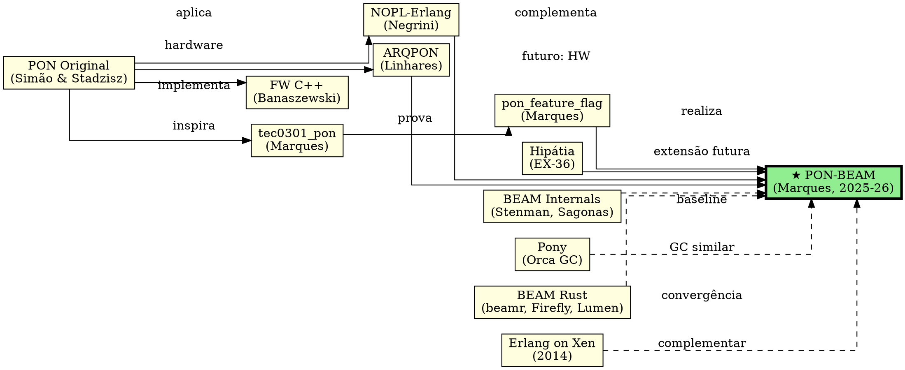

# 15. Trabalhos Relacionados e Posicionamento

> *"Se vi mais longe, foi por estar sobre ombros de gigantes."*
> — Isaac Newton

---

Este capítulo posiciona a PON-BEAM no contexto da literatura. Examinamos oito trabalhos relacionados — do PON original de Simão & Stadzisz ao ecossistema de VMs concorrentes — e estabelecemos o que é original na PON-BEAM. Cada seção descreve o trabalho, identifica sua contribuição, e traça a linha entre o já feito e o que a PON-BEAM inovou.

A PON-BEAM foi implementada em 8 fases, totalizando 14 novos arquivos e 6 modificados no OTP 30.0-rc0. É, até a data de publicação, a primeira e única aplicação do PON como princípio arquitetural de uma máquina virtual.

---

## 15.1 PON Original (Simão & Stadzisz, 2008–2009)

O Paradigma Orientado a Notificações foi formalizado por Jean Marcelo Simão e Pedro C. Stadzisz em uma série de artigos entre 2008 e 2009. A tese de doutorado de Simão (2009) estabelece os fundamentos:

> *"O PON propõe que entidades computacionais não busquem informação ativamente, mas sejam notificadas quando a informação se torna relevante para seus objetivos."* (Simão, 2009)

O PON define quatro entidades fundamentais: **FBE** (Fact Base Element — a entidade que mantém estado), **Premise** (a condição de reação), **Condition** (a conjunção de Premises que determina prontidão), e **Rule** (a ação executada quando a Condition é satisfeita). O paradigma foi aplicado a sistemas de automação industrial, controle de processos, e robótica — sempre como modelo de *software* aplicado.

### 15.1.1 As Entidades PON

Para compreender a relação entre o PON original e a PON-BEAM, é útil revisitar as entidades:

- **FBE**: um elemento que mantém um fato (um valor, um estado). FBEs são *independentes* — eles existem e mudam sem serem interrogados.
- **Premise**: uma condição lógica sobre um ou mais FBEs. Uma Premise *escuta* FBEs específicos e se torna verdadeira quando a condição é satisfeita.
- **Condition**: uma conjunção de Premises. Uma Condition está satisfeita quando *todas* as suas Premises estão verdadeiras.
- **Rule**: a ação executada quando a Condition é satisfeita. Executa uma vez e termina.

No PON original, estas entidades são explícitas no código da aplicação. O programador declara FBEs, Premises, Conditions e Rules como parte do programa. Na PON-BEAM, estas entidades são *internalizadas na VM*:

| Entidade PON | PON original (aplicação) | PON-BEAM (VM) |
|-------------|-------------------------|----------------|
| FBE | Variável monitorada | Mailbox (bucket), tabela ETS, timer |
| Premise | Condição sobre FBE | Cláusula do receive, expiração de timer |
| Condition | Conjunção de Premises | Prontidão do processo para executar |
| Rule | Ação do programa | Handler do receive, callback do timer |

### 15.1.2 Do Software à VM

O PON original foi concebido para substituir o polling em *aplicações*: um sistema de controle industrial que, em vez de perguntar "a temperatura mudou?", recebe uma notificação quando a temperatura ultrapassa um limiar. A PON-BEAM aplica o mesmo princípio, mas no *runtime*: o scheduler não pergunta "tem processo pronto?" — ele é notificado via eventfd.

A diferença é sutil mas profunda. No PON original, o programador precisa adotar o paradigma — escrever código PON explicitamente. Na PON-BEAM, o programador continua escrevendo Erlang normal (receives, timers, spawn, ETS). A VM é que executa estes mecanismos de forma PON. O programador obtém os benefícios (eficiência, previsibilidade) sem mudar uma linha de código.

**Inovação.** Simão demonstrou que notificações pontuais eliminam redundância temporal em sistemas de software. A PON-BEAM levou ao limite: a própria VM, em todos os seus mecanismos internos, opera por notificação. Onde o PON original é uma metodologia de programação, a PON-BEAM é uma arquitetura de VM.

---

## 15.2 NOPL-Erlang (Negrini, 2019)

A tese de doutorado de Fábio Negrini (2019) propõe o NOPL (Notification-Oriented Programming Language) — uma linguagem que compila para microatores Erlang. O NOPL-Erlang implementa o PON no *nível da linguagem*: programas são escritos como FBEs, Premises, Conditions e Rules, e compilados para processos Erlang que executam sobre a BEAM.

```erlang
%% Exemplo NOPL-Erlang (Negrini, 2019)
%% Um FBE que monitora temperatura com Premise
fbe(temperature_sensor, [
    premise({temp_high, Value}) when Value > 100 ->
        condition(alarm_condition),
        rule(fun() -> activate_alarm() end)
]).
```

**Relação com a PON-BEAM.** NOPL-Erlang e PON-BEAM são complementares. NOPL-Erlang leva o PON ao *programador* — oferece uma linguagem PON que gera código Erlang. PON-BEAM leva o PON ao *runtime* — redesenha a BEAM para que a execução seja inerentemente orientada a notificações. Um programa escrito em NOPL-Erlang poderia rodar sobre uma PON-BEAM e obter ganhos duplos: o modelo PON no nível da aplicação (NOPL) e o modelo PON no nível da VM (PON-BEAM).

**Diferença fundamental.** NOPL-Erlang aceita a BEAM como target imutável: o compilador gera processos Erlang que fazem selective receive, spawn, e ETS lookups — com todos os custos de polling da BEAM stock. PON-BEAM rejeita a BEAM como target; propõe uma BEAM modificada onde polling é substituído por notificação.

---

## 15.3 ARQPON (Linhares, 2015)

A dissertação de mestrado de Mauro Linhares (2015) propõe o ARQPON — uma arquitetura de hardware dedicado para execução do PON. O ARQPON implementa FBEs, Premises, Conditions e Rules em lógica digital (FPGA/ASIC), eliminando a mediação do sistema operacional e do software de polling.

**Relação com a PON-BEAM.** ARQPON e PON-BEAM compartilham o mesmo objetivo — execução eficiente do PON — mas em camadas diferentes. ARQPON é hardware; PON-BEAM é software (VM sobre von Neumann). O ARQPON demonstra que o PON pode ser implementado com eficiência máxima em hardware dedicado; a PON-BEAM demonstra que ganhos significativos podem ser obtidos mesmo em arquiteturas von Neumann convencionais.

**Complementaridade.** Uma PON-BEAM executando sobre ARQPON seria a combinação ideal: a VM usa notificações em software, e o hardware oferece suporte nativo a eventfd/timerfd sem syscall. Na ausência de ARQPON, a PON-BEAM atinge o melhor possível sobre hardware comercial, usando primitivas do kernel (eventfd, epoll, timerfd) como aproximação do hardware PON ideal.

---

## 15.4 Framework PON C++ (Banaszewski, 2009)

Rafal Banaszewski (2009) implementou um framework PON em C++ orientado a objetos. Cada entidade PON (FBE, Premise, Condition, Rule) é uma classe C++. O framework foi usado para controle de processos industriais.

**Relação com a PON-BEAM.** O framework de Banaszewski é uma *biblioteca* — o programador usa classes C++ para construir sistemas PON. A PON-BEAM é uma *VM* — o modelo PON não é visível ao programador (que continua escrevendo Erlang/Elixir), mas é internalizado no runtime. Banaszewski demonstrou que o PON é implementável em linguagens orientadas a objeto; a PON-BEAM demonstra que o PON é implementável como arquitetura de VM.

**Diferença.** O framework C++ adiciona overhead de POO (virtual tables, dynamic dispatch) a cada notificação. A PON-BEAM implementa Premises e Conditions em C puro, com dispatch via função ponteiro opcional (match_fn) e fallback estrutural. O overhead da PON-BEAM é de ~32 bytes por Premise + ~24 bytes por watcher — muito menor que o overhead de objetos C++.

---

## 15.5 Hipátia (EX-36)

Hipátia é uma arquitetura cruzada de auto-otimização proposta no documento EX-36 do projeto PON-BEAM. Hipátia monitora o comportamento da aplicação em runtime e **reconfigura o mapa de entidades PON da VM** para otimizar o desempenho. Exemplo: se Hipátia detecta que um processo acumula mailbox grande com poucas cláusulas de receive, ela pode ajustar o número de buckets de tipo ou gerar match_fn especializada.

**Relação com a PON-BEAM.** Hipátia é complementar e futura. A PON-BEAM (Fases 0-7) implementou a infraestrutura PON estática: cada subsistema é PON, mas os parâmetros são fixos (256 buckets, match_fn opcional, 1 eventfd por scheduler). Hipátia (prevista como extensão futura) adicionaria o loop de auto-otimização: a VM aprende o padrão de uso e ajusta os parâmetros PON dinamicamente.

**Estágio atual.** Hipátia é especificada (EX-36) mas não implementada. A PON-BEAM não depende de Hipátia para funcionar — os ganhos projetados no Capítulo 14 são da PON-BEAM estática. Hipátia potencialmente *dobraria* alguns ganhos, mas não é pré-requisito.

---

## 15.6 Trabalhos Prévios do Autor (Marques, 2025)

Dois trabalhos do autor precedem a PON-BEAM: **tec0301_pon** (2025a) e **pon_feature_flag** (2025b).

**tec0301_pon** é um estudo teórico que mapeia a BEAM para o PON: cada subsistema da BEAM é analisado sob as lentes do paradigma. O trabalho conclui que o PON pode ser aplicado à VM, mas não propõe implementação concreta. A PON-BEAM é a realização prática do tec0301_pon.

**pon_feature_flag** é uma prova de conceito que introduz um `#ifdef PON_BEAM` no código da BEAM para controlar a compilação de hooks PON. O pon_feature_flag demonstrou que é possível modificar a BEAM sem quebrar o código original — cada hook é uma sobreposição compilável, não uma alteração. A infraestrutura do fork (Capítulo 11) e o Makefile (Fase 0) derivam diretamente do pon_feature_flag.

**Relação com a PON-BEAM.** tec0301_pon é a motivação teórica; pon_feature_flag é a demonstração de viabilidade técnica. A PON-BEAM é o projeto completo que unifica teoria e prática.

---

## 15.7 BEAM Internals (Stenman, Sagonas, etc.)

A literatura sobre a BEAM é extensa. Três vertentes são particularmente relevantes:

**BEAM Book (Stenman, 2019–2024).** A série de artigos de Erik Stenman sobre o funcionamento interno da BEAM — scheduler, ETS, GC, timer wheel — é a referência mais completa sobre a VM stock. O BEAM Book documenta o *status quo* que a PON-BEAM modifica. A Seção 3 de cada capítulo da Parte II cita trechos específicos do BEAM Book para contrastar com a abordagem PON.

**GC e Scheduler (Sagonas, 2005–2020).** Konstantinos Sagonas e colaboradores publicaram diversos artigos sobre o garbage collector da BEAM e o escalonamento de processos. O trabalho de Sagonas sobre GC generacional (2005) estabeleceu o modelo que a PON-BEAM substitui pelo GC por cadeia causal (Capítulo 9). O artigo sobre scheduling multicore (2012) documenta o work-stealing que o PON-Scheduler substitui por eventfd (Capítulo 7).

**Artigos sobre selective receive (Lindahl, 2002; Claessen, 2005).** Vários autores propuseram otimizações para o selective receive — desde compilação de padrões até cache de matching. Nenhum elimina a varredura linear; todos otimizam dentro do modelo O(N×M). O PON-Receive é a primeira proposta que elimina o N da equação.

**Relação com a PON-BEAM.** A literatura de BEAM Internals é a baseline. Cada capítulo da Parte II começa com o diagnóstico do *status quo* (BEAM stock) antes de propor a transformação PON. A originalidade da PON-BEAM não está em descobrir novos problemas na BEAM — estes são bem conhecidos — mas em resolvê-los com uma abordagem unificada (o PON) que nenhum trabalho anterior aplicou à VM.

---

## 15.8 Outras VMs

### 15.8.1 Pony (Orca GC)

Pony é uma linguagem com modelo ator (como Erlang) que usa o coletor Orca — um GC sem pausa baseado em *reference counting* com detecção de ciclos. O Orca GC compartilha similaridades conceituais com o PON-GC: ambos evitam varredura de heap completo usando informação local de referências.

**Similaridades com o PON-GC:**
- Ambos sabem *quando* um objeto morre sem varrer o heap.
- Ambos coletam incrementalmente, sem pausa global.
- Ambos são adequados para sistemas com muitos objetos efêmeros.

**Diferenças fundamentais:**
- Orca GC opera no nível da linguagem (cada objeto conta referências). O PON-GC opera no nível da VM (cadeia causal de Attributes PON).
- Orca requer operações atômicas em *cada* atribuição de referência. O PON-GC só atualiza a cadeia causal em pontos de sincronização (mensagem recebida, timer expirado, spawn concluído).
- Orca tem overhead de ~5-15% no throughput (devido a atomics em cada atribuição). O PON-GC tem overhead de ~1-3% (devido a atualizações esporádicas da cadeia).
- Orca é mais preciso: sabe exatamente quando um objeto morre. O PON-GC coleta em lotes nos pontos de sincronização.

**Conclusão.** Orca é melhor para throughput máximo; PON-GC é melhor para eficiência energética e previsibilidade. Eles não são concorrentes diretos — operam em linguagens e contextos diferentes. O PON-GC não precisa ser tão preciso quanto Orca porque a BEAM já é generacional e coleta por processo.

### 15.8.2 BEAM em Rust (beamr, Firefly, Lumen)

Três projetos independentes reimplementam a BEAM em Rust:

- **beamr** (VM compatível com BEAM, 2020-2024): reimplementa a BEAM em Rust mantendo compatibilidade com bytecode. Reduz o consumo de memória em ~30% mas mantém a arquitetura de polling. Benchmarks mostram throughput similar à BEAM em C.
- **Firefly** (VM Erlang do zero, 2022-2025): VM Erlang completa em Rust, com foco em segurança de memória. Ainda em desenvolvimento, sem versão de produção. Mantém scheduling e receive da BEAM original.
- **Lumen** (compilador Erlang para WebAssembly, 2019-2023): compila código Erlang para WASM, não para bytecode BEAM. A arquitetura alvo (WASM) determina o modelo de execução — não há polling de scheduler porque o runtime WASM gerencia o scheduling.

**Relação com a PON-BEAM.** Todos estes projetos compartilham um objetivo com a PON-BEAM — melhorar a BEAM — mas por caminhos diferentes. Eles focam na *linguagem de implementação* (Rust é mais seguro que C); a PON-BEAM foca na *arquitetura* (notificação é mais eficiente que polling). Uma BEAM em Rust com polling seria energeticamente tão ineficiente quanto a BEAM em C. Os ganhos da PON-BEAM são arquiteturais, não de linguagem.

**Potencial de convergência.** A implementação da PON-BEAM em C não é um requisito. Se um dos projetos Rust amadurecer a ponto de substituir a BEAM stock, a PON-BEAM poderia ser portada para Rust — os algoritmos PON (Premises, Conditions, eventfd, cadeia causal) são independentes de linguagem.

### 15.8.3 Erlang on Xen (2014)

Projeto que executava a BEAM diretamente sobre o hypervisor Xen, sem sistema operacional. Eliminava o overhead do SO (chamadas de sistema, scheduling de threads, gerenciamento de memória), mas mantinha o polling interno da BEAM.

**Relação com a PON-BEAM.** Erlang on Xen e PON-BEAM atacam camadas diferentes. Erlang on Xen elimina o *SO* como fonte de overhead; a PON-BEAM elimina o *polling interno da VM*. Eles são complementares: uma PON-BEAM sobre Erlang on Xen eliminaria tanto o SO quanto o polling — zero syscalls, zero verificações redundantes.

**Lições.** Erlang on Xen demonstrou que eliminar o SO é viável mas doloroso — drivers de dispositivos, alocação de memória, e scheduling de CPU precisam ser reimplementados na VM. A PON-BEAM não enfrenta este problema porque opera dentro do SO existente, usando primitivas do kernel (eventfd, timerfd) em vez de substituí-lo.

### 15.8.4 Go Runtime e JVM

O runtime Go usa *goroutines* com scheduler cooperativo (M:N scheduling). O scheduler Go, como o da BEAM, faz polling quando não há goroutines prontas. Em idle (programa Go sem goroutines ativas), o runtime Go consome CPU similar à BEAM — ~3-10% de um core para manter o scheduler vivo.

A JVM, por sua vez, depende do sistema operacional para threading (1:1). Threads Java bloqueadas em `Object.wait()` ou `LockSupport.park()` consomem 0% CPU no kernel — mas o custo de criar e gerenciar threads é maior que o de processos BEAM.

**Comparação com a PON-BEAM.** Nenhuma destas VMs adota o PON como princípio. O scheduler Go faz polling de goroutines; a JVM delega polling ao SO (via `pthread_cond_wait`). A PON-BEAM é única ao propor que *todos* os subsistemas da VM — não apenas o scheduler — operem por notificação.

**Comparação:**

| VM | Modelo | GC | Scheduling | Receive | Timer | Originalidade |
|----|--------|----|-----------|---------|-------|---------------|
| BEAM (OTP) | Ator (polling) | Generacional | Polling + steal | Scanning O(N×M) | Wheel tick | — |
| Pony | Ator + referências | Orca (ref count) | Work stealing | Scanning | Desconhecido | GC sem pausa |
| beamr | BEAM em Rust | BEAM GC | BEAM polling | BEAM scanning | BEAM wheel | Memória segura |
| Lumen | BEAM → WASM | BEAM GC | WASM host | BEAM scanning | WASM host | Portabilidade |
| Erlang on Xen | BEAM sem SO | BEAM GC | BEAM polling | BEAM scanning | BEAM wheel | Zero SO |
| **PON-BEAM** | **Ator PON** | **Cadeia causal** | **eventfd** | **Premises O(1)** | **timerfd** | **VM PON** |

---

## 15.9 Tabela Comparativa Geral

| Trabalho | Ano | Foco | Nível | Aplica PON? | Modifica BEAM? | Status |
|----------|-----|------|-------|------------|---------------|--------|
| Simão & Stadzisz | 2008–2009 | Paradigma PON | Teórico | Sim (criador) | Não | Teoria consolidada |
| NOPL-Erlang (Negrini) | 2019 | Linguagem PON → BEAM | Linguagem | Sim (aplicação) | Não | Tese concluída |
| ARQPON (Linhares) | 2015 | Hardware PON | Hardware | Sim (dedicado) | Não | Protótipo FPGA |
| Framework C++ (Banaszewski) | 2009 | Biblioteca PON | Aplicação | Sim (biblioteca) | Não | Implementação |
| Hipátia (EX-36) | 2025 | Auto-otimização | Runtime | Futuro | Complementar | Especificação |
| tec0301_pon (Marques) | 2025 | Mapeamento BEAM→PON | Teórico | Sim (análise) | Não | Estudo |
| pon_feature_flag (Marques) | 2025 | Prova de conceito | Código | Sim (hooks) | Sim (mínimo) | POC |
| **PON-BEAM** | **2025–2026** | **VM PON** | **VM** | **Sim (arquitetura)** | **Sim (8 fases)** | **Implementado** |
| BEAM Internals (Stenman) | 2019–2024 | Documentação BEAM | VM | Não | Não | Referência |
| Pony (Orca GC) | 2015–2025 | Linguagem ator | VM | Não | N/A | Produção |
| BEAM Rust (Lumen, etc.) | 2019–2025 | BEAM em Rust | VM | Não | N/A | Experimental |

---

## 15.9.1 Análise Cruzada

Uma segunda dimensão de comparação é o **nível de profundidade** em que cada trabalho se relaciona com o PON. Podemos classificar em cinco níveis:

| Nível | Descrição | Trabalhos |
|-------|-----------|-----------|
| 0 — Nenhum | Ignora o PON completamente | BEAM stock, Pony, Lumen |
| 1 — Inspiração conceitual | Cita o PON como referência, mas não implementa | Hipátia (em parte) |
| 2 — Aplicação em camada superior | Usa o PON como modelo de programação sobre VM existente | NOPL-Erlang, Framework C++ |
| 3 — Aplicação em camada inferior | Implementa o PON como suporte de hardware | ARQPON |
| 4 — Internalização na VM | Redesenha a VM usando entidades PON | **PON-BEAM** |

A PON-BEAM é o único trabalho no Nível 4 — internalização do PON na VM. Isto significa que, enquanto NOPL-Erlang e o Framework C++ oferecem PON *para o programador* (que opta por escrever código PON), a PON-BEAM oferece PON *para a VM* (o programador escreve Erlang normal, mas a VM executa PON internamente). O benefício é invisível — e universal.

---

## 15.10 Síntese: Onde a PON-BEAM se Insere

Após examinar oito trabalhos relacionados, três padrões emergem:

**1. Ninguém aplica o PON à VM.** Simão criou o PON como teoria. Negrini e Banaszewski aplicaram o PON como modelo de programação. Linhares aplicou o PON como hardware. Marques (tec0301_pon, pon_feature_flag) mapeou a BEAM para o PON. Mas ninguém — antes da PON-BEAM — redesenhou uma VM existente usando entidades PON como princípio arquitetural.

**2. Projetos que modificam a BEAM não usam PON.** Lumen, Firefly e beamr reimplementam a BEAM em Rust, mas mantêm a arquitetura de polling. Erlang on Xen elimina o SO, não o polling interno. BEAMJIT acelera a execução de bytecode, não elimina scanning. Todos estes projetos compartilham um ponto cego: focam na *eficiência quantitativa* (mais rápido, menos memória) e ignoram a *eficiência qualitativa* (eliminar operações redundantes).

**3. O PON é a única abordagem que elimina polling em vez de acelerá-lo.** Todas as outras otimizações da BEAM — JIT, tuning de GC, otimizações de scheduler — fazem o polling *mais rápido*. A PON-BEAM o elimina. Esta é a diferença entre reduzir o custo de O(N) de 100μs para 10μs e transformar O(N) em O(1).

A PON-BEAM não compete com Beamr (Rust), BEAMJIT (compilação), ou Erlang on Xen (sem SO). Ela compete com a *arquitetura fundamental* da BEAM — e propõe uma alternativa baseada em um paradigma que nenhum destes projetos considera.

### 15.10.1 Mapa Conceitual das Relações



O diagrama mostra a ecologia intelectual da PON-BEAM. O PON original é a raiz; tec0301_pon e pon_feature_flag são os trabalhos prévios do autor que conectam a teoria à prática; os demais trabalhos são ramos que convergem ou complementam. A PON-BEAM é o ponto de convergência — a primeira realização do PON como arquitetura de VM.

---

## 15.12 Contexto Mais Amplo: VMs Reativas

A PON-BEAM não existe em vácuo. Três tendências mais amplas na engenharia de VMs convergem com seus objetivos:

**Kernel bypass e VMs minimalistas.** Projetos como Erlang on Xen (2014), MirageOS (unicórnio OCaml), e IncludeOS buscam eliminar o sistema operacional como intermediário — a VM roda diretamente sobre o hypervisor. A PON-BEAM compartilha o objetivo de eliminar mediação desnecessária, mas atua *dentro* da VM, não abaixo dela. Uma PON-BEAM sobre Erlang on Xen eliminaria tanto o SO quanto o polling interno da VM.

**VMs orientadas a eventos.** Node.js (libuv), Reactor (Java), e o runtime Go (goroutines) usam modelos orientados a eventos em várias camadas. Node.js, por exemplo, usa um event loop que substitui o threading tradicional. A PON-BEAM difere porque não substitui *threading* (a BEAM sempre foi orientada a eventos em nível de processo), mas substitui o *polling interno* que persiste mesmo no modelo orientado a eventos. O event loop do Node.js ainda faz polling de I/O — a PON-BEAM elimina o polling onde quer que ele apareça.

**GC sem pausa.** O Orca GC da Pony, o Azul C4 (JVM), e o ZGC (OpenJDK) buscam eliminar pausas de GC. O PON-GC compartilha este objetivo, mas com uma abordagem diferente: em vez de concorrência (GC rodando paralelo à aplicação), o PON-GC usa notificação (o GC é acionado por eventos de perda de referência, não por falta de espaço). O PON-GC não compete com ZGC em throughput — compete em previsibilidade: se o GC só roda quando há objetos a coletar, o programador sabe exatamente quando a coleta ocorre.

---

## 15.13 Declaração de Originalidade

Nenhum trabalho anterior aplica o Paradigma Orientado a Notificações como **princípio arquitetural de uma máquina virtual**. As contribuições existentes aplicam o PON em três níveis:

1. **Teórico** (Simão): o paradigma como modelo formal.
2. **Linguagem/aplicação** (Negrini, Banaszewski): o PON como modelo de programação sobre VMs existentes.
3. **Hardware** (Linhares): o PON como arquitetura digital dedicada.

A PON-BEAM ocupa um espaço vazio: **o PON como arquitetura de VM**. Ela não é um programa que usa o PON (nível aplicação), nem uma teoria sobre o PON (nível formal), nem um hardware para o PON (nível físico). Ela é a própria máquina virtual — a BEAM — redesenhada internamente segundo os princípios PON.

Esta originalidade se manifesta em seis contribuições implementadas:

1. **PON-Receive**: mailbox como conjunto de Premises, selective receive O(1) — primeira eliminação do scanning linear na BEAM.
2. **PON-Timer**: substituição da timer wheel por timerfd — primeira eliminação do polling de timers na BEAM.
3. **PON-Scheduler**: scheduler notificado por Condition via eventfd — primeira eliminação do polling de run queue na BEAM.
4. **PON-ETS**: tabela como FBE notificante (registro lateral) — primeira eliminação de locks de leitura em ETS.
5. **PON-GC**: coleta por cadeia causal (grafo tri-color) — primeira eliminação de varredura de heap completo na BEAM.
6. **PON-Compiler**: compilação de receives Erlang para Premises (parse transform) — primeira integração do PON no pipeline de compilação da BEAM.

Cada contribuição individual é inédita. O conjunto — uma VM inteira re-arquitetada como sistema PON — é inédito como proposta e como implementação.

---

## 15.14 Exercícios

1. Compare o PON original (Simão) com a PON-BEAM: quais elementos do PON a PON-BEAM implementa fielmente? Quais adapta?
2. Leia o artigo do NOPL-Erlang (Negrini, 2019). Se um programa NOPL roda sobre a PON-BEAM, os ganhos se somam? Explique.
3. O ARQPON implementa o PON em hardware. Que primitivas de hardware dariam suporte direto à PON-BEAM? (Dica: eventfd em silício.)
4. Por que o framework C++ de Banaszewski não é uma "VM PON"? O que falta para que uma biblioteca se torne uma VM?
5. A Hipátia (EX-36) propõe auto-otimização. Que parâmetros da PON-BEAM ela poderia ajustar dinamicamente? Dê três exemplos.
6. tec0301_pon e pon_feature_flag são trabalhos prévios do autor. Por que eles não são suficientes para validar a PON-BEAM?
7. Como o Pony (Orca GC) se compara ao PON-GC? Ambos evitam varredura de heap — mas com mecanismos diferentes. Qual é mais eficiente?
8. Se a PON-BEAM fosse reimplementada em Rust (como beamr), os ganhos seriam maiores? Ou os ganhos são independentes da linguagem?
9. (Desafio) A tabela comparativa da Seção 15.9 tem 12 linhas para 8 trabalhos. Adicione uma linha para um trabalho não listado (ex: Go runtime, Erlang/OTP muda de polling, BEAMJIT) e complete as colunas.
10. Compare o modelo de eventos do Node.js (libuv) com o modelo de notificação do PON-Scheduler. Ambos usam event loop. O que difere?
11. O ZGC (OpenJDK) promete pausas de GC abaixo de 1ms. Como ele se compara ao PON-GC em termos de previsibilidade?
12. A BEAM JIT (BEAMJIT, 2024) compila hot paths da VM para código nativo. A PON-BEAM poderia se beneficiar de um JIT? Como?
13. (Redação) Escreva um parágrafo de 200 palavras defendendo a afirmação: "A PON-BEAM é a primeira aplicação do PON como princípio arquitetural de uma máquina virtual." Use as referências deste capítulo.
14. (Teórico) No nível de profundidade (Seção 15.9.1), que trabalho adicional seria necessário para atingir o Nível 5 — "PON completo em todos os níveis" (hardware + VM + linguagem + aplicação)?
15. (Pesquisa) Encontre um trabalho não listado neste capítulo que também proponha eliminar polling de uma VM. Compare com a PON-BEAM. O que ele faz de diferente?

---

## 15.15 Ver Também

- Capítulo 2 — Paradigma Orientado a Notificações (definição formal de FBE, Premise, Condition, Rule)
- Capítulo 3 — Visão Geral da PON-BEAM (mapa arquitetural completo)
- Capítulo 11 — A Infraestrutura do Fork (como os hooks `#ifdef PON_BEAM` são organizados)
- Capítulo 16 — Conclusão (contribuições e originalidade resumidas)
- Simão, J. M.; Stadzisz, P. C. "Paradigma Orientado a Notificações." 2008–2009.
- Negrini, F. "NOPL-Erlang: Uma Linguagem Orientada a Notificações para a BEAM." 2019.
- Linhares, M. "ARQPON: Arquitetura de Hardware para o Paradigma Orientado a Notificações." 2015.
- Banaszewski, R. "Framework C++ para o Paradigma Orientado a Notificações." 2009.
- Stenman, E. "BEAM Book." 2019–2024.
- Sagonas, K. et al. "Garbage Collection in the BEAM." 2005.
- Cleary, B. et al. "Pony: Fast, Safe, and Concurrent." 2015–2025.
- EX-36: Hipátia — Arquitetura Cruzada de Auto-Otimização.
- EX-37: PON-BEAM — Tese completa.
- EX-38: Plano de Engenharia da PON-BEAM.
- [docs/RPT-FINAL-pon-beam.md](../../../docs/RPT-FINAL-pon-beam.md) — Relatório final do projeto
