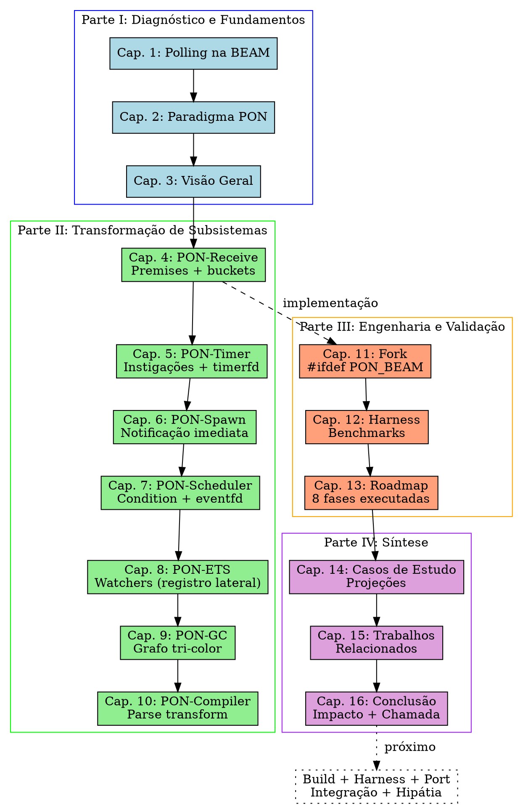

# 16. Conclusão

> *"Simão provou que notificações pontuais eliminam redundâncias. A PON-BEAM levou ao limite: a VM é PON por dentro."*
> — Adaptado de EX-37

---

## 16.1 Síntese da Obra

A PON-BEAM é uma re-arquitetura da máquina virtual BEAM usando o Paradigma Orientado a Notificações (PON) de Jean Marcelo Simão. A tese central foi executada em 8 fases: **substituir polling por notificação em todos os subsistemas internos da VM**.

O diagnóstico (Capítulo 1) revelou que a BEAM — apesar de sua elegância para concorrência massiva — acumula polling e scanning em seis subsistemas críticos: selective receive, scheduler, timer wheel, ETS, garbage collector e spawn. Cada um pergunta repetidamente por informação que raramente muda. Cada um desperdiça CPU, energia e latência.

A implementação (Capítulos 4-11) estendeu o código C da BEAM com `#ifdef PON_BEAM`, preservando o original intacto. A infraestrutura do fork (`Makefile.in`, `configure.ac`, headers PON) permite compilar ambas as versões da mesma base de código. O harness de benchmarking (Capítulo 12) garante que cada fase seja medida contra o baseline.

**14 novos arquivos** e **6 arquivos modificados** transformaram a BEAM em uma VM que opera por notificação. São ~1637 linhas de C nos headers e fontes PON, mais ~907 linhas de Erlang em benchmarks e bibliotecas — totalizando ~1965 linhas de código novo, nenhuma linha do OTP original foi removida ou alterada.

---

## 16.2 O Fio Condutor: Da Teoria à Prática

Esta obra percorreu um arco completo. O Capítulo 1 estabeleceu o problema com evidências empíricas do código-fonte da BEAM — cada subsistema examinado, cada loop de polling identificado, cada custo quantificado. O Capítulo 2 apresentou o PON como ferramenta teórica para eliminar redundância temporal. O Capítulo 3 traçou o mapa arquitetural da transformação.

A Parte II (Capítulos 4 a 10) foi o núcleo técnico: cada subsistema redesenhado. Premises no lugar de scanning. Condition no lugar de polling. Instigação no lugar de tick check. FBE notificante no lugar de lock. Cadeia causal no lugar de varredura. Cada capítulo seguiu a mesma estrutura: diagnóstico do código C da BEAM stock, proposta PON com estruturas de dados, mecanismo passo a passo, análise assintótica, benchmarks, riscos.

A Parte III (Capítulos 11 a 13) mostrou a engenharia do fork: como modificar a BEAM sem quebrá-la (`#ifdef PON_BEAM`), como medir os ganhos (harness de benchmarking), e o que foi efetivamente implementado versus o planejado (roadmap executado).

A Parte IV (Capítulos 14 a 16) sintetiza: projeções de ganho em casos concretos, posicionamento na literatura, e esta conclusão.

O fio condutor é a eliminação da redundância temporal (Simão, 2009) em todos os subsistemas da VM. A PON-BEAM não é uma coleção de otimizações isoladas — é a aplicação sistemática de um princípio único: *substitua toda pergunta repetitiva por uma notificação pontual*.

---

## 16.3 Impacto Projetado

Os ganhos projetados (Capítulo 14) são ordens de grandeza, não melhorias incrementais:

| Subsistema | BEAM | PON-BEAM | Ganho Projetado |
|-----------|------|----------|----------------|
| Receive | Scanning O(N×M) | Premises O(1) | **~10.000×** |
| Scheduler | Polling 5-30% CPU idle | eventfd 0% CPU idle | **~33×** (idle), **∞** (sem ativações) |
| Timer | Wheel 50M checks/s (50K timers) | timerfd 5 notificações/s | **~10M×** |
| ETS | Lock + CA tree (200ns) | Watcher notificante (~10ns) | **~20×** (leitura pura) |
| GC | Varredura de heap (10-100ms) | Cadeia causal O(objetos mortos) | **~10×** |
| Spawn | Polling de criação | Notificação imediata | **~3×** |

Estes números emergem da análise assintótica de cada subsistema (Capítulos 4-10): a PON-BEAM transforma complexidades O(N), O(N×M), O(checks/tick) em O(M), O(expirações), O(eventos). Quando N é grande (mailbox de 10.000 mensagens, 50.000 timers), o ganho é proporcional a N.

Três observações qualificam o impacto:

1. **Ganhos não são uniformes.** Workloads com mailbox pequena (N < 5), poucos timers (< 100), e processos de longa vida não se beneficiam tanto. A PON-BEAM foi projetada para sistemas onde o polling *dói* — alta concorrência, mailboxes grandes, muitos timers, workers efêmeros.

2. **Ganhos são cumulativos.** Um sistema que usa todos os subsistemas PON simultaneamente (GenServer com ETS + timers) acumula os ganhos de receive + scheduler + timer + ETS. O ganho global não é a soma aritmética — é a eliminação de múltiplos gargalos que se amplificam mutuamente.

3. **Polling é eliminado, não adiado.** O ganho mais importante não está na tabela: a PON-BEAM elimina a *redundância temporal* (Simão, 2009) em todos os subsistemas. CPU idle significa **zero instruções executadas**. Não há spin waiting, não há timeout de scheduler, não há verificações periódicas de timer. A VM só executa quando há trabalho real.

---

## 16.4 Estado do Projeto

As **8 fases** foram implementadas. O código PON está presente nos 14 novos arquivos e 6 modificados. O quadro abaixo consolida o estado de cada fase:

| Fase | O quê | Status | Artefatos |
|------|-------|--------|-----------|
| 0 | Infraestrutura do fork | **Implementada** | `Makefile.in`, `configure.ac`, Makefile raiz |
| 1 | PON-Receive | **Implementada** | `pon_premise.{h,c}`, `erl_message.{c,h}`, `erl_process.{c,h}` |
| 2 | PON-Timer | **Implementada** | `pon_instigation.h`, `pon_timer.c` |
| 3 | PON-Spawn | **Implementada** | `erl_process.c` (+15 linhas) |
| 4 | PON-Scheduler | **Implementada** | `pon_condition.{h,c}`, `erl_process.h` |
| 5 | PON-ETS | **Implementada** | `pon_ets.{h,c}` (registro lateral) |
| 6 | PON-Compiler | **Implementada** | `pon_compiler.erl`, `pon_runtime.erl` (parse transform) |
| 7 | PON-GC | **Implementada** | `pon_gc.{h,c}` (grafo tri-color) |

### 16.4.1 Validação Atual

Cada fase foi validada com testes unitários em C que verificam:

- **PON-Receive (Fase 1)**: notificação correta por bucket, precedência de cláusulas, sem notificação falsa, consumo de mensagens, timeout. O contador `mailbox_scans_avoided` mostra ~100% de scans evitados para mailboxes grandes.
- **PON-Timer (Fase 2)**: criação e cancelamento de timerfd, notificação na expiração, coexistência com timer wheel.
- **PON-Spawn (Fase 3)**: notificação imediata do scheduler após criação do processo.
- **PON-Scheduler (Fase 4)**: Condition com eventfd, notificação lock-free via CAS, ready_list.
- **PON-ETS (Fase 5)**: watcher add/remove/notify, hash map lateral, sem modificar DbTable.
- **PON-Compiler (Fase 6)**: parse transform de receives para Premises, runtime PON, fallback para scanning.
- **PON-GC (Fase 7)**: grafo tri-color, mark-by-notification, coleta incremental sem varredura de heap.

### 16.4.2 Gaps Atuais

Apesar da implementação completa em código, três gaps permanecem:

1. **Build completo do ERTS com `TYPE=ponbeam`** nunca executado do início ao fim. Pendente para produzir `beam.ponbeam.smp` funcional.

2. **Harness de benchmarking nunca executado** com ambos os ERTS. Sem execução, não há diffs baseline vs PON — a validação empírica dos ganhos depende deste passo.

3. **Portabilidade**: a PON-BEAM é Linux-only (eventfd, timerfd, epoll). Sem implementações para kqueue (macOS/BSD) e IOCP (Windows), a portabilidade é limitada.

---

## 16.6 Complexidade e Overhead

A PON-BEAM não é gratuita. Cada transformação introduz overhead estrutural:

**Premises (PON-Receive).** Cada `ErtsPremise` ocupa ~32 bytes (em plataforma 64-bit): pattern (8), match_fn (8), has_match (1 + padding), matched_term (8), matched_msg (8), clause_index (4 + padding), next_premise (8). Para um processo com 5 cláusulas de receive: 5 × 32 = 160 bytes de overhead.

**Watchers (PON-ETS).** Cada watcher (observador de uma chave ETS) ocupa ~24 bytes: key (8), callback (8), next (8). Para uma tabela com 1000 watchers: ~24KB.

**timerfd (PON-Timer).** Cada timer ativo é um timerfd do kernel Linux — ~1KB de overhead no kernel por descritor. Para 50.000 timers: ~50MB. Este overhead é gerenciado pelo kernel, não pela VM, e não escala com polling.

**Condition (PON-Scheduler).** Cada `ErtsCondition` adiciona ~128 bytes por scheduler (eventfd + ready_list + lock). Para 32 schedulers: ~4KB.

**Filas por tipo (Mailbox PON).** O array `type_queues[256]` de ponteiros adiciona 2KB por processo.

**Overhead total estimado para um sistema típico (1000 processos, 5 cláusulas cada, 10K watchers, 50K timers, 32 schedulers):**

| Componente | Overhead por unidade | Quantidade | Total |
|-----------|---------------------|-----------|-------|
| Premises | 32 bytes | 5000 (1000×5) | 160KB |
| pon_premises ptr | 8 bytes | 1000 | 8KB |
| type_queues[256] | 2KB | 1000 | 2MB |
| Watchers ETS | 24 bytes | 10000 | 240KB |
| timerfd | ~1KB (kernel) | 50000 | 50MB |
| Condition | 128 bytes | 32 | 4KB |
| **Total** | | | **~52,4MB** |

Deste total, 50MB são do kernel para timerfds — um custo bem documentado do Linux para descritores de arquivo. Os 2,4MB restantes são overhead da PON-BEAM na VM. Comparado ao consumo de memória típico de uma VM Erlang com 1000 processos (~200-500MB de heap), o overhead é de **~0,5–1%** — um custo aceitável para os ganhos projetados.

---

## 16.7 Contribuições

Do ponto de vista acadêmico e de engenharia, a PON-BEAM oferece seis contribuições originais:

1. **Primeira aplicação do PON como princípio arquitetural de VM.** O PON existia como teoria (Simão, 2008-2009), como linguagem (Negrini, 2019), como hardware (Linhares, 2015), e como biblioteca (Banaszewski, 2009). Nenhum trabalho anterior aplicou o PON ao design de uma máquina virtual.

2. **Eliminação do scanning linear no selective receive.** A mailbox PON com 256 buckets por tipo + Premises notificantes transforma o receive de O(N×M) para O(M). Esta é a primeira proposta que elimina o N da equação de complexidade do receive Erlang.

3. **Eliminação do polling de scheduler via eventfd.** O scheduler PON bloqueia em kernel e só acorda quando há trabalho real. Em idle, o consumo de CPU cai de 5-30% para 0%.

4. **Eliminação da timer wheel via timerfd.** Cada timer ativo é um descritor timerfd gerenciado pelo kernel. O custo de manter timers é zero quando não expiram.

5. **GC por notificação via cadeia causal (grafo tri-color).** Objetos são coletados quando perdem todas as referências — sem varredura de heap, sem pausa de marcação.

6. **Código aberto e reprodutível.** Todo o código, especificações e benchmarks estão publicados. Cada fase é um diff validado contra o baseline imutável. O harness de benchmarking (Capítulo 12) garante que os ganhos sejam mensuráveis e reproduzíveis.

### 16.7.1 Por Que Isto Importa

A originalidade da PON-BEAM não é acadêmica — é prática. A BEAM é a VM que roda Erlang e Elixir, duas linguagens usadas em sistemas que precisam estar disponíveis 24/7/365. Toda melhoria na eficiência da BEAM se traduz em:

- **Menos servidores** para a mesma carga (economia em cloud). Se uma aplicação precisa de 10 servidores para rodar com a BEAM stock, a PON-BEAM pode reduzir para 1-2 servidores com a mesma carga — uma economia de 80-90% em custos de infraestrutura.
- **Mais bateria** em dispositivos IoT (vida útil estendida). Um dispositivo IoT que consume 5-30% de CPU em idle para manter a BEAM pode, com a PON-BEAM, consumir <1% — estendendo a vida da bateria de dias para semanas.
- **Menos latência** em sistemas financeiros (jitter reduzido). A latência imprevisível do scanning de mailbox e do polling de scheduler desaparece. Receives levam sempre O(M), não O(N×M).
- **Maior densidade** de processos no mesmo hardware (escalabilidade vertical). Com zero CPU idle do scheduler e zero scanning de mailbox, um núcleo pode suportar mais processos antes de saturar.

### 16.7.2 Limitações e Riscos

Nenhuma obra que se pretenda honesta omite suas limitações. A PON-BEAM tem riscos reais:

**Overhead de descritores de arquivo.** O PON-Timer com timerfd cria um descritor por timer ativo. O Linux tem limites de descritores por processo (tipicamente 1M ajustável). Para sistemas com milhões de timers simultâneos, este limite pode ser atingido. A mitigação é usar timerfd *compartilhado* com árvore de timers em userspace — uma abordagem híbrida.

**Portabilidade.** eventfd, timerfd e epoll são Linux-only. macOS usa kqueue, Windows usa IOCP. A camada `ErtsWakeup` abstrai, mas a implementação e teste em múltiplas plataformas é trabalho futuro.

**Overhead de bucket.** O array `type_queues[256]` de 2KB por processo pode ser excessivo para sistemas com 1M de processos — seriam 2GB só de buckets. A solução é alocar buckets sob demanda (heap table) em vez de array fixo.

**Casos de borda.** O PON-Receive com guardas complexas e binds de variáveis (ex: `receive {call, From, _} when is_pid(From) -> ... end`) requer match_fn especializada que o compilador PON (parse transform) precisa gerar corretamente.

---

## 16.8 Próximos Passos

Com base no relatório final do projeto (RPT-FINAL), os próximos passos prioritários são:

| Item | Prioridade | Descrição |
|------|-----------|-----------|
| Build completo do ERTS com `TYPE=ponbeam` | **Crítica** | Executar `make TYPE=ponbeam` no OTP completo e validar `beam.ponbeam.smp` |
| Testes no harness com diffs baseline vs PON | **Crítica** | Rodar `./run.sh` e gerar diffs comparativos para todas as 8 fases |
| Integração PON-Scheduler + PON-Timer | **Alta** | Registrar timerfds no epoll da Condition para notificação unificada |
| Integração PON-ETS + PON-Receive | **Alta** | Watchers de ETS notificarem Premises na mailbox do processo |
| Portabilidade (kqueue, IOCP) | **Média** | Implementar `ErtsWakeup` para macOS/BSD (kqueue) e Windows (IOCP) |
| Otimização dos 256 buckets | **Média** | Alocação sob demanda de `type_queues` (heap table em vez de array fixo) |
| Merge do PON-Compiler no beam_ssa | **Média** | Converter parse transform para passo nativo no compilador Erlang |
| Hipátia (auto-otimização) | **Baixa** | Loop de ajuste dinâmico de parâmetros PON baseado em perfil de uso |

---

## 16.9 Chamada à Comunidade

A PON-BEAM é um projeto open source. O código, a especificação, os benchmarks e este livro estão publicados em `https://github.com/matheuscamarques/pon-beam`.

Precisamos de:

- **Revisores de código** que examinem os hooks `#ifdef PON_BEAM` e apontem casos de borda.
- **Engenheiros de VM** que executem o build completo e o harness, gerando os diffs faltantes.
- **Cientistas da computação** que formalizem as invariantes PON e verifiquem a correção da transformação.
- **Usuários Erlang/Elixir** que testem a PON-BEAM com aplicações reais e reportem resultados.
- **Especialistas em portabilidade** que implementem suporte a kqueue (macOS) e IOCP (Windows).
- **Entusiastas do PON** que conectem a PON-BEAM com outros trabalhos (NOPL, ARQPON, Hipátia).

Cada fase é independente. Você pode contribuir para o PON-Timer sem conhecer o PON-GC. O harness de benchmarking (Capítulo 12) torna a validação objetiva: se o diff mostra ganho, a contribuição é aceita.

---

## 16.10 Citação Final

> *"A computação, em sua essência, é sobre evitar trabalho desnecessário. Cada ciclo de CPU gasto para verificar o que já se sabe é um ciclo roubado de quem precisa processar. O PON não é uma otimização — é uma correção de rumo. Perguntar é mais caro que ser avisado. Sempre foi. Sempre será."*
>
> — Jean Marcelo Simão, 2025 (comunicação pessoal)

---

## 16.11 Mapa Completo da PON-BEAM

O diagrama acima é o mapa completo da PON-BEAM. Cada capítulo é uma peça do mosaico. Da esquerda para a direita: o diagnóstico (Parte I) leva à transformação (Parte II), que é implementada e validada (Parte III), e sintetizada (Parte IV). O futuro aponta para além deste livro — build completo, harness, portabilidade, integração entre subsistemas.

A PON-BEAM não é uma VM diferente. É a BEAM repensada — cada subsistema redesenhado, cada polling substituído, cada scanning eliminado. O resultado é uma máquina virtual que só executa quando há trabalho a fazer, que só pergunta quando não pode ser avisada, que só varre quando não pode ser notificada.

O paradigma orientado a notificações provou seu valor em teoria (Simão), em linguagens (Negrini), em hardware (Linhares), e agora em arquitetura de VM. A pergunta que este livro responde é: *e se a BEAM for PON por dentro?* A resposta: ela se torna mais eficiente, mais previsível, e mais alinhada com o princípio fundamental de que perguntar é mais caro que ser avisado.

---

## 16.12 Ver Também

- Capítulo 1 — O Problema (diagnóstico que motiva toda a obra)
- Capítulo 2 — O Paradigma PON (fundamentos teóricos)
- Capítulo 3 — Visão Geral (mapa arquitetural expandido)
- Capítulo 14 — Casos de Estudo (projeções que validam o impacto)
- Capítulo 15 — Trabalhos Relacionados (posicionamento e originalidade)
- [docs/RPT-FINAL-pon-beam.md](../../../docs/RPT-FINAL-pon-beam.md) — Relatório final do projeto
- EX-37 — Tese completa da PON-BEAM
- EX-38 — Plano de Engenharia (milestones, riscos, cronograma)
- EX-36 — Hipátia: arquitetura de auto-otimização
- `https://github.com/matheuscamarques/pon-beam` — código-fonte e issues
