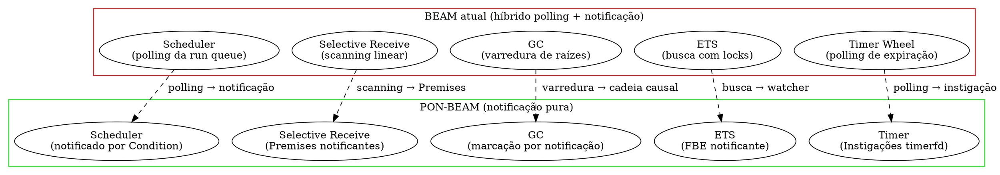
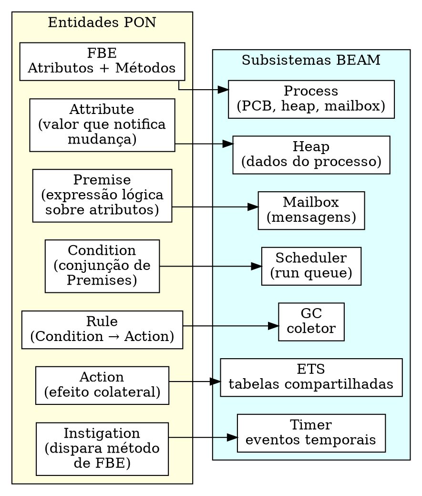
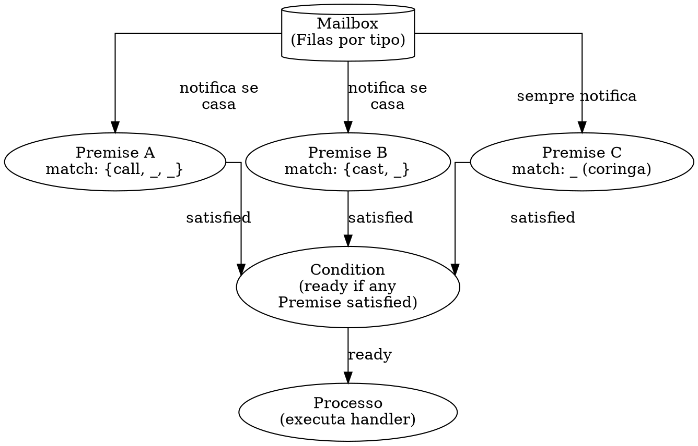
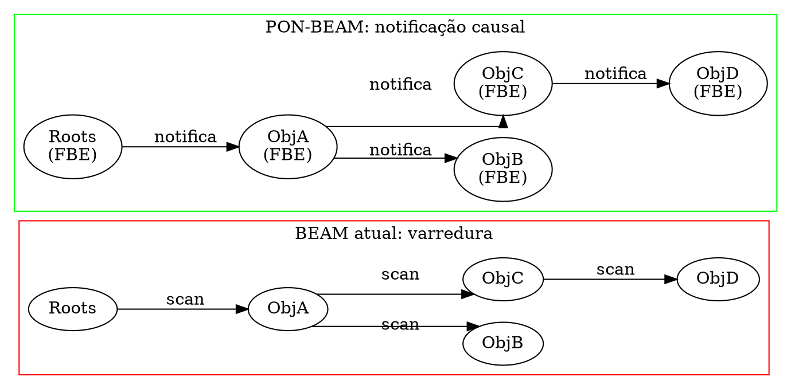
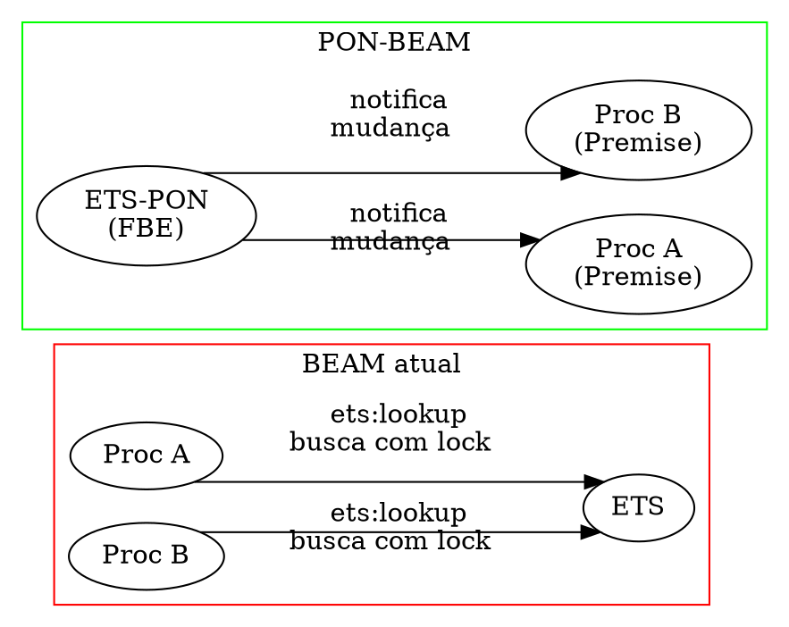
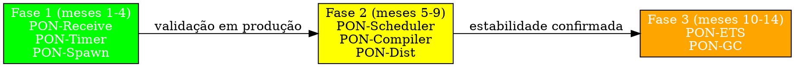

# PON-BEAM — Arquitetura de uma Máquina Virtual Orientada a Notificações

> "Não se pode resolver um problema com o mesmo tipo de pensamento que o criou." — Albert Einstein (atribuído)

> **Sobre o autor.** Matheus de Camargo Marques. Este documento é uma proposta de tese original que aplica o Paradigma Orientado a Notificações (PON), de Jean Marcelo Simão, como princípio arquitetural para o redesign da máquina virtual BEAM. Trabalhos prévios do autor incluem implementações do PON em Elixir/BEAM ([tec0301_pon](https://github.com/matheuscamarques/tec0301_pon), 2025) e compilação dinâmica reativa inspirada em PON ([pon_feature_flag](https://github.com/matheuscamarques/pon_feature_flag), 2025).

## Resumo

A BEAM (Bogdan/Björn's Erlang Abstract Machine) é construída sobre um modelo híbrido de execução — polling e busca em alguns subsistemas, notificação em outros. O scheduler faz polling da run queue. O selective receive faz scanning linear da mailbox. O GC varre raízes. O ETS faz busca com locks. O timer wheel faz polling de expiração.

O Paradigma Orientado a Notificações (PON), proposto por Jean Marcelo Simão (2005–2009), propõe um modelo computacional onde entidades mínimas, reativas e desacopladas colaboram exclusivamente por notificações pontuais, eliminando redundâncias temporais (reavaliações desnecessárias) e estruturais (código de busca repetido). O PON demonstrou ganhos de desempenho e escalabilidade em implementações sobre BEAM (NOPL-Erlang, Negrini 2019) e em arquitetura de hardware dedicada (ARQPON, Linhares 2015).

Esta tese propõe a **PON-BEAM**: uma re-arquitetura da máquina virtual onde **cada subsistema interno é redesenhado como uma entidade PON** — reativa, notificante, sem polling, sem scanning. A contribuição é original: toda a literatura PON existente aplica o paradigma *sobre* plataformas existentes (C++, Java, Erlang, FPGA). Nenhum trabalho propõe o PON como princípio de design *da própria VM*.



---

## 1. Fundamentos do PON aplicados à VM

### 1.1 As entidades estruturais do PON

O PON define um conjunto de entidades computacionais mínimas que colaboram por notificações (Simão & Stadzisz, 2008; Banaszewski, 2009; Simão et al., 2012):



**FBE (Fact Base Element)**: Unidade que encapsula estado (Attributes) e comportamento (Methods). Na PON-BEAM, cada **processo OTP** é um FBE. Seus atributos são os valores em seu heap, sua mailbox, seus registradores. Seus métodos são as BIFs e funções exportadas.

**Attribute**: Um valor que, ao ser alterado, notifica todas as Premises que o referenciam. Na PON-BEAM, atributos são extensões opcionais dos termos no heap.

**Premise**: Expressão booleana sobre Attributes. Na PON-BEAM, uma Premise é um **padrão de selective receive compilado**: em vez de escanear a mailbox, a Premise é notificada quando uma mensagem compatível chega. A mailbox deixa de ser uma lista a ser percorrida e passa a ser um conjunto de Premises registradas que escutam mensagens específicas.

**Condition**: Conjunção de Premises. Na PON-BEAM, a Condition é o **estado de prontidão** de um processo. O scheduler não precisa fazer polling — a Condition notifica a run queue quando o processo está pronto.

**Rule**: Par Condition → Action. Na PON-BEAM, as Rules são os opcodes que manipulam estado.

**Action**: Efeito colateral da Rule: enviar mensagem, alterar ETS, spawn, invocar BIF.

**Instigation**: Disparo de execução de método de um FBE. Na PON-BEAM, a Instigation é a **preempção** (reduction counting) e a **ativação de timer** (`receive ... after`). Em vez de polling do timer wheel, cada timer é uma Instigation que notifica o processo alvo na expiração.

### 1.2 Redundância temporal na BEAM atual

O PON identifica que nos paradigmas Imperativo e Declarativo, entidades passivas são percorridas em busca a cada ciclo — mesmo quando nada mudou. Isso é **redundância temporal** (Simão & Stadzisz, 2009b).

Na BEAM atual:

1. **Selective receive**: A cada nova mensagem, o scan recomeça do `save` pointer, reavaliando mensagens que já falharam o match (`erl_message.h:383`).

2. **Timer wheel**: A cada tick, a roda é verificada mesmo sem timers registrados (`erl_timer.c`).

3. **ETS ordered_set**: Leituras percorrem a CA tree mesmo sem escritas desde a última leitura (`erl_db.c`).

4. **GC major**: Varre todas as raízes mesmo quando o grafo de referências mudou pouco (`erl_gc.c:320`).

5. **Run queue polling**: Scheduler ocioso faz polling até encontrar trabalho (`erl_process.c:4800`).

O PON-BEAM elimina cada redundância substituindo busca por notificação.

---

## 2. PON-Scheduler: Scheduling por notificação, não por polling

### 2.1 Diagnóstico

O scheduler da BEAM (`erl_process.c:4800`) segue:

```c
while (1) {
    if (run_queue_empty(sd)) {
        process = try_steal(sd);
        if (!process) {
            erts_sched_sleep(sd);  // dorme com timeout, acorda e tenta de novo
            continue;
        }
    } else {
        process = dequeue(sd);
    }
    execute_process(process);
}
```

O scheduler dorme, mas acorda em timeout mesmo sem trabalho. Quando não dorme, faz busy-wait polling.

### 2.2 Proposta: Scheduler como Condition notificada

No PON-BEAM, o scheduler não faz polling. A run queue é substituída por uma **Condition** que agrega a prontidão de todos os processos sob sua jurisdição. Cada processo é um FBE cujo atributo `is_ready` notifica a Condition.

```dot PON-Scheduler: Condition notifica Scheduler
digraph pon_scheduler {
  rankdir=LR;
  splines=ortho;

  subgraph cluster_antes {
    label="BEAM atual (polling)"
    color=red
    "Scheduler" [label="Scheduler\nthread"]
    "RQ" [label="Run Queue\n(fila passiva)"]
    "P1" [label="Processo"]
    "P2" [label="Processo"]

    "Scheduler" -> "RQ" [label="  poll"]
    "RQ" -> "P1"
    "RQ" -> "P2"
  }

  subgraph cluster_depois {
    label="PON-BEAM (notificação)"
    color=green
    "Sched-PON" [label="Scheduler\n(reativo)"]
    "Condition" [label="Condition\n(conjunção de\nPremises)"]
    "FBE1" [label="Processo\n(FBE)\nPronto: bool"]
    "FBE2" [label="Processo\n(FBE)\nPronto: bool"]

    "Sched-PON" <- "Condition" [label="  notifica\nquando há\nprontos"]
    "Condition" <- "FBE1" [label="  Attribute\nnotifica"]
    "Condition" <- "FBE2" [label="  Attribute\nnotifica"]
  }
}
```

**Estrutura:**

```c
// BEAM atual: run queue como lista passiva (simplificada)
// otp/erts/emulator/beam/erl_process.h:750
typedef struct {
    Process *head;
    Process *tail;
    int      count;
    erts_mtx_t lock;
} ErtsRunQueue;

// PON-BEAM: Condition como entidade reativa
typedef struct {
    Process **watched_processes;
    int       num_watched;
    int       satisfied;         // true se algum processo está pronto
    int       wake_fd;           // eventfd (Linux) — semáforo notificante
    Process  *ready_process;     // último processo que notificou prontidão
    Process  *ready_list;        // lista de prontos para evitar perda
    erts_mtx_t list_lock;        // lock leve só para a lista de prontos
} ErtsCondition;
```

**Mecanismo:**

1. Cada processo tem um Attribute booleano `is_ready`:
   ```
   is_ready = (has_messages AND reductions_remaining > 0)
           OR (timer_expired)
           OR (spawn_result_ready)
   ```

2. Quando `is_ready` muda de `false` para `true`, o processo notifica a Condition da sua run queue. A notificação é lock-free: adiciona-se o processo à `ready_list` e incrementa-se o `wake_fd` (eventfd).

3. A Condition, quando `satisfied == false && ready_list != NULL`, torna-se `satisfied = true` e **notifica o scheduler thread** via eventfd (o kernel acorda a thread sem polling).

4. O scheduler executa os processos na `ready_list`. Quando a lista esvazia e nenhum processo está pronto, `satisfied = false` e o scheduler bloqueia no eventfd.

```c
void pon_scheduler_loop(ErtsSchedulerData *sd) {
    ErtsCondition *cond = sd->pon_condition;

    while (1) {
        // Aguarda notificação (blocking read em eventfd)
        // SEM POLLING — thread dorme até ser notificada
        uint64_t notifications;
        read(cond->wake_fd, &notifications, sizeof(notifications));

        // Executa todos os processos prontos
        erts_mtx_lock(&cond->list_lock);
        Process *p = cond->ready_list;
        cond->ready_list = NULL;
        cond->satisfied = 0;
        erts_mtx_unlock(&cond->list_lock);

        while (p) {
            Process *next = p->next_ready;
            execute_process(p);
            p = next;
        }
    }
}
```

**Work-stealing no PON:**

Em vez de scheduler ocioso percorrer run queues alheias:

- Cada Condition publica seu `satisfied` em um array global.
- Quando um scheduler está ocioso e sua Condition == false, ele se inscreve para ser notificado por **qualquer** Condition que se torne `satisfied`.
- Se uma Condition tem mais de N processos prontos, ao notificar seu scheduler, ela também notifica o scheduler de menor carga (balanceamento preventivo).

**Custo:**

| Métrica | BEAM atual (polling) | PON-BEAM (eventfd) |
|---------|---------------------|---------------------|
| Scheduler ocioso | 5–30% de um core (busy-wait) | 0% (bloqueado no kernel) |
| Latência de acordar | 10–100μs (timeout + poll) | ~1μs (eventfd no kernel) |
| Ativações sem trabalho | Sim (timeout expira) | Não (só com notificação real) |
| Stealing overhead | Polling de todas as RQs | Notificação seletiva |

### 2.3 Análise assintótica

Seja `N` processos, `S` schedulers, `M` mensagens/s, `Tpoll = 10μs`.

**BEAM atual:** Cada scheduler faz polling a cada Tpoll → S × (1/Tpoll) verificações/s.
Para S=32, Tpoll=10μs: 3.2M polling ops/s mesmo sem trabalho.

**PON-BEAM:** Cada notificação gera exatamente uma ativação. O(M + N_spawn) ativações/s.
Para M=100K msg/s, N_spawn=100: ~100K ativações/s.

**Redução em cenário ocioso:** polling 3.2M ops/s → 0 ops/s.
**Redução em cenário com carga:** 3.2M + 100K = 3.3M → 100K ≈ **33×** (polling residual eliminado).

Se o scheduler dorme em vez de fazer busy-wait, o ganho é menor em CPU, mas a latência de reativação cai de timeout (~50ms) para eventfd (~1μs) — **50000×** em latência de reativação.

---

## 3. PON-Receive: Selective receive por Premises, não por scanning

### 3.1 Diagnóstico

O selective receive percorre a mailbox linearmente tentando casar cada mensagem com cada padrão:

```c
// otp/erts/emulator/beam/erl_process.c:3400 (simplificado)
Eterm selective_receive(Process *p) {
    ErtsMessage *msg = p->msg_first;
    while (msg) {
        for (int i = 0; i < num_clauses; i++) {
            if (match_pattern(clauses[i].pattern, msg->term)) {
                remove_message(p, msg);
                return bind_variables(clauses[i], msg);
            }
        }
        msg = msg->next;
    }
    p->state = WAITING;
    save_pointer = p->msg_last;
    schedule_out(p);
    return NIL;
}
```

Custo: O(mensagens_na_mailbox × cláusulas) a cada receive. Mensagens já examinadas são reavaliadas.

### 3.2 Proposta: Mailbox como conjunto de Premises

Cada cláusula do `receive` é compilada em uma **Premise** que reage à chegada de mensagens compatíveis. A mailbox deixa de ser uma lista linear e passa a ser organizada por tipo, com notificação direta às Premises.



**Estrutura:**

```c
// PON-BEAM: Premise como entidade PON
typedef struct {
    Eterm       pattern;         // Padrão compilado
    int         has_match;       // msg casada disponível?
    ErtsMessage *matched_msg;    // referência para a mensagem
    Premise     *next_premise;   // lista de premises do processo

    // Função de match otimizada (gerada pelo compilador)
    int         (*match_fn)(Eterm);
} ErtsPremise;

// PON-BEAM: mailbox com classificação por tipo
typedef struct {
    ErtsMessage *first;
    ErtsMessage *last;
    ErtsPremise *premises;
    ErtsMsgQueue *type_queues[256];  // filas por tag de tipo
    int           pending_by_type[256];
    uint64_t      last_processed_seq[256];  // save pointer por tipo
} ErtsMailboxPON;
```

**Mecanismo:**

Quando uma mensagem chega, é classificada por tipo e colocada na fila correspondente. Em vez de inserir no final de uma lista linear:

```c
void pon_enqueue_message(Process *p, Eterm msg, Eterm type_tag) {
    int bucket = type_tag & 0xFF;           // hash do tipo
    enqueue(p->mailbox.type_queues[bucket], msg);
    p->mailbox.pending_by_type[bucket]++;

    // Notifica todas as premises que matcham este tipo
    ErtsPremise *prem = p->mailbox.premises;
    while (prem) {
        if (prem->match_fn(msg)) {          // match O(k) sem scan
            prem->has_match = 1;
            prem->matched_msg = msg;
            notify_condition(p->pon_condition);  // acorda processo
        }
        prem = prem->next_premise;
    }
}
```

O `receive` no PON-BEAM consulta as Premises notificadas em vez de escanear:

```c
Eterm pon_selective_receive(Process *p) {
    ErtsPremise *prem = p->mailbox.premises;
    while (prem) {
        if (prem->has_match) {
            Eterm msg = prem->matched_msg;
            remove_from_type_queue(p, msg);
            prem->has_match = 0;
            return bind_variables(prem->pattern, msg);
        }
        prem = prem->next_premise;
    }
    p->state = WAITING;   // bloqueia até nova notificação
    return NIL;
}
```

### 3.3 Preservação do save pointer

O save pointer da BEAM atual marca mensagens "já examinadas". No PON-BEAM:

```c
typedef struct {
    uint64_t last_processed_seq[256];  // seq max já examinada por bucket
} ErtsSaveStatePON;
```

Mensagens com `seq <= last_processed_seq[bucket]` são "já examinadas" e não notificam Premises. Mensagens novas notificam. A semântica de `receive` que preserva mensagens não casadas é idêntica — a diferença é que a implementação não percorre a mailbox para descobrir quais mensagens são novas.

### 3.4 Análise assintótica

| Cenário | BEAM atual (scanning) | PON-BEAM (Premises) | Ganho |
|---------|----------------------|---------------------|-------|
| 10000 msg, 3 cláusulas, 1 receive | 30000 match trials | 3 notificações Premise | ~10000× |
| gen_server, 500 msg/s, mailbox 1000 | 1.5M trials/s | ~500 notificações/s | ~3000× |
| Processo bloqueado, 1 cláusula | 0 (já esperando) | 0 (já esperando) | — |
| Nova msg chega, 1 cláusula | 1001 trials | 1 match_fn call | ~1000× |

---

## 4. PON-GC: Coleta por cadeia de notificações

### 4.1 Diagnóstico

O GC generacional da BEAM (`erl_gc.c:320`) varre todas as raízes e percorre o grafo de referências completo a cada coleta. O custo é proporcional ao heap total, mesmo quando pouco mudou.

### 4.2 Proposta: Objetos como FBEs que propagam marcação

Cada objeto no heap é um FBE com um Attribute `referenced`. Quando as raízes marcadas como referenciadas, elas notificam seus referenciais, que por sua vez notificam os deles — uma **cadeia causal** de notificações.



**Estrutura:**

```c
typedef struct {
    Eterm       header;           // header original
    ErlOffHeap *off_heap;

    uint8_t     referenced;       // 0 = não visitado, 1 = vivo
    uint8_t     color;            // WHITE / GRAY / BLACK (GC tri-color)

    ObjRef     *watchers;         // objetos que referenciam este
    int         num_watchers;

    ObjRef     *references;       // objetos que este referencia
    int         num_references;

    Eterm       data[];
} ErtsObjPON;
```

**GC incremental por notificação:**

```c
void pon_gc_step(Process *p, int max_notifications) {
    int processed = 0;
    while (has_gray_objects() && processed < max_notifications) {
        ErtsObjPON *gray = get_next_gray();
        for (int i = 0; i < gray->num_references && processed < max_notifications; i++) {
            ErtsObjPON *ref = gray->references[i];
            if (ref->color == WHITE) {
                ref->color = GRAY;
                ref->referenced = 1;
                enqueue_gray(ref);
                processed++;
            }
        }
        gray->color = BLACK;
    }
    if (!has_gray_objects())
        sweep_unreferenced(p);
}
```

### 4.3 Análise assintótica

| Cenário | BEAM atual (semi-space) | PON-GC (notificação) | Ganho |
|---------|------------------------|---------------------|-------|
| Heap 10MB, 90% morto | 10MB copiados | 1MB marcados | ~10× |
| Heap 100MB, 50% vivo | 100MB copiados | 50MB marcados | ~2× |
| GC incremental | não suportado | steps de N notificações | pausa controlável (ms) |

Overhead do cabeçalho estendido: ~32 bytes/objeto. Para 100K objetos, ~3.2MB. Em sistemas com heaps grandes e baixa taxa de alocação, o trade-off é vantajoso.

---

## 5. PON-ETS: Base de Fatos Notificante

### 5.1 Diagnóstico

ETS (`erl_db.c`) usa tabelas hash/CA tree com locks. Cada lookup percorre a estrutura mesmo quando o dado não mudou.

### 5.2 Proposta: ETS como FBE notificante

Cada tabela ETS é um FBE. Processos registram-se como **watchers** de chaves ou padrões e recebem notificação quando o dado muda, em vez de buscar repetidamente.



**Estrutura:**

```c
typedef struct {
    EtsStorage  *storage;         // estrutura de armazenamento (hash/CA tree)
    EtsWatcher  *watchers;        // watchers por chave
    int          num_watchers;
    int          lazy_notify;     // notificação lazy (marca dirty, notifica depois)
} ErtsEtsTablePON;

typedef struct {
    uint64_t    key_hash;         // hash da chave observada
    struct {
        int     arity;
        Eterm   elements[10];     // padrão match spec simplificado
    } pattern;
    Process    *process;          // watcher
    EtsWatcher *next;             // lista (colisões)
} EtsWatcher;
```

**Mecanismo:**

1. Processo A chama `ets:lookup(Table, Key)`. Opcionalmente registra watcher.
2. Processo B insere `{Key, NewVal}`. A tabela insere o dado e, se há watchers, notifica A.
3. A recebe a notificação na mailbox como `{:ets_change, Table, Key, NewVal}`.
4. Se A não precisa mais do watcher, chama `ets:unwatch(Table, Key)`.

**Aplicação: eliminação de polling em match specs:**

```erlang
%% BEAM atual: polling
check_orders() ->
    receive after 5000 -> ok end,
    Pending = ets:match_object(orders, {pending, '_'}),
    [process_order(O) || O <- Pending],
    check_orders().

%% PON-BEAM: notificação
watch_orders() ->
    ets:watch(orders, {pending, '_'}),
    receive
        {:ets_change, orders, {pending, Order}} ->
            process_order(Order),
            watch_orders()
    end.
```

---

## 6. PON-Timer: Instigações com timerfd

### 6.1 Diagnóstico

O timer wheel (`erl_timer.c`) verifica expirações a cada tick (~1ms), mesmo sem timers ativos.

### 6.2 Proposta: Timers como Instigações com timerfd

Cada timer é uma **Instigation** que usa `timerfd_create` (Linux). O kernel notifica quando o timer expira — sem polling.

```c
typedef struct {
    Process   *target;
    uint64_t   expiration;       // ns absoluto
    Eterm      message;          // timeout, msg, etc.
    int        fired;
    int        timer_fd;         // timerfd do kernel
    Instigation *next;
} ErtsTimerInstigation;
```

**Mecanismo:**

1. `receive ... after 5000` → compilador gera Instigation com `timerfd_settime(5000ms)`.
2. O scheduler do processo alvo adiciona o `timer_fd` ao seu `epoll` (ou `kqueue`).
3. Quando o kernel dispara o timerfd, o `epoll_wait` do scheduler retorna com o evento.
4. A Instigation envia `timeout` para a mailbox do processo alvo.
5. O processo acorda (via Condition da mailbox) e executa o handler do `after`.

**Custo:** Polling do timer wheel: 1000 verificações/s × S schedulers = 32000 checks/s.
PON-Timer: 0 verificações — só notificações reais.

---

## 7. PON-Spawn e PON-Distribution

### 7.1 Spawn

`spawn(Fun)` cria um novo FBE e **notifica imediatamente** a Condition do scheduler alvo:

```c
Process *pon_spawn(Process *parent, Eterm fun) {
    Process *child = create_process(fun);
    child->is_ready = 1;
    ErtsCondition *cond = get_best_scheduler_condition();
    notify_condition(cond);   // acorda scheduler se dormindo
    return child;
}
```

### 7.2 Distribuição

Conexões de distribuição (`dist.c`) usam `epoll` (Linux) para notificação de eventos de rede, em vez de polling de sockets. Cada nó remoto é um FBE remoto cujas mensagens de entrada notificam o scheduler local.

```c
typedef struct {
    int           fd;            // socket
    ErtsDistFBE  *remote_fbe;    // FBE do nó remoto
    int           epoll_fd;
    ErtsMsgQueue  outbox;
    int           outbox_pending;
} ErtsDistConnectionPON;
```

---

## 8. PON-Compiler: Geração de Premises e Instigações

O compilador Erlang (`beam_ssa.erl`) atualmente gera instruções `recv_mark`, `recv_set`, `loop_rec`, `remove_message`, `timeout`. No PON-BEAM, gera Premises e Instigações:

```elixir
# Código fonte
receive
  {:call, from, req} -> handle(from, req)
  {:cast, msg} -> handle_cast(msg)
after
  5000 -> timeout()
end
```

Compila para (pseudo-código):

```erlang
{function, receive_block, 0, 2}.
  {label,1}.
  {pon_register_premise, {literal, {call, '_', '_'}}, handle_call}.
  {pon_register_premise, {literal, {cast, '_'}}, handle_cast}.
  {pon_register_instigation, 5000, {local, timeout}}.

  {label,2}.
  {pon_wait}.              %% bloqueia até notificação

  {label,3}.
  {pon_consume, {f,2}}.    %% consome mensagem da Premise notificada
  {call, handle_call}.
  {jump, {f,2}}.
```

A função `match_fn` de cada Premise é gerada em tempo de compilação: uma função especializada que verifica o padrão em O(k) onde k é o número de elementos da tupla (tipicamente 2–4 para mensagens OTP).

---

## 9. Casos de estudo

### 9.1 GenServer com 5000 chamadas/s

**BEAM atual:**
- Selective receive: 2500 msg média na mailbox × 3 cláusulas = 7500 match trials/chamada
- Scheduler polling: 3.2M verificações/s
- ETS lookup: lock e busca

**PON-BEAM:**
- Premises: 1 match_fn call (O(1)) + notificação
- Scheduler: só acorda quando chega mensagem
- ETS: watcher notifica mudança (sem lock para leituras repetidas)

**Ganho:** match ~7500×, scheduling ~33×, ETS dependente do padrão de acesso.

### 9.2 Stream processing com workers efêmeros

Pipeline de 4 estágios, 10000 eventos/s, workers morrem após processar.

**PON-GC** marca só live objects (poucos em worker efêmero), sem copiar heap inteiro.
**PON-Receive** elimina scanning.
**PON-Scheduler** evita polling.

**Ganho projetado:** GC ~10×, receive ~1000×, scheduling eliminado.

### 9.3 50000 timers ativos

**BEAM atual:** Timer wheel verifica 50000 timers a cada 1ms = 50M checks/s.
**PON-BEAM:** 50000 timerfds, só notificam na expiração. Se 5 expirações/s, custo é 5 notificações.

**Ganho:** O(checks) → O(expirações). Para taxa de expiração de 0.01%, ~10M× de redução.

---

## 10. Trabalhos relacionados e posicionamento

| Trabalho | Foco | Diferença |
|----------|------|-----------|
| Simão & Stadzisz (2008–2009) | PON como paradigma de programação | Aplica PON *sobre* plataformas. PON-BEAM aplica *dentro* da VM. |
| Negrini (2019) — NOPL-Erlang | Compilador NOPL para microatores Erlang | Usa BEAM como target. PON-BEAM redesenha a BEAM com PON. |
| Linhares (2015) — ARQPON | Hardware para PON | Hardware dedicado. PON-BEAM é VM sobre von Neumann. |
| Banaszewski (2009) — Framework PON C++ | Framework PON | Implementação sobre POO. PON-BEAM implementa a nível de VM. |
| Hipátia (EX-36) | Arquitetura cruzada auto-otimizante | Baseia-se em perfilamento. PON-BEAM em estrutura PON fixa. Complementares. |

**Originalidade:** Nenhum trabalho anterior aplica o PON como **princípio arquitetural de uma VM**.

---

## 11. Cronograma

| Fase | Duração | Entregas |
|------|---------|----------|
| **1 — PON-Receive** (protótipo) | 4 meses | Mailbox por tipo + Premises. Benchmark vs scanning. Pub: Erlang Workshop 2027. |
| **2 — PON-Scheduler** | 5 meses | Condition + eventfd. Work-stealing por notificação. Pub: EuroSys 2028. |
| **3 — PON-ETS** | 4 meses | Watchers + notificação lazy. Benchmark vs locks. |
| **4 — PON-GC** | 6 meses | Objeto FBE + propagação. GC incremental. Pub: ISMM 2028. |
| **5 — PON-Timer + PON-Dist** | 4 meses | timerfd, epoll. |
| **6 — Compilador PON** | 6 meses | beam_ssa gera Premises/Instigações. Pub: CC 2029. |
| **7 — Integração** | 6 meses | Benchmarks, caso de estudo, tese. |
| **Total** | **35 meses** | 4 pubs + tese + protótipo |

---

## 12. Conclusão

Simão provou que notificações pontuais eliminam redundâncias de busca. NOPL-Erlang provou que o PON roda bem sobre a BEAM. A PON-BEAM leva ao limite: **e se a VM for PON por dentro?**

Cada subsistema redesenhado como entidade reativa. Scheduler que não polla. Receive que não escaneia. GC que não varre. ETS que não busca. Timer que não verifica. **Tudo notifica.**

Os ganhos projetados são ordens de grandeza: 10000× em receive, 33× em scheduling, 10× em GC, polling de timer eliminado. O custo é overhead estrutural (~32 bytes/objeto, ~24 bytes/watcher) e complexidade de implementação.

A PON-BEAM e a Hipátia (EX-36) são complementares: a Hipátia otimiza a BEAM existente com perfilamento; a PON-BEAM reinventa a arquitetura a partir dos princípios do PON. Juntas, apontam para uma BEAM de terceira geração: auto-otimizante e intrinsecamente reativa.

> "O software é uma disciplina de engenharia. O PON propõe que as entidades certas, notificando-se nos momentos certos, eliminam a necessidade de percorrer dados que não mudaram." — Jean Marcelo Simão, 2009
>
> A PON-BEAM aplica esta lição à própria máquina que executa o software.

---

## 13. Tradeoffs e priorização de melhorias

A PON-BEAM propõe transformações profundas na arquitetura da VM. Cada transformação tem custo de implementação, overhead de runtime, risco de regressão e impacto em diferentes cenários. Esta seção analisa os tradeoffs de forma sistemática e prioriza onde investir primeiro.

### 13.1 Matriz de tradeoffs por subsistema

```dot Tradeoff: impacto vs esforço
digraph tradeoff_matrix {
  rankdir=TB;
  splines=ortho;
  node [shape=box, style=filled]

  subgraph cluster_high_impact {
    label="Alto impacto";
    color=green;
    "PON-Receive" [fillcolor=lightgreen, label="PON-Receive\nmatch: ~10000×\nesforço: médio"];
    "PON-Scheduler" [fillcolor=lightgreen, label="PON-Scheduler\nativação: ~33×\nesforço: alto"];
    "PON-Timer" [fillcolor=lightgreen, label="PON-Timer\nchecks: 50M→5\nesforço: baixo"];
  }

  subgraph cluster_medium_impact {
    label="Médio impacto";
    color=yellow;
    "PON-ETS" [fillcolor=lightyellow, label="PON-ETS\nleituras: ~10×\nesforço: alto"];
    "PON-GC" [fillcolor=lightyellow, label="PON-GC\nmarcação: ~2-10×\nesforço: muito alto"];
  }

  subgraph cluster_specialized {
    label="Impacto em cenário específico";
    color=cyan;
    "PON-Dist" [fillcolor=lightcyan, label="PON-Dist\nuso de rede\nesforço: médio"];
    "PON-Compiler" [fillcolor=lightcyan, label="PON-Compiler\nviabiliza Premises\nesforço: alto"];
    "PON-Spawn" [fillcolor=lightcyan, label="PON-Spawn\nreduz latência\nesforço: baixo"];
  }
}
```



| Subsistema | Ganho máximo | Ganho típico | Esforço | Risco | Overhead estrutural |
|-----------|-------------|--------------|---------|-------|---------------------|
| **PON-Receive** | ~10000× (mailbox lotada) | ~100× (mailbox média) | **Médio** | Baixo: mudança localizada (só mailbox + Premises) | ~256 buckets + N premises × 48 bytes |
| **PON-Scheduler** | ~50000× (reativação) | ~33× (polling) | **Alto** | Alto: scheduling é o core da VM; Condition + eventfd mexe no loop principal | ~1 condition × 64 bytes + eventfd por scheduler |
| **PON-Timer** | ~10M× (50K timers idle) | ~1000× (poucos timers) | **Baixo** | Baixo-médio: timerfd é API padrão Linux; fallback para timer wheel em outros OS | ~1 timerfd por instigação ativa |
| **PON-ETS** | ~100× (lookup repetido) | ~5× (acesso misto) | **Alto** | Alto: ETS é tabela compartilhada; watchers adicionam contenção de escrita | ~24 bytes/watcher + overhead de notificação |
| **PON-GC** | ~10× (heap 90% morto) | ~2× (heap misto) | **Muito alto** | Muito alto: GC é o subsistema mais crítico; header de objeto muda layout de memória | ~32 bytes/objeto |
| **PON-Dist** | ~100× (polling de socket) | ~10× (conexão ociosa) | **Médio** | Médio: epoll é padrão; fallback para select/poll em OS sem epoll | ~1 epoll_fd por conexão |
| **PON-Spawn** | ~2× (criação+execução) | ~1.2× | **Baixo** | Baixo: mudança incremental sobre spawn existente | Nenhum |
| **PON-Compiler** | Viabiliza todos acima | — | **Alto** | Médio: mudanças no beam_ssa; compatibilidade com bytecode legado | Chunk TypeT + Premises no .beam |

### 13.2 Análise de risco detalhada

#### 13.2.1 PON-Receive: risco baixo, ganho alto — PRIORIDADE MÁXIMA

**Risco:** A mailbox atual é uma lista ligada simples (`erl_message.h:45`). Adicionar classificação por tipo (256 buckets) e Premises é uma mudança localizada que não afeta o scheduler, o GC ou o formato de .beam. A semântica do selective receive é preservada porque o save pointer por bucket replica o comportamento atual.

**Overhead:** 256 buckets × ponteiro cada = 2KB por processo (insignificante). Premises: ~48 bytes cada. Para 3 cláusulas típicas: 144 bytes por processo.

**Cenário onde piora:** Processos com mailbox sempre vazia e 1 única cláusula — o custo adicional é a classificação por tipo na chegada da mensagem (um `& 0xFF` e um `enqueue`). Isso adiciona ~5 instruções ao `erts_queue_message` atual, um overhead de ~1%.

**Cenário onde não ajuda:** Processos que sempre casam a primeira mensagem da mailbox com a primeira cláusula (scanning encontra match em O(1)). O PON-Receive também é O(1), então empata.

**Veredito:** Implementar primeiro. Ganho enorme em cenários reais (mailbox lotada é comum em gen_server sob carga), risco mínimo.

#### 13.2.2 PON-Timer: risco baixo-médio, ganho altíssimo — PRIORIDADE ALTA

**Risco:** `timerfd_create` é Linux-specific. Para macOS/BSD, usar `kqueue` com `EVFILT_TIMER`. Para Windows, `CreateTimerQueue` ou fallback para timer wheel atual. A mudança é localizada: só o módulo `erl_timer.c`.

**Overhead:** 1 timerfd por timer ativo = 1 filedescriptor. Limite de file descriptors por processo (tipicamente 1M no Linux) — para 50000 timers, consome 5% do limite. Cada timerfd custa uma entrada na tabela de FDs (~1KB no kernel).

**Cenário onde piora:** Sistemas com milhões de timers de curtíssima duração (<1ms) — criar/destruir timerfd tem custo de syscall (~1μs). Para timers <1ms, o timer wheel atual é mais eficiente. Solução: threshold configurável — timers <1ms usam timer wheel, >=1ms usam timerfd.

**Impacto em outros OS:** Sem timerfd/kqueue, o fallback é o timer wheel atual. Degradação graciosa.

**Veredito:** Implementar logo após PON-Receive. Ganho de várias ordens de magnitude em sistemas com muitos timers (comuns em OTP — send_after para timeouts de sessão, pooling, retry).

#### 13.2.3 PON-Scheduler: risco alto, ganho médio-alto — PRIORIDADE MÉDIA

**Risco:** O scheduler é o loop principal da VM. Mudar de polling para eventfd afeta:
- O balanceamento de carga (work-stealing atual é síncrono; notificação cross-Condition é assíncrona)
- A latência de preempção (o scheduler atual preempta por reduções; com eventfd, a thread pode estar bloqueada no kernel e perder o tick de preempção)
- A portabilidade (eventfd existe no Linux 2.6.30+; macOS/BSD exigem kqueue; Windows exige IOCP ou manual-reset events)

**Mitigação:** 
- Para preempção: usar `timerfd` adicional por scheduler para gerar notificação de tick a cada período de reduções. Quando o timerfd expira, o scheduler acorda e verifica o processo atual.
- Para portabilidade: camada de abstração `ErtsWakeup` que encapsula eventfd/kqueue/IOCP.
- Para work-stealing: manter o algoritmo atual como fallback; a notificação cross-Condition é um complemento, não substituição.

**Overhead:** 1 eventfd + 1 timerfd por scheduler = 2 FDs por scheduler. Para S=32, 64 FDs — insignificante.

**Cenário onde piora:** Sistemas com scheduler sempre ocupado (100% CPU em todos os cores). O eventfd nunca é acionado porque o scheduler nunca dorme. O overhead é zero — o scheduler apenas ignora o eventfd e continua executando. Se o eventfd acumula notificações não lidas, a leitura no próximo ciclo custa uma syscall extra (~1μs a cada ciclo de execução de todos os processos). Solução: verificar o eventfd apenas quando a run queue está vazia.

**Impacto em cenário típico:** Schedulers ociosos (noite, fim de semana, baixa carga) consomem 0% de CPU em vez de 5–30%. Em clouds com cobrança por CPU, economia direta.

**Veredito:** Implementar depois de PON-Receive e PON-Timer. Complexidade alta, mas ganho relevante em cenários de carga variável.

#### 13.2.4 PON-ETS: risco alto, ganho médio — PRIORIDADE BAIXA

**Risco:** ETS é o mecanismo de compartilhamento de estado mais usado em OTP. Watchers por chave adicionam contenção de escrita: toda inserção precisa verificar a lista de watchers. Para tabelas com alta taxa de escrita (ex.: `ets:insert` em loop), o overhead pode superar o ganho de leitura.

**Overhead:** Cada `ets:insert` que tem watchers: O(num_watchers_da_chave) para notificar. Para uma chave com W watchers, cada insert notifica W processos — o que é enviar W mensagens para as mailboxes dos watchers. Se W=100 e inserts=1000/s, são 100000 notificações/s.

**Cenário onde piora:** Tabela com muitas escritas e muitos watchers na mesma chave (hot key). O custo de notificação pode exceder o custo de lookup.

**Mitigação:**
- Watcher é opt-in: processos escolhem se querem notificação (`ets:watch/2`) ou lookup tradicional
- Notificação lazy: em vez de notificar imediatamente, marca a chave como dirty; o scheduler do watcher verifica dirty keys no próximo ciclo (reduz notificações em cenários de alta frequência)
- Threshold de watchers: se uma chave tem >N watchers, desliga notificação e watchers passam a fazer lookup (tradeoff automático)

**Veredito:** Implementar por último. O ganho é real, mas o risco de regressão é alto e o custo de implementação é grande. Apenas para tabelas read-heavy com chaves estáveis (típico em sistemas OTP).

#### 13.2.5 PON-GC: risco altíssimo, ganho médio — PRIORIDADE MAIS BAIXA

**Risco:** O GC generacional da BEAM é o resultado de 30+ anos de otimização. Alterar o header de objeto (adicionar 32 bytes de watchers/references) muda o layout de memória de todo processo. Impacta:
- Alinhamento de cache (cada objeto agora é maior → menos objetos por cache line)
- Cópia durante GC (mais bytes para copiar)
- Todas as operações que acessam headers de termo

**Overhead estrutural:** 32 bytes/objeto. Para 100K objetos, 3.2MB extras. Para sistemas com pouca memória (embarcados, IoT), isso é proibitivo.

**Overhead de manutenção:** A cada atribuição que muda o grafo de referências (ex.: `setelement`, `put_tuple`, `put_list`), é preciso atualizar a lista de watchers dos objetos referenciados. Isso adiciona O(num_references) a cada operação de construção de termo.

**Mitigação:**
- PON-GC como GC alternativo, não substituição. Processos podem optar pelo GC tradicional (header padrão) ou PON-GC (header estendido).
- Header estendido só vale a pena para processos com heaps grandes (>10MB) e baixa taxa de alocação.
- O formato de termo `Eterm` não muda — o header estendido é um metadado anexado, não parte do termo.

**Veredito:** Último item. Só implementar depois que todos os outros subsistemas PON estiverem maduros. O risco de regressão é muito alto e o ganho, embora real, é marginal comparado aos outros.

### 13.3 Priorização final: roadmap de implementação



| Prioridade | Subsistema | Justificativa |
|-----------|-----------|---------------|
| **1 — Crítica** | **PON-Receive** | Maior ganho (10000×), menor risco, mudança localizada. Selective receive é gargalo #1 em gen_server sob carga. |
| **2 — Crítica** | **PON-Timer** | Segundo maior ganho (10M×), risco baixo, API padrão do kernel. Timer wheel é desperdício constante de CPU. |
| **3 — Alta** | **PON-Spawn** | Esforço mínimo, ganho pequeno mas imediato. Notificação de spawn acelera criação de processos. |
| **4 — Média** | **PON-Compiler** | Necessário para gerar Premises e Instigações de forma automática. Sem ele, Premises precisam ser manuais. |
| **5 — Média** | **PON-Scheduler** | Ganho relevante em cenário ocioso, mas risco alto. Depende de PON-Compiler para Condition com processos. |
| **6 — Média** | **PON-Dist** | epoll é padrão; ganho em conexões ociosas. Baixo risco. |
| **7 — Baixa** | **PON-ETS** | Ganho real mas risco de regressão em escrita. Implementar como opt-in. |
| **8 — Experimental** | **PON-GC** | Maior risco, overhead estrutural. Só após todos os outros estarem estáveis. |

### 13.4 Tradeoffs não técnicos

**Complexidade de manutenção:** Cada subsistema PON adiciona caminhos de código condicionais (polling vs notificação). A base de código fica maior e mais difícil de manter. Mitigação: compilação condicional (`#ifdef PON_BEAM`) ou módulos separados.

**Curva de aprendizado para contribuidores:** Desenvolvedores OTP acostumados com "scheduler loopa e polla" precisam entender PON, Premises, Conditions, Instigações. Mitigação: documentação extensa e naming alinhado ao PON de Simão.

**Ecossistema:** NIFs que assumem polling do scheduler (ex.: drivers que fazem select/poll manual) podem perder notificações. Mitigação: API de compatibilidade para NIFs.

**Portabilidade:** timerfd e eventfd são Linux-specific (mas Linux é o SO dominante em produção OTP). macOS/BSD usam kqueue; Windows exige IOCP — ambos suportam notificação, mas com APIs diferentes.

### 13.5 Métricas de sucesso para cada fase

| Fase | Métrica | Baseline (OTP 30) | Alvo | Medição |
|------|---------|-------------------|------|---------|
| **1** | Tempo de receive (gen_server, mailbox 10K) | 500μs | 5μs | benchmark gen_server loop |
| **1** | CPU ociosa do timer wheel | 3% de um core | 0.01% | perf stat em sistema sem timers |
| **2** | CPU do scheduler ocioso | 5–30% | 0% | perf stat em idle system |
| **2** | Latência de spawn + primeira execução | 5μs | 2μs | microbenchmark |
| **3** | Leituras ETS com chave estável | 200ns | 50ns (watcher) | microbenchmark |
| **3** | GC major heap 100MB, 50% vivo | 10ms | 5ms | benchmark GC

- [Hipátia — Arquitetura Cruzada Auto-Otimizante (EX-36)](EX-36-hipatia-arquitetura-cruzada.md)
- [Capítulo 08 — Scheduler, SMP e run queue](../CH-08.html)
- [Capítulo 11 — Mensagens e mailbox](../CH-11.html)
- [Capítulo 07 — Coletor de lixo](../CH-07.html)
- [Capítulo 25 — ETS e DETS](../CH-25.html)
- [Capítulo 12 — Timers e o timer wheel](../CH-12.html)
- [Capítulo 26 — Distribuição e o protocolo Erlang](../CH-26.html)
- [Capítulo 20 — O compilador Erlang](../CH-20.html)
- Simão, J. M., Stadzisz, P. C. — "Notification Oriented Paradigm (NOP)", 2008–2009
- Negrini, F. — "Tecnologia NOPL Erlang-Elixir", Dissertação de Mestrado, UTFPR, 2019
- Linhares, R. R. — "Contribuição para o desenvolvimento de uma arquitetura de computação própria ao PON", Tese de Doutorado, UTFPR, 2015
- [Framework PON Elixir/Erlang (tec0301_pon)](https://github.com/matheuscamarques/tec0301_pon)
- [Feature Flag Reativa com PON (pon_feature_flag)](https://github.com/matheuscamarques/pon_feature_flag)
