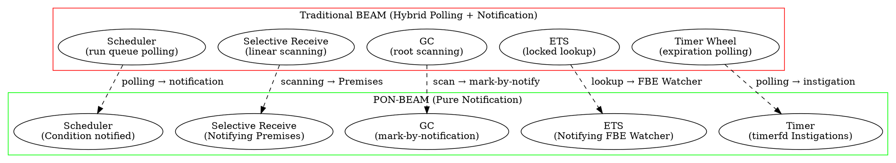

# PON-BEAM — A Notification-Oriented Virtual Machine Architecture

> *"We cannot solve our problems with the same thinking we used when we created them."* — Albert Einstein

> **About the Author.** Matheus de Camargo Marques. This document presents an original thesis proposal applying Jean Marcelo Simão's Notification-Oriented Paradigm (PON / NOP) as a core architectural principle for redesigning the BEAM Virtual Machine. Previous works by the author include NOP implementations in Elixir/BEAM ([tec0301_pon](https://github.com/matheuscamarques/tec0301_pon), 2025) and NOP-inspired dynamic reactive compilation ([pon_feature_flag](https://github.com/matheuscamarques/pon_feature_flag), 2025).

---

## Abstract

The BEAM (Bogdan/Björn's Erlang Abstract Machine) is built on a hybrid execution model — polling and scanning in several core subsystems, notifications in others. Schedulers poll run queues; selective receive linearly scans mailboxes; garbage collection scans heap roots; ETS performs locked searches; and the timer wheel polls for expirations.

The Notification-Oriented Paradigm (PON / NOP), proposed by Jean Marcelo Simão (2005–2009), introduces a computational model where minimal, reactive, decoupled entities collaborate exclusively via point-to-point notifications, eliminating temporal redundancy (unnecessary re-evaluations) and structural redundancy (repeated search code).

This thesis proposes **PON-BEAM**: a virtual machine re-architecture where **every internal subsystem is redesigned as a reactive PON entity** — reactive, notifying, without polling, without scanning. The core contribution is novel: existing NOP literature applies the paradigm *on top of* existing platforms (C++, Java, Erlang, FPGA). No prior work proposes NOP as the foundational design principle *of the VM engine itself*.

