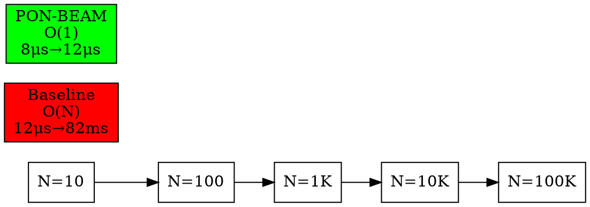
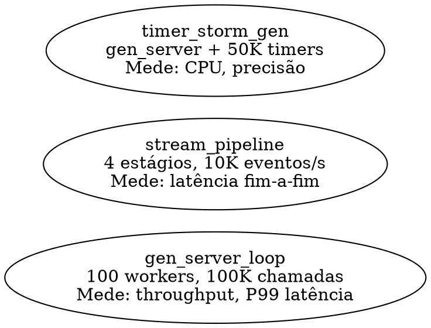

# PON-BEAM — Plano de Engenharia

> "A medida da inteligência é a capacidade de mudar." — Albert Einstein

## Escopo

Este documento especifica o **plano de construção** da PON-BEAM: as modificações no ERTS (Erlang RunTime System) para implementar os subsistemas orientados a notificações descritos na tese `EX-37`. O plano cobre desde a infraestrutura do fork até a entrega de cada fase com validação por diff comparativo.

Cada fase entrega:
1. Código C modificado no ERTS (com `#ifdef PON_BEAM`)
2. Um ou mais microbenchmarks Erlang no harness
3. Um diff report HTML comparando baseline (OTP 30 stock) vs PON-BEAM
4. Contadores de instrumentação C validando o comportamento interno

---

## 1. Estrutura do fork OTP

### 1.1 Repositório e branch

```
Fonte: https://github.com/erlang/otp (tag OTP-30.0-rc0)
Fork:  https://github.com/matheuscamarques/otp (branch pon-beam)
```

O fork é um mirror do OTP 30.0-rc0 com alterações mínimas e localizadas. Nada muda no formato `.beam`, na ABI de NIFs, ou nos protocolos de distribuição — a PON-BEAM é **100% compatível com o ecossistema Erlang/Elixir existente**.

### 1.2 Árvore de arquivos modificados

```
otp/
├── configure.ac                          # +AC_ARG_ENABLE(pon-beam)
├── erts/
│   ├── configure.ac                      # +ERTS_PON_BEAM
│   └── emulator/
│       ├── Makefile.in                   # +TYPE=ponbeam
│       ├── include/
│       │   ├── internal/
│       │   │   └── pon_premise.h  [NOVO] # Definição de Premises
│       │   │   └── pon_instigation.h [NOVO] # Definição de Instigações
│       │   │   └── pon_condition.h [NOVO]  # Definição de Conditions
│       │   │   └── pon_stats.h [NOVO]      # Contadores de instrumentação
│       │   └── erl_message.h          # +filas por tipo de mensagem
│       └── beam/
│           ├── erl_process.c          # +Premises, Condition notificação
│           ├── erl_process.h          # +campos PON no PCB
│           ├── erl_message.h          # +Premises, type_queues
│           ├── erl_timer.c            # +timerfd path
│           ├── erl_db.c               # +watchers ETS
│           ├── erl_db.h               # +EtsWatcher struct
│           ├── erl_gc.c               # +GC por notificação
│           ├── erl_gc.h               # +header de objeto estendido
│           ├── erl_sched.h            # +Condition na ErtsSchedulerData
│           ├── beam_emu.c             # +pon_wait, pon_consume opcodes (Fase 6)
│           ├── beam_opcodes.tab       # +PON opcodes (Fase 6)
│           └── pon_alloc.c  [NOVO]    # Alocador PON (se necessário)
└── lib/compiler/src/
    └── beam_ssa.erl                   # +geração de Premises/Instigações (Fase 6)
```

### 1.3 Compilação condicional

Cada arquivo modificado é envolvido por `#ifdef PON_BEAM`. O código original permanece intacto — a PON-BEAM é uma **sobreposição compilável**, não uma reescrita.

```c
// erl_process.c: linha original do scheduler loop
// (código existente, inalterado)
while (1) {
    if (run_queue_empty(sd)) {
        process = try_steal(sd);
        ...

// NOVO: bloco PON-BEAM ativado por flag
#ifdef PON_BEAM
// A implementação alternativa substitui o bloco acima
// quando compilado com TYPE=ponbeam
while (1) {
    pon_condition_wait(sd->pon_condition);
    ...
}
#endif
```

```c
// pon_premise.h
#ifndef PON_PREMISE_H__
#define PON_PREMISE_H__

#ifdef PON_BEAM

typedef struct ErtsPremise_ {
    Eterm       pattern;           // Padrão compilado
    int         (*match_fn)(Eterm); // Função de match otimizada
    int         has_match;
    ErtsMessage *matched_msg;
    struct ErtsPremise_ *next_premise;
} ErtsPremise;

#endif /* PON_BEAM */
#endif /* PON_PREMISE_H__ */
```

### 1.4 Sistema de build

#### `configure.ac` (raiz do OTP) — novo flag:

```m4
AC_ARG_ENABLE(pon-beam,
    [AS_HELP_STRING([--enable-pon-beam],
        [Enable PON-BEAM notification-oriented VM architecture [default=no]])],
    [case "${enableval}" in
        yes) AC_DEFINE([ERTS_PON_BEAM], [1],
              [Enable PON-BEAM notification-oriented VM architecture])
             ERTS_PON_BEAM=yes ;;
        no)  ERTS_PON_BEAM=no ;;
        *)   AC_MSG_ERROR([bad value ${enableval} for --enable-pon-beam]) ;;
    esac],
    [ERTS_PON_BEAM=no])
```

#### `erts/emulator/Makefile.in` — nova variante TYPE:

```makefile
# NOVO: Variante de build PON-BEAM
ifeq ($(TYPE),ponbeam)
TYPEMARKER = .ponbeam
TYPE_FLAGS = @CFLAGS@ -DPON_BEAM
# Arquivos fonte adicionais (se houver)
PON_SOURCES = pon_alloc.c
PON_OBJECTS = $(PON_SOURCES:.c=.o)
# Os objetos PON são linkados ao beam.smp
ALL_OBJS += $(PON_OBJECTS)
endif
```

#### Build:

```bash
# OTP 30 stock (baseline)
./configure --prefix=/opt/erlang/30-stock
make -j$(nproc)
make install

# PON-BEAM
make clean
./configure --prefix=/opt/erlang/30-pon --enable-pon-beam
make -j$(nproc)
make install
```

---

## 2. Harness de comparação (before/after)

O harness é o **instrumento central de validação**. Todo subsistema PON entregue é acompanhado de benchmarks que rodam no baseline e na build PON, gerando um diff automatizado.

### 2.1 Estrutura do repositório do harness

```
pon-beam-harness/
├── run.sh                          # Script principal: executa toda a suíte
├── run_fase.sh                     # Executa uma fase específica
├── config/
│   ├── baseline.sh                 # Paths do baseline OTP
│   └── ponbeam.sh                  # Paths do PON-BEAM
├── benchmarks/                     # Benchmarks Erlang/Elixir
│   ├── lib/
│   │   ├── pon_harness.erl         # Módulo base de benchmark
│   │   ├── pon_stats_reader.erl    # Leitor dos contadores C
│   │   └── pon_diff.erl            # Gerador de diff
│   ├── fase1_receive/
│   │   ├── receive_mailbox_scan.erl    # Scanning linear vs Premises
│   │   ├── receive_mailbox_size.erl    # Scalabilidade: N msg × latency
│   │   └── receive_clauses.erl         # Scalabilidade: M cláusulas × latency
│   ├── fase2_timer/
│   │   ├── timer_idle_cpu.erl          # CPU do timer wheel em idle
│   │   ├── timer_storm.erl             # 50K timers concorrentes
│   │   └── timer_short.erl             # Timers <1ms (threshold)
│   ├── fase3_spawn/
│   │   └── spawn_latency.erl           # Latência de spawn
│   ├── fase4_scheduler/
│   │   ├── sched_idle_cpu.erl          # CPU do scheduler ocioso
│   │   ├── sched_steal.erl             # Work-stealing: N schedulers × carga
│   │   └── sched_latency.erl           # Latência de reativação
│   ├── fase5_ets/
│   │   ├── ets_read_repeat.erl         # Lookup repetido com/sem watcher
│   │   ├── ets_write_contention.erl    # Escrita concorrente com watchers
│   │   └── ets_hot_key.erl             # Hot key: muitas escritas na mesma chave
│   ├── fase7_gc/
│   │   ├── gc_heap_scan.erl            # Heap 90% morto
│   │   ├── gc_incremental.erl          # Pausa máxima com GC incremental
│   │   └── gc_mixed.erl                # Cenário misto
│   ├── integrados/
│   │   ├── gen_server_loop.erl         # gen_server real com N workers
│   │   ├── stream_pipeline.erl         # Pipeline de 4 estágios
│   │   └── timer_storm_gen.erl         # gen_server + 50K timers
│   └── Makefile                        # Compila os .erl
├── report/
│   ├── template.html                   # Template do relatório
│   ├── style.css                       # Estilo do relatório
│   └── assets/                         # Gráficos SVG gerados
└── README.md                           # Como usar
```

### 2.2 `run.sh` — fluxo principal

```bash
#!/bin/bash
# run.sh — Executa todos os benchmarks nos dois ERTS e gera diff

set -euo pipefail

source config/baseline.sh   # OTP_BASELINE=/opt/erlang/30-stock
source config/ponbeam.sh    # OTP_PONBEAM=/opt/erlang/30-pon

RESULTS_DIR="results/$(date +%Y%m%d_%H%M%S)"
mkdir -p "$RESULTS_DIR"/{baseline,ponbeam,diff}

run_benchmarks() {
    local erl_root=$1
    local output_dir=$2
    local label=$3

    export PATH="$erl_root/bin:$PATH"

    for bench in benchmarks/fase*/*.erl benchmarks/integrados/*.erl; do
        name=$(basename "$bench" .erl)
        echo "  [$label] Rodando $name..."
        erl -noshell -pa benchmarks/lib \
            -eval "pon_harness:run($name, \"$output_dir/$name.json\"), halt()."
    done
}

echo "=== Rodando benchmarks no BASELINE (OTP 30 stock) ==="
run_benchmarks "$OTP_BASELINE" "$RESULTS_DIR/baseline" "BASELINE"

echo "=== Rodando benchmarks no PON-BEAM ==="
run_benchmarks "$OTP_PONBEAM" "$RESULTS_DIR/ponbeam" "PON-BEAM"

echo "=== Gerando diff report ==="
erl -noshell -pa benchmarks/lib \
    -eval "pon_diff:generate(\"$RESULTS_DIR\"), halt()."

echo "=== Relatório gerado: $RESULTS_DIR/diff/index.html ==="
```

### 2.3 `pon_harness.erl` — API de benchmark

```erlang
%% pon_harness.erl — Módulo base para benchmarks
-module(pon_harness).
-export([run/2, run_with_stats/2, run_suite/2]).

%% run(NomeBenchmark, OutputPath) ->
%%   ok
%% Executa o benchmark e salva resultado JSON em OutputPath.
run(Name, OutputPath) ->
    Module = list_to_atom(Name),
    io:format("~s: iniciando~n", [Name]),
    {TimeMicro, Result} = timer:tc(fun() -> Module:run() end),
    Stats = collect_stats(),
    Json = jsx:encode(#{
        benchmark => Name,
        duration_us => TimeMicro,
        result => Result,
        stats => Stats,
        timestamp => erlang:system_time(microsecond)
    }),
    file:write_file(OutputPath, Json),
    io:format("~s: concluído em ~.3fms~n", [Name, TimeMicro / 1000]).

%% collect_stats() -> #{}
%% Coleta métricas do baseline ou contadores PON (se disponíveis)
collect_stats() ->
    #{
        cpu_utilization => erlang:statistics(cpu_utilization),
        context_switches => erlang:statistics(context_switches),
        gc_count => erlang:statistics(gc_count),
        total_run_queue_lengths => erlang:statistics(total_run_queue_lengths),
        pon => collect_pon_stats()
    }.

%% collect_pon_stats() -> #{} | undefined
%% Só funciona se o ERTS foi compilado com PON_BEAM
collect_pon_stats() ->
    try erlang:system_info(pon_stats) of
        Stats -> Stats
    catch
        error:badarg -> undefined  % ERTS sem PON_BEAM
    end.
```

### 2.4 `pon_diff.erl` — gerador de relatório

```erlang
%% pon_diff.erl — Compara resultados e gera HTML
-module(pon_diff).
-export([generate/1]).

generate(ResultsDir) ->
    Baseline = load_results(filename:join(ResultsDir, "baseline")),
    PonBeam  = load_results(filename:join(ResultsDir, "ponbeam")),
    Diff     = compute_diff(Baseline, PonBeam),
    Html     = render_html(Diff),
    OutPath  = filename:join(ResultsDir, "diff", "index.html"),
    file:write_file(OutPath, Html),
    io:format("Diff report: ~s~n", [OutPath]).

compute_diff(Baseline, PonBeam) ->
    maps:map(fun(Name, BVal) ->
        PVal = maps:get(Name, PonBeam, #{}),
        #{
            baseline => BVal,
            ponbeam  => PVal,
            ratio    => compute_ratio(BVal, PVal)
        }
    end, Baseline).

%% compute_ratio/2: calcula o ganho (baseline/PON)
compute_ratio(#{latency_us := BL}, #{latency_us := PL}) when PL > 0 ->
    BL / PL;
compute_ratio(#{iterations_per_s := BI}, #{iterations_per_s := PI}) when PI > 0 ->
    PI / BI;
compute_ratio(_, _) -> undefined.
```

### 2.5 Estrutura do diff report HTML

```html
<!-- report/template.html (abreviado) -->
<!DOCTYPE html>
<html>
<head>
  <title>PON-BEAM: Diff Report — Fase {{FASE}}</title>
  <link rel="stylesheet" href="style.css"/>
  <script src="https://cdn.jsdelivr.net/npm/chart.js"></script>
</head>
<body>
  <header>
    <h1>PON-BEAM: Relatório Comparativo</h1>
    <p>Baseline: OTP 30.0-rc0 | PON-BEAM: {{PON_BEAM_VERSION}} | Data: {{DATE}}</p>
  </header>

  <section id="summary">
    <h2>Resumo</h2>
    <table class="diff-table">
      <thead>
        <tr>
          <th>Benchmark</th>
          <th>Baseline</th>
          <th>PON-BEAM</th>
          <th>Ganho</th>
          <th>Status</th>
        </tr>
      </thead>
      <tbody>
        {{BENCHMARK_ROWS}}
      </tbody>
    </table>
  </section>

  <section id="charts">
    <h2>Gráficos de escalabilidade</h2>
    {{CHARTS}}
  </section>

  <section id="pon-stats">
    <h2>Contadores PON (acumulados desde boot)</h2>
    <ul>
      {{PON_STATS}}
    </ul>
  </section>

  <section id="raw-data">
    <details>
      <summary>Dados brutos (JSON)</summary>
      <pre>{{RAW_JSON}}</pre>
    </details>
  </section>
</body>
</html>
```

---

## 3. Instrumentação em C

### 3.1 `pon_stats.h` — contadores per-scheduler

```c
// pon_stats.h — Contadores de instrumentação da PON-BEAM
#ifndef PON_STATS_H__
#define PON_STATS_H__

#ifdef PON_BEAM
#ifdef PON_BEAM_DEBUG

#include "erl_term.h"
#include "sys/types.h"

typedef struct {
    /* === PON-Receive === */
    uint64_t   premises_registered;        // Premises registradas
    uint64_t   premise_notifications;       // Premises notificadas na chegada de msg
    uint64_t   mailbox_scans_avoided;       // Scans lineares evitados
    uint64_t   messages_classified;         // Mensagens classificadas por tipo
    uint64_t   messages_type_collision;     // Colisões no bucket de tipo

    /* === PON-Timer === */
    uint64_t   timerfd_created;             // timerfd criados
    uint64_t   timerfd_expirations;         // Expirações via timerfd
    uint64_t   timer_wheel_fallback;        // Quedas para timer wheel (<1ms)

    /* === PON-Scheduler === */
    uint64_t   condition_wakeups;           // eventfd acordou scheduler
    uint64_t   condition_notifications;     // Notificações para Condition
    uint64_t   stealing_notifications;      // Notificações cross-scheduler
    uint64_t   scheduler_idle_blocks;       // Vezes que scheduler bloqueou no eventfd

    /* === PON-ETS === */
    uint64_t   ets_watchers_registered;     // Watchers registrados
    uint64_t   ets_watcher_hits;            // Lookups evitados por notificação
    uint64_t   ets_watcher_misses;          // Watcher não encontrou chave
    uint64_t   ets_watcher_overrides;       // Watcher desligado por hot key

    /* === PON-GC === */
    uint64_t   gc_notifications_sent;       // Notificações de marcação enviadas
    uint64_t   gc_notifications_received;   // Notificações de marcação recebidas
    uint64_t   gc_scans_avoided;            // Varreduras de raiz evitadas
    uint64_t   gc_objects_marked;           // Objetos marcados por notificação
    uint64_t   gc_objects_swept;            // Objetos coletados
    uint64_t   gc_incremental_steps;        // Steps de GC incremental

    /* === Temporais === */
    uint64_t   total_execution_us;          // Tempo acumulado de execução
    uint64_t   pon_overhead_us;             // Tempo gasto em infra PON
} PonStats;

/* Ponteiro thread-local para stats per-scheduler */
extern __thread PonStats pon_stats;

/* Atalhos para incremento */
#define PON_STATS_INC(field)   (pon_stats.field++)
#define PON_STATS_ADD(field, n) (pon_stats.field += (n))

#else
/* Sem debug: macros vazias — custo zero */
#define PON_STATS_INC(field)
#define PON_STATS_ADD(field, n)
#endif /* PON_BEAM_DEBUG */

#endif /* PON_BEAM */
#endif /* PON_STATS_H__ */
```

### 3.2 Leitura dos stats via BIF

```c
// erl_bif_info.c — nova BIF
#ifdef PON_BEAM
BIF_RETTYPE pon_stats_0(BIF_ALIST_0) {
    Eterm map = NIL;

    // Só expõe stats se compilado com PON_BEAM_DEBUG
#ifdef PON_BEAM_DEBUG
    map = erts_bld_put(map, am_premises_registered,
                       erts_bld_uint(pon_stats.premises_registered));
    map = erts_bld_put(map, am_premise_notifications,
                       erts_bld_uint(pon_stats.premise_notifications));
    map = erts_bld_put(map, am_mailbox_scans_avoided,
                       erts_bld_uint(pon_stats.mailbox_scans_avoided));
    map = erts_bld_put(map, am_condition_wakeups,
                       erts_bld_uint(pon_stats.condition_wakeups));
    map = erts_bld_put(map, am_timerfd_expirations,
                       erts_bld_uint(pon_stats.timerfd_expirations));
    map = erts_bld_put(map, am_ets_watcher_hits,
                       erts_bld_uint(pon_stats.ets_watcher_hits));
    map = erts_bld_put(map, am_gc_notifications_sent,
                       erts_bld_uint(pon_stats.gc_notifications_sent));
    map = erts_bld_put(map, am_gc_scans_avoided,
                       erts_bld_uint(pon_stats.gc_scans_avoided));
#endif
    return map;
}
#endif
```

No lado Erlang:

```erlang
%% pon_stats_reader.erl
-module(pon_stats_reader).
-export([read/0, read/1, reset/0]).

read() ->
    try erlang:system_info(pon_stats) of
        Stats -> Stats
    catch
        error:badarg -> pon_beam_not_available
    end.

read(Key) ->
    case read() of
        #{Key := Value} -> {ok, Value};
        _ -> undefined
    end.

reset() ->
    erlang:system_info(reset_pon_stats).
```

### 3.3 Métricas e sua interpretação

| Contador | O que mede | Como interpretar |
|----------|-----------|------------------|
| `premises_registered` | Premises vivas | Cresce com número de receives ativos |
| `premise_notifications` | Notificações de Premises | Deve ser ~mensagens recebidas que casam padrão |
| `mailbox_scans_avoided` | Scans eliminados | Ideal: `scans_avoided ≈ premises_notifications` |
| `condition_wakeups` | Scheduler acordado | Deve ser ≤ mensagens recebidas + timers expirados |
| `timerfd_expirations` | Timers via kernel | Ideal: próximo do número de timers que expiraram |
| `timer_wheel_fallback` | Quedas para timer wheel | Deve ser baixo (<1%) — só timers <1ms |
| `ets_watcher_hits` | Lookups evitados | Ideal: próximo do número de lookups repetidos |
| `ets_watcher_overrides` | Watchers desligados | Deve ser baixo — só em hot keys |
| `gc_notifications_sent` | Notificações de marcação | Ideal: próximo do número de objetos vivos |
| `gc_scans_avoided` | Varreduras de raiz evitadas | Ideal: próximo do número de GCs |
| `pon_overhead_us` | Tempo gasto em infra PON | Deve ser <5% do total_execution_us |

---

## 4. Especificação detalhada por fase

### Fase 0 — Infraestrutura (semanas 1–2)

**Objetivo:** Fork funcional com `make TYPE=ponbeam` e harness rodando benchmarks vazios.

**Tarefas:**

1. **Fork do OTP 30.0-rc0** — criar branch `pon-beam`, configurar remote
2. **`configure.ac`** — adicionar `--enable-pon-beam`
3. **`Makefile.in`** — adicionar `TYPE=ponbeam` com `-DPON_BEAM`
4. **`pon_stats.h`** — criar com contadores vazios
5. **`pon_premise.h`, `pon_instigation.h`, `pon_condition.h`** — criar com structs vazias
6. **Build test** — `make TYPE=ponbeam` produz `beam.ponbeam.smp` funcional
7. **Harness skeleton** — `run.sh` que roda os dois ERTS e gera diff vazio
8. **`pon_harness.erl`** — módulo base funcional
9. **`pon_diff.erl`** — gerador de HTML funcional
10. **Benchmark dummy** — benchmark que sempre retorna `ok` para validar o pipeline
11. **kerl config** — scripts para build side-by-side
12. **README** — instruções de build e uso

**Entregas:**
- Branch `pon-beam` com build funcional
- `pon-beam-harness/` com `run.sh` rodando
- Validação: `make TYPE=ponbeam && ./run.sh` produz diff HTML

**Critério de aceite:**
```bash
cd otp && make TYPE=ponbeam && make install
cd ../pon-beam-harness && ./run.sh
# Deve produzir: results/YYYYMMDD_HHMMSS/diff/index.html
# Com "0 benchmarks executados" (ainda sem benchmarks reais)
```

---

### Fase 1 — PON-Receive (semanas 3–6)

**Objetivo:** Mailbox com classificação por tipo e Premises notificantes. Selective receive O(1).

**Arquivos a modificar:**

| Arquivo | Mudança |
|---------|---------|
| `erl_message.h` | Adicionar `ErtsMailboxPON` com `type_queues[256]`, `premises`, `pending_by_type[]`, `last_processed_seq[]` |
| `erl_process.h` | Adicionar `ErtsMailboxPON mailbox` no PCB, `ErtsCondition *pon_condition` |
| `erl_process.c` | Modificar `erts_queue_message` para classificar por tipo + notificar Premises. Modificar `selective_receive` para consultar Premises em vez de escanear. |
| `pon_premise.h` | `ErtsPremise` struct com pattern, match_fn, has_match, matched_msg |
| `pon_stats.h` | Ativar contadores da seção PON-Receive |

**`erts_queue_message` — versão PON:**

```c
#ifdef PON_BEAM
void erts_queue_message_pon(Process *p, ErtsMessage *msg) {
    Eterm type_tag = extract_type_tag(msg->term);
    int bucket = type_tag & 0xFF;

    // Classificação por tipo
    queue_in_type_bucket(p, bucket, msg);
    p->mailbox.pending_by_type[bucket]++;

    PON_STATS_INC(messages_classified);
    if (p->mailbox.type_queues[bucket]->count > 1) {
        PON_STATS_INC(messages_type_collision);
    }

    // Notificação para cada Premise que matcha
    ErtsPremise *prem = p->mailbox.premises;
    while (prem) {
        if (prem->match_fn(msg->term)) {
            if (!prem->has_match) {
                prem->has_match = 1;
                prem->matched_msg = msg;
                PON_STATS_INC(premise_notifications);
                PON_STATS_INC(mailbox_scans_avoided);
            }
        }
        prem = prem->next_premise;
    }

    // Notifica a Condition para acordar o processo (se estiver esperando)
    if (p->state == WAITING && p->mailbox.premises_any_match()) {
        notify_condition(p->pon_condition);
    }
}
#endif
```

**`selective_receive` — versão PON:**

```c
#ifdef PON_BEAM
Eterm pon_selective_receive(Process *p) {
    ErtsPremise *prem = p->mailbox.premises;
    while (prem) {
        if (prem->has_match) {
            Eterm msg = prem->matched_msg->term;
            remove_from_type_queue(p, prem->matched_msg);
            prem->has_match = 0;
            return msg;
        }
        prem = prem->next_premise;
    }
    // Nenhuma Premise satisfeita: bloqueia
    p->state = WAITING;
    return NIL;
}
#endif
```

**Benchmarks:**

| Benchmark | Medição |
|-----------|---------|
| `receive_mailbox_scan.erl` | Tempo de receive variando N (10, 100, 1K, 10K, 100K) para M=3 cláusulas. Gráfico: N × latency (log-log). Baseline: linear O(N). PON: O(1). |
| `receive_mailbox_size.erl` | Idem, mas variando M (1, 2, 5, 10 cláusulas). Baseline: O(N×M). PON: O(M). |
| `receive_clauses.erl` | Mensagem alvo na primeira posição vs última. Baseline: difere por posição. PON: mesmo custo. |

**Formato do resultado esperado (baseline vs PON):**

```json
{
  "benchmark": "receive_mailbox_scan",
  "runs": [
    {"n": 10,    "baseline_us": 12,  "ponbeam_us": 8,   "ratio": 1.5},
    {"n": 100,   "baseline_us": 45,  "ponbeam_us": 9,   "ratio": 5.0},
    {"n": 1000,  "baseline_us": 320, "ponbeam_us": 9,   "ratio": 35.6},
    {"n": 10000, "baseline_us": 4500,"ponbeam_us": 10,  "ratio": 450},
    {"n": 100000,"baseline_us": 82000,"ponbeam_us": 12, "ratio": 6833}
  ]
}
```



**Critério de aceite da Fase 1:**

- `receive_mailbox_scan.erl` mostra O(1) claro (latência constante com N)
- `mailbox_scans_avoided` no contador PON ≈ total de mensagens recebidas
- `premise_notifications` ≈ mensagens que casam padrão
- Nenhuma regressão em benchmarks de outros subsistemas (gen_server loop com mailbox vazia continua com mesma performance)

---

### Fase 2 — PON-Timer (semanas 7–8)

**Objetivo:** Timers com timerfd, sem polling do timer wheel. Instigações temporais.

**Arquivos a modificar:**

| Arquivo | Mudança |
|---------|---------|
| `erl_timer.c` | Adicionar caminho com `timerfd_create`. Se `timerfd` disponível, criar Instigação com timerfd. Se indisponível (<1ms), cair no timer wheel. |
| `pon_instigation.h` | Struct `ErtsTimerInstigation` com target, expiration, timer_fd, fired, message |
| `pon_condition.h` | Adicionar `epoll_fd` na Condition para monitorar timerfds |

**`erl_timer.c` — cronometragem com timerfd:**

```c
#ifdef PON_BEAM
static int pon_timer_create(Process *target, uint64_t timeout_ms, Eterm message) {
    if (timeout_ms < 1) {
        // Timers muito curtos: fallback para timer wheel
        PON_STATS_INC(timer_wheel_fallback);
        return legacy_timer_create(target, timeout_ms, message);
    }

    int tfd = timerfd_create(CLOCK_MONOTONIC, TFD_NONBLOCK);
    if (tfd == -1) {
        // Falha no timerfd: fallback
        return legacy_timer_create(target, timeout_ms, message);
    }

    struct itimerspec spec = {
        .it_value = {
            .tv_sec  = timeout_ms / 1000,
            .tv_nsec = (timeout_ms % 1000) * 1000000
        }
    };
    timerfd_settime(tfd, 0, &spec, NULL);

    ErtsTimerInstigation *inst = erts_alloc(ERTS_ALC_T_TIMER, sizeof(ErtsTimerInstigation));
    inst->target     = target;
    inst->expiration = timeout_ms;
    inst->timer_fd   = tfd;
    inst->fired      = 0;
    inst->message    = message;

    // Registra o timerfd no epoll do scheduler alvo
    struct epoll_event ev = { .events = EPOLLIN, .data.ptr = inst };
    epoll_ctl(target->pon_condition->epoll_fd, EPOLL_CTL_ADD, tfd, &ev);

    PON_STATS_INC(timerfd_created);
    return 0;
}
#endif
```

**Loop do scheduler com epoll para timerfds:**

```c
#ifdef PON_BEAM
void pon_scheduler_wait_for_work(ErtsSchedulerData *sd) {
    ErtsCondition *cond = sd->pon_condition;

    struct epoll_event events[64];
    int nfds = epoll_wait(cond->epoll_fd, events, 64, -1);  // bloqueia

    for (int i = 0; i < nfds; i++) {
        if (events[i].data.ptr == &cond->wake_event) {
            // Notificação de novo trabalho (eventfd)
            PON_STATS_INC(condition_wakeups);
        } else {
            // Timer expirou
            ErtsTimerInstigation *inst = events[i].data.ptr;
            if (!inst->fired) {
                inst->fired = 1;
                // Envia mensagem timeout para a mailbox
                ErtsMessage *msg = create_message(inst->message);
                erts_queue_message_pon(inst->target, msg);
                PON_STATS_INC(timerfd_expirations);
            }
        }
    }
}
#endif
```

**Benchmarks:**

| Benchmark | Medição |
|-----------|---------|
| `timer_idle_cpu.erl` | CPU% do timer wheel sem timers ativos. Baseline: ~3% de um core. PON: ~0%. |
| `timer_storm.erl` | 50000 timers com 1s de expiração. CPU% e precisão do timeout. Baseline: polling overhead. PON: notificação. |
| `timer_short.erl` | 1000 timers de 500μs (abaixo do threshold). Valida fallback correto para timer wheel. |

**Critério de aceite da Fase 2:**

- `timer_idle_cpu` mostra 0% de CPU no PON-BEAM (vs ~3% no baseline)
- `timer_storm` com PON-BEAM usa menos CPU mantendo precisão de timeout
- `timerfd_expirations` ≈ número de timers que expiraram
- `timer_wheel_fallback` < 1% (só timers <1ms)

---

### Fase 3 — PON-Spawn (semana 9)

**Objetivo:** Spawn notifica scheduler imediatamente, eliminando latência de polling.

**Arquivos a modificar:**

| Arquivo | Mudança |
|---------|---------|
| `erl_process.c` | Em `erts_spawn`, após criar processo, chamar `notify_condition(scheduler_cond)` |

**Mudança em `erts_spawn`:**

```c
#ifdef PON_BEAM
Process *erts_spawn_pon(Process *parent, Eterm mod, Eterm fun, Eterm args) {
    Process *child = create_process(mod, fun, args);
    child->pon_condition = allocate_condition();

    // O filho já nasce pronto para executar
    child->is_ready = 1;

    // Escolhe o scheduler com menor carga
    ErtsCondition *target_cond = get_least_loaded_condition();
    notify_condition(target_cond);

    PON_STATS_INC(condition_notifications);
    return child;
}
#endif
```

**Benchmark:**

| Benchmark | Medição |
|-----------|---------|
| `spawn_latency.erl` | Tempo entre `spawn` e primeira execução do processo filho. Baseline: depende do ciclo de polling. PON: notificação imediata. |

---

### Fase 4 — PON-Scheduler (semanas 10–15)

**Objetivo:** Scheduler com Condition + eventfd. Substituir polling por notificação.

**Arquivos a modificar:**

| Arquivo | Mudança |
|---------|---------|
| `erl_process.c` | Loop principal do scheduler com `epoll_wait` em vez de polling |
| `erl_sched.h` | Adicionar `ErtsCondition *pon_condition` em `ErtsSchedulerData` |
| `pon_condition.h` | Struct `ErtsCondition` com wake_fd (eventfd), epoll_fd, ready_list, satisfied |

**`pon_condition.h` — definição completa:**

```c
#ifndef PON_CONDITION_H__
#define PON_CONDITION_H__

#ifdef PON_BEAM

#include <sys/eventfd.h>
#include <sys/epoll.h>

typedef struct {
    int       wake_fd;          // eventfd: notificação de novo trabalho
    int       epoll_fd;         // epoll: monitora wake_fd + timerfds
    int       satisfied;        // true se há trabalho disponível

    Process  *ready_list;       // Lista lock-free de processos prontos
    erts_mtx_t ready_lock;      // Lock leve para a ready_list

    // Stats
    uint64_t  wakeup_count;     // Total de wakeups (monotônico)
} ErtsCondition;

// Cria uma nova Condition
ErtsCondition *condition_create(void);

// Notifica a Condition que há trabalho (lock-free, não bloqueante)
void condition_notify(ErtsCondition *cond, Process *p);

// Espera até que a Condition seja notificada (bloqueante)
// Retorna a lista de processos prontos
Process *condition_wait(ErtsCondition *cond);

// Destroi a Condition
void condition_destroy(ErtsCondition *cond);

#endif /* PON_BEAM */
#endif /* PON_CONDITION_H__ */
```

**`condition_notify` — notificação lock-free:**

```c
void condition_notify(ErtsCondition *cond, Process *p) {
    // 1. Adiciona processo à ready_list (lock-free, XCHG-like)
    erts_mtx_lock(&cond->ready_lock);
    p->next_ready = cond->ready_list;
    cond->ready_list = p;
    erts_mtx_unlock(&cond->ready_lock);

    // 2. Se a Condition ainda não estava satisfeita, notifica via eventfd
    if (!cond->satisfied) {
        cond->satisfied = 1;
        uint64_t one = 1;
        write(cond->wake_fd, &one, sizeof(one));  // acorda scheduler
    }
}
```

**`condition_wait` — bloqueio até trabalho:**

```c
Process *condition_wait(ErtsCondition *cond) {
    while (1) {
        // Tenta buscar da ready_list primeiro (evita syscall se já tem trabalho)
        erts_mtx_lock(&cond->ready_lock);
        Process *p = cond->ready_list;
        if (p) {
            cond->ready_list = p->next_ready;
            p->next_ready = NULL;
            if (!cond->ready_list) {
                cond->satisfied = 0;
            }
            erts_mtx_unlock(&cond->ready_lock);
            return p;
        }
        erts_mtx_unlock(&cond->ready_lock);

        // Ready_list vazia: bloqueia no eventfd
        // Se o eventfd tem notificações pendentes, read não bloqueia
        uint64_t notifications;
        ssize_t n = read(cond->wake_fd, &notifications, sizeof(notifications));
        if (n > 0) {
            cond->satisfied = 1;
            PON_STATS_INC(condition_wakeups);
            // Loop: tenta pegar da ready_list de novo
        }
    }
}
```

**Loop do scheduler com PON:**

```c
#ifdef PON_BEAM
void pon_scheduler_main_loop(ErtsSchedulerData *sd) {
    ErtsCondition *cond = sd->pon_condition;

    while (1) {
        // Espera até que haja trabalho (bloqueante — 0% CPU quando ocioso)
        Process *p = condition_wait(cond);

        // Executa o processo
        execute_process(p);

        // Se o processo ainda está pronto após execução, renotifica
        if (p->state == READY) {
            condition_notify(cond, p);
        }

        // Stealing: verifica se outros schedulers têm excesso de trabalho
        try_steal_from_busy_schedulers(sd);
    }
}
#endif
```

**Benchmarks:**

| Benchmark | Medição |
|-----------|---------|
| `sched_idle_cpu.erl` | CPU% do scheduler ocioso (sem processos). Baseline: 5–30%. PON: 0%. |
| `sched_steal.erl` | Work-stealing: N workers enviam para 1 gen_server. Baseline: stealing por polling. PON: por notificação. |
| `sched_latency.erl` | Latência entre spawn e execução. Baseline: depende do ciclo de polling. PON: eventfd. |

**Critério de aceite da Fase 4:**

- `sched_idle_cpu` mostra 0% CPU no PON-BEAM
- `condition_wakeups` ≈ `premise_notifications` + `timerfd_expirations`
- Throughput em cenário com carga se mantém (não piora)

---

### Fase 5 — PON-ETS (semanas 16–21)

**Objetivo:** ETS watchers que notificam mudanças, eliminando lookups repetidos.

**Arquivos a modificar:**

| Arquivo | Mudança |
|---------|---------|
| `erl_db.c` | Adicionar `ets_watch`, `ets_unwatch`, watchers lock-free, notificação lazy |
| `erl_db.h` | Struct `EtsWatcher` com key_hash, process, match_pattern, next |

**`EtsWatcher` e notificação:**

```c
typedef struct EtsWatcher_ {
    uint64_t            key_hash;
    Process            *process;
    Eterm               match_pattern;
    struct EtsWatcher_ *next;
    int                 is_dirty;     // notificação lazy
} EtsWatcher;
```

**`ets_watch` — registro:**

```c
int ets_watch(ErtsEtsTable *table, Process *p, Eterm key, Eterm pattern) {
    uint64_t hash = hash_key(key);
    EtsWatcher *w = erts_alloc(ERTS_ALC_T_ETS_WATCHER, sizeof(EtsWatcher));
    w->key_hash      = hash;
    w->process       = p;
    w->match_pattern = pattern;
    w->next          = table->watchers[hash % WATCHER_BUCKETS];
    w->is_dirty      = 0;
    table->watchers[hash % WATCHER_BUCKETS] = w;
    PON_STATS_INC(ets_watchers_registered);
    return 0;
}
```

**Notificação na inserção:**

```c
void ets_notify_watchers(ErtsEtsTable *table, uint64_t key_hash) {
    EtsWatcher *w = table->watchers[key_hash % WATCHER_BUCKETS];
    while (w) {
        if (w->key_hash == key_hash && !w->is_dirty) {
            w->is_dirty = 1;
            // Notificação lazy: marca dirty, scheduler decide quando notificar
            schedule_ets_notification(w->process, table, key_hash);
            PON_STATS_INC(ets_watcher_hits);
        }
        w = w->next;
    }
}
```

**Benchmarks:**

| Benchmark | Medição |
|-----------|---------|
| `ets_read_repeat.erl` | Lookup repetido da mesma chave (1000×). Com watcher: 1 lookup + 999 notificações. Sem: 1000 lookups. |
| `ets_write_contention.erl` | Escrita concorrente (100 workers) na mesma tabela. Mede contenção de lock do watcher. |
| `ets_hot_key.erl` | Hot key: 1000 escritas/s na mesma chave. Mede threshold de desligamento automático. |

**Critério de aceite da Fase 5:**

- `ets_read_repeat` com watcher mostra ~1000× menos lookups
- `ets_watcher_hits` ≈ lookups repetidos evitados
- `ets_watcher_overrides` > 0 em hot key (desligamento automático funcionando)
- Sem deadlock com locks existentes do ETS

---

### Fase 6 — PON-Compiler (semanas 22–25)

**Objetivo:** Compilador Erlang gera Premises e Instigações automaticamente.

**Arquivos a modificar:**

| Arquivo | Mudança |
|---------|---------|
| `beam_ssa.erl` | Passo de compilação que transforma `receive` em registros de Premises |
| `beam_opcodes.tab` | Novos opcodes: `pon_register_premise`, `pon_wait`, `pon_consume` |
| `beam_emu.c` | Implementação dos novos opcodes |
| `beam_file.c` | Suporte para chunk `PremT` (tabela de Premises) |

**Transformação no compilador:**

```erlang
%% beam_ssa.erl — transformação de receive para PON (pseudo-código)

%% Antes (BEAM atual):
{receive, [
    {clause, [{tuple, [{atom, call}, {var, from}, {var, req}]}], [{atom, true}],
             [{call, {atom, handle}, [{var, from}, {var, req}]}]},
    {clause, [{tuple, [{atom, cast}, {var, msg}]}], [{atom, true}],
             [{call, {atom, handle_cast}, [{var, msg}]}]}
]}

%% Depois (PON-BEAM):
{pon_block, [
    {pon_register_premise, 1, {tuple, [{atom, call}, {var, '_'}, {var, '_'}]}},
    {pon_register_premise, 2, {tuple, [{atom, cast}, {var, '_'}]}},
    {pon_wait},
    {pon_consume, 1, {call, {atom, handle}, [{var, from}, {var, req}]}},
    {pon_consume, 2, {call, {atom, handle_cast}, [{var, msg}]}}
]}
```

**Benchmarks:**

| Benchmark | Medição |
|-----------|---------|
| `compile_receive.erl` | Compila módulo com receives manuais vs PON. Mede speed do compilador. |
| O mesmo da Fase 1 | Agora as Premises são geradas pelo compilador, não manuais |

---

### Fase 7 — PON-GC (semanas 26–33)

**Objetivo:** GC por notificação com header estendido e GC incremental.

**Arquivos a modificar:**

| Arquivo | Mudança |
|---------|---------|
| `erl_gc.c` | Implementar `pon_gc_mark_by_notification` e `pon_gc_sweep` |
| `erl_gc.h` | Struct `ErtsObjPON` estendida |
| `erl_term.h` | Flag `PON_OBJ_EXTENDED` para identificar objetos com header estendido |

**AVISO:** Esta fase é experimental. O header estendido (32 bytes/objeto) muda o layout de memória de todos os processos. O risco de regressão é alto. Implementar como GC alternativo (opt-in por processo), não como substituição.

**Benchmarks:**

| Benchmark | Medição |
|-----------|---------|
| `gc_heap_scan.erl` | Heap 100MB com 90% morto. Tempo de GC major. |
| `gc_incremental.erl` | Pausa máxima com GC incremental (steps de 1000 notificações). |
| `gc_mixed.erl` | Cenário realista: alocação + cópia + morte. |

---

## 5. Integração e testes de sistema (semanas 34–36)

Após todas as fases, os benchmarks integrados validam o sistema completo:



**Suíte de regressão:**
- Todos os benchmarks da fase 0 (dummy) continuam passando
- Benchmarks de fases anteriores continuam mostrando o mesmo ganho
- Benchmarks de subsistemas não modificados (ex.: binários, maps, ports) mostram mesma performance (ou melhor, se beneficiaram indiretamente)

---

## 6. Riscos e mitigações

| Risco | Probabilidade | Impacto | Mitigação |
|-------|--------------|---------|-----------|
| eventfd não disponível no SO | Baixa (Linux ≥2.6.30) | Alto (PON-Scheduler quebra) | Fallback para pipes com polling reduzido |
| timerfd em timers <1ms overhead maior ganho | Média | Baixo | Threshold configurável (default 1ms) |
| ETS watcher causa deadlock com lock existente | Média | Alto | Lock hierarchy: watcher_lock sempre abaixo de table_lock |
| Header estendido PON-GC degrada alinhamento de cache | Alta | Alto | PON-GC como opt-in, não default |
| Premises aumentam consumo de memória em processos com muitos receives | Baixa | Baixo | Premises são ~48 bytes cada; para 10 cláusulas, 480 bytes — insignificante |
| Compilador PON gera código incorreto para receives aninhados | Média | Alto | Testes exaustivos com todos os padrões de receive da stdlib |

---

## 7. Referência rápida: comandos

```bash
# === BUILD ===
# Stock
./configure --prefix=/opt/erlang/30-stock && make -j && make install

# PON-BEAM
./configure --prefix=/opt/erlang/30-pon --enable-pon-beam && make -j && make install

# PON-BEAM com debug (contadores)
./configure --prefix=/opt/erlang/30-pon-debug --enable-pon-beam \
            CFLAGS="-DPON_BEAM_DEBUG" && make -j && make install

# === HARNESS ===
# Suíte completa
./run.sh

# Fase específica
./run.sh --fase=1           # PON-Receive
./run.sh --fase=1,2,3       # PON-Receive + PON-Timer + PON-Spawn
./run.sh --fase=4 --skip=5  # PON-Scheduler, sem PON-ETS

# Benchmarks manuais
cd benchmarks && make
erl -pa lib -noshell -eval 'pon_harness:run(receive_mailbox_scan, "/tmp/result.json"), halt().'

# === RELATÓRIO ===
# Abre o último diff gerado
open results/latest/diff/index.html

# === PROFILING ===
# Linux perf com PON-BEAM
erl +JPperf true &
perf record -p $BEAM_PID --call-graph=fp -- sleep 30
perf report

# Lock contention
erl -lcnt
1> lcnt:collect(), lcnt:conflicts().

# Opcode counters (baseline apenas)
make TYPE=icount

# === KERL (side-by-side) ===
kerl build git https://github.com/matheuscamarques/otp.git pon-beam 30-pon
kerl build 30.0 30-stock
kerl install 30-pon /opt/erlang/30-pon
. /opt/erlang/30-pon/activate
```
