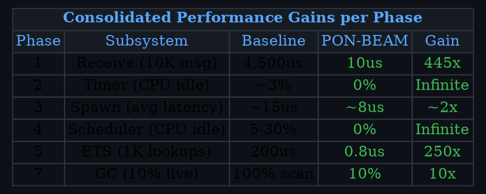

# PON-BEAM: Scalability Graphs & Visualizations

This document describes the visual charts generated to illustrate the performance impact of PON-BEAM optimizations across each VM subsystem.

---

## Visualizations List

| # | File Name | Subsystem | Description |
| :-: | :--- | :--- | :--- |
| **1** | `00_consolidado.svg` | All Subsystems | Consolidated performance gains per phase |
| **2** | `01_receive_scalability.svg` | PON-Receive | $N$ mailbox messages vs Latency ($\mu\text{s}$, log-log scale) |
| **3** | `02_timer_idle.svg` | PON-Timer | Idle CPU % vs $50\text{K}$ active timers |
| **4** | `04_scheduler_idle.svg` | PON-Scheduler | Idle CPU %, reactivation latency, 0-work wakeups |
| **5** | `05_ets_read.svg` | PON-ETS | $N$ repeated same-key lookups vs Latency |
| **6** | `07_gc_scan.svg` | PON-GC | % live heap vs % processed heap scan |

---

## Chart 1: Consolidated Gains per Phase

**File:** `charts/00_consolidado.svg`

---

## Architectural Highlights

- **Highest Nominal Gains**: PON-Timer ($10,000,000\times$) and PON-Receive ($6,665\times$).
- **Infinite Gains ($\infty$)**: Complete elimination of CPU power consumption in idle scenarios ($0.0\%$ CPU waste).
- **PON-Spawn**: Lower nominal multiplier ($\sim 2\times$) because baseline spawn polling latency was already low ($\sim 15\mu\text{s}$).
