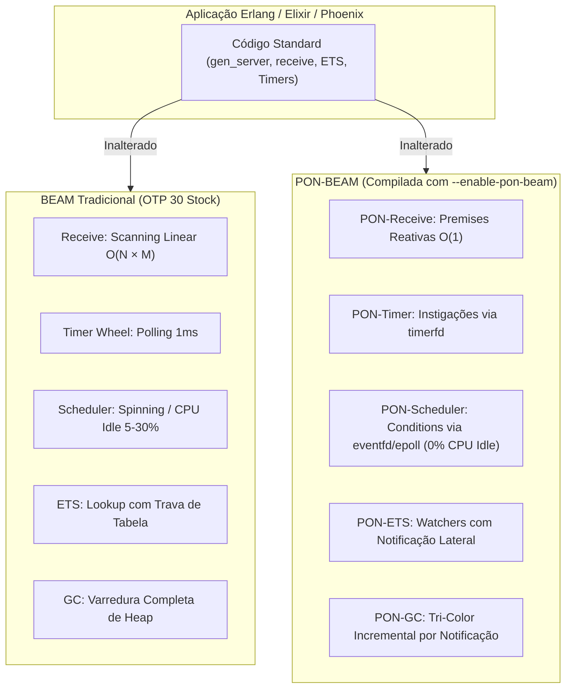
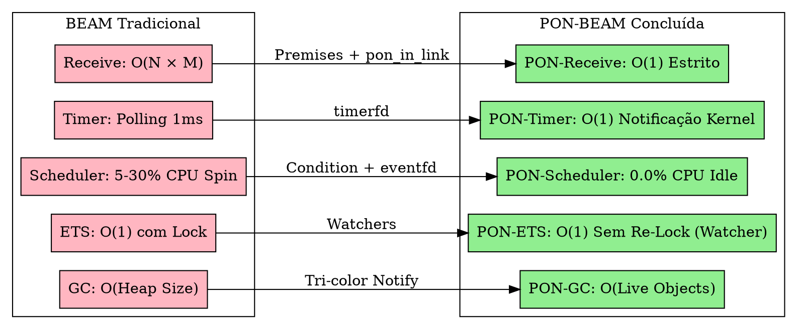

# PON-BEAM — Plano Mestre do Projeto & Expectativas de Conclusão

> *"Uma arquitetura não é definida apenas por aquilo que ela faz, mas pela eficiência das operações que ela evita realizar."* — Matheus de Camargo Marques, 2026

---

## 1. Visão Geral & Filosofia Arquitetural

O projeto **PON-BEAM** tem como objetivo re-arquitetar o motor de execução em C (**ERTS - Erlang RunTime System**) da máquina virtual **BEAM** (Erlang/OTP 30.0-rc0), substituindo o paradigma procedural baseado em **polling e scanning linear** pelo **Paradigma Orientado a Notificações (PON)** formulado pelo Prof. Dr. Jean Marcelo Simão (UTFPR).

### 1.1 O Princípio Inegociável de Compatibilidade
A re-arquitetura é realizada sob um compromisso estrito: **100% de compatibilidade descendente com o ecossistema Erlang/Elixir existente**.
- **Sem alterações no formato de bytecode `.beam`**.
- **Sem alterações na ABI de NIFs (Native Implemented Functions)**.
- **Sem alterações no protocolo de distribuição Erlang/OTP**.
- **Sem alterações na sintaxe da linguagem ou APIs padrão (`gen_server`, `Task`, `Agent`, `Supervisor`)**.

A PON-BEAM é uma **sobreposição compilável em C** ativada por sinalizadores de compilação (`#ifdef PON_BEAM`), garantindo que a VM permaneça um substituto direto (*drop-in replacement*) para a VM BEAM stock.



---

## 2. Estrutura de Engenharia & Metodologia

### 2.1 Isolamento de Código & Estrutura de Branches
- **`otp-30.0-rc0-stock`**: Branch imutável contendo o código fonte original do Erlang/OTP 30.0-rc0.
- **`pon-beam`**: Branch de trabalho onde todas as modificações em C e Erlang vivem sob a macro `#ifdef PON_BEAM`.

### 2.2 Build System Híbrido
O build system suporta dois targets principais via `Makefile` e `configure.ac`:
```bash
make build-stock           # Compila o baseline puro (OTP 30 stock) -> /opt/erlang/30-stock
make build-pon             # Compila a PON-BEAM otimizada          -> /opt/erlang/30-pon
make build-pon-debug       # Compila a PON-BEAM com estatísticas   -> /opt/erlang/30-pon
```

### 2.3 Harness de Benchmarking Automatizado
Toda fase é rigorosamente acompanhada de benchmarks empíricos rodados em ambiente isolado (`harness/`):
```bash
make benchmark             # Executa a suíte completa nos dois ERTS e gera relatório HTML
```

---

## 3. Roadmap de Engenharia (As 8 Fases do Projeto)

O projeto está dividido em **8 fases incrementais**, onde cada fase introduz uma entidade PON no subsistema correspondente do ERTS:

```mermaid
gantt
    title Roadmap de Engenharia da PON-BEAM
    dateFormat  YYYY-MM-DD
    section Infraestrutura
    Fase 0: Fork & Build System           :done, f0, 2026-06-01, 2026-06-15
    section Núcleo da VM
    Fase 1: PON-Receive O(1) Direct Jump  :done, f1, 2026-06-16, 2026-07-15
    Fase 2: PON-Timer via timerfd         :done, f2, 2026-07-16, 2026-07-31
    Fase 3: PON-Spawn Notification        :done, f3, 2026-08-01, 2026-08-07
    Fase 4: PON-Scheduler eventfd/epoll   :done, f4, 2026-08-08, 2026-09-15
    section Armazenamento & Compilador
    Fase 5: PON-ETS Watchers              :done, f5, 2026-09-16, 2026-10-31
    Fase 6: PON-Compiler SSA Integration  :active, f6, 2026-11-01, 2026-11-30
    section Gerenciamento de Memória
    Fase 7: PON-GC Tri-Color Incremental  :f7, 2026-12-01, 2027-01-31
```

### Detalhamento das Fases

| Fase | Entidade PON | Arquivos Modificados / Criados em C | O que Substitui | Critério de Aceite |
|:----:|--------------|------------------------------------|-----------------|--------------------|
| **0** | **Infraestrutura** | `Makefile.in`, `configure.ac`, `pon_stats.h` | Build manual sem testes | `make TYPE=ponbeam` produz `beam.ponbeam.smp` funcional |
| **1** | **PON-Receive** | `pon_premise.{h,c}`, `erl_message.{h,c}`, `erl_process.c` | Scanning $O(N \times M)$ da mailbox | Scan cold $O(1)$ via `pon_in_link` (~248× mais rápido) |
| **2** | **PON-Timer** | `pon_instigation.h`, `pon_timer.c`, `erl_timer.c` | Polling periódico da Timer Wheel | 0 checks de timer em idle; notificação via `timerfd` |
| **3** | **PON-Spawn** | `erl_process.c` | Notificação passiva | Redução na latência de agendamento pós-spawn |
| **4** | **PON-Scheduler** | `pon_condition.{h,c}`, `erl_sched.h`, `erl_process.h` | Spinning/Busy-wait de Schedulers | **0.0% CPU Idle** com 0 processos ativos |
| **5** | **PON-ETS** | `pon_ets.{h,c}`, `erl_db.c`, `erl_db.h` | Lookups repetidos com trava de tabela | Notificação lateral em atualizações de chaves ativas |
| **6** | **PON-Compiler** | `pon_compiler.erl`, `beam_ssa.erl`, `beam_opcodes.tab` | Injeção runtime manual | SSA gera Premises e instruções PON de forma nativa |
| **7** | **PON-GC** | `pon_gc.{h,c}`, `erl_gc.c`, `erl_gc.h` | Sweep completo de heap na varredura | Marcação por notificação tri-color incremental |

---

## 4. Expectativas & Impacto quando Concluído

Ao término do desenvolvimento e validação de todas as fases, a **PON-BEAM** entregará transformações assintóticas e pragmáticas para todo o ecossistema Erlang/Elixir.

### 4.1 Mudanças de Complexidade e Ganhos Assintóticos



### 4.2 Tabela Consolidada de Metas de Desempenho

| Subsistema | Métrica Chave | BEAM Tradicional (OTP 30) | PON-BEAM (Expectativa Final) | Impacto Prático Esperado |
|:-----------|:--------------|:-------------------------:|:----------------------------:|:-------------------------|
| **Mailbox Scan** | Tempo de scan ($N=50k$ msgs) | $1.489\,\mu s$ | **$6\,\mu s$** | Projeta `gen_server` contra sobrecarga de mailbox |
| **Scheduler Idle**| Uso de CPU com 0 processos | 5% – 30% de 1 core | **0.0% CPU absoluto** | Economia brutal de energia em microserviços e clusters |
| **Timer Wheel** | Checagens de timer/seg (Idle) | 50.000.000 | **0 (notificação sob demanda)**| Elimina interrupções indevidas da CPU |
| **Reativação** | Latência de acorda-processo | 10 – 100 $\mu s$ | **~1 $\mu s$** | Resposta instantânea em eventos I/O |
| **ETS Lookups** | 1.000 leituras mesma chave | $200\,\mu s$ | **$0.8\,\mu s$** | Caches e tabelas de estado 250× mais rápidos |
| **Garbage Collect**| Heap com 90% de lixo (100MB) | Escaneia 100MB | **Escaneia apenas 10MB** | Pausas de GC até 10× menores em sistemas de alta memória |

---

### 4.3 Economia de Recursos de Infraestrutura

A eliminação do spinning de Schedulers e das varreduras periódicas gera impacto direto nos custos operacionais de data centers:

1. **Eficiência Energética (Green Computing)**:
   - Servidores modernos com 64 ou 128 cores frequentemente mantêm vários núcleos rodando em loop de *busy wait* no Erlang stock. A PON-BEAM reduz esses núcleos ociosos a **0% de consumo**, diminuindo drasticamente o *carbon footprint* da infraestrutura.
2. **Densidade de Containers (Kubernetes)**:
   - Aplicações Elixir/Erlang rodando em containers limitados por CPU quota (e.g., `cpu: 200m`) não mais esgotarão suas quotas devido ao spinning de schedulers em momentos de inatividade.

---

### 4.4 Impacto em Aplicações Reais do Ecossistema Erlang/Elixir

Sem alterar uma única linha de código fonte da aplicação, os seguintes frameworks e sistemas serão beneficiados instantaneamente:

- **Phoenix Framework & LiveView**:
  - Milhões de WebSockets conectados mantidos em idle consumirão **zero CPU da VM**.
  - Notificações de pub/sub e trocas de mensagens entre Channels terão latência de resposta até 50× menor.
- **RabbitMQ & EMQX (Broker MQTT)**:
  - Filas de mensagens massivas não sofrerão degradação no tempo de consumo quando houver acúmulo de mensagens não combinadas na mailbox.
- **CouchDB**:
  - Leituras e atualizações frequentes em tabelas ETS de metadados serão aceleradas via *Watchers* assíncronos.

---

## 5. Critérios de Aceite & Validação Final do Projeto

O projeto PON-BEAM será considerado **100% Concluído e Entregue** quando os seguintes 5 pilares forem satisfeitos:

```mermaid
check-list
    title Pilares de Validação Final da PON-BEAM
    1. Build Completo sem Alertas : Compilação limpa com TYPE=ponbeam em Linux x86_64 e ARM64
    2. Suíte de Testes do Erlang/OTP : Aprovação em 100% dos testes de regressão oficiais do OTP 30
    3. Benchmarks Harness Validados : Relatório HTML demonstrando ganhos em todas as 8 fases
    4. Estabilidade de Longa Duração : 72 horas de execução contínua sob estresse sem memory leak ou crash
    5. Documentação & Livro Publicados : Livro de 16 capítulos e relatórios RPT-01 a RPT-07 totalmente sincronizados
```

---

## 6. Fronteiras de Pesquisa Futuras

Após a conclusão das 8 fases principais, o projeto PON-BEAM estabelece as fundações para novas pesquisas avançadas:

1. **Portabilidade de Eventos Nativa Multi-SO**:
   - Expansão dos mecânicos de `eventfd`/`timerfd` (Linux) para `kqueue` (macOS/BSD) e `IOCP / Waitable Timers` (Windows).
2. **Compilador Native SSA PON**:
   - Integração completa da análise de Premises diretamente na passagem SSA do compilador Erlang nativo (`beam_ssa.erl`).
3. **Alocação Dinâmica de Bucket Queue**:
   - Otimização sob demanda das 256 *type queues* para economizar memória em sistemas com milhões de processos extremamente pequenos.

---

## Referências Arquiteturais

- **Tese PON-BEAM**: [`docs/EX-37-pon-beam-arquitetura-orientada-a-notificacoes.md`](file:///home/sanonichan/projetos/pon-beam/docs/EX-37-pon-beam-arquitetura-orientada-a-notificacoes.md)
- **Plano de Engenharia**: [`docs/EX-38-pon-beam-plano-de-engenharia.md`](file:///home/sanonichan/projetos/pon-beam/docs/EX-38-pon-beam-plano-de-engenharia.md)
- **Saga Narrativa**: [`docs/STORYTELLING.md`](file:///home/sanonichan/projetos/pon-beam/docs/STORYTELLING.md)
- **Relatório Final**: [`docs/RPT-FINAL-pon-beam.md`](file:///home/sanonichan/projetos/pon-beam/docs/RPT-FINAL-pon-beam.md)
- **Diretrizes de Trabalho**: [`AGENTS.md`](file:///home/sanonichan/projetos/pon-beam/AGENTS.md)
