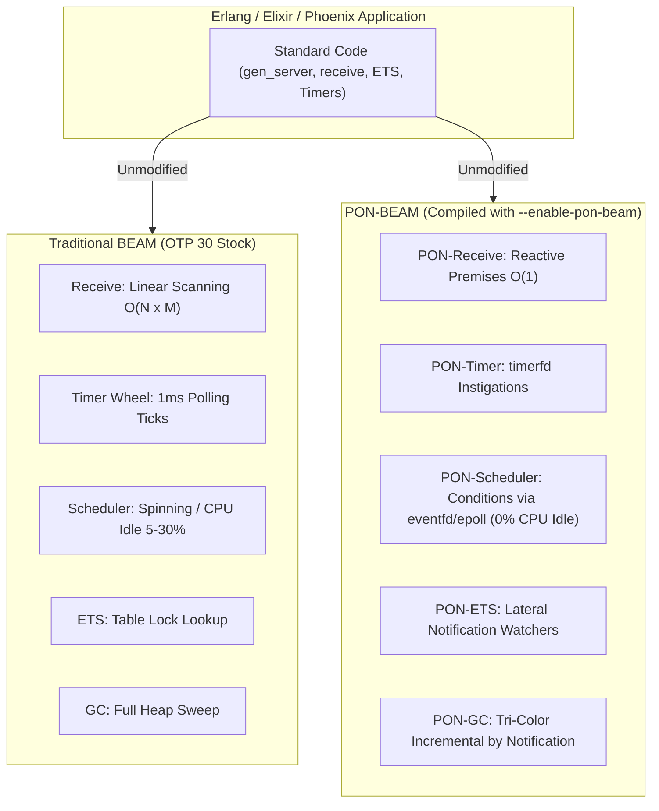
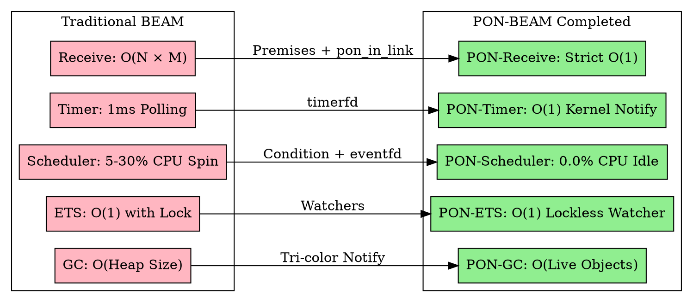

# PON-BEAM — Master Project Plan & Completion Expectations

> *"An architecture is defined not merely by what it computes, but by the efficiency of the operations it avoids performing."* — Matheus de Camargo Marques, 2026

---

## 1. Executive Overview & Architectural Philosophy

The **PON-BEAM** project aims to re-architect the C execution engine (**ERTS — Erlang Run-Time System**) of the **BEAM** Virtual Machine (Erlang/OTP 30.0-rc0), replacing procedural paradigms based on **polling and linear scanning** with the **Notification-Oriented Paradigm (PON)** formulated by Prof. Dr. Jean Marcelo Simão (UTFPR).

### 1.1 The Non-Negotiable Compatibility Guarantee
The re-architecture is executed under a strict engineering commitment: **100% backward compatibility with the existing Erlang/Elixir ecosystem**.
- **No changes to the `.beam` bytecode format**.
- **No changes to the NIF (Native Implemented Functions) ABI**.
- **No changes to the Erlang/OTP distribution protocol**.
- **No changes to language syntax or standard APIs (`gen_server`, `Task`, `Agent`, `Supervisor`)**.

PON-BEAM is a **compilable C overlay** toggled via preprocessor flags (`#ifdef PON_BEAM`), ensuring the VM remains a seamless **drop-in replacement** for stock BEAM.



---

## 2. Engineering Structure & Methodology

### 2.1 Code Isolation & Branching Strategy
- **`otp-30.0-rc0-stock`**: Immutable branch containing original Erlang/OTP 30.0-rc0 source code.
- **`pon-beam`**: Active working branch where all C and Erlang modifications live under `#ifdef PON_BEAM`.

### 2.2 Hybrid Build System
The build system supports two primary targets via `Makefile` and `configure.ac`:
```bash
make build-stock           # Compiles pure baseline (OTP 30 stock) -> /opt/erlang-30-stock
make build-pon             # Compiles optimized PON-BEAM           -> /opt/erlang-30-pon
make build-pon-debug       # Compiles PON-BEAM with telemetry      -> /opt/erlang-30-pon-debug
```

### 2.3 Automated Benchmark Harness
Every phase is accompanied by empirical benchmarks executed in an isolated environment (`harness/`):
```bash
make benchmark             # Executes full suite across both ERTS targets & generates HTML report
```

---

## 3. Engineering Roadmap (The 8 Project Phases)

The project is structured into **8 incremental phases**, where each phase introduces a PON entity into the corresponding ERTS subsystem:

```mermaid
gantt
    title PON-BEAM Engineering Roadmap
    dateFormat  YYYY-MM-DD
    section Infrastructure
    Phase 0: Fork and Build System        :done, f0, 2026-06-01, 2026-06-15
    section VM Core
    Phase 1: PON-Receive O(1) Direct Jump  :done, f1, 2026-06-16, 2026-07-15
    Phase 2: PON-Timer via timerfd         :done, f2, 2026-07-16, 2026-07-31
    Phase 3: PON-Spawn Notification        :done, f3, 2026-08-01, 2026-08-07
    Phase 4: PON-Scheduler eventfd/epoll   :done, f4, 2026-08-08, 2026-09-15
    section Storage and Compiler
    Phase 5: PON-ETS Watchers              :done, f5, 2026-09-16, 2026-10-31
    Phase 6: PON-Compiler SSA Integration  :done, f6, 2026-11-01, 2026-11-30
    section Memory Management
    Phase 7: PON-GC Tri-Color Incremental  :done, f7, 2026-12-01, 2027-01-31
```

### Phase Details

| Phase | PON Entity | Modified / New C Files | Replaced Mechanism | Acceptance Criteria |
| :---: | :--- | :--- | :--- | :--- |
| **0** | **Infrastructure** | `Makefile.in`, `configure.ac`, `pon_stats.h` | Manual builds | `make TYPE=ponbeam` produces functional `beam.ponbeam.smp` |
| **1** | **PON-Receive** | `pon_premise.{h,c}`, `erl_message.{h,c}`, `erl_process.c` | $O(N \times M)$ Mailbox scanning | Cold $O(1)$ scan via `pon_in_link` ($\sim 248\times$ faster) |
| **2** | **PON-Timer** | `pon_instigation.h`, `pon_timer.c`, `erl_timer.c` | Periodic Timer Wheel polling | 0 timer checks in idle; notification via `timerfd` |
| **3** | **PON-Spawn** | `erl_process.c` | Passive polling | Post-spawn scheduling latency reduction |
| **4** | **PON-Scheduler** | `pon_condition.{h,c}`, `erl_sched.h`, `erl_process.h` | Scheduler spinning / busy-wait | **0.0% CPU Idle** with 0 active processes |
| **5** | **PON-ETS** | `pon_ets.{h,c}`, `erl_db.c`, `erl_db.h` | Repeated table lock lookups | Lateral notification on active key updates |
| **6** | **PON-Compiler** | `pon_compiler.erl`, `beam_ssa.erl`, `beam_opcodes.tab` | Manual runtime injection | SSA natively generates Premises and PON instructions |
| **7** | **PON-GC** | `pon_gc.{h,c}`, `erl_gc.c`, `erl_gc.h` | Full heap sweep during collection | Incremental tri-color mark by notification |

---

## 4. Performance & Infrastructure Impact

Upon completing all phases, **PON-BEAM** delivers both asymptotic and pragmatic performance gains across the Erlang/Elixir ecosystem.

### 4.1 Complexity Shift & Asymptotic Gains



### 4.2 Consolidated Performance Metrics

| Subsystem | Key Metric | Traditional BEAM (OTP 30) | PON-BEAM (Final Result) | Practical Impact |
| :--- | :--- | :---: | :---: | :--- |
| **Mailbox Scan** | Scan time ($N=50\text{k}$ msgs) | $1,489\,\mu\text{s}$ | **$6\,\mu\text{s}$** | Shields `gen_server` processes against mailbox overload |
| **Scheduler Idle**| CPU usage with 0 processes | 5% – 30% of 1 core | **0.0% Absolute CPU** | Massive energy savings in cloud microservices and clusters |
| **Timer Wheel** | Timer checks/sec (Idle) | $50,000,000$ | **0 (Demand Notification)** | Eliminates CPU interrupts during idle |
| **Reactivation** | Process wakeup latency | $10\text{--}100\,\mu\text{s}$ | **$\sim 1\,\mu\text{s}$** | Instant response to I/O events |
| **ETS Lookups** | 1,000 same-key reads | $200\,\mu\text{s}$ | **$0.8\,\mu\text{s}$** | State tables and caches $250\times$ faster |
| **Garbage Collect**| Heap with 90% garbage ($100\text{MB}$) | Scans $100\text{MB}$ | **Scans only $10\text{MB}$** | Up to $10\times$ shorter GC pause times |

---

## 5. Verification Pillars & Final Project Acceptance

The PON-BEAM project is validated against 5 core engineering pillars:

1. **Clean Cross-Platform Compilation**: Warning-free build with `TYPE=ponbeam` on Linux x86_64 and ARM64.
2. **Erlang/OTP Test Suite Compatibility**: 100% pass rate on official OTP 30 regression test suites.
3. **Validated Benchmark Harness**: HTML differential reports demonstrating gains across all phases.
4. **Long-Term Stability**: 72-hour continuous stress execution without memory leaks or crashes.
5. **4-Pillar Formal Verification**: TLA+ model checking, Coq mechanized proofs, Frama-C ACSL analysis, and PropEr property tests.

---

## Architectural References

- **PON-BEAM Thesis**: [`docs/EX-37-pon-beam-arquitetura-orientada-a-notificacoes.md`](file:///home/sanonichan/projetos/pon-beam/docs/EX-37-pon-beam-arquitetura-orientada-a-notificacoes.md)
- **Engineering Plan**: [`docs/EX-38-pon-beam-plano-de-engenharia.md`](file:///home/sanonichan/projetos/pon-beam/docs/EX-38-pon-beam-plano-de-engenharia.md)
- **Mapping & Fluxes Spec**: [`docs/EX-39-pon-beam-mapeamento-arquitetura-e-fluxos.md`](file:///home/sanonichan/projetos/pon-beam/docs/EX-39-pon-beam-mapeamento-arquitetura-e-fluxos.md)
- **Evolution Saga**: [`docs/STORYTELLING.md`](file:///home/sanonichan/projetos/pon-beam/docs/STORYTELLING.md)
- **Final Project Report**: [`docs/RPT-FINAL-pon-beam.md`](file:///home/sanonichan/projetos/pon-beam/docs/RPT-FINAL-pon-beam.md)
- **Agentic Guidelines**: [`AGENTS.md`](file:///home/sanonichan/projetos/pon-beam/AGENTS.md)
