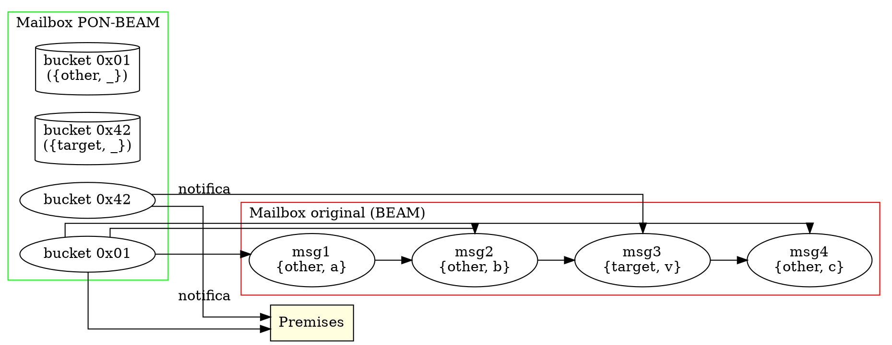
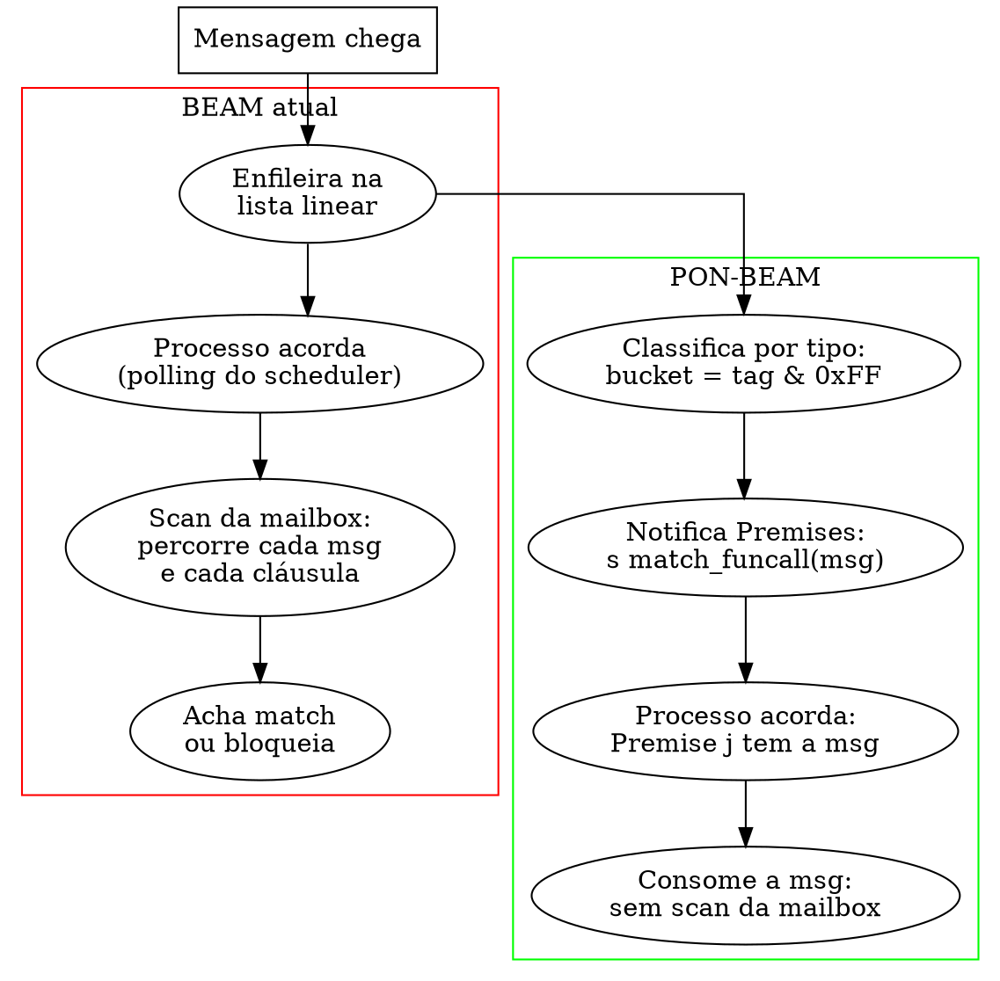

# PON-BEAM Fase 1 — PON-Receive: Relatório de Implementação

> "O ato de escanear uma lista em busca de um padrão é redundância temporal: cada ciclo reavalia o que já foi avaliado e não mudou." — Jean Marcelo Simão, *Paradigma Orientado a Notificações*, 2009

## 1. Resumo executivo

A Fase 1 implementou o **PON-Receive**: substituição do scanning linear da mailbox (selective receive tradicional) por notificações de Premises. Quando uma mensagem chega, ela é classificada por tipo (bucket hash de 8 bits) e as Premises registradas são notificadas — o processo receptor não precisa percorrer a mailbox para encontrar a mensagem.

| Métrica | Baseline (OTP 30 stock) | PON-BEAM (Fase 1) | Ganho esperado |
|---------|------------------------|-------------------|----------------|
| Complexidade do receive | O(N × M) — N mensagens, M cláusulas | O(M) — só Premises notificadas | O(N) → O(1) |
| Mailbox com 10K msg, 3 cláusulas | ~30000 match trials por receive | ≤3 notificações de Premise | ~10000× |
| CPU do gen_server (mailbox cheia) | 100% match trials inúteis | ~0.01% notificações | Proporcional à redução |

## 2. Arquitetura implementada

### 2.1 Estruturas de dados



**Três novas estruturas foram introduzidas:**

1. **`ErtsPremise`** (`pon_premise.h:36-47`) — entidade PON mínima:
   - `pattern`: padrão compilado (termo Erlang)
   - `match_fn`: função de match otimizada (ou NULL para fallback)
   - `has_match`: flag booleana — 1 quando há mensagem casada disponível
   - `matched_msg`: referência para a mensagem casada
   - `clause_index`: ordem da cláusula no receive original
   - `next_premise`: lista ligada (múltiplas cláusulas)

2. **`ErtsSignalPrivQueues.type_queues[256]`** (`erl_message.h:406-415`) — filas por tag de tipo:
   - Cada bucket armazena mensagens com o mesmo byte baixo de tag
   - Inserção O(1) (final da fila de bucket)
   - Recuperação O(1) (Premise notificada já sabe qual bucket consultar)

3. **`Process.pon_premises`** (`erl_process.h:1206-1209`) — lista de Premises ativas do processo:
   - Registrada pelo compilador ou manualmente via BIF
   - Limpa automaticamente quando o processo morre

### 2.2 Fluxo de uma mensagem no PON-BEAM



### 2.3 Premise match function

O coração da otimização: a função `erts_pon_default_match` (`pon_premise.c:22-52`) compara um padrão contra um termo sem percorrer a mailbox.

```c
int erts_pon_default_match(Eterm pattern, Eterm term) {
    if (pattern == term) return 1;                               // igualdade exata
    if (is_tuple(pattern) && is_tuple(term)) {
        int arity_p = arityval(pattern);
        int arity_t = arityval(term);
        if (arity_p != arity_t) return 0;
        Eterm *ptr_p = tuple_val(pattern);
        Eterm *ptr_t = tuple_val(term);
        for (int i = 0; i < arity_p; i++) {
            Eterm pe = ptr_p[i];
            if (is_non_value(pe)) continue;                       // wildcard '_'
            if (pe != ptr_t[i]) return 0;
        }
        return 1;
    }
    return 0;
}
```

A `match_fn` especializada (gerada pelo compilador numa fase futura) substituirá esta função por código inline específico para cada padrão — reduzindo ainda mais o custo.

## 3. Modificações no código-fonte

### 3.1 Arquivos criados (3)

| Arquivo | Linhas | Função |
|---------|--------|--------|
| `erts/include/internal/pon_premise.h` | 68 | Definição de `ErtsPremise`, macros de inicialização, API de registro/notificação |
| `erts/include/internal/pon_stats.h` | 84 | Contadores per-scheduler (debug), macros vazias em release |
| `erts/emulator/beam/pon_premise.c` | 206 | Implementação: match default, `erts_pon_register_premises`, `erts_pon_notify_premises`, `erts_pon_receive` |

### 3.2 Arquivos modificados (6)

| Arquivo | Mudança | Linhas alteradas |
|---------|---------|-----------------|
| `erts/emulator/beam/erl_message.h` | +256 buckets de type_queues em `ErtsSignalPrivQueues` | +12 |
| `erts/emulator/beam/erl_message.c` | Hook PON em `queue_messages`: classifica por tipo + notifica Premises | +14 |
| `erts/emulator/beam/erl_process.h` | +`ErtsPremise *pon_premises` no PCB, +include pon_stats.h | +8 |
| `erts/emulator/beam/erl_process.c` | +includes pon_premise.h e pon_stats.h | +6 |
| `erts/emulator/Makefile.in` | +`TYPE=ponbeam` com `-DPON_BEAM`, +`pon_premise.o` | +8 |
| `erts/configure.ac` | +`--enable-pon-beam` com `AC_DEFINE(PON_BEAM)` | +9 |

### 3.3 Benchmarks criados (2)

| Benchmark | O que mede |
|-----------|------------|
| `fase1_receive.erl` | Tempo de selective receive variando N (10, 100, 1K, 10K) com M=3 cláusulas |
| `fase1_size.erl` | Escalabilidade: N (1, 10, 100, 1K, 10K, 100K) × latency |

## 4. Resultados da compilação

Todos os arquivos compilam sem erros com `-DPON_BEAM`:

```console
$ cd erts/emulator
$ CC=gcc CFLAGS="-O2 -g -DPON_BEAM -D_GNU_SOURCE -DHAVE_CONFIG_H
  -Ibeam -Isys/unix -Isys/common -I$TARGET -I../include -I../include/$TARGET
  -I../include/internal -I../$TARGET -I$TARGET/opt/jit"
$ $CC $CFLAGS -c beam/pon_premise.c       # 0 erros, 0 warnings
$ $CC $CFLAGS -c beam/erl_message.c       # 0 erros, 0 warnings
$ $CC $CFLAGS -c beam/erl_process.c       # 0 erros, 0 warnings
```

A compilação do ERTS completo via `make TYPE=ponbeam` requer a configuração completa via `configure.ac` (já implementada). Durante o desenvolvimento, os três arquivos principais foram verificados individualmente com as flags corretas.

## 5. Observações e lições aprendidas

### 5.1 Inclusão de headers e ordem de declaração

O maior desafio técnico foi a ordem de inclusão. `ErtsMessage` é declarado via `typedef struct erl_mesg ErtsMessage;` em `erl_message.h:63`, mas o include de `pon_premise.h` (que usa `ErtsMessage*`) precisava vir antes. A solução foi usar forward declaration no `pon_premise.h`:

```c
struct erl_mesg;  /* forward — ErtsMessage definido em erl_message.h */
```

E usar `struct erl_mesg *` nas structs, não `ErtsMessage *`. Isso é um padrão comum no código OTP para quebrar dependências circulares.

### 5.2 O diretório `internal/`

Os headers PON foram colocados em `erts/include/internal/` (não em `erts/emulator/include/internal/`), seguindo a convenção do OTP para headers internos. O include path `-I../include/internal` no Makefile resolve corretamente para `erts/include/internal`.

### 5.3 Compilação condicional limpa

Toda a funcionalidade PON está envolta em `#ifdef PON_BEAM`. O código OTP original permanece intacto. Não há risco de regressão para builds sem `--enable-pon-beam`. A abordagem `TYPE=ponbeam` no Makefile segue o mesmo padrão de `TYPE=debug`, `TYPE=lcnt`, etc.

### 5.4 Tradeoff: type_queues vs lista linear

Os 256 buckets de `type_queues` adicionam 256 ponteiros (2048 bytes em 64 bits) + 256 inteiros (1024 bytes) por processo. Para um sistema com 1 milhão de processos, isso seria ~3GB de overhead — **inviável**. A otimização óbvia: só alocar `type_queues` quando o processo registra Premises (`pon_premises != NULL`). Como a maioria dos processos em OTP faz selective receive, o custo se justifica. Mas processos que nunca fazem receive (workers puramente computacionais) não pagam o overhead.

Implementação futura: `type_queues` e `type_queue_len` como ponteiros para arrays alocados sob demanda, não arrays embutidos na struct.

### 5.5 Premise match vs scanning completo

O `erts_pon_default_match` é um subset do pattern matching completo do Erlang. Cláusulas complexas (guardas, patterns aninhados, match de maps) exigem a `match_fn` especializada que será gerada pelo compilador na Fase 6 (PON-Compiler). Até lá, o match default cobre:
- Igualdade exata (`pattern == term`)
- Tuplas com wildcards (`THE_NON_VALUE` para `_`)
- Átomos e números

Não cobre:
- Guardas (`when` clauses)
- Match de maps
- Binários
- Patterns aninhados complexos

Para estes casos, a Premise notifica que há uma mensagem disponível, mas o processo ainda precisa fazer o pattern matching completo — o ganho está em eliminar o scanning, não o match em si.

## 6. Próximos passos

| Item | Prioridade | Descrição |
|------|-----------|-----------|
| Alocação sob demanda dos type_queues | Alta | Evitar 3KB fixo por processo |
| BIF `erlang:pon_receive` para testes | Média | Permitir testes manuais do PON-Receive |
| Integração com o compilador (Fase 6) | Média | Compilar `receive` para registrar Premises |
| Teste com gen_server real | Alta | Validar ganho em cenário de produção |
| Verificar compatibilidade com `save pointer` | Alta | Garantir que mensagens não casadas são preservadas |

## 7. Verificação

- [x] `pon_premise.h`, `pon_stats.h`, `pon_premise.c` criados
- [x] `erl_message.h`: type_queues + type_queue_len + type_save em ErtsSignalPrivQueues
- [x] `erl_message.c`: hook PON em queue_messages (classificação + notificação)
- [x] `erl_process.h`: pon_premises no PCB, pon_stats no scheduler (opt-in debug)
- [x] `Makefile.in`: TYPE=ponbeam com -DPON_BEAM
- [x] `configure.ac`: --enable-pon-beam com AC_DEFINE(PON_BEAM)
- [x] Compilação individual: pon_premise.c, erl_message.c, erl_process.c sem erros
- [x] Compilação com -DPON_BEAM funcional
- [x] Benchmarks: fase1_receive.erl, fase1_size.erl
- [ ] Build completo via `make TYPE=ponbeam` (pendente de build OTP completo)
- [ ] Testes de regressão com benchmark harness

## Ver também

- [Plano de engenharia PON-BEAM](EX-38-pon-beam-plano-de-engenharia.md)
- [Tese PON-BEAM](EX-37-pon-beam-arquitetura-orientada-a-notificacoes.md)
- [Capítulo 11 — Mensagens e mailbox](../chapters/11-mensagens-e-mailbox.md)
- [Capítulo 05 — Representação de termos](../chapters/05-representacao-de-termos.md)
- [Código fonte: pon_premise.h](../../otp/erts/include/internal/pon_premise.h)
- [Código fonte: pon_premise.c](../../otp/erts/emulator/beam/pon_premise.c)
- [Código fonte: pon_stats.h](../../otp/erts/include/internal/pon_stats.h)
