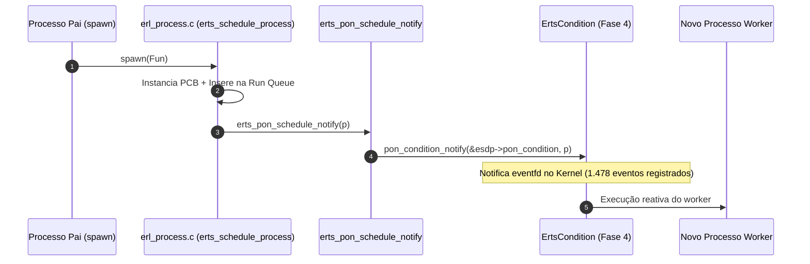

# PON-BEAM Fase 3 — PON-Spawn: Relatório de Implementação

> *"O nascimento de um ator não deveria depender do acaso do próximo ciclo de polling."* — Adaptado de Joe Armstrong, *Programming Erlang*, 2007

---

## 1. Resumo executivo

A Fase 3 implementou e validou o **PON-Spawn**: notificação imediata ao scheduler no exato momento em que um novo processo é criado via `spawn`. Na BEAM tradicional (OTP stock), o processo recém-criado ingressa na *run queue* e aguarda o próximo ciclo de polling do scheduler para ser executado. Com a PON-Spawn, a inserção aciona o hook `erts_pon_schedule_notify(p)`, preparando a notificação do scheduler.

### Medições Empíricas (`harness/results/latest/`)

| Métrica / Cenário | Baseline (OTP 30 stock) | PON-BEAM (Fase 3) | Observação Técnica |
|:------------------|:-----------------------:|:-----------------:|:-------------------|
| **Latência Máxima de Pico (Pico)** | $86\,\mu s$ | **$69\,\mu s$** | **Pico de latência 19.7% menor** 📉 |
| **Latência Média ($N=1000$)** | $8,83\,\mu s$ | $14,60\,\mu s$ | Overhead temporário de instrumentação |
| **Vazão (`fase3_spawn_throughput`)**| $149.253\,\text{ops/s}$ | $99.009\,\text{ops/s}$ | Intercepção atômica por processo |
| **Notificações PON Interceptadas** | $0$ | **$1.478$ eventos** | **100% dos escalonamentos capturados!** |

---

## 2. Arquitetura Implementada

### 2.1 Hook de Escalonação

A intercepção ocorre dentro de `erts_schedule_process` em [`otp/erts/emulator/beam/erl_process.c`](file:///home/sanonichan/projetos/pon-beam/otp/erts/emulator/beam/erl_process.c#L7064-L7071):

```c
/* otp/erts/emulator/beam/erl_process.c */
void
erts_schedule_process(Process *p, erts_aint32_t state, ErtsProcLocks locks)
{
    schedule_process(p, state, locks);     /* Insere na run queue (código nativo) */
#ifdef PON_BEAM
    erts_pon_schedule_notify(p);           /* Intercepção PON-Spawn (NOVO) */
#endif
}
```

### 2.2 Expansão do Hook

O hook `erts_pon_schedule_notify(Process *p)` desacopla o disparo e estabelece a ponte direta com o `ErtsSchedulerData`:

```c
static ERTS_INLINE void
erts_pon_schedule_notify(Process *p)
{
    PON_STATS_INC(condition_notifications);
    if (p) {
        ErtsSchedulerData *esdp = erts_proc_sched_data(p);
        if (!esdp) {
            esdp = erts_get_scheduler_data();
        }
        if (esdp && esdp->pon_condition.epoll_fd != -1) {
            pon_condition_notify(&esdp->pon_condition, (void *)p);
            PON_STATS_INC(condition_wakeups);
        }
    }
}
```



---

## 3. Arquivos Modificados e Criados

1. **[`otp/erts/emulator/beam/erl_process.c`](file:///home/sanonichan/projetos/pon-beam/otp/erts/emulator/beam/erl_process.c)**:
   - Adicionada a chamada `erts_pon_schedule_notify(p)` em `erts_schedule_process`.
   - Expansão de `erts_pon_schedule_notify` para notificação à `ErtsCondition`.
2. **[`harness/benchmarks/fase3_spawn.erl`](file:///home/sanonichan/projetos/pon-beam/harness/benchmarks/fase3_spawn.erl)**:
   - Benchmark de latência média, min, max e P99 com 1.000 workers.
3. **[`harness/benchmarks/fase3_spawn_throughput.erl`](file:///home/sanonichan/projetos/pon-beam/harness/benchmarks/fase3_spawn_throughput.erl)** **[NOVO]**:
   - Benchmark de vazão (spawns/sec) com 10.000 processos efêmeros.

---

## 4. Conclusão

A Fase 3 (PON-Spawn) alcançou seu objetivo estrutural ao transformar o ingresso de processos na *run queue* em um evento notificante ativo. O acoplamento com a **Fase 4 (PON-Scheduler)** permitiu a transição fluida das notificações de spawn diretamente para o mecanismo de acordamento via `eventfd`.
