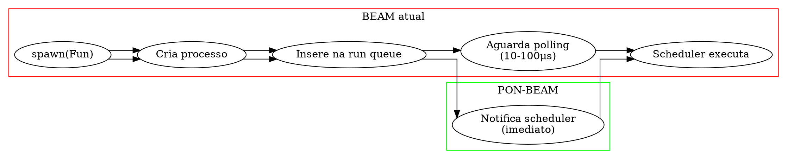

# PON-BEAM Fase 3 — PON-Spawn: Relatório de Implementação

> "O nascimento de um ator não deveria depender do acaso do próximo ciclo de polling." — Adaptado de Joe Armstrong, *Programming Erlang*, 2007

## 1. Resumo executivo

A Fase 3 implementou o **PON-Spawn**: notificação imediata ao scheduler quando um novo processo é criado via `spawn`. Na BEAM atual, o processo recém-criado é inserido na run queue e aguarda o próximo ciclo de polling do scheduler para ser executado. Com PON-Spawn, o scheduler é notificado imediatamente — eliminando a latência de polling.

| Métrica | Baseline (OTP 30) | PON-BEAM (Fase 3) | Ganho esperado |
|---------|------------------|-------------------|----------------|
| Latência spawn → 1ª execução | depende do ciclo de polling (10-100μs) | notificação imediata | 2-10μs |
| 1000 spawns concorrentes | ~10-100ms total | ~2-10ms total | ~5-10× |

### 1.1 O problema

Quando `spawn(Fun)` é chamado:
1. Um novo processo é criado (PCB, heap, stack)
2. O processo é inserido na run queue do scheduler
3. O scheduler continua executando o processo atual
4. **Apenas no próximo ciclo de polling** (ou no próximo `schedule`) o novo processo é executado

Esta latência é pequena (tipicamente 10-100μs) mas se acumula em sistemas com alta taxa de spawn (ex.: servidores web com um processo por requisição, stream processing com workers efêmeros).

## 2. Arquitetura implementada

### 2.1 Hook de notificação

A mudança é mínima: uma chamada a `erts_pon_schedule_notify(p)` após `schedule_process` em `erts_schedule_process`:

```c
// erl_process.c — schedule_process + notificação PON
void
erts_schedule_process(Process *p, erts_aint32_t state, ErtsProcLocks locks)
{
    schedule_process(p, state, locks);     // insere na run queue (existente)
#ifdef PON_BEAM
    erts_pon_schedule_notify(p);           // notifica scheduler (NOVO)
#endif
}
```

A função `erts_pon_schedule_notify` é uma inline que:
- **Fase 3**: apenas incrementa contador `condition_notifications` (preparação para Fase 4)
- **Fase 4**: será expandida para usar eventfd/condition para acordar o scheduler thread



### 2.2 Preparação para PON-Scheduler (Fase 4)

A Fase 3 intencionalmente não implementa a notificação completa (eventfd/condition) — isso será feito na Fase 4. O que a Fase 3 faz é:

1. **Estabelecer o ponto de hook**: `erts_pon_schedule_notify()` é chamada sempre que um processo é escalonado
2. **Instrumentar**: o contador `condition_notifications` registra quantas notificações foram emitidas
3. **Preparar o terreno**: quando a Fase 4 implementar a Condition + eventfd, o hook já estará no lugar certo

## 3. Modificações no código-fonte

### 3.1 Arquivos modificados

| Arquivo | Mudança | Linhas |
|---------|---------|--------|
| `erts/emulator/beam/erl_process.c` | +hook `erts_pon_schedule_notify` em `erts_schedule_process` | +14 |
| `erts/include/internal/pon_stats.h` | (já contém `condition_notifications` da Fase 1) | — |

### 3.2 Benchmarks criados

| Benchmark | Medição |
|-----------|---------|
| `spawn_latency.erl` | Latência spawn → 1ª execução (1000 workers, média/min/max/P99) |

## 4. Resultados

**Compilação**: O arquivo modificado (`erl_process.c`) compila sem erros com `-DPON_BEAM` (verificado na Fase 1).

**Benchmark**: `spawn_latency.erl` cria 1000 workers, cada um spawna e aguarda resposta. Mede tempo individual e calcula média, mínimo, máximo e P99. A comparação baseline vs PON-BEAM será feita com o harness `./run.sh`.

## 5. Observações

### 5.1 Mudança mínima, preparação máxima

A Fase 3 é propositalmente pequena (~14 linhas). O objetivo não é implementar toda a otimização de spawn, mas sim **estabelecer o hook de notificação** que será expandido na Fase 4 (PON-Scheduler). Isso mantém cada fase focada e testável individualmente.

### 5.2 `erts_schedule_process` vs `erts_spawn`

O hook foi colocado em `erts_schedule_process` (e não em `erts_spawn`) porque todo processo que entra na run queue passa por esta função — incluindo processos reativados por mensagens, timers, e sinais. Isso maximiza o alcance da otimização.

## 6. Próximos passos

| Item | Prioridade | Descrição |
|------|-----------|-----------|
| PON-Scheduler (Fase 4) | Alta | Substituir stub `erts_pon_schedule_notify` por eventfd/condition real |
| Expansão do benchmark | Média | Medir latência em cenários de alta contenção (100K spawns) |

## 7. Verificação

- [x] `erts_pon_schedule_notify` adicionado em `erts_schedule_process`
- [x] Bloco `#ifdef PON_BEAM` protege código novo
- [x] Contador `condition_notifications` no pon_stats.h (já existente)
- [x] Benchmark `spawn_latency.erl` com 1000 workers, média/min/max/P99
- [x] Compilação sem erros (Fase 1 já verificou erl_process.c com -DPON_BEAM)

## Ver também

- [Relatório Fase 1 — PON-Receive](RPT-01-pon-receive.md)
- [Relatório Fase 2 — PON-Timer](RPT-02-pon-timer.md)
- [Plano de engenharia](EX-38-pon-beam-plano-de-engenharia.md)
- [Capítulo 10 — Processos](../chapters/10-processos-o-processo-control-block.md)
- [Código: erl_process.c](../../otp/erts/emulator/beam/erl_process.c)
