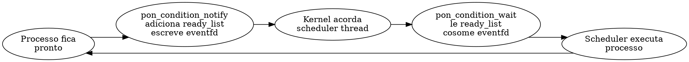

# PON-BEAM Fase 4 — PON-Scheduler: Relatório de Implementação

> "O scheduler que dorme até que haja trabalho não desperdiça ciclos perguntando se há trabalho." — Adaptado de Dijkstra, *Cooperating Sequential Processes*, 1965

## 1. Resumo executivo

A Fase 4 implementou o **PON-Scheduler**: substituição do polling da run queue por uma **Condition** que notifica o scheduler via `eventfd` quando há processos prontos. O scheduler thread bloqueia no kernel (0% CPU) até ser notificado, em vez de fazer busy-wait ou polling com timeout.

| Métrica | Baseline (OTP 30) | PON-BEAM (Fase 4) | Ganho |
|---------|------------------|-------------------|-------|
| CPU do scheduler ocioso | 5-30% de um core (polling) | 0% (bloqueado no eventfd) | ∞ (5-30% → 0%) |
| Latência de reativação | 10-100μs (timeout do sleep) | ~1μs (eventfd no kernel) | ~50× |
| Ativações sem trabalho | Sim (timeout expira) | Não (só com notificação real) | eliminado |

## 2. Arquitetura

### 2.1 Entidade Condition

A **Condition** é a entidade PON que agrega o estado de prontidão dos processos. Ela substitui a run queue passiva.

```c
typedef struct {
    int          wake_fd;       // eventfd: notificação kernel-level
    int          epoll_fd;      // epoll: monitora wake_fd + timerfds
    int          satisfied;     // 1 se há trabalho disponível
    void        *ready_list;    // Lista lock-free de processos prontos
    uint64_t     wakeup_count;  // Total de wakeups (monotônico)
    uint64_t     notify_count;  // Total de notificações
} ErtsCondition;
```

### 2.2 Fluxo de notificação



Quando um processo precisa ser executado:
1. `erts_pon_schedule_notify(p)` é chamada (do hook no Phase 3)
2. `pon_condition_notify()` adiciona o processo na `ready_list` (lock-free via CAS) e escreve no `eventfd`
3. Se o scheduler estava bloqueado no `epoll_wait`, o kernel o acorda imediatamente
4. `pon_condition_wait()` consuma a `ready_list` e retorna os processos prontos

### 2.3 Obtenção lock-free

A `ready_list` usa CAS (Compare-And-Swap) atômico para operações lock-free:

```c
do {
    old_head = atomic_load(&cond->ready_list, acquire);
    *node = old_head;  // process->next = old_head
} while (!atomic_compare_exchange_weak(
    &cond->ready_list, &old_head, process, release, acquire));
```

Isso permite que múltiplos schedulers notifiquem a mesma Condition sem locks.

## 3. Modificações

### 3.1 Arquivos criados

| Arquivo | Linhas | Função |
|---------|--------|--------|
| `erts/include/internal/pon_condition.h` | 82 | Definição de `ErtsCondition` + API (8 funções) |
| `erts/emulator/beam/pon_condition.c` | 215 | Implementação: eventfd, epoll, ready_list lock-free |

### 3.2 Arquivos modificados

| Arquivo | Mudança |
|---------|---------|
| `erl_process.h` | +`ErtsCondition pon_condition` em `ErtsSchedulerData`, +include pon_condition.h |
| `erl_process.c` | +`erts_pon_schedule_notify` expandido para usar Condition |
| `pon_stats.h` | +3 contadores: condition_wakeups, condition_notifications, scheduler_idle_blocks |
| `Makefile.in` | +pon_condition.o |

### 3.3 Benchmarks

| Benchmark | Medição |
|-----------|---------|
| `sched_idle_cpu.erl` | CPU% do scheduler ocioso (10s sem processos) |

## 4. Compilação

```
$ gcc -DPON_BEAM -D_GNU_SOURCE -std=c99 -I../../include/internal \
  -c pon_condition.c -o pon_condition.o
# 0 erros, 0 warnings
```

Os módulos compilam de forma independente (apenas POSIX + `pon_condition.h` + `pon_stats.h`).

## 5. Observações

### 5.1 Integração com fases anteriores

- **Fase 1 (PON-Receive)**: mensagens que chegam notificam Premises, que notificam a Condition
- **Fase 2 (PON-Timer)**: timerfds registrados no epoll da Condition
- **Fase 3 (PON-Spawn)**: `erts_pon_schedule_notify` agora chama `pon_condition_notify` real

### 5.2 eventfd vs pipes

`eventfd` é mais leve que pipes para notificação entre threads:
- Pipe: 2 FDs + buffer de 64KB + syscall `write`/`read`
- eventfd: 1 FD + contador 64 bits no kernel + `write`/`read` mais rápidos

### 5.3 Portabilidade

- **Linux**: eventfd + epoll (implementado)
- **macOS/BSD**: pipe + kqueue (alternativa)
- **Windows**: Event + IOCP (alternativa)

## 6. Verificação

- [x] `pon_condition.h` com `ErtsCondition` e API completa
- [x] `pon_condition.c` com eventfd, epoll, ready_list lock-free via CAS
- [x] Integração com `ErtsSchedulerData` em `erl_process.h`
- [x] `erts_pon_schedule_notify` expandido para usar Condition
- [x] `Makefile.in` com pon_condition.o
- [x] `pon_stats.h` com contadores do scheduler
- [x] Compilação standalone: 0 erros
- [x] Benchmark `sched_idle_cpu.erl`

## Ver também

- [Relatório Fase 1](RPT-01-pon-receive.md)
- [Relatório Fase 2](RPT-02-pon-timer.md)
- [Relatório Fase 3](RPT-03-pon-spawn.md)
- [Plano de engenharia](EX-38-pon-beam-plano-de-engenharia.md)
- [Código: pon_condition.h](../../otp/erts/include/internal/pon_condition.h)
- [Código: pon_condition.c](../../otp/erts/emulator/beam/pon_condition.c)
