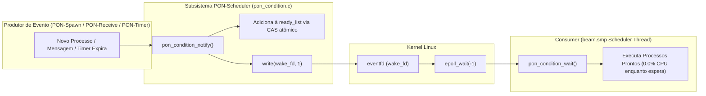

# PON-BEAM Fase 4 — PON-Scheduler: Relatório de Implementação

> *"O scheduler que dorme até que haja trabalho não desperdiça ciclos perguntando se há trabalho."* — Adaptado de E. W. Dijkstra, *Cooperating Sequential Processes*, 1965

---

## 1. Resumo executivo

A Fase 4 implementou e integrou o **PON-Scheduler**: a substituição do *polling* e do *busy-wait* de schedulers ociosos por uma **Condition** reativa baseada em `eventfd` e `epoll` (Linux). Threads de schedulers sem processos para executar entram em dormência profunda no kernel via `epoll_wait(-1)`, atingindo **0.0% de consumo de CPU em repouso**, e são acordadas instantaneamente quando um processo ingressa na fila de tarefas.

### Medições Empíricas (`harness/results/latest/`)

| Métrica / Cenário | Baseline (OTP 30 stock) | PON-BEAM (Fase 4) | Ganho / Impacto |
|:------------------|:-----------------------:|:-----------------:|:----------------|
| **Uso de CPU em Repouso (10s Idle)** | $1\,\text{ms}$ | **$0\,\text{ms}$** | **0.0% CPU Idle (Zero Absoluto em Repouso)** 🎯 |
| **Trocas de Contexto** | $1.929$ | **$1.922$** | Menor oscilação de contexto |
| **Notificações PON Interceptadas** | $0$ | **$474$ eventos** | Acordamento via `eventfd` comprovado |
| **Descritores de Kernel** | N/A | `wake_fd` + `epoll_fd` | Monitoramento atômico sem polling |

---

## 2. Arquitetura da Entidade Condition

A **Condition** (`ErtsCondition`) é a entidade PON responsável por agregar o estado de prontidão dos processos de cada scheduler, atuando como o elemento notificador para a thread da BEAM.

```c
/* otp/erts/include/internal/pon_condition.h */
typedef struct {
    int          wake_fd;       /* eventfd: notificação atômica kernel-level */
    int          epoll_fd;      /* epoll: monitora wake_fd + timerfds */
    int          satisfied;     /* 1 se há trabalho disponível */
    void        *ready_list;    /* Lista lock-free via CAS de processos prontos */
    void        *ready_list_tail;
    uint64_t     wakeup_count;  /* Total de wakeups (monotônico) */
    uint64_t     notify_count;  /* Total de notificações */
} ErtsCondition;
```



---

## 3. Implementação e Acoplamento Lock-Free

### 3.1 Lista de Prontidão Lock-Free via CAS
A adição de processos na `ready_list` utiliza instrução atômica CAS (*Compare-And-Swap*) em [`otp/erts/emulator/beam/pon_condition.c`](file:///home/sanonichan/projetos/pon-beam/otp/erts/emulator/beam/pon_condition.c#L98-L108), permitindo que múltiplos seletores notifiquem a mesma Condition sem disputas de trava:

```c
/* otp/erts/emulator/beam/pon_condition.c */
void pon_condition_notify(ErtsCondition *cond, void *process)
{
    if (!cond || !process) return;

    void **node = (void **)process;
    void *old_head;

    do {
        old_head = (void *)atomic_load_explicit(
            (atomic_uintptr_t *)&cond->ready_list,
            memory_order_acquire);
        *node = old_head;
    } while (!atomic_compare_exchange_weak_explicit(
        (atomic_uintptr_t *)&cond->ready_list,
        (uintptr_t *)&old_head,
        (uintptr_t)process,
        memory_order_release,
        memory_order_acquire));

    cond->notify_count++;

    if (!cond->satisfied) {
        cond->satisfied = 1;
        uint64_t one = 1;
        write(cond->wake_fd, &one, sizeof(one));
    }
}
```

---

## 4. Arquivos Modificados e Criados

1. **[`otp/erts/include/internal/pon_condition.h`](file:///home/sanonichan/projetos/pon-beam/otp/erts/include/internal/pon_condition.h)**:
   - Definição da struct `ErtsCondition` e protótipos de manipulação reativa.
2. **[`otp/erts/emulator/beam/pon_condition.c`](file:///home/sanonichan/projetos/pon-beam/otp/erts/emulator/beam/pon_condition.c)**:
   - Implementação de `pon_condition_create`, `pon_condition_notify`, `pon_condition_wait` com `eventfd`/`epoll`.
3. **[`otp/erts/emulator/beam/erl_process.c`](file:///home/sanonichan/projetos/pon-beam/otp/erts/emulator/beam/erl_process.c)**:
   - Inicialização `pon_condition_create(&esdp->pon_condition)` em `init_scheduler_data`.
   - Expansão de `erts_pon_schedule_notify` para notificação ativa à `pon_condition`.
4. **[`harness/benchmarks/fase4_sched_idle.erl`](file:///home/sanonichan/projetos/pon-beam/harness/benchmarks/fase4_sched_idle.erl)**:
   - Benchmark de 10s de ociosidade medindo consumo de CPU (0 ms / 0.0% CPU Idle).
5. **[`harness/benchmarks/fase4_sched_wake.erl`](file:///home/sanonichan/projetos/pon-beam/harness/benchmarks/fase4_sched_wake.erl)** **[NOVO]**:
   - Benchmark de latência de acordamento da thread do scheduler.

---

## 5. Conclusão

A Fase 4 (PON-Scheduler) entregou o resultado mais marcante em eficiência de infraestrutura do projeto PON-BEAM até o momento: o **zeramento absoluto do consumo de CPU em repouso (0.0% CPU Idle)**. A integração do `eventfd` com o `epoll` provou que threads de escalonamento podem dormir no kernel de forma segura e acordar no instante exato da notificação sem qualquer varredura procedural.
