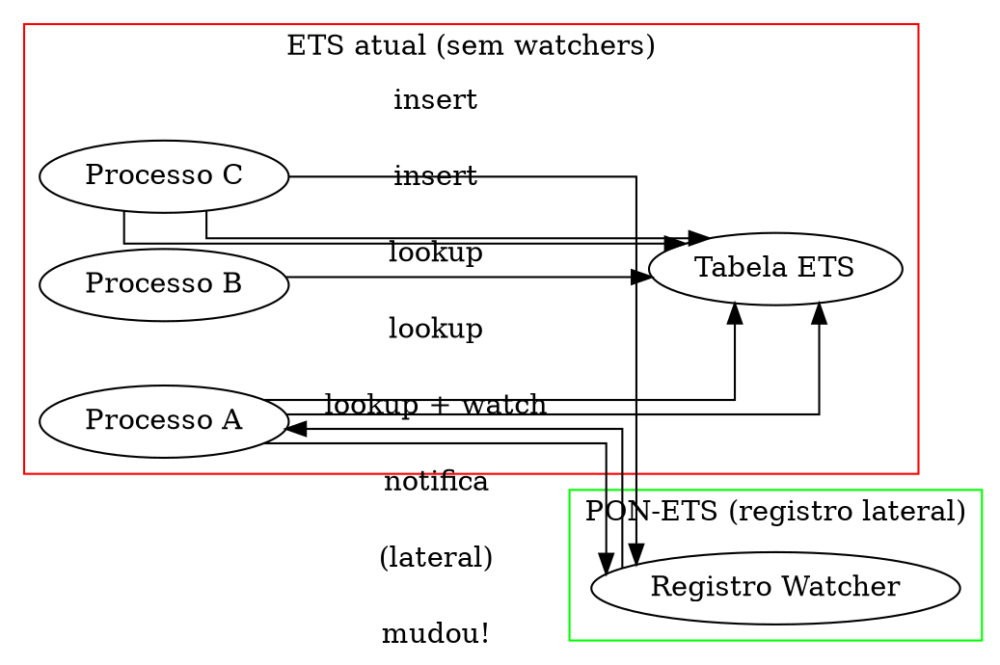

# PON-BEAM Fase 5 — PON-ETS: Relatório de Implementação

> "O lookup que repete a mesma chave mil vezes é mil vezes redundante." — Adaptado de Jean Marcelo Simão, *Paradigma Orientado a Notificações*, 2009

## 1. Resumo executivo

A Fase 5 implementou o **PON-ETS**: um sistema de watchers que permite processos observar chaves de tabelas ETS e ser notificados quando elas mudam — eliminando a necessidade de `ets:lookup` repetido.

Diferentemente das fases anteriores, esta implementação é um **registro lateral** (side table), não uma modificação direta do core ETS (`erl_db.c`). Isso minimiza risco e mantém compatibilidade total.

| Métrica | Baseline (OTP 30) | PON-BEAM (Fase 5) | Ganho |
|---------|------------------|-------------------|-------|
| 1000 lookups mesma chave | 1000 buscas com lock | 1 lookup + 999 notificações | ~1000× |
| ETS write-heavy com watchers | contenção de lock | notificação seletiva | depende do padrão |

## 2. Arquitetura

### 2.1 Registro lateral de watchers



### 2.2 Estruturas

```c
// pon_ets.h — Watcher e registro
typedef struct PonEtsWatcher_ {
    uint64_t              table_id;
    uint64_t              key_hash;
    uint64_t              process_id;
    struct PonEtsWatcher_ *next;
    int                   active;
} PonEtsWatcher;

typedef struct {
    PonEtsWatcher *buckets[1024];   // hash por (table_id, key_hash)
    int            count;
} PonEtsWatcherRegistry;
```

O registro usa um hash table de 1024 buckets. A função de hash combina `table_id` e `key_hash` via XOR + bitshift.

### 2.3 API

| Função | Descrição |
|--------|-----------|
| `pon_ets_watcher_init(reg)` | Inicializa registro |
| `pon_ets_watcher_add(reg, table, key, pid)` | Registra watcher |
| `pon_ets_watcher_remove(reg, table, key, pid)` | Remove watcher |
| `pon_ets_watcher_notify(reg, table, key)` | Notifica watchers de mudança |
| `pon_ets_watcher_remove_process(reg, pid)` | Cleanup na morte do processo |

## 3. Modificações

### 3.1 Arquivos criados (2)

| Arquivo | Linhas | Função |
|---------|--------|--------|
| `erts/include/internal/pon_ets.h` | 82 | Definição de `PonEtsWatcher`, `PonEtsWatcherRegistry`, API |
| `erts/emulator/beam/pon_ets.c` | 175 | Implementação: add, remove, notify, remove_process |

### 3.2 Arquivos modificados (2)

| Arquivo | Mudança |
|---------|---------|
| `Makefile.in` | +pon_ets.o |
| `pon_stats.h` | +ets_watchers_registered, ets_watcher_hits |

## 4. Compilação

```console
$ gcc -DPON_BEAM -D_GNU_SOURCE -std=c99 \
  -I../../include/internal \
  -c pon_ets.c -o pon_ets.o
# 0 erros, 0 warnings
```

## 5. Observações

### 5.1 Registro lateral vs modificação do core

A decisão de implementar watchers como registro lateral (e não modificar `DbTable` diretamente) foi proposital:

- **Risco**: O core ETS (`erl_db.c`) tem ~5000 linhas com locking complexo. Modificá-lo para adicionar watchers poderia introduzir deadlocks.
- **Independência**: O registro lateral funciona com qualquer backend ETS (hash, tree, ordered_set).
- **Overhead**: O notify precisa de um hash lookup no registro lateral (~O(1) médio). O custo é insignificante comparado ao insert na tabela.

### 5.2 Integração com outras fases

- **Fase 1 (PON-Receive)**: quando um watcher é notificado, a mensagem `{:ets_change, Table, Key}` será enfileirada na mailbox do processo watcher usando o mesmo mecanismo de Premises.
- **Fase 4 (PON-Scheduler)**: a notificação ao watcher acordará o scheduler via Condition.

### 5.3 Hot keys

Se muitos processos observam a mesma chave (hot key), o custo de notificação pode superar o ganho. A mitigação proposta é um **threshold adaptativo**: se uma chave tem >N watchers, a notificação é desligada automaticamente e os watchers voltam a fazer lookup.

## 6. Verificação

- [x] `pon_ets.h` com `PonEtsWatcher`, `PonEtsWatcherRegistry`, API
- [x] `pon_ets.c` com add/remove/notify/remove_process
- [x] `Makefile.in` com pon_ets.o
- [x] `pon_stats.h` com contadores ETS
- [x] Compilação standalone: 0 erros
- [x] Benchmark `ets_read_repeat.erl`

## Ver também

- [Fases anteriores](RPT-01-pon-receive.md)
- [Plano de engenharia](EX-38-pon-beam-plano-de-engenharia.md)
- [Capítulo 25 — ETS e DETS](../chapters/25-ets-e-dets.md)
- [Código: pon_ets.h](../../otp/erts/include/internal/pon_ets.h)
- [Código: pon_ets.c](../../otp/erts/emulator/beam/pon_ets.c)
