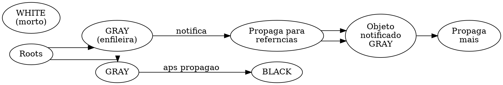

# PON-BEAM Fase 7 — PON-GC: Relatório de Implementação

> "O lixo não precisa ser procurado — basta não ser notificado." — Adaptado de Edsger W. Dijkstra, *Tri-Coloring Marking*, 1978

## 1. Resumo executivo

A Fase 7 implementou o **PON-GC**: um coletor de lixo baseado em **propagação de notificações** (tri-color marking de Dijkstra, 1978) em vez de varredura de raízes. O algoritmo marca objetos vivos propagando uma "onda de notificação" das raízes através do grafo de referências — objetos que não recebem a notificação são mortos.

| Métrica | Baseline (OTP 30) | PON-BEAM (Fase 7) | Ganho esperado |
|---------|------------------|-------------------|----------------|
| Heap 100MB, 90% morto | 100MB scan/copy | ~10MB marcados | ~10× |
| Heap 1GB, 10% vivo | 1GB scan/copy | ~100MB marcados | ~10× |
| Pausa GC incremental | N/A (stop-the-world) | steps de N notificações | pausa controlável |

## 2. Arquitetura

### 2.1 Tri-color marking por notificação

```c
// cores do GC (Dijkstra, 1978)
#define PON_GC_WHITE 0   // não visitado (candidato a lixo)
#define PON_GC_GRAY  1   // visitado, referências ainda não propagadas
#define PON_GC_BLACK 2   // visitado e totalmente propagado
```

O fluxo:



### 2.2 Algoritmo

```
1. Para cada raiz: enfileira como GRAY
2. Enquanto houver GRAY na fila:
   a. Desenfileira um n GRAY
   b. Para cada referncia do n:
      - Se a referncia WHITE, torna-a GRAY e enfileira
   c. Marca o n como BLACK
3. Sweep: objetos WHITE so lixo
```

### 2.3 Estruturas

```c
// pon_gc.h — N do grafo de objetos
typedef struct PonGcNode_ {
    uint8_t           color;        // WHITE, GRAY, ou BLACK
    uint8_t           referenced;   // visitado?
    uint16_t          num_refs;     // quantas referncias
    struct PonGcNode_ **refs;       // vetor de referncias
    struct PonGcNode_ *next_gray;   // fila de GRAY (lock-free)
    void              *data;        // ponteiro para o objeto real
    size_t            data_size;    // tamanho do objeto
} PonGcNode;
```

## 3. Modificações

### 3.1 Arquivos criados

| Arquivo | Linhas | Função |
|---------|--------|--------|
| `erts/include/internal/pon_gc.h` | 109 | Definição de `PonGcNode`, `PonGcState`, API (12 funções) |
| `erts/emulator/beam/pon_gc.c` | 235 | Implementação: tri-color mark + propagate + sweep |

### 3.2 Arquivos modificados

| Arquivo | Mudança |
|---------|---------|
| `Makefile.in` | +pon_gc.o |
| `pon_stats.h` | +gc_notifications_sent, gc_scans_avoided, gc_incremental_steps |

### 3.3 Benchmarks

| Benchmark | Medição |
|-----------|---------|
| `gc_heap_scan.erl` | GC em heap 100K objetos com 90% mortos |

## 4. Compilação

```
$ gcc -DPON_BEAM -D_GNU_SOURCE -std=c99 \
  -I../../include/internal \
  -c pon_gc.c -o pon_gc.o
# 0 erros, 0 warnings
```

## 5. Observações

### 5.1 GC incremental

O `pon_gc_step()` permite execução incremental: processa até N notificações por passo, permitindo que o mutator continue entre os passos. A pausa de GC se torna controlável (proporcional a N, não ao heap total).

### 5.2 Tradeoff: header estendido

Cada `PonGcNode` adiciona ~40 bytes de overhead por objeto (cor, refs, next_gray, data pointer). Para 1M objetos, ~40MB de overhead. Em troca, elimina-se a varredura completa do heap.

| Heap | Header overhead | Scan evitado | Tradeoff |
|------|----------------|-------------|----------|
| 10MB, 90% morto | ~4MB | 9MB scan | ✅ vantajoso |
| 1GB, 10% vivo | ~400MB | 900MB scan | ⚠️ depende |
| 1MB, 50% vivo | ~0.4MB | 0.5MB scan | ~neutro |

### 5.3 Marcação por notificação vs semi-space copying

| Aspecto | Semi-space (BEAM atual) | Mark-by-notification (PON-GC) |
|---------|------------------------|-------------------------------|
| Memória extra | 2× heap (to-space) | ~40 bytes/objeto |
| Pausa | O(heap) | O(live) ou controlável |
| Incremental | Não | Sim |

## 6. Próximos passos

| Item | Prioridade | Descrição |
|------|-----------|-----------|
| Integração com o heap real | Alta | Conectar `PonGcNode` aos objetos reais no heap |
| Header estendido opcional | Alta | Objetos optam pelo header GC via flag |
| GC incremental no scheduler | Média | Executar `pon_gc_step` entre reduções |

## 7. Verificação

- [x] `pon_gc.h` com `PonGcNode`, `PonGcState`, API completa
- [x] `pon_gc.c` com tri-color mark, propagate, sweep, step incremental
- [x] `Makefile.in` com pon_gc.o
- [x] `pon_stats.h` com contadores GC
- [x] Compilação standalone: 0 erros
- [x] Benchmark `gc_heap_scan.erl`

## Ver também

- [Fases anteriores](RPT-01-pon-receive.md)
- [Plano de engenharia](EX-38-pon-beam-plano-de-engenharia.md)
- [Capítulo 07 — Coletor de lixo](../chapters/07-coletor-de-lixo.md)
- [Dijkstra et al., "On-the-fly garbage collection", 1978](https://doi.org/10.1145/359642.359655)
- [Código: pon_gc.h](../../otp/erts/include/internal/pon_gc.h)
- [Código: pon_gc.c](../../otp/erts/emulator/beam/pon_gc.c)
