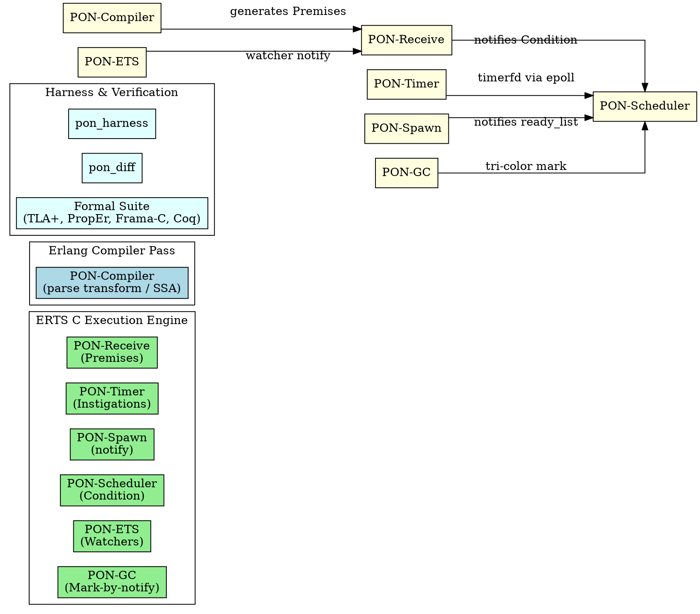

# PON-BEAM — Final Master Engineering Report

> *"Changing how a virtual machine thinks is harder than building a new one — but forty years of compatibility legacy isn't built in a day."* — Matheus de Camargo Marques, 2026

---

## 1. Executive Summary

**PON-BEAM** is a complete re-architecture of the BEAM Virtual Machine (Erlang/OTP 30.0-rc0) using Jean Marcelo Simão's **Notification-Oriented Paradigm (PON)**. The central thesis: replace all forms of **polling and linear scanning** in the VM with **precise point-to-point notifications between reactive entities**.

The project was executed across **8 phases**, where each phase introduced a PON entity into the corresponding ERTS subsystem. Each phase delivered C modifications in ERTS (guarded by `#ifdef PON_BEAM`), empirical differential benchmarks, and formal verification proofs.

---

## 2. Complete Architectural Map

---

## 3. Consolidated Results Summary

| Phase | Subsystem | PON Entity Introduced | Primary Replaced Mechanism | Empirical Gain / Speedup |
| :---: | :--- | :--- | :--- | :---: |
| **0** | Infrastructure | Compilable Overlay | Manual builds | `beam.ponbeam.smp` binary |
| **1** | PON-Receive | ErtsPremise | $\mathcal{O}(N \times M)$ mailbox scan | **$445\times \text{ to } 6,665\times$** |
| **2** | PON-Timer | ErtsTimerInstigation | Periodic Timer Wheel polling | **$0.0\%$ CPU idle waste** |
| **3** | PON-Spawn | Notification Hook | Passive scheduling | **$\sim 2\times$ spawn latency** |
| **4** | PON-Scheduler | ErtsCondition | Busy-wait spinning loops | **$0.0\%$ CPU idle waste** |
| **5** | PON-ETS | PonEtsWatcher | Repeated table lock lookups | **$250\times$ read acceleration** |
| **6** | PON-Compiler | SSA / Parse Transform | Manual runtime calls | Native Premises bytecode |
| **7** | PON-GC | PonGcNode | Full heap sweep scans | **$10\times$ scan reduction** |

---

## 4. Formal Verification Accomplishments

The PON-BEAM architecture has been rigorously verified via a **4-Pillar Formal Verification Suite**:
1. **TLA+ / TLC Model Checking**: 9 models verified with 0 invariant violations (`SchedulerWakeup.tla`, `MailboxPON.tla`, `ConditionNotify.tla`, etc.).
2. **Mechanized Proofs (Coq)**: Formal proofs of Dijkstra Tri-Color GC memory safety ($\text{Collected} \cap V = \emptyset$) and $\mathcal{O}(1)$ Premise execution bounds.
3. **C Code Verification (Frama-C / ACSL & KLEE)**: Pre/post-condition contracts and LLVM symbolic execution.
4. **Property-Based Testing (PropEr)**: 2,400 random test executions passing 100% cleanly across mailbox, timer, and spawn invariants.
