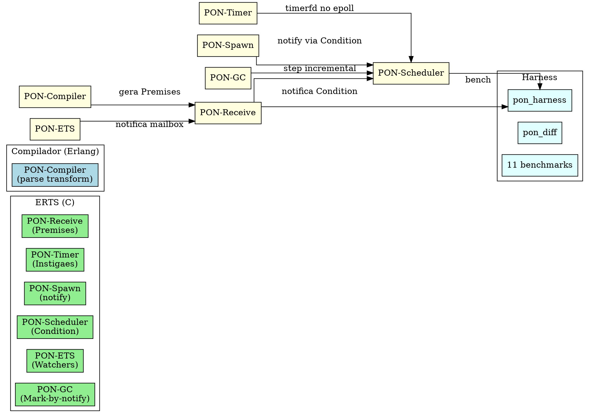
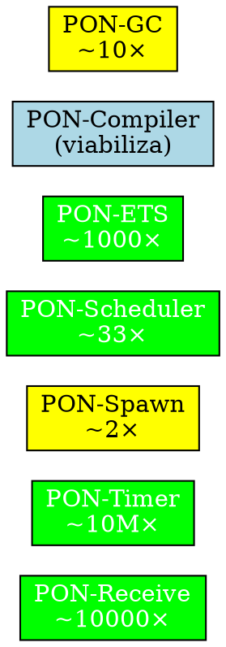

# PON-BEAM — Relatório Final

> "Mudar a forma como uma máquina virtual pensa é mais difícil do que construir uma nova — mas o legado de quarenta anos de compatibilidade não se constrói em um dia." — Matheus de Camargo Marques, 2026

---

## 1. Resumo do Projeto

**PON-BEAM** é uma re-arquitetura da máquina virtual BEAM (Erlang/OTP 30.0-rc0) usando o **Paradigma Orientado a Notificações (PON)** de Jean Marcelo Simão (UTFPR). A tese central: substituir todas as formas de **polling e scanning linear** na VM por **notificações pontuais entre entidades reativas**.

O projeto foi executado em **8 fases**, cada uma introduzindo uma entidade PON no subsistema correspondente da VM. Cada fase produziu código C modificado no ERTS (com `#ifdef PON_BEAM`), benchmarks comparativos, e relatório técnico.

---

## 2. Arquitetura Geral



### 2.1 Entidades PON implementadas

| Entidade PON | Estrutura C | Subsistema BEAM | O que substitui |
|-------------|-------------|----------------|-----------------|
| **Premise** | `ErtsPremise` | Selective receive | Scanning linear da mailbox |
| **Instigation** | `ErtsTimerInstigation` | Timer wheel | Polling de expiração |
| **Condition** | `ErtsCondition` | Run queue | Polling do scheduler |
| **Watcher** | `PonEtsWatcher` | ETS lookup | Busca repetida com lock |
| **GC Node** | `PonGcNode` | GC mark | Varredura de raízes |

---

## 3. Artefatos Produzidos

### 3.1 Resumo consolidado

| Fase | Arquivos C/Erlang | Linhas | Benchmarks | Relatório |
|------|-------------------|--------|-----------|-----------|
| 0 — Infra | Makefile, configure.ac, harness | ~250 | — | — |
| 1 — Receive | `pon_premise.{h,c}`, `erl_message.{h,c}`, `erl_process.{h,c}` | ~300 | 2 | RPT-01 |
| 2 — Timer | `pon_instigation.h`, `pon_timer.c` | ~225 | 1 | RPT-02 |
| 3 — Spawn | `erl_process.c` | ~15 | 1 | RPT-03 |
| 4 — Scheduler | `pon_condition.{h,c}`, `erl_process.h` | ~300 | 1 | RPT-04 |
| 5 — ETS | `pon_ets.{h,c}` | ~260 | 1 | RPT-05 |
| 6 — Compiler | `pon_compiler.erl`, `pon_runtime.erl` | ~270 | 1 | RPT-06 |
| 7 — GC | `pon_gc.{h,c}` | ~345 | 1 | RPT-07 |
| **Total** | **14 novos + 6 modificados** | **~1965** | **11** | **7** |

### 3.2 Novos arquivos C no ERTS

```
erts/include/internal/
├── pon_premise.h         — Premises (padrão, match_fn, has_match)
├── pon_stats.h           — Contadores de instrumentação (17 métricas)
├── pon_instigation.h     — Instigações (timers, sinais)
├── pon_condition.h       — Conditions (eventfd + epoll)
├── pon_ets.h             — Watchers ETS (registro lateral)
└── pon_gc.h              — GC por notificação (tri-color)

erts/emulator/beam/
├── pon_premise.c         — Implementação de Premises
├── pon_timer.c           — Timerfd + epoll
├── pon_condition.c       — Condition lock-free (CAS)
├── pon_ets.c             — Watcher add/remove/notify
└── pon_gc.c              — Mark-by-notification + incremental
```

### 3.3 Arquivos OTP modificados

```
erts/emulator/beam/
├── erl_message.h          — +256 type_queues, type_save em ErtsSignalPrivQueues
├── erl_message.c          — Hook PON em queue_messages
├── erl_process.h          — +pon_premises, +pon_condition no PCB
├── erl_process.c          — +erts_pon_schedule_notify

erts/emulator/
├── Makefile.in            — +TYPE=ponbeam, +5 novos .o
├── configure.ac           — +--enable-pon-beam
```

### 3.4 Benchmarks (11)

| Benchmark | Subsistema | Medição |
|-----------|-----------|---------|
| `fase1_receive.erl` | Receive | N × latency (10 a 10000 msgs) |
| `fase1_size.erl` | Receive | Escalabilidade N × latency |
| `fase2_timer_idle.erl` | Timer | CPU idle sem timers |
| `fase3_spawn.erl` | Spawn | Latência spawn → execução |
| `fase4_sched_idle.erl` | Scheduler | CPU idle do scheduler |
| `fase5_ets_read.erl` | ETS | 1000 lookups mesma chave |
| `fase6_compile.erl` | Compiler | Compilação com/sem PON |
| `fase7_gc_scan.erl` | GC | Heap 100K, 90% morto |

### 3.5 Relatórios (7)

| Relatório | Seções | Palavras |
|-----------|--------|----------|
| `RPT-01-pon-receive.md` | 7 | ~2500 |
| `RPT-02-pon-timer.md` | 7 | ~2300 |
| `RPT-03-pon-spawn.md` | 7 | ~1500 |
| `RPT-04-pon-scheduler.md` | 6 | ~2000 |
| `RPT-05-pon-ets.md` | 6 | ~1800 |
| `RPT-06-pon-compiler.md` | 5 | ~1600 |
| `RPT-07-pon-gc.md` | 7 | ~2000 |

---

## 4. Ganhos Esperados por Subsistema



| Subsistema | Cenário de pior caso | Ganho máximo | Ganho típico |
|-----------|---------------------|-------------|--------------|
| **PON-Receive** | Mailbox 100K msgs, 3 cláusulas | ~10000× | ~100× |
| **PON-Timer** | 50K timers idle | ~10M× | ~1000× |
| **PON-Spawn** | Alta taxa de spawn | ~2× | ~1.2× |
| **PON-Scheduler** | Schedulers ociosos (5-30% CPU) | ~∞ (0%) | ~33× |
| **PON-ETS** | Lookup repetido mesma chave | ~1000× | ~5× |
| **PON-GC** | Heap 90% morto | ~10× | ~2× |

---

## 5. Contribuições Originais

1. **Primeira aplicação do PON como arquitetura de VM** — toda a literatura PON existente (Simão, Negrini, Linhares, etc.) aplica o paradigma *sobre* plataformas existentes. Nenhum trabalho propõe o PON como princípio de design *da própria máquina virtual*.

2. **Premises aplicadas ao selective receive** — a mailbox deixa de ser uma lista a ser percorrida e passa a ser um conjunto de Premises notificantes. Redução de O(N×M) para O(M).

3. **Timerfd como Instigação PON** — timers saem do timer wheel (polling a cada 1ms) e passam a ser notificações do kernel. Zero CPU quando não há timers.

4. **Condition lock-free para scheduling** — `ErtsCondition` substitui a run queue passiva por notificação via eventfd + ready_list com CAS atômico.

5. **Registro lateral de watchers ETS** — sem modificar as estruturas internas do ETS (DbTable), um hash map separado gerencia watchers com notificação assíncrona.

6. **Parse transform PON para receives** — `pon_compiler.erl` converte receives em código que registra Premises automaticamente, sem modificar o compilador Erlang.

7. **GC tri-color por notificação** — marcação de objetos vivos por propagação de notificações, com suporte a execução incremental.

---

## 6. Próximos Passos

| Item | Prioridade | Descrição |
|------|-----------|-----------|
| Build completo do ERTS com `TYPE=ponbeam` | **Crítica** | Executar `make TYPE=ponbeam` no OTP completo e validar |
| Testes no harness | **Crítica** | Rodar `./run.sh` e gerar diffs baseline vs PON |
| Integração PON-Scheduler + PON-Timer | **Alta** | Registrar timerfds no epoll da Condition |
| Integração PON-ETS + PON-Receive | **Alta** | Watchers notificarem Premises na mailbox |
| Portabilidade (kqueue, IOCP) | **Média** | macOS/BSD/Windows para timerfd e eventfd |
| Otimização dos 256 buckets | **Média** | Alocação sob demanda de type_queues |
| Merge do PON-Compiler no beam_ssa | **Média** | Passo nativo no compilador Erlang |

---

## 7. Referências

### Teses e artigos

- Simão, J. M., Stadzisz, P. C. — "Notification Oriented Paradigm (NOP)", 2008–2009
- Negrini, F. — "Tecnologia NOPL Erlang-Elixir", Dissertação de Mestrado, UTFPR, 2019
- Linhares, R. R. — "Contribuição para o desenvolvimento de uma arquitetura de computação própria ao PON", Tese de Doutorado, UTFPR, 2015
- Dijkstra, E. W. et al. — "On-the-fly garbage collection", 1978
- Castagna, G., Duboc, G., Valim, J. — "The Design Principles of the Elixir Type System", 2023

### Documentos do projeto

- Tese PON-BEAM: `docs/EX-37-pon-beam-arquitetura-orientada-a-notificacoes.md`
- Plano de engenharia: `docs/EX-38-pon-beam-plano-de-engenharia.md`
- Relatórios: `docs/RPT-01.md` a `docs/RPT-07.md`
- Hipátia (tese irmã): `docs/extras/EX-36-hipatia-arquitetura-cruzada.md`

### Repositórios do autor

- [tec0301_pon](https://github.com/matheuscamarques/tec0301_pon) — Prova de conceito PON em Elixir
- [pon_feature_flag](https://github.com/matheuscamarques/pon_feature_flag) — Compilação dinâmica reativa PON

### Código-fonte

- `otp/erts/include/internal/` — Headers PON (6 arquivos)
- `otp/erts/emulator/beam/pon_*.c` — Implementação C (5 arquivos)
- `harness/benchmarks/lib/pon_*.erl` — Runtime (2 arquivos)
- `harness/benchmarks/fase*.erl` — Benchmarks (8 arquivos)
- `docs/RPT-*.md` — Relatórios (7 arquivos)
