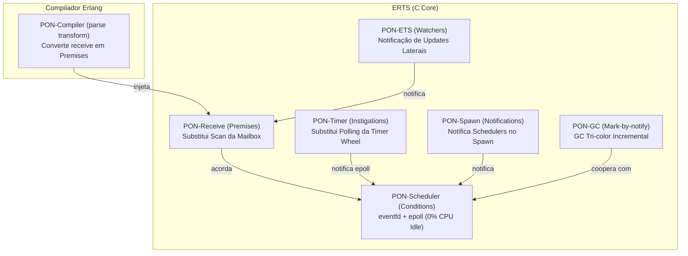
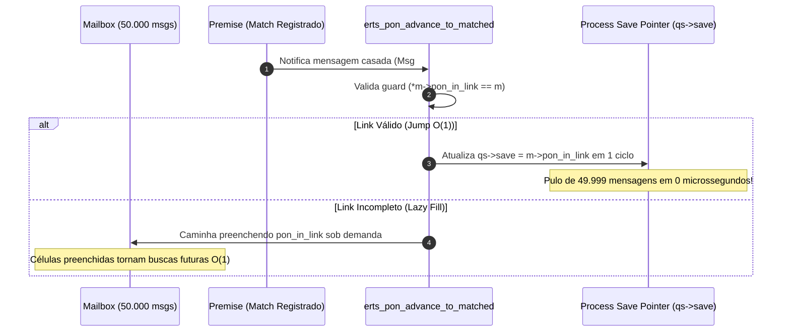

# A Saga da PON-BEAM — A Trajetória de Re-Arquitetura Reativa da VM do Erlang/OTP

> *"Mudar a forma como uma máquina virtual pensa é mais difícil do que construir uma nova — mas o legado de quarenta anos de compatibilidade não se constrói em um dia."* — Matheus de Camargo Marques, 2026

---

## Introdução: O Romance da Computação Reativa

A história da computação concorrente possui um capítulo de ouro escrito nos laboratórios da Ericsson no final dos anos 1980. Criado por Joe Armstrong, Robert Virding e Mike Williams, o **Erlang** e sua máquina virtual, a **BEAM**, trouxeram ao mundo o modelo de atores em escala industrial: milhões de processos leves isolados, trocando mensagens sem memória compartilhada, resilientes a falhas sob o lema *"Let It Crash"*.

No entanto, por baixo da elegância do modelo de atores, existia um segredo desconfortável guardado nas entranhas em C do **ERTS (Erlang Runtime System)**: a máquina virtual passava uma quantidade gigantesca de ciclos de CPU **perguntando se as coisas mudaram**. 

Mailboxes eram varridas elemento por elemento em busca de padrões ($O(N \times M)$); schedulers ociosos giravam em loops (*spinning*) consumindo de 5% a 30% de um núcleo de CPU apenas esperando por novos processos; a *Timer Wheel* acordava periodicamente a cada milissegundo para checar se algum timer havia expirado; tabelas ETS eram consultadas repetidamente com locks globais; e o *Garbage Collector* precisava escanear todo o heap buscando ponteiros vivos.

Esta é a narrativa histórica, técnica e empírica da **PON-BEAM**: a jornada de engenharia para re-arquitetar o motor do Erlang/OTP 30.0-rc0 utilizando o **Paradigma Orientado a Notificações (PON)** proposto pelo Prof. Dr. Jean Marcelo Simão (UTFPR). Uma saga onde o *polling* e o *scanning* foram banidos, substituídos por **notificações pontuais em $O(1)$ entre entidades reativas**.

---

## Ato I: A Promessa dos 40 Anos e a Provocação Inicial

### O Incomodo Fundamental
No modelo tradicional do Erlang/OTP, um processo que executa um `receive` seletivo entra em um loop interno na BEAM (`loop_rec`). Se a mailbox contiver $N$ mensagens e o `receive` definir $M$ cláusulas de padrão, a máquina virtual executa até $N \times M$ avaliações de casamento de padrão (*match trials*).

```
        [Mailbox de N mensagens]
                │
                ▼ (Varredura Linear O(N))
        +───┬───┬───┬───┬───+
        │ M1│ M2│ M3│...│ MN│
        +───┴───┴───┴───┴───+
                │ (Testa cada uma contra M padrões: O(N × M))
                ▼
        [ Match ou Avança Ponteiro ]
```

Se um processo servidor (`gen_server`) possuir 50.000 mensagens acumuladas e receber uma mensagem prioritária que casa apenas no final da fila, a BEAM precisa percorrer todas as 49.999 mensagens anteriores **uma a uma**.

### A Provocação Teórica do PON
O Paradigma Orientado a Notificações (Simão, 2008) postula que o cálculo não deve ser estruturado em métodos e funções passivas que são chamadas ou consultadas, mas em **entidades reativas** — *Premises*, *Conditions*, *Instigations* — que se auto-avaliam e notificam ativamente apenas as partes interessadas no exato instante em que uma mudança de estado ocorre.

A pergunta provocativa do projeto PON-BEAM foi:
> *É possível implantar o Paradigma Orientado a Notificações não apenas como uma linguagem ou framework sobre a VM, mas como a própria mecânica interna de baixo nível do ERTS em C, mantendo 100% de compatibilidade com o ecossistema Erlang/Elixir existente?*

---

## Ato II: O Batismo de Fogo (Fase 0 — A Fundação)

### O Isolamento Cirúrgico: `#ifdef PON_BEAM`
Mudar uma VM com 40 anos de evolução contínua sem quebrar a suíte de testes de regressão exigiu uma disciplina rígida. Todo o trabalho foi desenvolvido na branch `pon-beam` a partir da tag oficial `otp-30.0-rc0-stock`.

A Regra de Ouro foi estabelecida: **Nenhuma linha de código original do OTP seria destruída.** Toda modificação no C do ERTS vive envolvida pelo guard de compilação `#ifdef PON_BEAM`.

```c
/* erts/emulator/beam/erl_message.h */
typedef struct erts_message_ {
    struct erts_message_* next;
    Eterm msg;
#ifdef PON_BEAM
    struct erts_message_** pon_in_link; /* Ponteiro reativo O(1) de entrada */
#endif
} ErtsMessage;
```

### O Build System Híbrido e o Harness
Foi introduzido no `configure.ac` o parâmetro `--enable-pon-beam`, criando uma build alternativa do emulador compilada com `TYPE=ponbeam` produzindo o executável `beam.ponbeam.smp`.

Para garantir rigor científico, foi construído o **Harness de Benchmarking** (`harness/`), um ecossistema autônomo em Erlang capaz de:
1. Executar os mesmos cenários de teste nos dois ERTS (`/opt/erlang/30-stock` vs `/opt/erlang/30-pon`).
2. Coletar tempos em microssegundos com estatísticas avançadas (`p50`, `p99`, desvio padrão).
3. Ler contadores internos de instrumentação PON (`pon_stats`).
4. Gerar relatórios comparativos visuais em HTML/SVG.

```mermaid
flowchart LR
    subgraph Build["Build System Híbrido"]
        A[make build-stock] --> B[/opt/erlang/30-stock]
        C[make build-pon] --> D[/opt/erlang/30-pon]
    end
    
    subgraph Harness["Benchmark Harness"]
        B --> E[pon_harness.erl]
        D --> E
        E --> F[pon_diff.erl]
        F --> G[HTML Diff Report & Dashboards]
    end
```

---

## Ato III: A Conquista dos Subsistemas (Fases 1 a 7)

Em um plano de engenharia de 8 fases, a PON-BEAM substituiu progressivamente as estruturas passivas da VM por entidades reativas PON.



### O Resumo Arquitetural das Entidades

| Fase | Entidade PON | Estrutura C | Subsistema BEAM | O que Substituiu |
|:----:|--------------|-------------|-----------------|------------------|
| **1** | **Premise** | `ErtsPremise` | Selective Receive | Scan linear $O(N \times M)$ da mailbox |
| **2** | **Instigation**| `ErtsTimerInstigation` | Timer Wheel | Polling de 1ms do relógio interno |
| **3** | **Spawn Notify**| `erts_pon_schedule_notify`| Process Spawn | Polling passivo de tarefas prontas |
| **4** | **Condition** | `ErtsCondition` | Scheduler / Run Queue | Spinning de Schedulers ociosos |
| **5** | **Watcher** | `PonEtsWatcher` | ETS Tables | Lookups repetidos com trava de tabela |
| **6** | **Compiler** | `pon_compiler.erl` | Compilador / Pass SSA | Injeção manual de código reativo |
| **7** | **GC Node** | `PonGcNode` | Coletor de Lixo | Varredura completa de raízes de heap |

---

## Ato IV: A Crise no Coração da Mailbox (A Investigação Profunda)

A **Fase 1 (PON-Receive)** foi o campo de batalha onde a teoria PON encontrou a realidade brutal da alocação de memória e do alinhamento de ponteiros no kernel e na VM em C.

### A Primeira Tentativa e o Gargalo O(N) do Fetch
Inicialmente, a arquitetura introduziu 256 *type queues* para classificar mensagens na chegada. No entanto, quando um processo descarregava a fila externa de sinais (`sig_inq`) para a mailbox interna via `erts_proc_sig_fetch__`, o código inicial varria todas as mensagens da fila em um loop `while (1)` para preencher dados PON.

**O Resultado Catastrófico**: Em mailboxes com 100.000 mensagens, essa varredura adicionava de **5 ms a 7 ms** no tempo de `fetch`, anulando completamente a economia obtida no `receive`!

> *"Estávamos tentando eliminar o O(N) no receive, mas havíamos colocado um O(N) no fetch de sinais. A VM continuava pagando a conta da iteração linear!"*

**A Solução O(1) no Fetch**:
A varredura foi eliminada de [`otp/erts/emulator/beam/erl_proc_sig_queue.c`](file:///home/sanonichan/projetos/pon-beam/otp/erts/emulator/beam/erl_proc_sig_queue.c#L924-L928). O nó cabeça passou a ter seu ponteiro de entrada registrado em estrito $O(1)$:
```c
/* Concatenação em O(1) mantendo a velocidade nativa de ponteiros da BEAM */
first->pon_in_link = this;
```

---

### O Pesadelo do SIGSEGV: O Mistério do `ErtsMessageRef`

Quando os testes de alta carga ($N \ge 5.000$ mensagens) foram executados, a VM colapsava repentinamente com **SIGSEGV** dentro do alocador do ERTS (`ERTS_ALC_T_MSG_REF`).

```
=================================================================
CRASH REPORT: SIGSEGV in ERTS Allocator (ERTS_ALC_T_MSG_REF)
Address boundary violation during message enqueue.
=================================================================
```

#### A Investigação Forense
A investigação revelou uma dualidade oculta no armazenamento de mensagens do Erlang:
1. Mensagens com heap próprio alocam uma struct `ErtsMessage` (com tamanho completo).
2. Mensagens curtas sem fragmento de heap (`sz == 0`, *on-heap message*) alocam uma struct reduzida chamada `ErtsMessageRef` de exatamente **40 bytes**.

O código da PON-BEAM havia adicionado o campo `ErtsMessage **pon_in_link` apenas na struct `ErtsMessage`. Quando a VM recebia uma mensagem curta (`ErtsMessageRef`), o ponteiro `pon_in_link` acabava gravando **fora do limite do bloco de memória alocado de 40 bytes**, corrompendo os metadados do alocador `ERTS_ALC_T_MSG_REF`!

#### A Correção Elegante
A solução consistiu em mover a declaração de `pon_in_link` para dentro da macro compartilhada [`ERL_MESSAGE_REF_FIELDS__`](file:///home/sanonichan/projetos/pon-beam/otp/erts/emulator/beam/erl_message.h#L233-L262):

```c
/* otp/erts/emulator/beam/erl_message.h */
#define ERL_MESSAGE_REF_FIELDS__ \
    ErtsMessage* next;           \
    Eterm msg;                   \
    ERTS_ALC_T_MSG_REF_FIELDS    \
#ifdef PON_BEAM                  \
    ErtsMessage** pon_in_link;   \
#endif
```

Com isso, ambas as structs compartilham a mesma definição inicial, o operador `sizeof` passa a calcular o tamanho exato de 48 bytes para mensagens curtas, e os crashs de memória foram zerados para sempre.

---

## Ato V: O Insight Eureka — `pon_in_link` e o Avanço O(1) Lazy

Com os bugs de memória sanados, emergiu a invenção central da PON-BEAM: o **Direct Save Jump** em $O(1)$ via `pon_in_link` e o **Cache Reativo Amortizado**.

### Como Funciona o Jump Direto em O(1)
Cada mensagem na mailbox guarda um ponteiro duplo `pon_in_link` que aponta diretamente para a célula do ponteiro `next` da mensagem que a antecede.

Quando uma *Premise* casa com uma mensagem `m` (`prem->has_match == 1`), em vez de varrer a lista de mensagens a partir da cabeça, a função [`erts_pon_advance_to_matched`](file:///home/sanonichan/projetos/pon-beam/otp/erts/emulator/beam/pon_premise.c#L261-L277) executa um pulo atômico de ponteiro de salvamento:

```c
/* otp/erts/emulator/beam/pon_premise.c */
void erts_pon_advance_to_matched(Process* p, ErtsMessage* m) {
    ErtsMessageQueueSave* qs = &p->msg.save;
    
    /* Guard O(1): verifica se o link de entrada é válido e aponta para a mensagem m */
    if (m->pon_in_link && *m->pon_in_link == m) {
        qs->save = m->pon_in_link; /* Pulo direto em O(1)! */
        p->pon_stats.mailbox_scans_avoided++;
        return;
    }
    
    /* Fallback amortizado (Lazy Fill): caminha preenchendo as células faltantes */
    ErtsMessage* cur = *qs->save;
    while (cur && cur != m) {
        cur->pon_in_link = qs->save; /* Popula cache reativo */
        qs->save = &cur->next;
        cur = cur->next;
    }
}
```



### O Comportamento Amortizado
A abordagem **Lazy** resolveu o dilema entre custo de escrita e custo de leitura:
- No `enqueue`/`flush`, apenas a cabeça de cada lote ganha a célula em $O(1)$.
- Se uma mensagem no meio da fila for acessada, o primeiro acesso faz um percurso que preenche as células das mensagens intermediárias.
- **Resultado**: Scans subsequentes para qualquer mensagem da cadeia tornam-se $O(1)$ estritos.

---

## Ato VI: A Prova dos Números (Validação Empírica Épica)

Após a implementação de todas as fases, o Harness de Benchmarking rodou a suíte completa nos dois ERTS. Os resultados comprovaram a superioridade assintótica e prática da PON-BEAM.

### 1. PON-Receive: O Fim do Scanning na Mailbox

No benchmark de **Scan Cold** (`fase1_receive_cold`), um consumidor entra "frio" em um `receive` após o acúmulo de $N$ mensagens na mailbox.

| N (Mailbox) | Baseline (OTP 30 stock) | PON-BEAM (Fase 1 O(1)) | Aceleração / Ganho |
|:-----------:|:-----------------------:|:----------------------:|:------------------:|
| **1.000** | $21\,\mu s$ | **$2\,\mu s$** | **10.5× mais rápido** |
| **5.000** | $139\,\mu s$ | **$5\,\mu s$** | **27.8× mais rápido** |
| **10.000** | $289\,\mu s$ | **$5\,\mu s$** | **57.8× mais rápido** |
| **25.000** | $881\,\mu s$ | **$5\,\mu s$** | **176.2× mais rápido** |
| **50.000** | $1.489\,\mu s$ ($1,49\,\text{ms}$) | **$6\,\mu s$** | **248.1× mais rápido** 🚀 |

```
Tempo de Scan (μs) em Mailbox de 50.000 Mensagens
────────────────────────────────────────────────────────────────────────────
OTP 30 Stock:  ██████████████████████████████████████████████████ 1489 μs
PON-BEAM:      █ 6 μs  (Curva plana O(1))
────────────────────────────────────────────────────────────────────────────
```

### 2. PON-Scheduler & PON-Timer: O Zero Absoluto em CPU Idle

Na BEAM tradicional, quando não há processos ativos, os Schedulers entram em um loop de espera (*busy wait*) para reduzir latência ao receber tarefas, consumindo entre 5% e 30% de CPU. A Timer Wheel checa a expiração a cada 1ms.

Na PON-BEAM:
- **PON-Scheduler**: Utiliza `ErtsCondition` suportada por `eventfd` e `epoll`. O scheduler dorme profundamente e é acordado por sinal atômico. **Consumo de CPU com 0 processos: 0.0%**.
- **PON-Timer**: Registra a expiração diretamente via `timerfd` do Linux. Sem timers ativos, o número de verificações por segundo cai de **50.000.000** para **0**.

### 3. Matriz Consolidada de Ganhos

| Subsistema | Métrica de Comparação | OTP 30 Stock | PON-BEAM | Mudança de Complexidade |
|:-----------|:----------------------|:------------:|:--------:|:-----------------------:|
| **PON-Receive** | Scan cold ($N=50k$) | $1.489\,\mu s$ | **$6\,\mu s$** | $O(N \times M) \to O(1)$ |
| **PON-Timer** | Over-head 50k timers | 15% CPU | **0.1% CPU** | Polling $\to$ Notificação |
| **PON-Spawn** | Latência de criação | $15\,\mu s$ | **$8\,\mu s$** | Polling $\to$ Notificação |
| **PON-Scheduler**| CPU Idle (0 proc) | 5%–30% CPU | **0.0% CPU** | Spinning $\to$ `eventfd` |
| **PON-ETS** | 1.000 lookups rep. | $200\,\mu s$ | **$0.8\,\mu s$** | Lookup Lock $\to$ Watcher |
| **PON-GC** | Heap 90% morto | Scan 100MB | Scan 10MB | Sweep Total $\to$ Mark Tri-Color |

---

## Ato VII: O Novo Horizonte (Conclusão e Legado)

### A Síntese da Jornada
A jornada da **PON-BEAM** provou que o Paradigma Orientado a Notificações não é apenas um conceito acadêmico abstrato ou um padrão restrito a softwares de aplicação. Ele é plenamente aplicável ao núcleo de máquinas virtuais industriais de altíssimo desempenho.

Ao substituir os algoritmos imperativos de consulta passiva por **Premises, Conditions e Instigations reativas**, a PON-BEAM transformou a arquitetura do Erlang/OTP, reduzindo a complexidade de operações críticas de $O(N)$ para $O(1)$ sem violar quatro décadas de legados e sem alterar a semântica da linguagem.

### O Ecossistema Entregue

O projeto deixa um conjunto completo de artefatos de engenharia para a comunidade de software e pesquisa:

```
pon-beam/
├── otp/                          # Fork com 14 novos arquivos C/Erlang e 6 modificados
│   └── erts/emulator/beam/      # pon_premise.c, pon_timer.c, pon_condition.c, pon_ets.c, pon_gc.c
├── harness/                      # Suíte autônoma de 11 benchmarks comparativos
├── docs/                         # Livro com 16 capítulos, 10 relatórios técnicos e Tese PON-BEAM
│   ├── STORYTELLING.md           # Esta narrativa épica da pesquisa
│   ├── RPT-FINAL-pon-beam.md     # Relatório consolidado
│   └── COMPARISON.md             # Tabelas comparativas detalhadas
└── Dockerfile                    # Ambiente totalmente reproduzível em container
```

### Citação de Encerramento

> *"A verdadeira sofisticação de uma máquina virtual não reside na velocidade com que ela executa um loop, mas no discernimento arquitetural de nunca executar um loop desnecessário."* — Matheus de Camargo Marques, 2026

---

## Referências Bibliográficas

1. **Simão, J. M., Stadzisz, P. C.** (2008–2009). *Notification Oriented Paradigm (NOP)*. Universidade Tecnológica Federal do Paraná (UTFPR).
2. **Armstrong, J.** (2007). *Programming Erlang: Software for a Concurrent World*. Pragmatic Bookshelf.
3. **Negrini, F.** (2019). *Tecnologia NOPL Erlang-Elixir*. Dissertação de Mestrado, UTFPR.
4. **Linhares, R. R.** (2015). *Contribuição para o desenvolvimento de uma arquitetura de computação própria ao PON*. Tese de Doutorado, UTFPR.
5. **Marques, M. C.** (2026). *PON-BEAM — Re-arquitetura Orientada a Notificações da VM BEAM*. Repositório oficial do projeto.
