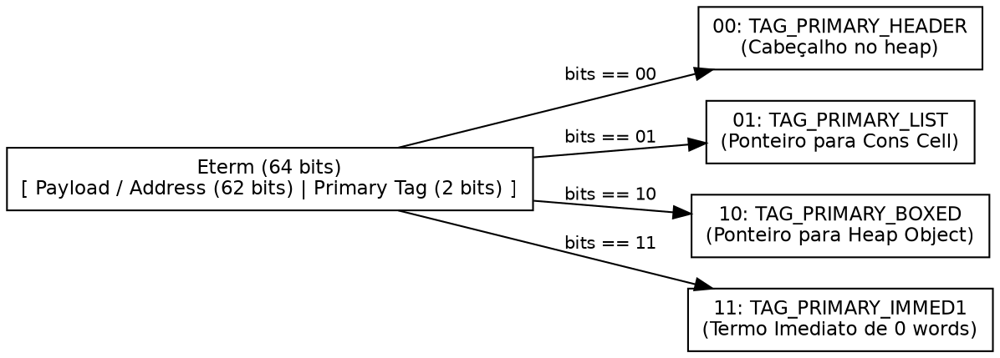
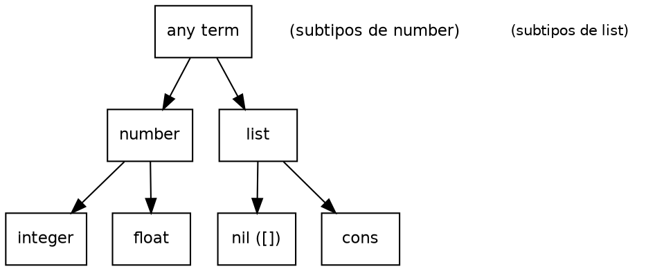
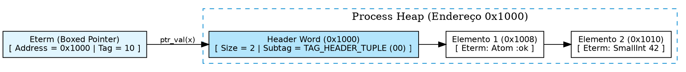
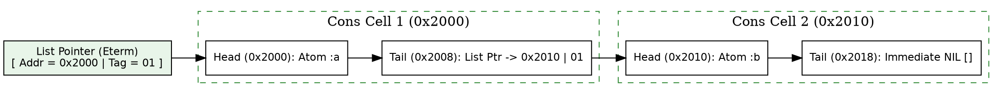
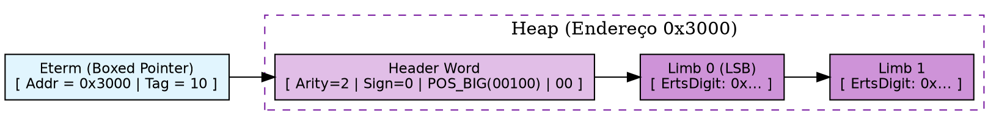
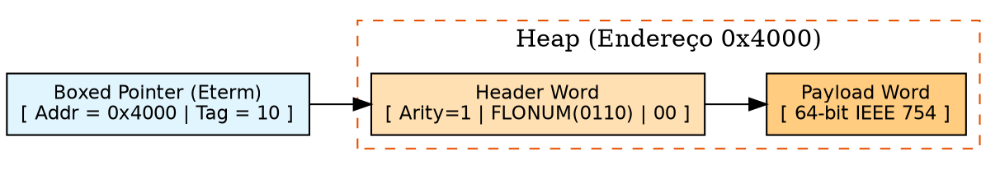
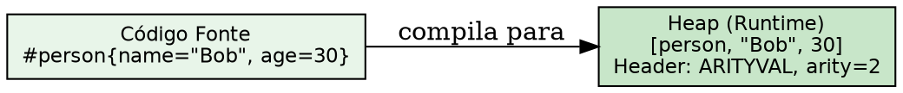

# Representação de termos: sistema de tipos, tags e alocação

> "A percepção visual e simbólica baseia-se na detecção imediata de traços primários em milissegundos antes do processamento profundo."
> — Stanislas Dehaene, *Reading in the Brain*, 2009

## Objetivos de leitura

- Dominar o esquema de tagging de 64 bits do tipo `Eterm` e o sistema de tipos do Erlang
- Distinguir termos immediates (0 palavras no heap) de termos alocados no heap
- Mapear a representação interna de todos os tipos: immediates (small ints, átomos, PIDs, ports, catch, nil), boxed (tuplas, bignums, floats, references, records, maps, binários, strings)
- Compreender o layout interno de bignums (limbs, sign bit, algoritmos I_add/I_mul/I_div), floats IEEE 754, references de 82 bits e records como compile-time sugar
- Entender a representação de strings como listas de inteiros Unicode e o conceito de IO Lists
- Medir empiricamente o tamanho em palavras de termos usando BIFs do sistema

> 💡 **Âncora Cognitiva — A Etiqueta do Aeroporto:** Pense na palavra `Eterm` como a etiqueta de código de barras colada em uma mala de viagem. Os funcionários do aeroporto (a BEAM) não precisam abrir a mala nem revistar o conteúdo para saber se ela vai para o porão de carga (um objeto alocado no heap) ou se é uma bagagem de mão leve. Eles simplesmente escaneiam os 2 bits finais da etiqueta (a `primary_tag`). Se for `11`, a bagagem cabe no próprio código de barras (imediato de 0 palavras)!

## 1. O tipo universal: `Eterm`

Na máquina virtual BEAM, todos os valores do Erlang/Elixir (inteiros, átomos, tuplas, listas, PIDs, binários, mapas) são representados internamente em C pelo mesmo tipo escalar: a palavra de 64 bits `Eterm` (`otp/erts/emulator/beam/erl_term.h:42`).

```c
typedef UWord Eterm;
```

Para determinar o tipo do valor sem estruturas adicionais ou ponteiros para vtables, a BEAM utiliza **tagged pointers** (ponteiros marcados). Os bits menos significativos da própria palavra `Eterm` contêm a **primary tag** do valor. Como o alinhamento de memória em 64-bit é de 8 bytes (terminados em `000`), os 3 bits inferiores ficam livres para armazenar informações de tipo.

### As quatro Primary Tags (2 bits)

Os 2 bits menos significativos definem a `primary_tag` (`erl_term.h:74-78`):

| Bit 1 | Bit 0 | Constante C | Descrição |
| :---: | :---: | :--- | :--- |
| `0` | `0` | `TAG_PRIMARY_HEADER` (`0x0`) | Cabeçalho de objeto alocado no heap (tuplas, mapas, etc.) |
| `0` | `1` | `TAG_PRIMARY_LIST` (`0x1`) | Ponteiro para uma cons cell de lista (par de palavras) |
| `1` | `0` | `TAG_PRIMARY_BOXED` (`0x2`) | Ponteiro para um objeto complexo no heap com cabeçalho |
| `1` | `1` | `TAG_PRIMARY_IMMED1` (`0x3`) | Termo imediato que cabe inteiramente na palavra (sem heap) |



```c
#define primary_tag(x)      ((x) & _TAG_PRIMARY_MASK)
#define _TAG_PRIMARY_MASK   0x3
```

`erl_term.h:79-84` — extração da tag primária via máscara de bits $O(1)$.

### 1.5 O sistema de tipos do Erlang

Erlang é **strongly typed** e **dynamically typed**. Não existe coerção implícita entre tipos — `1 + "foo"` lança uma exceção em runtime, nunca em compile time. O compilador não verifica tipos estaticamente; toda verificação ocorre durante a execução, na instrução BEAM `test` correspondente.

O type lattice do Erlang é relativamente plano:



Erlang possui dois operadores de igualdade: `==` (igualdade aritmética) e `=:=` (igualdade exata). `1 == 1.0` é verdadeiro (o inteiro é convertido para float antes da comparação), mas `1 =:= 1.0` é falso — e `=:=` é o operador usado em pattern matching. A regra geral: na comparação aritmética, o tipo de menor precisão é convertido para o de maior precisão; na igualdade exata, nenhuma conversão ocorre.

A ordem total entre termos heterogêneos segue a hierarquia (`erl_term.c:350-420`):

$$\text{number} < \text{atom} < \text{reference} < \text{fun} < \text{port} < \text{pid} < \text{tuple} < \text{map} < \text{list} < \text{binary}$$

Para estruturas compostas (tuplas, listas), a ordenação é recursiva: `{1, 2} < {1, 3}`. Maps são comparados primeiro por tamanho (menor número de chaves é menor), depois por chaves em ordem (inteiros < floats), depois por pares valor-a-valor com comparação aritmética — portanto `#{1 => 1.0} == #{1 => 1}` mas `#{1.0 => 1} /= #{1 => 1}`.

> 💡 **Âncora Cognitiva — O Alfaiate de Tipos:** Pense no sistema de tipos do Erlang como um alfaiate que só veste a roupa no cliente na hora (runtime). Ele não adivinha medidas (compile time). Cada peça (termo) traz uma etiqueta costurada (a tag) que diz exatamente que tipo é — e se você tentar usar uma calça como camisa, o alfaiate simplesmente recusa na hora, sem converter nada.

## 2. Immediates: valores sem heap (0 words)

Termos cuja tag primária é `TAG_PRIMARY_IMMED1` (`11`) são chamados de **immediates**. Eles ocupam **zero palavras no heap do processo**. O valor inteiro do dado está codificado dentro dos 60 bits restantes da palavra `Eterm`.

### 2.1 A hierarquia de subtags dos imediatos

O sistema de tags dos imediatos é organizado em **dois níveis de subtags**, usando 4 bits no primeiro nível (`_TAG_IMMED1_SIZE = 4`) e 6 bits no segundo (`_TAG_IMMED2_SIZE = 6`) (`erl_term.h:79-90`):

| Bits 3-2 | Bits 1-0 | Constante | Tipo | Descrição |
| :---: | :---: | :--- | :--- | :--- |
| `00` | `11` | `_TAG_IMMED1_PID` (0x3) | PID Local | Identificador de processo |
| `01` | `11` | `_TAG_IMMED1_PORT` (0x7) | Port Local | Identificador de port |
| `10` | `11` | `_TAG_IMMED1_IMMED2` (0xB) | Immed2 | Segundo nível de subtag (átomos, catch, nil) |
| `11` | `11` | `_TAG_IMMED1_SMALL` (0xF) | Small Integer | Inteiro de até 60 bits |

Dentro do `_TAG_IMMED1_IMMED2` (0xB), os bits 4-5 formam o segundo nível:

| Bits 5-4 | Bits 3-0 | Constante | Tipo |
| :---: | :---: | :--- | :--- |
| `00` | `10 11` | `_TAG_IMMED2_ATOM` (0x2B) | Átomo |
| `01` | `10 11` | `_TAG_IMMED2_CATCH` (0x6B) | Catch (continuation pointer) |
| `11` | `10 11` | `_TAG_IMMED2_NIL` (0xEB) | Nil (lista vazia `[]`) |

### 2.2 Small Integers

Inteiros que cabem em 60 bits (com sinal) são representados como `_TAG_IMMED1_SMALL` (`0xF`), alcance de $-2^{59}$ a $2^{59}-1$ (`erl_term.h:84`).

```c
#define make_small(val)     (((Eterm)(val) << _HEIGHT_SMALL) | _TAG_IMMED1_SMALL)
```

`erl_term.h:120` — criação de um small integer. Operações aritméticas com dois small integers usam a macro `is_both_small` como otimização de dispatch (`erl_term.h:285-289`):

```c
#define is_both_small(x,y) (((x) & (y) & _TAG_IMMED1_MASK) == _TAG_IMMED1_SMALL)
```

Se ambos os operandos tiverem os 4 bits de tag como `1111`, o `&` bit a bit preserva `1111` e a comparação é verdadeira — um teste de **palavra única** que não requer acesso à memória. Essa macro é usada com `ERTS_LIKELY` nas instruções aritméticas para seguir o fast path sem branches especulativos (`emu/arith_instrs.tab:98`).

### 2.3 PIDs Locais: layout bit a bit

PIDs locais usam `_TAG_IMMED1_PID` (`0x3`). Os 60 bits de payload são subdivididos em três campos (`erl_term.h:81`):

```
  Bits 63-62 | Bits 61-60 | Bits 59-0
  [creation] | [serial]   | [process index]
```

Em um sistema 64-bit típico, o process index (15 bits) é um offset na **process table**, o serial (13 bits) permite reusar índices de processos mortos sem colisão, e o creation (2 bits) desambigua entre reinícios do nó. Quando você imprime um PID no shell (`<Node.Index.Serial>`), o creation aparece como o node. Como o PID inteiro cabe em uma palavra, a comparação de igualdade (`=:=`) entre PIDs reduz-se a uma única comparação de inteiros.

### 2.4 Ports Locais

Ports usam `_TAG_IMMED1_PORT` (`0x7`), com o mesmo layout de PIDs: um campo de número da port + serial + creation (`erl_term.h:82`). A comparação de igualdade também é $O(1)$.

### 2.5 Átomos: a Atom Table e a struct `Atom`

Átomos são imediatos `_TAG_IMMED2_ATOM` (`0x2B`). O payload armazena um índice (60 bits) na **Atom Table** global (`erts_atom_table`), uma tabela de hash de todos os átomos já criados.

A struct C interna de cada entrada da Atom Table (`atom.h:50-59`):

```c
typedef struct atom {
    IndexSlot slot;      /* MUST BE LOCATED AT TOP OF STRUCT!!! */
    Sint16 len;          /* length of atom name (UTF-8 encoded) */
    Sint16 latin1_chars; /* 0-255 if atom can be encoded in latin1; otherwise, -1 */
    int ord0;            /* ordinal value of first 3 bytes + 7 bits */
    union{
        byte* name;      /* name of atom, used by templates */
        Eterm bin;       /* name of atom, used when atom is in table*/
    } u;
} Atom;
```

O campo `ord0` armazena o valor ordinal dos primeiros 3 bytes do nome do átomo (+7 bits extras), permitindo comparação eficiente de ordem entre átomos **desde que eles não compartilhem as primeiras 4 letras**. Se você gera átomos como `foo_1, foo_2, foo_3...`, todos compartilham o prefixo `foo_` e a comparação de ordem precisará percorrer o nome completo — uma micro degradação.

### 2.6 Catch: o continuation pointer pós-exceção

Catch é um imediato `_TAG_IMMED2_CATCH` (`0x6B`) usado **exclusivamente na stack**. Ele armazena um endereço indireto para o ponto de execução onde o controle deve continuar após uma exceção (`erl_term.h:89,1385-1386`).

```c
#define make_catch(x)  (((x) << _TAG_IMMED2_SIZE) | _TAG_IMMED2_CATCH)
#define is_catch(x)    (((x) & _TAG_IMMED2_MASK) == _TAG_IMMED2_CATCH)
```

A macro `KILL_CATCHES(p)` no scheduler zera a pilha de catches de um processo (`erl_process.h:1580`).

### 2.7 Nil e THE_NON_VALUE

`_TAG_IMMED2_NIL` (`0xEB`) representa a lista vazia `[]` (`erl_term.h:90`). O restante da palavra é preenchido com bits `1`.

`THE_NON_VALUE` não é um imediato comum — é definido como `_make_header(0, _TAG_HEADER_FLOAT)` (`erl_term.h:375`), um hack que reusa o subtag de float como sentinela para "nenhum valor" (resultado de exceção, operação cancelada). A macro `is_non_value(x)` testa igualidade contra essa constante sentinela.

## 3. Boxed terms: ponteiros com marcação

Quando um valor excede 60 bits (tuplas, mapas, bignums, floats, binários), ele é alocado no heap como um **heap object** com tag `TAG_PRIMARY_BOXED` (`10`, `0x2`).

O payload contém o endereço apontando para o primeiro elemento no heap. A VM desfaz a marcação subtraindo a tag:

```c
#define ptr_val(x)          ((Eterm*)((x) - TAG_PRIMARY_BOXED))
```

`erl_term.h:145` — como o endereço era alinhado em 8 bytes (terminado em `000`), somar `0x2` resulta em `010`. Subtrair `TAG_PRIMARY_BOXED` (`2`) restaura o ponteiro C original.

### Cabeçalhos de Heap Objects (`TAG_PRIMARY_HEADER`)

O primeiro elemento de qualquer objeto alocado no heap apontado por um boxed pointer é uma palavra de cabeçalho (`TAG_PRIMARY_HEADER`, `00`), especificando a subtag e o tamanho em palavras (`erl_term.h:160-180`): `TAG_HEADER_TUPLE` (tupla de N elementos), `TAG_HEADER_FLOAT` (float de 64 bits), `TAG_HEADER_MAP` (mapa).



> ❓ **Não Existem Perguntas Idiotas**  
> **Leitor:** Se um número inteiro for menor que $2^{59}$, ele é armazenado no heap do processo ou não?  
> **Resposta:** Não! Ele é um `Small Integer` (`TAG_IMMED1_SMALL`, `0xF`). Ele vive inteiramente dentro dos 60 bits da própria palavra `Eterm`. Você pode criar milhões de small integers sem gastar um único byte do heap do seu processo!

## 4. Cons cells: a lista encadeada da BEAM

As listas possuem a primary tag `TAG_PRIMARY_LIST` (`01`, `0x1`). O ponteiro aponta para uma **cons cell** alocada no heap contendo exatamente **duas palavras contíguas** (`erl_term.h:110-115`):

1. **Head (`CAR`):** O `Eterm` do elemento atual.
2. **Tail (`CDR`):** O `Eterm` apontando para o restante da lista (outra cons cell ou `NIL` `[]`).



Como não há palavra de cabeçalho (overhead de 0 words além das 2 palavras de dados), a lista é compacta: cada elemento custa exatas 2 palavras (16 bytes).

```c
#define list_val(x)         ((Eterm*)((x) - TAG_PRIMARY_LIST))
#define CAR(hp)             ((hp)[0])
#define CDR(hp)             ((hp)[1])
```

`erl_term.h:114-116` — extração de `CAR` e `CDR`.

### 4.1 Proper lists, improper lists e a economia contra tuplas

Em Erlang, uma **proper list** termina com `NIL` (`[]`) na última cons cell. Uma **improper list** como `[1 | 2]` termina com um termo não-lista no tail — a última cons cell tem `CDR = 2` (um small integer). Funções que esperam proper lists (como `lists:map/2`) surpreendem-se ao encontrar `[1 | 2]`.

Cada cons cell `[A | B]` usa **2 palavras** (head + tail, sem cabeçalho). Comparado a um tupla boxed `{A, B}` que usa **3 palavras** (header + 2 elementos), a cons cell economiza **33% de memória** por par. Essa economia reflete-se também em velocidade: inicializar 2 palavras no heap é mais rápido que inicializar 3.

## 5. Bignums: inteiros além de 60 bits

Quando um inteiro não cabe nos 60 bits de um small integer, ele é alocado no heap como um **bignum** — um boxed term com subtag `POS_BIG_SUBTAG` (0x2, positivo) ou `NEG_BIG_SUBTAG` (0x3, negativo) (`erl_term.h:132-135`).

```c
#define POS_BIG_SUBTAG   __MAKE_SUBTAG(0x2)
#define NEG_BIG_SUBTAG   __MAKE_SUBTAG(0x3)
```

### 5.1 Layout do header bignum

A header word de um bignum codifica o sinal no bit 2 da subtag (`_BIG_SIGN_BIT`) e o número de **limbs** (dígitos) nos bits superiores:

```
  Bits 63-6 | Bit 5 | Bit 4 | Bits 3-2 | Bits 1-0
  [arity]   | sign  |  001  |    00    |   HEADER (00)
```

`big.h:29` define o tipo do dígito:

```c
typedef Uint ErtsDigit;
```

Em sistemas 64-bit, cada `ErtsDigit` é um `Uint` de 64 bits; em 32-bit, é um `Uint` de 32 bits. `BIG_V(xp)` retorna um ponteiro `ErtsDigit*` para o primeiro limb (least significant word) (`big.h:68,71`):

```c
#define BIG_V(xp)        ((ErtsDigit*)((xp)+1))
#define BIG_DIGIT(xp,i)  *(BIG_V(xp)+(i))
```

Os limbs são armazenados em ordem **little-endian** (limb menos significativo primeiro).

### 5.2 Operações aritméticas multi-precision

A aritmética de bignums vive em `big.c` e opera diretamente sobre os arrays `ErtsDigit*`:

- `I_add`: percorre limbs com propagação de carry (`big.c:3652-3654`)
- `I_sub`: percorre limbs com propagação de borrow (`big.c:3661-3663`)
- `I_mul`: usa algoritmo quadrático schoolbook para poucos limbs, ou **Karatsuba** (`I_mul_karatsuba`) para operandos acima de um threshold (`big.c`)
- `I_div`: implementa o **Algorithm D** de Knuth para divisão de múltipla precisão (`big.c:3812-3817`)
- `big_norm`: função estática que recompõe o header (subtag, arity, sign) e pode **reintegrar** o resultado como small immediate se couber nos 60 bits (`big.c:3246`)



> ❓ **Não Existem Perguntas Idiotas**  
> **Leitor:** Então um bignum de 1000 bits ocupa 1000/64 ≈ 16 limbs no heap? Isso não é terrivelmente lento para comparar?  
> **Resposta:** Comparação de bignums é $O(n)$ no número de limbs. Mas na prática, a maioria dos inteiros cabe em small int (60 bits). Bignums só aparecem em criptografia, hash ou matemática de precisão arbitrária — e nesses casos, o custo da computação domina o custo da comparação.

## 6. Floats: ponto flutuante na VM

Floats são boxed terms com subtag `FLOAT_SUBTAG` (0x6) (`erl_term.h:138,159`). Cada float ocupa **exatas 2 palavras** no heap:

1. **Header word**: `_TAG_HEADER_FLOAT` com arity 1, subtag `0110`, primary tag `00`
2. **Payload word**: 64 bits IEEE 754 representando o valor em ponto flutuante (`erl_term.h:479-481`)

```c
#define _TAG_HEADER_FLOAT  (TAG_PRIMARY_HEADER | FLOAT_SUBTAG)
#define HEADER_FLONUM      _make_header(1, _TAG_HEADER_FLOAT)
```

O payload é tratado como opaco pelo garbage collector — a VM não inspeciona os bits do float, apenas o copia ou descarta como bloco. Operações aritméticas de float usam instruções nativas da CPU quando disponíveis, ou software fallback.



## 7. References: o contador de 82 bits

Uma **reference** (`make_ref/0`) é um termo "único" usado para etiquetar mensagens e implementar canais sobre mailboxes. Internamente, reference é um boxed term com subtag `REF_SUBTAG` (0x4) (`erl_term.h:136`).

Seu valor é um contador de **82 bits** que incrementa a cada chamada de `make_ref/0`. O contador leva aproximadamente $9.6 \times 10^{24}$ chamadas para wrappear — essencialmente impossível dentro da vida de um nó.

O tamanho em palavras depende da arquitetura:

- **32-bit**: 4 palavras (1 header + 3 words de dados: Data0, Data1, Data2)
- **64-bit**: 3 palavras (1 header + 2 words de dados)

A constante `ERTS_REF_THING_SIZE` em `erl_term.h:990` define o tamanho em `Uint`:

```c
#define ERTS_REF_THING_SIZE (sizeof(ErtsORefThing)/sizeof(Uint))
```

A representação em 32-bit espalha os 82 bits assim:

```
  Header:  [ Arity=3 | REF(0100) | 00 ]
  Data0:   [ bits 17-0 do contador ]
  Data1:   [ bits 49-18 do contador ]
  Data2:   [ bits 81-50 do contador ]
```

O valor completo é recombinado como `(Data2 bsl 50) + (Data1 bsl 18) + Data0`. A BIF `erts_make_ref_in_buffer` em `erl_bif_unique.h:39` preenche o buffer de `ERTS_REF_THING_SIZE` words.

## 8. Strings, Unicode e IO Lists

### 8.1 Strings como listas de inteiros

Em Erlang, uma string `"hello"` é açúcar sintático para a lista `[104,101,108,108,111]` — uma lista de inteiros representando code points Unicode. O shell tenta detectar listas de caracteres imprimíveis e exibi-las como strings:

```console
$ erl -noshell -eval 'io:format("~p~n", [[88,89,90]]), halt().'
"XYZ"
```

Cada caractere em uma string ocupa **2 palavras na cons cell** (head + tail) em um heap 64-bit — 16 bytes por caractere. Em contraste, o mesmo texto em UTF-8 ocuparia 1 byte por caractere latino. Strings em Erlang são, portanto, uma estrutura temporária para **text buffers** que você percorre com pattern matching — não para armazenamento persistente. Para isso, use binários (`<<>>`).

### 8.2 Unicode e a opção `+pc unicode`

O shell Erlang usa por padrão o range Latin-1 (0-255) para detectar strings. Para exibir code points Unicode completos (gregos, cirílicos, CJK):

```console
$ erl +pc unicode -noshell -eval 'io:format("~p~n", [[955, 960, 963]]), halt().'
"λπσ"
```

A opção `+pc unicode` expande a detecção de "caractere imprimível" para todo o range Unicode, mas não altera a representação em memória — continua sendo uma lista de inteiros.

### 8.3 IO Lists

**IO Lists** estendem o conceito de strings para compor saída de I/O sem cópia. Uma IO list é uma estrutura aninhada de binários, listas, strings e inteiros:

```erlang
IOList = ["Hello ", <<"world">>, $\n, [<<"more">>]]
```

O driver de I/O percorre a estrutura em profundidade e emite cada fragmento sequencialmente, **sem achatar (flatten)** a lista em uma nova string. Isso permite concatenar gigabytes de dados com zero alocação além das cons cells originais.

## 9. Records: compile-time sugar sobre tuplas

Records em Erlang são puramente **compile-time**: um record `#foo{a=1, b=2}` compila para uma tupla `{foo, 1, 2}`. O primeiro elemento é o átomo com o nome do record; os campos seguem na ordem da declaração.

A VM reconhece records através do subtag `RECORD_SUBTAG` (0x7) (`erl_term.h:139,167`):

```c
#define RECORD_SUBTAG  __MAKE_SUBTAG(0x7)
#define _TAG_HEADER_RECORD (TAG_PRIMARY_HEADER | RECORD_SUBTAG)
```

Records são **transparentes** para o GC — `header_is_transparent` trata `RECORD_SUBTAG` como `ARITYVAL_SUBTAG`, significando que o GC varre todos os elementos sem distinção (`erl_term.h:170-172`). Macros de acesso e atualização (`record_info/2`, `is_record/2`, `setelement/3`) operam por índice fixo, sem overhead de lookup em runtime.



## 10. Tabela completa de subtags de header

A header word de objetos alocados no heap usa 4 bits para a subtag e 26+ bits para a arity (ou tamanho em palavras) (`erl_term.h:95-168`):

```c
#define _TAG_HEADER_MASK      0x3F
#define _HEADER_ARITY_OFFS    6
#define _HEADER_SUBTAG_MASK   0x3C    /* 4 bits for subtag */
```

| Subtag (4 bits) | Constante C | Tipo | Descrição |
| :---: | :--- | :--- | :--- |
| `0000` | `ARITYVAL_SUBTAG` | **Tuple** | Tupla de N elementos |
| `0001` | — | *FREE* | Não usado |
| `0010` | `POS_BIG_SUBTAG` | **Bignum positivo** | Big integer, sinal positivo |
| `0011` | `NEG_BIG_SUBTAG` | **Bignum negativo** | Big integer, sinal negativo |
| `0100` | `REF_SUBTAG` | **Reference** | `make_ref/0` counter |
| `0101` | `FUN_SUBTAG` | **Fun** | Closure/fun reference |
| `0110` | `FLOAT_SUBTAG` | **Float** | 64-bit IEEE 754 |
| `0111` | `RECORD_SUBTAG` | **Record** | Compile-time tuple sugar |
| `1000` | `HEAP_BITS_SUBTAG` | **Heap binary** | Binary ≤ 64 bytes no heap |
| `1001` | `SUB_BITS_SUBTAG` | **Sub binary** | Fatia de outro binary (zero-copy) |
| `1010` | `BIN_REF_SUBTAG` | **ProcBin (Refc)** | Binary off-heap ref-counted |
| `1011` | `MAP_SUBTAG` | **Map** | Mapa chave-valor |
| `1100` | `EXTERNAL_PID_SUBTAG` | **External PID** | PID de outro nó |
| `1101` | `EXTERNAL_PORT_SUBTAG` | **External Port** | Port de outro nó |
| `1110` | `EXTERNAL_REF_SUBTAG` | **External Ref** | Ref de outro nó |
| `1111` | — | *FREE* | Reservado para external terms |

`erl_term.h:100-172` — definição completa de todas as subtags.

## 11. Literal Area: constantes imutáveis

Termos literais definidos no código (ex: `{:ok, "sucesso"}`) vivem na **Literal Area** gerenciada pela VM (`erl_alloc.c`).

Ponteiros para literais recebem a flag `TAG_LITERAL_PTR` (`0x4`) em 64-bit (`erl_term.h:55-67`). A macro `erts_is_literal` em `global.h:1572` identifica o termo e faz o Garbage Collector ignorá-lo, garantindo tempo de GC $O(1)$ para constantes.

## 12. A ordem total dos termos

Erlang e Elixir permitem comparar quaisquer dois termos (`<`, `>`, `<=`, `>=`) através de uma **ordem total rígida entre tipos** em C (`erl_term.c:350-420`):

$$\text{number} < \text{atom} < \text{reference} < \text{fun} < \text{port} < \text{pid} < \text{tuple} < \text{map} < \text{list} < \text{binary}$$

## 14. Experimentos: medindo o tamanho de termos na prática

```console
$ erl -noshell -eval '
  io:format("small int: ~p words~n", [erts_debug:flat_size(42)]),
  io:format("atom: ~p words~n", [erts_debug:flat_size(ola)]),
  io:format("tuple 2: ~p words~n", [erts_debug:flat_size({1, 2})]),
  io:format("list 2: ~p words~n", [erts_debug:flat_size([1, 2])]),
  io:format("empty tuple: ~p words~n", [erts_debug:flat_size({})]),
  io:format("float: ~p words~n", [erts_debug:flat_size(3.14)]),
  io:format("bignum: ~p words~n", [erts_debug:flat_size(2**100)]),
  io:format("ref: ~p words~n", [erts_debug:flat_size(make_ref())]),
  io:format("string \"hi\": ~p words~n", [erts_debug:flat_size("hi")]),
  io:format("record: ~p words~n", [erts_debug:flat_size({person, "Bob", 30})]),
  halt().'
small int: 0 words
atom: 0 words
tuple 2: 3 words
list 2: 4 words
empty tuple: 0 words
float: 2 words
bignum: 5 words
ref: 3 words
string "hi": 4 words
record: 3 words
```

- **Small Int (`42`) & Átomo (`ola`):** `0 words` (immediates).
- **Tupla de 2 elementos (`{1, 2}`):** `3 words` ($1 \text{ header} + 2 \text{ elem}$).
- **Lista de 2 elementos (`[1, 2]`):** `4 words` ($2 \text{ cons cells} \times 2 \text{ words}$).
- **Tupla vazia (`{}`):** `0 words` (imediato pré-alocado).
- **Float (`3.14`):** `2 words` ($1 \text{ header} + \text{payload}$), confirmando §6.
- **Bignum (`2**100`):** `5 words` ($1 \text{ header} + 4 \text{ limbs}$), confirmando §5.
- **Ref (`make_ref()`):** `3 words` ($1 \text{ header} + 2 \text{ data words}$), confirmando §7.
- **String `"hi"`:** `4 words` (2 cons cells × 2 words), confirmando §8.
- **Record:** `3 words` — mesmo que uma tupla de 2 elementos (header + person atom + "Bob").

Experimento adicional — comparação `==` vs `=:=`:

```console
$ erl -noshell -eval '
  io:format("1 == 1.0: ~p~n", [1 == 1.0]),
  io:format("1 =:= 1.0: ~p~n", [1 =:= 1.0]),
  io:format("1000 < :atom: ~p~n", [1000 < atom]),
  halt().'
1 == 1.0: true
1 =:= 1.0: false
1000 < :atom: true
```

## 15. Tabela resumida de tags e overhead

| Tipo | Primary Tag | Subtag / Bits | Onde reside | Custo no Heap |
| :--- | :--- | :--- | :--- | :--- |
| **Small Integer** | `11` (`IMMED1`) | `1111` (`0xF`) | Na própria palavra | **0 words** |
| **PID** | `11` (`IMMED1`) | `0011` (`0x3`) | Na própria palavra | **0 words** |
| **Port** | `11` (`IMMED1`) | `0111` (`0x7`) | Na própria palavra | **0 words** |
| **Atom** | `11` (`IMMED1`) | `101011` (`0x2B`) | Na própria palavra (índice) | **0 words** |
| **Catch** | `11` (`IMMED1`) | `011011` (`0x6B`) | Apenas na stack | **0 words** |
| **Nil (`[]`)** | `11` (`IMMED1`) | `111011` (`0xEB`) | Na própria palavra | **0 words** |
| **List (Cons Cell)** | `01` (`LIST`) | — | Heap do Processo | **2 words** por elemento |
| **Tuple (N elem)** | `10` (`BOXED`) | `0000` (ARITYVAL) | Heap do Processo | **$N + 1$ words** |
| **Bignum (N limbs)** | `10` (`BOXED`) | `0010` (POS) / `0011` (NEG) | Heap do Processo | **$N + 1$ words** |
| **Float** | `10` (`BOXED`) | `0110` (FLONUM) | Heap do Processo | **2 words** |
| **Reference** | `10` (`BOXED`) | `0100` (REF) | Heap do Processo | **3 words** (64-bit) |
| **Record (N campos)** | `10` (`BOXED`) | `0111` (RECORD) | Heap do Processo | **$N + 1$ words** |
| **Map** | `10` (`BOXED`) | `1011` (MAP) | Heap do Processo | variável |
| **Fun** | `10` (`BOXED`) | `0101` (FUN) | Heap do Processo | variável |
| **Heap Binary (≤ 64B)** | `10` (`BOXED`) | `1000` (HEAP_BITS) | Heap do Processo | variável |
| **ProcBin (Refc)** | `10` (`BOXED`) | `1010` (BIN_REF) | Off-heap + ponteiro | 24 bytes no heap |
| **Literal** | `10` (`BOXED`) | `TAG_LITERAL_PTR` (`0x4`) | Literal Area | **0 words** no heap |

### Bate-papo à beira da lareira com a palavra escalar `Eterm`

**Leitor:** Olá, `Eterm`! Como você consegue disfarçar inteiros, tuplas, átomos e listas em uma única palavra de 64 bits?  
**`Eterm`:** Olá! O truque está nos meus 2 bits menos significativos (`primary_tag`). Como a memória C é alinhada em 8 bytes, os ponteiros sempre terminam em `000`. Eu aproveito esses 2 bits livres: se forem `11`, sou um imediato e carrego o valor direto no meu peito. Se forem `10` ou `01`, sirvo como um ponteiro guiado para o heap!

## A Lente Multidisciplinar

> **Cognitivo / Computacional.** "A percepção visual e simbólica baseia-se na detecção imediata de traços primários em milissegundos antes do processamento profundo." — Stanislas Dehaene, *Reading in the Brain*, 2009  
> *A máscara `primary_tag(x) & 0x3` funciona como um detector perceptivo primário em 2 bits. Conforme Herbert Simon (1979) demonstrou no chunking simbólico, encodar átomos como índices de 60 bits para a Atom Table compacta a memória do sistema com alocação zero no heap. A macro `is_both_small` estende o princípio: em um único `&` bit a bit, a VM sabe se ambos os operandos são small ints — sem branches, sem acesso a memória.*

> **Sociológico / Computacional.** "Uma moldura (frame) institucional estabelece as regras de interpretação dos elementos mantidos em seu interior." — Erving Goffman, *Frame Analysis*, 1974  
> *A palavra de cabeçalho (`TAG_PRIMARY_HEADER`) atua como a moldura de Goffman: ela declara antecipadamente à VM a extensão e a interpretação dos campos no heap. A indireção `ptr_val(x)` garante segurança de tipos com custo $O(1)$ (Liskov, 1977). O bignum estende a metáfora: a header word declara o sinal (bit 2) e o número de limbs, como uma certidão de nascimento que declara sexo e filhos.*

> **Jurídico / Algorítmico.** "Fatos e atos jurídicos consolidados produzem efeitos erga omnes, imunes à revisão por jurisdições ordinárias." — Pontes de Miranda, *Tratado de Direito Privado*, 1954  
> *A Literal Area é a memória pública coletiva da BEAM: a flag `TAG_LITERAL_PTR` (`0x4`) confere imunidade aos literais no GC local. A ordem total rígida de termos (`number < atom < tuple < list`) estabelece o ordenamento unívoco (Hart, 1961) exigido por estruturas como mapas e ETS.*

> **Algorítmico / Biológico.** "O algoritmo de Karatsuba divide números grandes em metades, reduzindo a complexidade de $O(n^2)$ para $O(n^{\log_2 3})$." — Donald Knuth, *The Art of Computer Programming*, 1968  
> *A aritmética de bignums da BEAM espelha a homeostase celular descrita por Claude Bernard: quando um small integer "cresce" além de 60 bits, o ERTS reorganiza a representação em limbs no heap (multi-precision), e se o valor encolher, `big_norm` reintegra o termo a small int — anabolismo e catabolismo de precisão.*

> **Computacional / Arquiteturas Cognitivas.** "A representação de conhecimento em sistemas simbólicos exige estruturas que minimizem o custo de matching e unificação." — Allen Newell, *Unified Theories of Cognition*, 1990  
> *Records como compile-time sugar sobre tuplas eliminam o custo de lookup em runtime: o nome do record vira o primeiro elemento da tupla e os campos são acessados por índice fixo. Strings como listas de inteiros permitem pattern matching estrutural — a cabeça da string é o primeiro elemento da cons cell, sem necessidade de uma operação de indexing separada.*

## 30 Exercícios práticos e conceituais

### Bloco A — Questões Conceituais e Fundamentos (1–8)

1. **Qual o sistema de tipos do Erlang?** Explique "strongly typed" e "dynamically typed". Dê um exemplo de operação que falha em runtime.

2. **Qual a diferença entre `==` e `=:=`?** Por que `1 == 1.0` é `true` mas `1 =:= 1.0` é `false`? Qual é usado em pattern matching?

3. **Quantos bits tem a primary tag e quais as 4 categorias?** Dê o valor binário de cada uma (`erl_term.h:74-78`).

4. **Qual a hierarquia de subtags dos imediatos?** Dê os valores de `_TAG_IMMED1_PID`, `_TAG_IMMED1_PORT`, `_TAG_IMMED1_SMALL` e os três tipos dentro de `_TAG_IMMED1_IMMED2`.

5. **O que é `is_both_small` e como ela funciona?** Explique a macro `(x & y & 0xF) == 0xF` (`erl_term.h:285-289`).

6. **Como o layout de um PID é organizado nos 60 bits de payload?** Quais os campos e para que serve cada um?

7. **O que contém a struct `Atom` no ERTS?** Explique os campos `len`, `ord0`, e por que átomos com prefixos iguais comparam mais devagar (`atom.h:50-59`).

8. **O que é `THE_NON_VALUE`?** Por que ele reusa o subtag de float? (`erl_term.h:375`)

### Bloco B — Análise de Código Fonte e Verificação `file:line` (9–16)

9. **Localize `_TAG_IMMED1_PID`, `_TAG_IMMED1_PORT` e `_TAG_IMMED1_SMALL`** em `erl_term.h:79-84`. Quais os valores hexa de cada um?

10. **Encontre `_TAG_IMMED2_ATOM`, `_TAG_IMMED2_CATCH` e `_TAG_IMMED2_NIL`** em `erl_term.h:86-90`. Quantos bits de subtag cada um ocupa?

11. **Analise `make_catch` e `is_catch`** em `erl_term.h:1385-1386`. Onde catch é usado na stack e o que `KILL_CATCHES` faz? (`erl_process.h:1580`)

12. **Localize `POS_BIG_SUBTAG` e `NEG_BIG_SUBTAG`** em `erl_term.h:132-135`. Como o bit de sinal é representado?

13. **Encontre as macros `BIG_V` e `BIG_DIGIT`** em `big.h:68,71`. Como acessar o i-ésimo limb de um bignum?

14. **Localize `FLOAT_SUBTAG` e `_TAG_HEADER_FLOAT`** em `erl_term.h:138,159`. Quantas palavras um float ocupa e qual o formato do payload?

15. **Encontre `ERTS_REF_THING_SIZE`** em `erl_term.h:990**. Quantas palavras uma reference ocupa em 64-bit? E em 32-bit?

16. **Localize `RECORD_SUBTAG` e `_TAG_HEADER_RECORD`** em `erl_term.h:139,167`. Por que records são "transparentes" para o GC? (`erl_term.h:170-172`)

### Bloco C — Experimentos Práticos (17–24)

17. **Meça `erts_debug:flat_size/1`** para `42`, `:hello`, `{1,2,3}`, `[1,2,3]` e `{}`. Quais são immediates e quais alocam no heap?

18. **Meça o custo de um float** com `erts_debug:flat_size(3.14)`. O resultado confirma 2 words? Por que?

19. **Gere um bignum** com `X = 2**100` e meça com `flat_size`. Quantos limbs são necessários para representar $2^{100}$? ($100/60 \approx 1.67$, logo 2 limbs? O resultado empírico confirma?)

20. **Crie uma reference** com `R = make_ref()` e meça com `flat_size`. O resultado corresponde a 3 words? Teste se duas refs consecutivas são `==` ou `=/=`.

21. **Teste a comparação `==` vs `=:=`**: Compare `1 == 1.0`, `1 =:= 1.0`, `2 == 2.0`, `#{1 => 1.0} == #{1 => 1}`. Explique cada resultado.

22. **Teste a comparação de ordem heterogênea**: `1000 < :atom`, `{1} < [1]`, `:a < :b`, `make_ref() < self()`. Verifique a hierarquia de tipos.

23. **Use `+pc unicode`** e exiba uma string grega: `erl +pc unicode -noshell -eval 'io:format("~p~n", [[955, 960, 963]]), halt().'`. O que acontece sem `+pc unicode`?

24. **Crie um record simulado** com `R = {person, "Bob", 30}` e meça com `flat_size`. O resultado é o mesmo que uma tupla de 2 elementos? Por que records são idênticos a tuplas em runtime?

### Bloco D — Pontes Cognitivas, Invariantes e Desafios de Arquitetura (25–30)

25. **Invariante do sistema de tags**: Demonstre que todo `Eterm` pertence a exatamente uma das 4 categorias de primary tag. O que aconteceria se um bit corrompido produzisse `01` onde deveria ser `11`?

26. **Ponte Cognitiva — Karatsuba e homeostase celular**: A aritmética de bignums usa Karatsuba para multiplicação e `big_norm` para reintegrar small ints. Como esse ciclo de expansão/contração lembra o anabolismo e catabolismo celular (Claude Bernard)?

27. **Arquitetura — Por que bignums usam limbs little-endian?** A ordem little-endian (LSB primeiro) simplifica carry/borrow propagation em I_add/I_sub. Por que isso é mais eficiente que big-endian?

28. **Desafio — Proper vs improper lists**: O que torna uma lista "proper"? Escreva uma função Erlang que detecta se uma lista é proper (termina com `[]`). Por que `lists:map/2` quebra com `[1 | 2]`?

29. **Ponte Cognitiva — Strings como listas vs binários**: Uma string `"hello mundo"` ocupa 11 cons cells (22 words em 64-bit). O mesmo texto em UTF-8 binário ocupa 11 bytes. Projete um experimento com `flat_size` e `term_to_binary` para comparar os dois formatos. Em que cenário usar string é vantajoso?

30. **Desafio de Arquitetura — IO Lists vs Flatten**: Duas abordagens para escrever 1 GB de texto: (a) concatenar tudo em uma string gigante (`lists:flatten`) e escrever de uma vez; (b) construir uma IO list aninhada com pedaços de 1 MB e passar para o driver. Por que (b) é mais eficiente? Qual o papel das cons cells nessa estratégia?

## Resumo para memorização

> 🧠 **Mnemônico IBHL** (pronuncia-se "ível"): **I**mmediate (tag `11`), **B**oxed (tag `10`), **H**eader (tag `00`), **L**ist (tag `01`). Ordene: `00 01 10 11`.
>
> 🧠 **Mnemônico — 3 BFRs**: **B**ignum (`001x`), **F**loat (`0110`), **R**eference (`0100`). "**B**ig **F**loats **R**equire boxing".

- **Primary Tags**: `00`=Header, `01`=List, `10`=Boxed, `11`=Immed1 (`erl_term.h:74-78`).
- **Immediates (0 words)**: PID, Port, Small Int, Atom, Catch, Nil — cada um com subtag específica (`erl_term.h:79-90`). `is_both_small` testa dois small ints em 1 ciclo (`erl_term.h:285`).
- **Cons Cells (2 words)**: Tag `01`, sem header. Proper list termina em NIL. Improper list surpreende `lists:map/2`.
- **Boxed Terms**: `ptr_val(x)=x-2`. Header = subtag(4 bits) + arity. Bignum (limbs LE + sign), Float (IEEE 754, 2w), Ref (82-bit counter, 3w), Record (compile-time sugar, subtag `0111`) (`erl_term.h:145`, `big.h:29`).
- **Strings**: Listas de inteiros Unicode (16 bytes/char). IO Lists para I/O sem flatten.
- **Ordem total + type system**: `number < atom < ref < fun < port < pid < tuple < map < list < binary`. Strong + dynamic typing. `==` converte; `=:=` exato (pattern match) (`erl_term.c:350-420`).
- **Literal Area**: Flag `TAG_LITERAL_PTR (0x4)` imune ao GC (`global.h:1572`).

## Ver também

- [Capítulo 04 — Anatomia do ERTS](CH-04.html)
- [Capítulo 06 — Heaps e memória](CH-06.html)
- [Capítulo 14 — Binaries](CH-14.html)
- [Extra — Mnemônicos, exercícios e reflexões complementares](extras/EX-05.html)
- [Flashcards deste capítulo](FL-05.html)
- [Lógica de predicados deste capítulo](PL-05.html)
- [Grafo de conhecimento deste capítulo](KG-05.html)
- [Erlang Efficiency Guide — Memory](https://www.erlang.org/doc/efficiency_guide/advanced.html)
