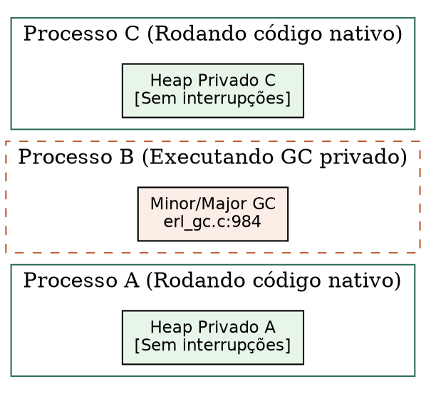
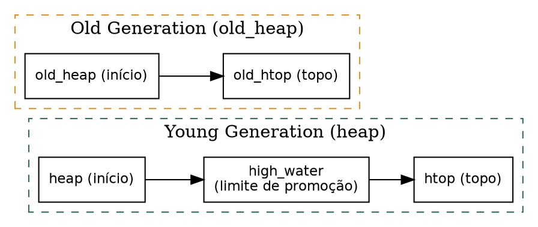
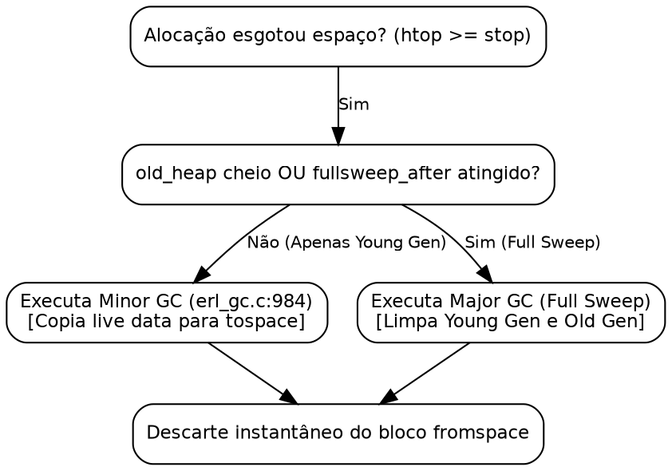

# Coletor de lixo

> "A vida é uma reciclagem perpétua: a matéria permanece a mesma, apenas a organização das formas se renova."
> — Claude Bernard, *Introduction à l'étude de la médecine expérimentale*, 1865

## Objetivos de leitura

- Dominar o funcionamento do **Garbage Collector generacional** privado por processo na BEAM.
- Compreender a diferença entre a **Young Generation** (novo heap) e a **Old Generation** (heap antigo).
- Acompanhar o algoritmo do **Copying Garbage Collector** (Cheney's copying collector) e os **Forwarding Pointers**.
- Entender como a VM aloca os ponteiros de raiz (*roots*): stack, registradores, mailbox e `high_water`.
- Medir a atividade do GC em runtime com `process_info/2` e simular coletas com `garbage_collect/1`.

> 💡 **Âncora Cognitiva — A Mudança de Apartamento (Copying Collector):** Imagine que o seu apartamento acumulou tanta bagunça e poeira que tentar passar aspirador de pó em cada cômodo levaria horas. Em vez de varrer o lixo, a BEAM usa a estratégia da mudança: ela aloca um apartamento novinho e limpo do mesmo tamanho (`tospace`), transporta apenas as caixas e móveis que você realmente utiliza (*live data*), e entrega as chaves do apartamento antigo (`fromspace`) com a poeira e o lixo direto para a imobiliária. O lixo não é limpo item por item; ele simplesmente desaparece com o descarte do bloco antigo!

## 1. Coleta de lixo por processo: o fim do "Stop the World"

A principal virtude do modelo de concorrência da BEAM é que o Garbage Collection é **estritamente privado por processo**. Em plataformas com heap global compartilhado (como a JVM do Java ou o V8 do JavaScript), o coletor de lixo precisa frequentemente pausar a execução de todas as threads da aplicação (*Stop the World*) para varrer com segurança as referências cruzadas de memória.

Na BEAM, como os heaps dos processos são isolados (`otp/erts/emulator/beam/erl_process.h:1043`), cada processo executa o seu GC de forma totalmente independente.



Quando o Processo B esgota seu espaço livre (`htop >= stop`) e invoca o GC em `otp/erts/emulator/beam/erl_gc.c:984`, os Processos A e C continuam executando código nativo em seus schedulers a toda velocidade, sem sofrer qualquer latência de bloqueio.

## 2. A arquitetura generacional: Young Gen vs. Old Gen

A BEAM adota a **hipótese generacional da memória**: a vasta maioria dos termos criados em programas funcionais (variáveis temporárias em chamadas recursivas, mensagens curtas, tuplas intermediárias) possui vida extremamente curta.

Para otimizar o desempenho, o heap do processo é dividido em duas gerações (`otp/erts/emulator/beam/erl_process.h:1051-1090`):

1. **Young Generation (Heap Principal):** Onde todas as novas alocações ocorrem. O GC nesta área é chamado de **Minor GC**.
2. **Old Generation (`old_heap`):** Armazena termos de longa vida que sobrevivam a coletas no Young Heap. O GC nesta área é chamado de **Major GC** (ou *Full Sweep GC*).

```c
Eterm* heap;                /* Young heap start */
Eterm* htop;                /* Young heap top */
Eterm* old_heap;            /* Old heap start */
Eterm* old_htop;            /* Old heap top */
Eterm* high_water;          /* Point on young heap where old data ends */
```

`otp/erts/emulator/beam/erl_process.h:1051-1056` — o ponteiro `high_water` marca o limite no Young Heap a partir do qual os dados sobreviventes são elegíveis para promoção (*tenuring*) para o `old_heap`.



## 3. O Algoritmo do Copying Collector e os Forwarding Pointers

Quando o Minor GC é ativado pela função `erts_garbage_collect` (`otp/erts/emulator/beam/erl_gc.c:984`), a VM aloca um novo bloco de memória limpo chamado **tospace** e executa o algoritmo de cópia de Cheney (*Cheney's copying collector*).

### 3.1 Identificação do Conjunto de Raízes (*Roots*)

O GC não varre o heap inteiro do início ao fim; ele começa inspecionando exclusivamente o **conjunto de raízes (root set)**:

- Os registradores da BEAM e a pilha de execução (variáveis locais entre `stop` e `hend`).
- As mensagens na fila do processo (`mailbox` e `heap_fragments`).
- Dicionários do processo e termos salvos na struct `Process`.

### 3.2 Cópias de Cons Cells e Boxed Terms

Para cada ponteiro no conjunto de raízes apontando para o Young Heap, o GC copia o dado para o `tospace` e substitui o valor original no `fromspace` por um **Forwarding Pointer** (ponteiro de redirecionamento).

Se outro ponteiro na pilha ou em uma tupla apontar para o mesmo objeto no `fromspace`, a VM detecta o Forwarding Pointer e atualiza a referência sem duplicar o objeto na memória!

```c
ERTS_GLB_INLINE void move_cons(Eterm *ERTS_RESTRICT ptr, Eterm car, Eterm **hpp, Eterm *orig)
{
    Eterm *ERTS_RESTRICT htop = *hpp;
    Eterm gval;

    htop[0] = car;               /* Copia o elemento head (CAR) */
    htop[1] = ptr[1];            /* Copia a cauda (CDR) */
    gval    = make_list(htop);   /* Cria o novo ponteiro alinhado com tag 01 */
    *orig   = gval;              /* Atualiza a referência original */
    ptr[0]  = THE_NON_VALUE;     /* Grava o marcador de forwarding no old cons */
    ptr[1]  = gval;              /* Grava o novo endereço para redirecionamento */
    *hpp   += 2;                 /* Avança o topo do tospace */
}
```

`otp/erts/emulator/beam/erl_gc.h:39-56` — a função `move_cons` grava a constante especial `THE_NON_VALUE` em `ptr[0]` como marcador de que a *cons cell* já foi movida para o `tospace`.

```c
ERTS_GLB_INLINE Eterm* move_boxed(Eterm *ERTS_RESTRICT ptr, Eterm hdr, Eterm **hpp, Eterm *orig)
{
    Eterm gval;
    Sint nelts;
    Eterm *ERTS_RESTRICT htop = *hpp;

    nelts = header_arity(hdr);
    ...
    gval    = make_boxed(htop);  /* Novo boxed pointer com tag 10 */
    *orig   = gval;              /* Atualiza a referência original */
    *htop++ = hdr;               /* Copia o cabeçalho no tospace */
    *ptr++  = gval;              /* Substitui a header word pelo forwarding pointer */
    ...
}
```

`otp/erts/emulator/beam/erl_gc.h:58-95` — para boxed terms (tuplas, mapas, floats), a própria header word no `fromspace` é substituída pelo novo `make_boxed(htop)`.

> ❓ **Não Existem Perguntas Idiotas**  
> **Leitor:** Por que a BEAM escolheu um Copying Collector que precisa de espaço extra na RAM em vez de um algoritmo de marcação e compactação no mesmo lugar (*Mark-and-Sweep in-place*)?  
> **Resposta:** Porque o Copying Collector varre apenas a memória viva (*live data*)! Se o processo tiver 100 MB de dados mortos e apenas 1 KB de dados vivos na pilha, o Copying Collector copia exatos 1 KB e libera os 100 MB instantaneamente. Além disso, ao copiar em ordem, o algoritmo elimina a fragmentação da memória e deixa todos os elementos perfeitamente contíguos no novo heap!

## 4. O Ciclo Completo: Minor GC, Major GC e Hibernação

1. **Minor GC (Coleta Jovem):** Ativado quando o Young Heap enche. Varre o conjunto de raízes, move os dados vivos para o `tospace` e descarta o `fromspace`. Se os dados vivos ultrapassarem o limite `high_water`, eles são promovidos para o `old_heap`.
2. **Major GC (Full Sweep):** Ativado quando o `old_heap` fica cheio, quando a contagem `gen_gcs` atinge o limite (`fullsweep_after`) ou quando o processo é forçado por `garbage_collect/1`. O Major GC limpa tanto a Young Gen quanto a Old Gen simultaneamente.
3. **Hibernação (`garbage_collect_hibernate`):** Quando um processo executa `Process.hibernate/3` ou `:erlang.hibernate/3`, a VM invoca `erts_garbage_collect_hibernate` (`otp/erts/emulator/beam/erl_gc.c:1129`). Ela descarta a Old Gen, reduz o Young Heap para o tamanho mínimo exato dos dados vivos e zera o excesso de RAM.



## 5. Experimentos: Observando o GC em Ação no Terminal

Podemos inspecionar as estatísticas de GC de qualquer processo no REPL e acionar coletas manuais:

```console
$ erl -noshell -eval '
  P = self(),
  io:format("antes gc: ~p~n", [element(2, process_info(P, garbage_collection))]),
  garbage_collect(P),
  io:format("depois gc: ~p~n", [element(2, process_info(P, garbage_collection))]),
  halt().'
antes gc: [{min_bin_vheap_size,46422},
           {min_heap_size,233},
           {fullsweep_after,65535},
           {minor_gcs,0}]
depois gc: [{min_bin_vheap_size,46422},
            {min_heap_size,233},
            {fullsweep_after,65535},
            {minor_gcs,1}]
```

Observação: A chamada `garbage_collect(self())` incrementou o contador `minor_gcs` para `1` e compactou a memória do processo.

### Bate-papo à beira da lareira com o Process GC (`erl_gc.c`)

**Leitor:** Olá, `Process GC`! É verdade que você é um especialista em "mudanças de apartamento"?  
**`erl_gc.c`:** Olá! Exatamente! Quando o Young Heap enche, eu não perco tempo limpando o lixo. Eu aloco um bloco novinho em folha (`tospace`), sigo as raízes da pilha e movo apenas os objetos vivos usando `move_cons` (`erl_gc.h:39`) e `move_boxed` (`erl_gc.h:58`). E o melhor: deixo um *Forwarding Pointer* no lugar original para que ninguém se perca na mudança!

## A Lente Multidisciplinar

> **Biológico / Computacional.** "A conservação de energia e a integridade de um organismo dependem da reciclagem constante de moléculas desgastadas." — Claude Bernard, *Introduction à l'étude de la médecine expérimentale*, 1865  
> *O Copying Collector da BEAM é a expressão da reciclagem celular: em vez de acumular resíduos, desfaz-se do bloco antigo de uma só vez. Como Brooks (2010) destaca, o algoritmo de Cheney reduz a complexidade do GC de $O(\text{heap})$ para $O(\text{live data})$.*

> **Jurídico / Sociológico.** "Órgãos jurisdicionais autônomos resolvem demandas locais sem paralisar o funcionamento dos demais poderes da República." — Hans Kelsen, *Teoria Pura do Direito*, 1960  
> *O GC privado por processo é a aplicação estrita da autonomia federativa: cada processo limpa seu próprio heap sem invocar uma pausa central "Stop the World" sobre os demais schedulers da VM (Weber, 1922).*

> **Estoico / Algorítmico.** "Desapega-te do que é transitório e retém apenas o que é essencial à tua razão." — Sêneca, *Cartas a Lucílio*, Carta 71  
> *A separação entre Young Gen e Old Gen espelha o desapego estoico: os termos de vida curta (transitórios) são descartados sem custos, enquanto apenas o conhecimento duradouro (essencial) é promovido pela função `high_water` ao `old_heap` (Knuth, 1968).*

## 30 Exercícios práticos e conceituais

### Bloco A — Questões Conceituais e Fundamentos (1–8)

1. **Explique o conceito central de Coletor de lixo em suas próprias palavras.**
2. **Qual a diferença fundamental entre Arquitetura Generacional e Algoritmo de Cheney (Copying Collector)?**
3. **Por que Root Set (Conjunto de Raízes) é importante para o funcionamento da BEAM?**
4. **Descreva a estrutura do Algoritmo de Cheney (Copying Collector).**
5. **Como Forwarding Pointers se relaciona com Hibernação?**
6. **Qual o propósito de Major GC no contexto da VM?**
7. **Liste as etapas principais de Arquitetura Generacional.**
8. **O que aconteceria se Forwarding Pointers não existisse na BEAM?**

### Bloco B — Análise de Código Fonte e Verificação `file:line` (9–16)

9. **Localize no código-fonte a definição de GC Privado por Processo. Em qual arquivo e linha ela está?**
10. **Encontre a implementação de Algoritmo de Cheney (Copying Collector) em otp/erts/emulator/beam/erl_gc.c e explique seu funcionamento.**
11. **Analise a macro/struct/função Root Set (Conjunto de Raízes) no arquivo otp/erts/emulator/beam/erl_gc.h. Qual sua assinatura?**
12. **Identifique em otp/erts/emulator/beam/erl_process.h como o Algoritmo de Cheney (Copying Collector) é implementado. Quais os parâmetros?**
13. **Busque no fonte otp/erts/emulator/beam/erl_gc.c a referência para Forwarding Pointers. Qual a linha exata?**
14. **Compare as implementações de Hibernação (`Process.hibernate/3`) e Algoritmo de Cheney (Copying Collector) nos fontes. O que difere?**
15. **Localize a constante Forwarding Pointers em otp/erts/emulator/beam/erl_gc.c. Qual o valor numérico e o que ele representa?**
16. **Encontre a função/macro Root Set em otp/erts/emulator/beam/erl_gc.h. Quantas linhas ela ocupa?**

### Bloco C — Experimentos Práticos (17–24)

17. **Execute um experimento no terminal que demonstre GC Privado por Processo. Cole a saída.**
18. **Use Algoritmo de Cheney (Copying Collector) para verificar o comportamento de Forwarding Pointers.**
19. **Meça no REPL o resultado de Hibernação (`Process.hibernate/3`) e explique o que observou.**
20. **Crie um exemplo mínimo em Erlang/Elixir que ilustre um Minor GC.**
21. **Compare a saída de Hibernação antes e depois de Root Set.**
22. **Utilize a ferramenta GC Privado por Processo para inspecionar Arquitetura Generacional.**
23. **Escreva um teste que valide a propriedade de Forwarding Pointers.**
24. **Simule o cenário onde Hibernação (`Process.hibernate/3`) ocorre e documente o resultado.**

### Bloco D — Pontes Cognitivas, Invariantes e Desafios de Arquitetura (25–30)

25. **Invariante: demonstre que GC Privado por Processo sempre preserva Arquitetura Generacional.**
26. **Ponte cognitiva: como o conceito de Forwarding Pointers se relaciona com Root Set (Conjunto de Raízes) segundo a Lente Multidisciplinar?**
27. **Desafio de arquitetura: se você pudesse redesenhar o Algoritmo de Cheney (Copying Collector), o que mudaria e por quê?**
28. **Analise o trade-off entre Forwarding Pointers e Hibernação. Qual a escolha da BEAM e por quê?**
29. **Ponte cognitiva: que metáfora do cotidiano melhor representa um Major GC?**
30. **Desafio: explique o que acontece em nível de VM quando Arquitetura Generacional é executado.**

## Resumo para memorização

> 🧠 **Mnemônico:** Associe os conceitos de GC Privado por Processo, Arquitetura Generacional, Algoritmo de Cheney (Copying Collector) com as primeiras letras para formar um acrônimo.

- **GC Privado por Processo**: Elimina pausas globais (*Stop the World*); o GC de um processo não bloqueia os demais schedulers (`erl_gc.c:984`).
- **Arquitetura Generacional**: Dividida em **Young Generation** (alocações novas) e **Old Generation** (`old_heap`, dados de longa vida) (`erl_process.h:1051-1056`).
- **Algoritmo de Cheney (Copying Collector)**: Copia apenas os dados vivos (*live data*) do `fromspace` para o `tospace`; a poeira e o lixo são descartados em $O(1)$ ao liberar o bloco antigo.
- **Forwarding Pointers**: Ao mover um dado, `move_cons` (`erl_gc.h:39`) e `move_boxed` (`erl_gc.h:58`) gravam um ponteiro de redirecionamento no `fromspace` para evitar duplicação de dados.
- **Root Set (Conjunto de Raízes)**: O GC inicia a busca varrendo exclusivamente registradores, pilha (`stop` até `hend`) e mailboxes.
- **Hibernação (`Process.hibernate/3`)**: Compacta o heap do processo ao tamanho mínimo exato dos dados vivos, descartando a Old Gen (`erl_gc.c:1129`).

## Ver também

- [Capítulo 05 — Representação de termos: ETERM e o heap](CH-05.html)
- [Capítulo 06 — Heaps e memória](CH-06.html)
- [Capítulo 37 — Alocadores de memória](CH-37.html)
- [Flashcards deste capítulo](FL-07.html)
- [Lógica de predicados deste capítulo](PL-07.html)
- [Grafo de conhecimento deste capítulo](KG-07.html)
- [Erlang Efficiency Guide — Memory and GC](https://www.erlang.org/doc/efficiency_guide/advanced.html)
