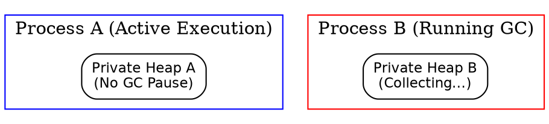

# Garbage Collector: Per-Process Memory Management

> *"Life is perpetual recycling: matter remains the same, only the organization of forms renews itself."*  
> — Claude Bernard, *Introduction à l'étude de la médecine expérimentale*, 1865

---

## 1. Per-Process Garbage Collection: Eradicating "Stop the World"

The defining virtue of BEAM's concurrency architecture is that Garbage Collection is **strictly private per process**. In shared-heap VMs (Java JVM, JavaScript V8), the garbage collector frequently pauses all execution threads (*Stop the World*) to safely sweep global cross-references.

In BEAM, because process heaps are completely isolated (`otp/erts/emulator/beam/erl_process.h:1043`), each process executes its GC independently.

---

## 2. Generational Copying Collector (Cheney's Algorithm)

BEAM employs a **generational copying collector** based on Cheney's algorithm:
- **Young Generation (`heap` / `fromspace`)**: Where new allocations occur.
- **Old Generation (`old_heap`)**: Long-lived data promoted after surviving collection cycles.
