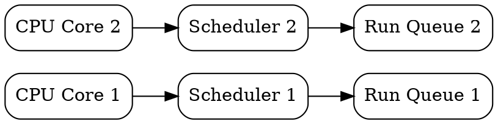

# SMP Scheduler and Run Queue Architecture

> *"Order is not pressure imposed from without on chaos, but the harmony of elements from within."*  
> — Norbert Wiener, *Cybernetics*, 1948

---

## 1. Multi-Core Concurrency Model

BEAM operates a multi-threaded SMP scheduler architecture. By default, it spawns one OS thread per CPU core (`+S`). Each scheduler thread manages its own private run queues (`run_queue`) to minimize contention.

---

## 2. Reduction-Based Scheduling & Preemption

BEAM achieves soft real-time guarantees via **reductions** (function call budget, default $4,000$ reductions per timeslice).
