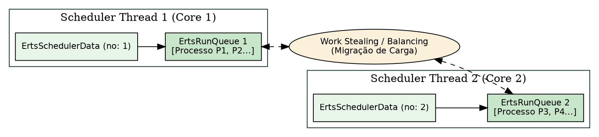
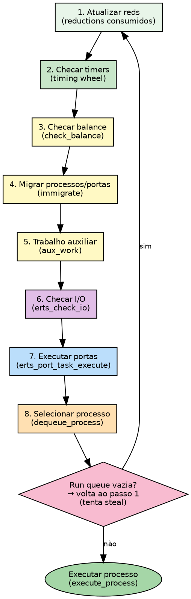
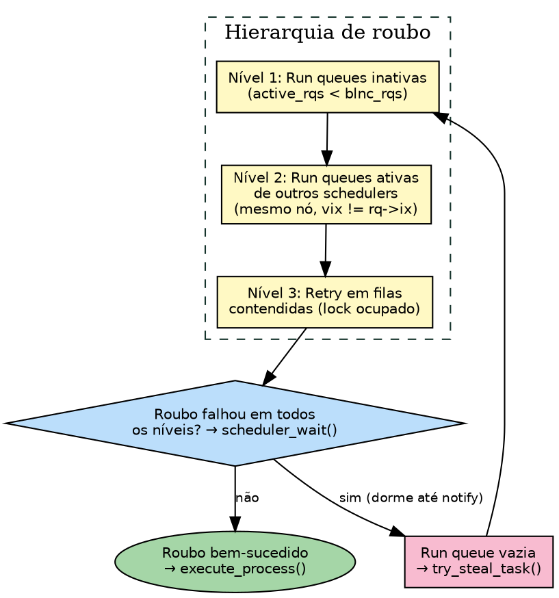

# Scheduler, SMP e run queue

> "A eficiência de um sistema distribuído de processamento depende da autonomia dos executores e da eliminação de gargalos centrais de coordenação."
> — Edsger W. Dijkstra, *Cooperating Sequential Processes*, 1965

## Objetivos de leitura

- Dominar o modelo **SMP (Symmetric Multiprocessing)** da BEAM e a estrutura `ErtsSchedulerData`.
- Compreender o conceito de **uma Run Queue por Scheduler** e como a contenda de travas é eliminada.
- Acompanhar os mecanismos de **balanceamento de carga (Work Balancing)** e **roubo de carga (Work Stealing)**.
- Entender a função dos **Dirty Schedulers** (`Dirty CPU` e `Dirty I/O`) na isolação de NIFs e I/O bloqueante.
- Inspecionar a atividade de schedulers e CPU affinity no terminal com `System.schedulers_online/0` e BIFs de sistema.

> 💡 **Âncora Cognitiva — As Pistas do Aeroporto e o Roubo de Carga (Work Stealing):** Pense em um sistema multi-core como um aeroporto internacional moderno com várias pistas de decolagem paralelas. Em vez de uma única fila confusa na torre central, cada pista possui seu próprio despachante dedicado (um `Scheduler` em C) e sua própria fila de aviões prontos (`ErtsRunQueue`). Se a Fila 1 acumula 50 voos enquanto a Fila 2 fica vazia, o despachante da Fila 2 imediatamente "rouba" aviões da Fila 1 (*Work Stealing*). Nenhuma pista fica ociosa e nenhum avião monopoliza o asfalto!

## 1. A arquitetura SMP: um Scheduler por núcleo lógico

Nos primórdios do Erlang, a VM operava em modo *single-threaded*. A partir da introdução do suporte **SMP (Symmetric Multiprocessing)**, a BEAM passou a instanciar, por padrão, **uma thread de scheduler no sistema operacional para cada núcleo lógico (CPU core)** detectado na máquina (`otp/erts/emulator/beam/erl_process.h:687`).

Cada scheduler é representado em C pela struct `ErtsSchedulerData` (`erl_process.h:687`):

```c
struct ErtsSchedulerData_ {
    ErtsRunQueue *run_queue;    /* Run queue associada a este scheduler */
    Process *current_process;   /* Processo atualmente em execução */
    Uint no;                    /* Número do scheduler (1, 2, 3...) */
    erts_tid_t tid;             /* Thread ID no sistema operacional */
    ...
};
```

`otp/erts/emulator/beam/erl_process.h:687-730` — a struct `ErtsSchedulerData` aloca dados privados alinhados por linha de cache (`ERTS_ALC_CACHE_LINE_ALIGN_SIZE`) para evitar o fenômeno destrutivo de *false sharing* no cache L1/L2 do processador.



## 2. O Loop de Agendamento (`erts_schedule`)

O coração do agendamento de processos no ERTS reside na função `erts_schedule` em `otp/erts/emulator/beam/erl_process.c:9607`.

Quando um processo em execução esgota seu orçamento de 4.000 reductions (`CONTEXT_REDS` em `erl_vm.h:53`), ou quando entra em um bloco de espera (`receive` sem mensagem), ele invoca `erts_schedule`:

```c
Process *erts_schedule(ErtsSchedulerData *esdp, Process *p, int calls)
```

`otp/erts/emulator/beam/erl_process.c:9607` — os passos principais do loop de agendamento são:

1. **Atualização de Estado:** Atualiza a contagem de reductions (`fcalls`) do processo `p` que está saindo da CPU.
2. **Seleção da Próxima Tarefa:** Consulta a `ErtsRunQueue` do scheduler ativo via `erts_get_runq_current(esdp)` (`erl_process.h:2803`).
3. **Checagem de Prioridades:** A fila atende processos em quatro níveis de prioridade: `max`, `high`, `normal` e `low`.
4. **Troca de Contexto:** Caso haja um processo pronto na fila, restaura seus registradores $X$ e $Y$ e retoma a execução do bytecode BEAM ou código nativo JIT.

> ❓ **Não Existem Perguntas Idiotas**  
> **Leitor:** Por que a BEAM não usa uma thread nativa do Sistema Operacional (pthread) para cada processo do Elixir em vez de criar essa estrutura complexa de Schedulers em C?  
> **Resposta:** Porque threads do sistema operacional são pesadíssimas! Cada pthread consome de 1 MB a 8 MB de memória para a pilha e a troca de contexto no kernel leva milissegundos. Os processos da BEAM são "threads verdes" extremamente leves: ocupam apenas 233 palavras (~1.8 KB) e a troca de contexto pelo `erts_schedule` ocorre em nanossegundos, no espaço de usuário, sem chamadas de sistema no kernel!

## 3. Balanceamento de Carga e Roubo de Carga (*Work Stealing*)

Ter uma `ErtsRunQueue` por scheduler elimina a contenção de travas de memória, mas introduz um desafio: o que acontece se um scheduler receber 1.000 processos pesados enquanto os outros schedulers ficam ociosos?

Para garantir a distribuição equitativa de trabalho, a BEAM utiliza duas estratégias complementares:

### 3.1 Roubo de Carga (*Work Stealing*)
Quando a `run_queue` de um scheduler fica completamente vazia, a thread do scheduler não dorme imediatamente. Em vez disso, ela entra no modo de roubo de carga: inspeciona as filas dos outros schedulers e "rouba" processos prontos para executar no seu próprio núcleo (`erl_process.c`).

### 3.2 Balanceamento Periódico de Carga (*Work Balancing*)
A cada intervalo de tempo, a VM recalcula as estatísticas globais de utilização e migra processos de forma proativa entre filas para manter a utilização de CPU homogênea entre todos os cores.

### 3.3 CPU Affinity (`erts_is_scheduler_bound`)
Em servidores multi-socket (NUMA), mover um processo entre núcleos distantes introduz latência de cache. A função `erts_is_scheduler_bound` em `otp/erts/emulator/beam/erl_process.h:2620` permite vincular cada thread de scheduler a um núcleo físico específico (*CPU affinity*), aumentando drasticamente a localidade de cache L1/L2.

## 4. Dirty Schedulers: Isolação de NIFs e I/O Bloqueante

O modelo de preempção por reductions funciona perfeitamente para código BEAM puro. Porém, se um desenvolvedor invocar uma função C nativa via NIF (Native Implemented Function) que execute uma operação síncrona longa (ex: compactação de vídeo ou leitura bloqueante de arquivo em C), essa NIF travaria a thread do scheduler.

Para resolver esse problema, a BEAM introduziu os **Dirty Schedulers**:

- **Dirty CPU Schedulers:** Threads de scheduler dedicadas a executar NIFs com computação C pesada sem monopolizar os schedulers normais.
- **Dirty I/O Schedulers:** Threads dedicadas a operações de sistema de arquivos e I/O bloqueante.

```console
$ erl -noshell -eval '
  io:format("schedulers: ~p~n", [erlang:system_info(schedulers)]),
  io:format("dirty_cpu_schedulers: ~p~n", [erlang:system_info(dirty_cpu_schedulers)]),
  io:format("dirty_io_schedulers: ~p~n", [erlang:system_info(dirty_io_schedulers)]),
  halt().'
schedulers: 8
dirty_cpu_schedulers: 8
dirty_io_schedulers: 10
```

Os schedulers normais continuam executando o código Elixir/Erlang em tempo real, enquanto o trabalho bloqueante fica isolado no grupo de Dirty Schedulers.

## 5. O Loop de 8 Passos do Scheduler (`erts_schedule` em detalhe)

> "Uma rotina bem-disciplinada de inspeção e correção impede que pequenos desvios se acumulem em desordem sistêmica."
> — Marco Aurélio, *Meditações*, Livro V

A função `erts_schedule` (`erl_process.c:9607`) não se limita a trocar
um processo por outro — ela executa um **loop interno de 8 passos** a
cada chamada, garantindo que o sistema opere de forma equilibrada e
responsiva. A descrição que segue corresponde ao fluxo do *normal
scheduler* (não-dirty), que é o coração do agendamento da BEAM.

Os **8 passos** (`erl_process.c:9797-10024`):

1. **Atualizar contadores de reduction (`reds`, `fcalls`).**  
   Calcula `reds = calls - esdp->virtual_reds`, acumula em `p->reds`   
   e prepara a contagem para o próximo processo (`erl_process.c:9678-9700`).

2. **Checar timers via timing wheel (`erts_bump_timers`).**  
   Se `esdp->check_time_reds >= ERTS_CHECK_TIME_REDS` (a cada ~4000
   reductions), atualiza o relógio monotônico. Se o tempo atual já
   ultrapassou o próximo timeout agendado, chama `erts_bump_timers()`
   para avançar a **timing wheel** e disparar timers vencidos
   (`erl_process.c:9801-9809`).

3. **Checar necessidade de balanceamento (`check_balance`).**  
   Se o contador `rq->check_balance_reds` chegou a zero, invoca
   `check_balance(rq)` para reavaliar a distribuição de carga entre
   todos os schedulers (`erl_process.c:9812-9813`).

4. **Migrar processos/portas se necessário (`immigrate`).**  
   Consulta os *migration paths* (`erts_get_migration_paths_managed`)
   e, se a flag `ERTS_RUNQ_FLGS_IMMIGRATE_QMASK` estiver ativa, executa
   `immigrate()` para receber processos/portas realocados por decisão
   do balanceador (`erl_process.c:9817-9821`).

5. **Trabalho auxiliar do scheduler (`handle_aux_work`).**  
   Lê `esdp->ssi->aux_work` e, se houver flags pendentes, chama
   `handle_aux_work()` para processar: finalização de dirty NIFs,
   saída de processos, *tracing hooks*, coleta de lixo forçada,
   realocação de memória, timers cancelados, etc.
   (`erl_process.c:9857-9864`). As flags possíveis estão definidas
   como `ERTS_SSI_AUX_WORK_*` (`erl_process.c:583-603`).

6. **Checar I/O e atualizar tempo (`erts_check_io`).**  
   A cada `2 * context_reds` (~8000 reductions), se `fcalls` acumulou
   o suficiente, o scheduler executa `erts_check_io()` — que processa
   eventos de drivers, portas e soquetes — e depois atualiza o tempo
   monotônico novamente (`erl_process.c:9946-9970`).

7. **Executar tarefas de porta (`erts_port_task_execute`).**  
   Se a run queue tem portas prontas (flag `PORT_BIT`), chama
   `erts_port_task_execute()` para executar uma operação de porta
   (driver linked-in, ETS, etc.) (`erl_process.c:9982-9988`).

8. **Selecionar próximo processo da run queue (`dequeue_process`).**  
   Consulta as filas de prioridade — `max`, `high`, `normal`, `low` —
   via as flags `ERTS_RUNQ_FLGS_PROCS_QMASK` e retira o processo
   mais prioritário com `dequeue_process()`. Se não há processo
   pronto, volta ao passo 1 (`check_activities_to_run`)
   (`erl_process.c:9993-10024`).



> 💡 **Âncora Cognitiva — O Inspetor de Qualidade na Linha de Montagem:**  
> Imagine um inspetor de qualidade em uma fábrica de automóveis que, a cada
> carro que passa, executa uma sequência fixa de 8 verificações: (1) anota
> quantos parafusos foram apertados, (2) verifica o cronômetro da esteira,
> (3) avalia se a linha está balanceada, (4) redistribui peças entre as
> mesas vizinhas, (5) limpa a bancada de ferramentas, (6) inspeciona o
> fluxo de entrada de matéria-prima, (7) testa um motor na bancada de
> provas e (8) pega o próximo carro da fila. O inspetor nunca pula etapas
> — essa disciplina rígida de 8 passos é o que mantém a fábrica
> funcionando sem gargalos, mesmo quando um lote problemático aparece.

> ❓ **Não Existem Perguntas Idiotas**  
> **Leitor:** Por que a BEAM não unifica os passos 3 (check_balance) e 4
> (immigrate) em um só?  
> **Resposta:** Porque `check_balance` é uma operação **cara** que examina
> *todas* as run queues do sistema para recalcular rotas de migração.
> Já `immigrate` é uma operação **barata** que apenas aplica a rota já
> calculada. Separar os dois significa que o balanceamento pesado só
> ocorre quando necessário (a cada N reductions), enquanto a migração
> leve pode ser executada a cada ciclo de schedule sem impacto
> significativo.

## 6. Load Balancing: estratégia, hierarquia e migração

> "Cada processo deve ter seu domínio próprio e não deve exceder os limites que lhe foram traçados."
> — Sêneca, *Da Clemência*, Livro I

O balanceamento de carga na BEAM não é apenas *work stealing* passivo
(§3.1). Ele opera em três camadas que formam uma **hierarquia de
roubo**: primeiro tenta-se a própria run queue, depois as run queues de
outros schedulers no mesmo nó, e por fim schedulers em outros nós
(Erlang Distribution). Esta seção detalha a estratégia ativa e a
implementação em C.

### 6.1 Estratégia: usar o menor número de schedulers possível

A BEAM tenta ativamente consolidar trabalho no menor número possível de
schedulers. A lógica está em `check_balance()` (`erl_process.c:4894`):
quando uma run queue fica vazia, o scheduler correspondente é colocado
em modo **inativo** (`ERTS_RUNQ_FLG_INACTIVE`) e sua thread entra em
espera. A variável global `no_empty_run_queues`
(`erl_process.c:341`) rastreia quantas run queues estão vazias.

```console
ErtsRunQueueBalance avg = {0};
get_no_runqs(NULL, &blnc_no_rqs);
if (blnc_no_rqs == 1) {
    /* apenas uma run queue ativa: sem necessidade de balancear */
    c_rq->check_balance_reds = INT_MAX;
    return;
}
```

`otp/erts/emulator/beam/erl_process.c:4913-4918` — se só uma run queue
está ativa, `check_balance` retorna imediatamente sem fazer nada.

A BEAM pode inclusive **reduzir o número de schedulers online**
dinamicamente via `erlang:system_flag(schedulers_online, N)`, que chama
`change_no_used_runqs()` (`erl_process.c:6363`). Isso permite, por
exemplo, desligar schedulers em horários de baixa demanda e religá-los
sob pico.

### 6.2 Hierarquia do Work Stealing: 3 níveis

Quando a run queue de um scheduler normal fica vazia, `try_steal_task()`
(`erl_process.c:4640`) executa a busca nesta ordem:

1. **Run queues inativas** (outros nós com schedulers desligados):
   `active_rqs < blnc_rqs` — tenta roubar das run queues que estão
   além do limite ativo (`erl_process.c:4664-4679`).
2. **Run queues ativas de outros schedulers no mesmo nó**: percorre
   todos os índices `vix` diferentes do próprio (`vix != rq->ix`) e
   chama `check_possible_steal_victim()` para cada um
   (`erl_process.c:4684-4697`).
3. **Retry em filas contendidas**: run queues cujo lock estava ocupado
   na primeira tentativa são recolocadas em uma fila de espera
   (`contended_runqueues`) e revisitadas (`erl_process.c:4699-4709`).

Se o roubo falha em todos os níveis, o scheduler chama `scheduler_wait()`
(`erl_process.c:3452`) e dorme até ser notificado por outro scheduler ou
por um evento de I/O.



`otp/erts/emulator/beam/erl_process.c:4640-4715` — implementação completa de `try_steal_task`.

### 6.3 Migração como compactação

A migração na BEAM não existe apenas para balancear carga — ela também
funciona como **compactação** (compaction). Quando o `check_balance()`
decide que é hora de reduzir o número de schedulers ativos, ele marca
rotas de migração nos `ErtsMigrationPath` (`erl_process.c:4317`). Cada
run queue de origem descarrega seus processos, portas e operações misc
para a run queue de destino definida pelo caminho de migração.

```c
/* Evacuate scheduled processes */
for (prio_q = 0; prio_q < ERTS_NO_PROC_PRIO_QUEUES; prio_q++) {
    proc = dequeue_process(rq, prio_q, &state);
    while (proc) {
        /* move proc para to_rq */
        erts_enqueue_process(to_rq, proc, prio);
        proc = dequeue_process(rq, prio_q, &state);
    }
}
```

`otp/erts/emulator/beam/erl_process.c:4376-4396` — evacuação de processos durante migração forçada. O efeito é similar ao *defrag* de memória: consolidar trabalho em poucos schedulers para que os demais possam dormir e economizar energia/CPU.

### 6.4 Ordem de locks e condições de corrida

O scheduler usa uma **ordem global de locks** para evitar deadlocks durante migração e roubo:

1. Lock da run queue de origem é tomado primeiro.
2. Lock da run queue de destino é tomado em segundo.
3. A operação de `immigrate()` segura ambos locks simultaneamente por um curto período (`erl_process.c:4336-4348`).

A condição de corrida mais crítica envolve `check_balance()`: apenas
**um** scheduler pode estar executando `check_balance()` por vez. O
mecanismo é um atomic CAS:

```c
if (erts_atomic32_xchg_nob(&balance_info.checking_balance, 1)) {
    c_rq->check_balance_reds = INT_MAX;
    return; /* outro scheduler já está balanceando */
}
```

`otp/erts/emulator/beam/erl_process.c:4908-4911` — exclusão mútua via atomic exchange. Se outro scheduler já iniciou o balanceamento, este scheduler simplesmente adia sua vez para o próximo ciclo.

## 7. BEAM como SO: isolamento e preempção na prática

> "Beam is an operating system for your code."
> — Saša Jurić, *The Soul of Erlang and Elixir*, Code BEAM 2024

A BEAM oferece ao seu código o que um SO oferece a processos do kernel:
schedulers, isolamento de memória, comunicação entre processos,
distribuição e tolerância a falhas — tudo embutido no runtime. A
diferença crucial está na granularidade: enquanto um SO gerencia
centenas de processos, a BEAM gerencia milhões, com troca de contexto
em nanossegundos (usuário, não kernel).

O experimento a seguir — adaptado da talk de Saša Jurić — demonstra
esse isolamento na prática com **um único scheduler**:

```elixir
defmodule SystemDemo do
  def start_workers(n) do
    for i <- 1..n do
      spawn(fn -> worker_loop(i) end)
    end
  end

  defp worker_loop(id) do
    # cada worker faz ~10ms de trabalho CPU-bound + sleep 1s
    Enum.sum(1..1000)
    send(:dashboard, {:ok, id})
    Process.sleep(1000)
    worker_loop(id)
  end

  def rogue_loop do
    # loop infinito SEM sleep — equivalente a while(true);
    rogue_step(0)
  end

  defp rogue_step(n) do
    # só consome reductions, nunca dorme
    rogue_step(n + 1)
  end
end
```

Com um scheduler ativo (forçado via `erl +S 1`), 10.000 workers rodando
cada um com 1s de ciclo, a taxa esperada é ~10.000 operações/segundo.
Introduz-se então um processo desgovernado (`rogue_loop`) que executa
um loop infinito sem sleeps — o tipo de bug que em threads OS travariam
todo o processo.

```dot Preempção protege o sistema: scheduler único com 10K workers + 1 rogue
digraph preemption_demo {
  rankdir=LR;
  node [shape=box, style=filled, fontname="Helvetica", fontsize=11];
  edge [fontname="Helvetica", fontsize=10];

  sched [label="Scheduler (1 thread)", fillcolor="#e8f5e9"];
  subgraph cluster_workers {
    label = "Run Queue — 10.001 processos";
    style = filled;
    fillcolor = "#f5f5f5";
    w1 [label="Worker 1\n(10ms CPU, 1s sleep)", fillcolor="#c8e6c9"];
    w2 [label="Worker 2", fillcolor="#c8e6c9"];
    w3 [label="...", shape=plain, fillcolor="white"];
    w10k [label="Worker 10.000", fillcolor="#c8e6c9"];
    rogue [label="Rogue Process\n(loop infinito)", fillcolor="#ffcdd2"];
  }

  sched -> w1 [label="4000 reds → preempt"];
  sched -> w2 [label="4000 reds → preempt"];
  sched -> rogue [label="4000 reds → preempt"];
  rogue -> w10k [label="volta ao fim da fila"];

  note [label="Cada processo recebe\nEXATAMENTE 4000 reductions\nantes de ser preemptado\n(CONTEXT_REDS)", shape=note, fillcolor="#fff9c4"];
  sched -> note [style=dashed, arrowhead=none];
}
```

O resultado observado: o scheduler alterna entre os 10.001 processos,
dando a cada um exatamente 4.000 reductions por vez (`CONTEXT_REDS` em
`erl_vm.h:53`). O processo desgovernado **não trava** os demais — ele
recebe sua fatia de 4.000 reductions e volta ao fim da run queue. A
taxa de 10.000 ops/s se mantém estável.

```console
$ erl +S 1 -noshell -eval '
  Dashboard = spawn(fn -> dashboard_loop(%{}) end),
  register(:dashboard, Dashboard),
  [spawn(fn -> worker_loop() end) || _ <- 1..10000],
  spawn(fn -> rogue_loop() end),
  timer:sleep(5000),
  halt().
'
# durante 5s, o sistema manteve ~10000 ops/s mesmo com o rogue ativo
```

> 💡 **Âncora Cognitiva — O Garçom com 10.001 Mesas:** Imagine um único
> garçom (scheduler) atendendo 10.001 mesas (processos). Ele dá exatos
> 30 segundos de atenção a cada mesa (4.000 reductions) e passa para a
> próxima. Uma mesa tem um cliente que fala sem parar (rogue loop) —
> mas o garçom não fica preso: depois de 30 segundos, ele se desculpa,
> vai para a próxima mesa e volta ao cliente tagarela no fim do ciclo.
> As outras 10.000 mesas continuam sendo servidas normalmente.

## 8. Experimentos: Medindo os Schedulers no Terminal

Podemos inspecionar a topologia e a utilização dos schedulers em execução:

```console
$ erl -noshell -eval '
  io:format("schedulers_online: ~p~n", [erlang:system_info(schedulers_online)]),
  io:format("scheduler_bindings: ~p~n", [erlang:system_info(scheduler_bindings)]),
  halt().'
schedulers_online: 8
scheduler_bindings: [0,1,2,3,4,5,6,7]
```

### Bate-papo à beira da lareira com o Scheduler (`erl_process.c`)

**Leitor:** Olá, `Scheduler Thread 1`! Como você faz para nunca deixar a sua CPU ociosa se a sua fila `ErtsRunQueue` esvaziar?  
**`erl_process.c`:** Olá! Eu sou incansável! Se a minha fila ficar vazia, eu não vou dormir de imediato. Eu ativo o *Work Stealing*: dou uma olhada discreta na `ErtsRunQueue` do Scheduler 2, roubo alguns processos prontos e trago para a minha pista de decolagem. A CPU trabalha a 100% sem desperdício de ciclos!

## A Lente Multidisciplinar

> **Sociológico / Algorítmico.** "A eficiência da divisão de trabalho racional exige a distribuição homogênea dos encargos sem sobrecarregar um único departamento." — Max Weber, *Economia e Sociedade*, 1922  
> *O algoritmo de Work Stealing da BEAM é a automação dessa justiça distributiva: ao redistribuir processos entre schedulers, garante a vazão máxima do sistema sem gargalos centralizados (Dijkstra, 1965).*

> **Jurídico / Computacional.** "Jurisdições paralelas com competências delimitadas eliminam os conflitos de competência e a disputa por jurisdição." — H.L.A. Hart, *The Concept of Law*, 1961  
> *Ter uma `ErtsRunQueue` por scheduler atua como jurisdição delimitada: elimina a contenção de travas de memória (locks) entre threads SMP. Como Fred Brooks (2010) enfatizou, o desacoplamento de estruturas privadas é a única forma de atingir escalabilidade linear.*

> **Psicológico / Estoico.** "Foca a tua atenção na tarefa do presente sem te perturbares com a agitação dos canais vizinhos." — Marco Aurélio, *Meditações*, Livro X  
> *A isolação por Dirty Schedulers reflete a proteção da atenção concentrada: ao delegar NIFs bloqueantes para threads "dirty" dedicadas, a BEAM protege os schedulers normais para que continuem garantindo preempção previsível em tempo real.*

## 30 Exercícios práticos e conceituais

### Bloco A — Questões Conceituais e Fundamentos (1–8)

1. **Explique o conceito central de Scheduler, SMP e run queue em suas próprias palavras.**
2. **Qual a diferença fundamental entre Uma `ErtsRunQueue` por Scheduler e Work Stealing (Roubo de Carga)?**
3. **Por que Níveis de Prioridade é importante para o funcionamento da BEAM?**
4. **Descreva a estrutura de Dirty Schedulers.**
5. **Como o Work Stealing se relaciona com a preempção por reductions — uma rouba processos, a outra limita o tempo de CPU de cada processo?**
6. **Qual o propósito de um scheduler único (+S 1) no contexto do experimento BEAM como SO (§7)?**
7. **Liste as etapas principais de Uma `ErtsRunQueue` por Scheduler.**
8. **O que aconteceria se `erts_schedule` não existisse na BEAM?**

### Bloco B — Análise de Código Fonte e Verificação `file:line` (9–16)

9. **Localize no código-fonte a definição de Arquitetura SMP. Em qual arquivo e linha ela está?**
10. **Encontre a implementação de Work Stealing (Roubo de Carga) em otp/erts/emulator/beam/erl_process.c e explique seu funcionamento.**
11. **Analise a macro/struct/função Níveis de Prioridade no arquivo otp/erts/emulator/beam/erl_process.h. Qual sua assinatura?**
12. **Identifique em otp/erts/emulator/beam/erl_vm.h como Dirty Schedulers é implementado. Quais os parâmetros?**
13. **Busque no fonte `otp/erts/emulator/beam/erl_process.c` a função `erts_schedule`. Qual a linha exata da assinatura e qual o tipo de retorno?**
14. **Compare as implementações de CPU Affinity (`scheduler_bindings`) e Dirty Schedulers nos fontes. O que difere?**
15. **Localize a constante `CONTEXT_REDS` em `otp/erts/emulator/beam/erl_vm.h:53`. Qual o valor e por que ele está em reductions e não em milissegundos?**
16. **Encontre a struct `ErtsSchedulerData` em `otp/erts/emulator/beam/erl_process.h`. Quantos campos ela tem?**

### Bloco C — Experimentos Práticos (17–24)

17. **Execute o experimento da seção §7: inicie 10.000 workers + 1 rogue loop com `erl +S 1` e meça a estabilidade da taxa de operações usando `statistics(run_queue)`.**
18. **Use `erlang:system_info(schedulers_online)` para verificar quantos schedulers ativos você tem — depois force `erl +S 1` e repita a medição.**
19. **Meça no REPL o resultado de CPU Affinity (`scheduler_bindings`) e explique o que observou.**
20. **Crie um exemplo mínimo que mostre Work Stealing: rode 2 schedulers com carga desbalanceada e verifique com `statistics(scheduler_wall_time)` que ambos os schedulers têm carga similar.**
21. **Compare a saída de `statistics(scheduler_wall_time)` antes e depois de ativar `erlang:system_flag(scheduler_wall_time, true)`.**
22. **Utilize o BIF `erlang:system_info(dirty_cpu_schedulers)` para inspecionar se Dirty Schedulers estão ativos e compare com o número de schedulers normais.**
23. **Escreva um teste que valide que um processo em loop infinito não impede a execução de outros processos no mesmo scheduler (preempção por reductions).**
24. **Simule o cenário onde CPU Affinity (`scheduler_bindings`) ocorre e documente o resultado com `erlang:system_info(cpu_topology)`.**

### Bloco D — Pontes Cognitivas, Invariantes e Desafios de Arquitetura (25–30)

25. **Invariante: demonstre que Arquitetura SMP sempre preserva Uma `ErtsRunQueue` por Scheduler.**
26. **Ponte cognitiva: como o conceito de `erts_schedule` se relaciona com Níveis de Prioridade segundo a Lente Multidisciplinar?**
27. **Desafio de arquitetura: se você pudesse redesenhar Dirty Schedulers para eliminar a necessidade de threads separadas, como faria?**
28. **Analise o trade-off entre preempção por reductions (justa, determinística) e preempção por timer (baseada em tempo real). Em que cenários cada uma vence?**
29. **Ponte cognitiva: a metáfora do aeroporto (âncora cognitiva no início do capítulo) se aplica também ao cenário BEAM como SO (§7)? Como?**
30. **Desafio: explique o que acontece em nível de VM quando o scheduler único alterna entre 10.001 processos — descreva o ciclo de `erts_schedule` para cada um.**

## Resumo para memorização

> 🧠 **Mnemônico:** 8S-LB-WS-D-C-P (8 Steps, Load Balancing, Work Stealing, Dirty, Context Reds, Preempção).

- **Arquitetura SMP**: Uma thread de scheduler em C para cada núcleo lógico da CPU (`erl_process.h:687`).
- **Work Stealing**: Schedulers ociosos roubam processos prontos de filas sobrecarregadas.
- **Dirty Schedulers**: Threads dedicadas para NIFs pesadas e I/O bloqueante.
- **`erts_schedule`**: Loop em C que gerencia trocas de contexto e preempção (`erl_process.c:9607`).
- **Loop de 8 passos** (§5): `reds → timers → balance → migrate → aux_work → IO → ports → process` (`erl_process.c:9797-10024`).
- **Load Balancing** (§6): `try_steal_task()` em 3 níveis — inativas → ativas → contendidas (`erl_process.c:4640`); migração como compactação; lock único de `check_balance()`.
- **BEAM como SO** (§7): Scheduler, run queue e reductions funcionam como um SO em microcosmo — isolamento e preempção para milhões de processos.
- **Níveis de Prioridade**: Filas `max`, `high`, `normal` e `low` no scheduler.
- **CPU Affinity**: Vincula threads a núcleos físicos para localidade de cache (`erl_process.h:2620`).
- **Preempção por reductions**: `CONTEXT_REDS` 4000 garante que um processo desgovernado não trave o sistema — mesmo num único scheduler (experimento 10K+1).

## Ver também

- [Capítulo 02 — A pilha: Erlang, OTP, Elixir e BEAM](CH-02.html)
- [Capítulo 07 — Coletor de lixo](CH-07.html)
- [Capítulo 09 — Reduções e preempção](CH-09.html)
- [Capítulo 10 — Processos: o processo control block](CH-10.html)
- [Capítulo 33 — Observando a VM](CH-33.html)
- [Flashcards deste capítulo](FL-08.html)
- [Lógica de predicados deste capítulo](PL-08.html)
- [Grafo de conhecimento deste capítulo](KG-08.html)
- [Erlang Efficiency Guide — SMP & Schedulers](https://www.erlang.org/doc/efficiency_guide/advanced.html)
