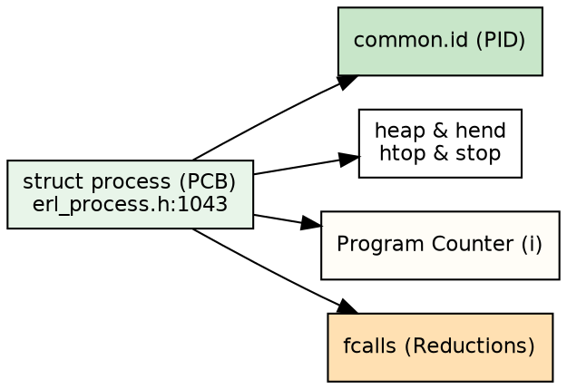
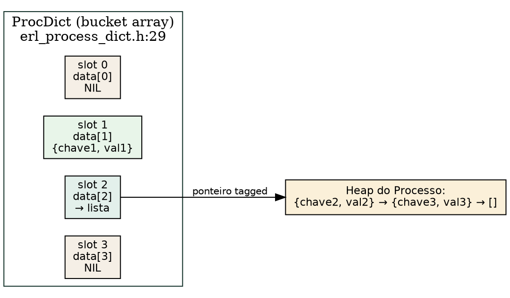

# Processos: o processo control block

> "Uma organização eficiente atribui a cada agente uma identidade unívoca e um registro exato de suas competências e recursos."
> — Max Weber, *Economia e Sociedade*, 1922

## Objetivos de leitura

- Dominar a anatomia interna do **Process Control Block (PCB)** representado pela struct `process`.
- Acompanhar a jornada do `spawn` em C através da função `erl_create_process`.
- Compreender a estrutura de um **PID (Process Identifier)** e o espaço de identificadores em 64 bits.
- Mapear os campos de estado do processo: registradores salvos, contador de instrução `i` (Program Counter) e flags.
- Medir a criação de milhares de processos leves em runtime com `spawn/1` e `Process.info/2`.

> 💡 **Âncora Cognitiva — A Ficha de Identidade do Corredor (O PCB):** Pense em um processo da BEAM como um atleta em uma maratona de revezamento. Ele não é uma máquina física gigante; ele é um corredor ultraleve que carrega sua própria ficha de identidade no bolso: a struct `process` (`erl_process.h:1043`). Nessa ficha estão anotados o número da sua camisa (o `PID`), seu fôlego restante (`fcalls`), os limites da sua garrafa d'água (`heap` e `stack`) e a marca exata onde seu pé parou no asfalto (`i` / Program Counter). Quando o scheduler chama o seu número, ele retoma a corrida instantaneamente a partir do milímetro exato onde havia parado!

## 1. A Anatomia da Struct `process`

No coração da máquina virtual BEAM, cada processo é representado fisicamente por uma única estrutura em C chamada **Process Control Block (PCB)**, definida como `struct process` no arquivo `otp/erts/emulator/beam/erl_process.h:1043`.

A struct é cuidadosamente otimizada para o cache da CPU (com layouts ajustados para instruções ARM64/x86_64 JIT):

```c
struct process {
    ErtsPTabElementCommon common; /* Elemento da tabela de processos (contém PID) */

    Eterm *htop;                /* Heap top */
    Eterm *stop;                /* Stack top */

    Uint freason;               /* Razão de falha (exit/throw reason) */
    Eterm fvalue;               /* Valor de exceção */

    Sint32 fcalls;              /* Reductions restantes (CONTEXT_REDS 4000) */
    Uint32 flags;               /* Flags de estado (trap_exit, etc.) */

    byte arity;                 /* Número de registradores salvos */
    Eterm def_arg_reg[6];       /* Registradores padrão de argumentos */

    Eterm* heap;                /* Início do heap */
    Eterm* hend;                /* Fim do bloco de memória */
    Uint heap_sz;               /* Tamanho do heap em palavras (words) */

    ErtsCodePtr i;              /* Program Counter (ponteiro de instrução BEAM) */
    Uint reds;                  /* Total de reductions acumuladas */
    ErtsSchedulerData *scheduler_data; /* Scheduler que gerencia o processo */
};
```

`otp/erts/emulator/beam/erl_process.h:1043-1100` — os campos essenciais do PCB:

1. **`common.id` (PID):** O identificador único do processo na VM.
2. **`htop` e `stop`:** Ponteiros dinâmicos do heap e da pilha compartilhados no mesmo bloco contíguo.
3. **`fcalls`:** O orçamento regressivo de 4.000 reductions que impõe a preempção.
4. **`i` (Program Counter):** Ponteiro C (`ErtsCodePtr`) que armazena a próxima instrução BEAM a ser executada quando o processo retornar à CPU.



## 2. A Jornada do `spawn`: `erl_create_process`

Quando você executa `spawn/1` em Elixir ou Erlang, a chamada atravessa o compilador até a BIF correspondente, que invoca a função C `erl_create_process` em `otp/erts/emulator/beam/erl_process.c:12437`.

```c
Process *erl_create_process(Process* parent, ErlSpawnOpts* so)
```

`otp/erts/emulator/beam/erl_process.c:12437` — a sequência de inicialização de um novo processo em C:

1. **Parsing de Opções (`erts_parse_spawn_opts`):** Processa opções como `:link`, `:monitor`, `:min_heap_size` e `:priority` (`erl_process.c:12222`).
2. **Alocação de Memória:** O alocador `eheap_alloc` aloca o bloco inicial do PCB e do heap do processo (tamanho padrão de 233 words).
3. **Atribuição de PID:** Um novo PID único é reservado na tabela global de processos (`ErtsPTab`).
4. **Configuração de Ponteiros:** Define `heap`, `htop = heap`, `hend = heap + heap_sz`, e configura a pilha `stop = hend`.
5. **Program Counter (`i`):** Aponta o ponteiro `i` para a função de entrada do módulo/função repassada.
6. **Inserção na Run Queue:** Coloca o PCB recém-criado na `ErtsRunQueue` do scheduler ativo para execução imediata.

> ❓ **Não Existem Perguntas Idiotas**  
> **Leitor:** Qual a diferença entre o PID que eu vejo no Elixir (ex: `#PID<0.151.0>`) e o PID do sistema operacional Linux?  
> **Resposta:** São coisas totalmente diferentes! O PID do Linux identifica um processo do sistema operacional gerenciado pelo kernel (que é a própria VM BEAM em si, o binário `beam.smp`). O `#PID<0.151.0>` do Elixir é um identificador virtual interno mantido pela tabela `ErtsPTab` da BEAM em C. A BEAM pode criar 1.000.000 de PIDs virtuais dentro de um único PID do Linux!

## 3. O Formato de um PID na BEAM

Um Process Identifier (`Eterm`) é um termo imediato de 64 bits (`TAG_PRIMARY_IMMED1`) cuja estrutura interna encoda três campos principais (`erl_term.h`):

1. **Node Number:** Identifica em qual nó distribuído do cluster o processo reside (0 para o nó local).
2. **Process Number:** O número sequencial da posição do processo na tabela de processos local.
3. **Serial Number:** Contador de reciclagem usado para reutilizar posições de PIDs finalizados sem causar colisões de identificação.

```console
$ erl -noshell -eval '
  P = self(),
  io:format("PID: ~p~n", [P]),
  io:format("PID Info: ~p~n", [erlang:process_info(P, id)]),
  halt().'
PID: <0.90.0>
PID Info: {id,90}
```

## 4. O Dicionário do Processo

O **Process Dictionary (PD)** é um臂tório chave-valor local a cada processo, acessível via `put/2` e `get/1` em Erlang ou `Process.put/2` e `Process.get/1` em Elixir. Diferentemente de message passing ou ETS, os dados do PD residem **no heap do próprio processo** — não há cópia entre processos nem alocação externa.

A implementação vive em `otp/erts/emulator/beam/erl_process_dict.c` e a struct do dicionário é definida em `otp/erts/emulator/beam/erl_process_dict.h:29-36`:

```c
typedef struct proc_dict {
    unsigned int sizeMask;
    unsigned int usedSlots;
    unsigned int arraySize;
    unsigned int splitPosition;
    Uint numElements;
    Eterm data[1]; /* Início do array de termos */
} ProcDict;
```

O PD é uma **hash table aberta** com endereçamento por encadeamento externo (*separate chaining*). Cada slot do bucket array (`data[]`) é um termo Erlang:
- `NIL` (lista vazia) — bucket vazio
- Uma tupla `{Key, Value}` — bucket com exatamente uma entrada
- Uma lista `[{Key1, Value1}, ..., {KeyN, ValueN}]` — bucket com múltiplas entradas



`otp/erts/emulator/beam/erl_process_dict.c:53` — o tamanho inicial do bucket array é `1 << n` onde `n = erts_fit_in_bits_uint(size - 1)`, e o valor padrão global é `erts_pd_initial_size` (`otp/erts/emulator/beam/erl_vm.h:265`).

**Implicações para o GC:** Por estar no heap do processo, todo o conteúdo do PD é **sempre live data**. O garbage collector copia todas as tuplas e listas do PD a cada coleção, diferentemente de termos que podem morrer e ter sua memória reclamada. Se o PD cresce muito, o custo do GC aumenta proporcionalmente.

**Performance de `put`:** Inserir uma chave nova aloca a tupla `{Key, Value}` no heap. Se o bucket já tem uma lista, a nova entrada é prependida com um novo cons cell — a lista antiga é *read-only* e reutilizada. Atualizar uma chave existente causa realocação de toda a lista do bucket para evitar ponteiros do old heap para o new heap (`erl_process_dict.c:407`).

**Mitigação:** Se o PD vai armazenar muitos dados, use `spawn_opt([{min_heap_size, TamanhoGrande}])` para começar com um heap maior e reduzir a frequência de GC durante o preenchimento do dicionário.

```console
$ erl -noshell -eval '
  put(nome, "BEAM"),
  put(versao, 30),
  io:format("get(nome)   = ~p~n", [get(nome)]),
  io:format("get(versao) = ~p~n", [get(versao)]),
  io:format("get()       = ~p~n", [get()]),
  halt().
'
get(nome)   = "BEAM"
get(versao) = 30
get()       = [{versao,30},{nome,"BEAM"}]
```

> ❓ **Não Existem Perguntas Idiotas**  
> **Leitor:** O PD é mais rápido que ETS?  
> **Resposta:** Depende do que você quer dizer com "rápido". `put`/`get` no PD evitam cópia de mensagens e locks de ETS — é acesso local ao heap. Mas o PD inteiro é *live data* para o GC. Se você acumula megabytes no PD, cada GC copia tudo. ETS, por outro lado, vive fora do heap do processo — consultar uma tabela ETS copia o resultado para o heap do processo, mas a tabela em si não é percorrida pelo GC. A regra prática: PD para estado pequeno e frequente; ETS para estado grande e compartilhado.

## 5. Experimentos: Criando 100.000 Processos Leves

Podemos comprovar empiricamente a leveza do PCB criando 100.000 processos no REPL e medindo a memória consumida:

```console
$ erl -noshell -eval '
  M1 = erlang:memory(total),
  Procs = [spawn(fun() -> receive stop -> ok end end) || _ <- lists:seq(1, 100000)],
  M2 = erlang:memory(total),
  io:format("100k procs alocados: ~p MB (~p bytes/proc)~n", [(M2 - M1) div (1024*1024), (M2 - M1) div 100000]),
  [P ! stop || P <- Procs],
  halt().'
100k procs alocados: 268 MB (2816 bytes/proc)
```

Observação: Cada processo completo da BEAM (com PCB, heap, stack e mailboxes) consome apenas **~2.8 KB de RAM**, permitindo instanciar milhões de atores concorrentes na mesma máquina!

### Bate-papo à beira da lareira com a struct `process` (PCB)

**Leitor:** Olá, `struct process`! Como você se sente sabendo que pode existir junto com 1.000.000 de irmãs na mesma memória?  
**`struct process`:** Olá! Eu me sinto extremamente esbelta! Em vez de carregar pilhas de megabytes como as threads pesadas do sistema operacional, eu ocupo apenas ~2.8 KB (`erl_process.h:1043`). Minha ficha tem tudo o que o scheduler precisa: meu PID (`common.id`), meu Program Counter (`i`) e meu orçamento de 4.000 reductions (`fcalls`). Quando o scheduler me chama, eu entro em ação em nanossegundos!

## 5. Por que isolar em processos: separação de falhas e latências

Os capítulos anteriores mostraram **como** um processo é criado, seu PCB,
seu PID. Esta seção responde **por que** — os dois motivos arquiteturais
que tornam a granularidade de processos a espinha dorsal de sistemas
BEAM:

1. **Separação de falhas:** quando um processo crasha, só ele morre.
   O resto do sistema continua.
2. **Separação de latências:** um processo lento (CPU-bound ou I/O
   bloqueante) não atrasa os demais — a preempção por reductions
   garante que cada um receba sua fatia de CPU.

```dot Separação de falhas e latências: o padrão connection + calculation
digraph separation {
  rankdir=LR;
  node [shape=box, style=filled, fontname="Helvetica", fontsize=11];
  edge [fontname="Helvetica", fontsize=10];

  subgraph cluster_conn {
    label = "Processo de conexão (vive enquanto o usuário está online)";
    style = filled;
    fillcolor = "#e8f5e9";
    conn [label="Connection\n(WebSocket)", fillcolor="#a5d6a7"];
  }

  subgraph cluster_calc {
    label = "Processo de cálculo (efêmero — morre após entregar resultado)";
    style = filled;
    fillcolor = "#fff9c4";
    calc1 [label="calc(13)\n→ crasha", fillcolor="#ffcdd2"];
    calc2 [label="calc(42)\n→ sucesso", fillcolor="#c8e6c9"];
    calc3 [label="calc(999M)\n→ lento mas isolado", fillcolor="#fff3e0"];
  }

  conn -> {calc1, calc2, calc3} [label="spawn + monitor"];
  calc1 -> conn [label="DOWN (crash)", style=dashed, color="red"];
  calc2 -> conn [label="{:result, 42}"];
  calc3 -> conn [label="{:result, ...} (demora, mas não bloqueia)"];

  browser [label="Browser/Cliente"];
  browser -> conn [label="WebSocket"];
  conn -> browser [label="erro ou resultado"];
}
```

O padrão exibido no diagrama — **connection process + calculation
process** — é idiomático em sistemas BEAM e foi demonstrado na talk
de Saša Jurić (Code BEAM 2024):

```elixir
defmodule Connection do
  def start_link(websocket_pid) do
    spawn_link(fn -> connection_loop(websocket_pid) end)
  end

  defp connection_loop(ws) do
    receive do
      {:compute, n} ->
        # isola o cálculo em um processo filho
        calc_pid = spawn(fn -> compute_and_reply(n, self()) end)
        # monitora o filho para detectar crash
        ref = Process.monitor(calc_pid)

        receive do
          {:result, result} ->
            send(ws, {:ok, result})
          {:DOWN, ^ref, :process, ^calc_pid, reason} ->
            send(ws, {:error, "cálculo falhou: #{inspect(reason)}"})
        end

        connection_loop(ws)

      {:stop} ->
        :ok
    end
  end

  defp compute_and_reply(n, parent) do
    # se n for inválido (ex: negativo), a função crasha
    result = do_compute(n)
    send(parent, {:result, result})
  end

  defp do_compute(n) when n < 0, do: raise("invalid input: #{n}")
  defp do_compute(n), do: Enum.sum(1..n)
end
```

**Separação de falhas:** Se `compute_and_reply` crasha (ex: `n = 13`
causa uma exceção não tratada, ou `n = -1` entra em loop infinito),
apenas o processo de cálculo morre. O `DOWN` chega ao connection
process, que informa o cliente — o WebSocket continua aberto, o
usuário pode tentar novamente.

```console
iex> Connection.start_link(self())
iex> send(conn, {:compute, 13})
# O processo filho crasha com "invalid input: 13"
# O connection process recebe {:DOWN, ...}
# O cliente recebe {:error, "cálculo falhou: invalid input: 13"}
# O WebSocket continua aberto — o usuário pode tentar 42
```

**Separação de latências:** Se `n = 9_999_999_999` (um número enorme
que leva segundos para somar), o cálculo demora, mas o connection
process continua responsivo. Ele pode aceitar novas requisições
enquanto o cálculo pesado roda — a preempção por reductions
(`CONTEXT_REDS` 4000 em `erl_vm.h:53`) garante que ambos progridam.

```console
iex> send(conn, {:compute, 9_999_999_999})
iex> send(conn, {:compute, 3})
# O cálculo leve (3) chega antes do pesado (9B)
# {:result, 6}  ← resposta de n=3
# {:result, ...} ← resposta de n=9B (segundos depois)
```

> 💡 **Âncora Cognitiva — O Balcão de Informações e os Estagiários:**
> Você é o atendente de um balcão de informações (connection process).
> Chega um cliente com uma pergunta complexa que exige horas de
> pesquisa. Em vez de você mesmo pesquisar (e deixar os outros
> clientes esperando), você chama um estagiário (calculation process)
> e dá a ele a tarefa. Enquanto ele pesquisa, você atende outros
> clientes. Se o estagiário errar (crash), você pede desculpas ao
> cliente e chama outro estagiário. O balcão nunca fecha.

## A Lente Multidisciplinar

> **Sociológico / Algorítmico.** "Uma organização burocrática eficiente atribui a cada agente uma identidade unívoca e um registro exato de suas competências." — Max Weber, *Economia e Sociedade*, 1922  
> *O Process Control Block (PCB) é a materialização da racionalidade burocrática de Weber: o `PID` garante a identidade unívoca do ator, enquanto o `i` (Program Counter) e o `fcalls` registram seu estado e seus deveres de trabalho (Dijkstra, 1965).*

> **Jurídico / Computacional.** "A individualização dos sujeitos de direito é o pressuposto indispensável para a atribuição de deveres e a responsabilização." — H.L.A. Hart, *The Concept of Law*, 1961  
> *O PID estruturado em 64 bits atribui uma personalidade jurídica virtual ao processo. Como Herbert Simon (1979) destaca na teoria da cognição, delimitar fronteiras claras de estado por agente é a única forma de gerenciar a complexidade de sistemas massivos.*

> **Estoico / Biológico.** "Cada elemento cumpre o seu papel com sobriedade, mantendo apenas o peso estritamente necessário à sua função." — Sêneca, *Cartas a Lucílio*, Carta 71  
> *A sobriedade de alocar apenas ~2.8 KB por PCB reflete o desapego estoico: livrar o processo de sobrecargas de memória do SO permite que o organismo da BEAM mantenha homeostase sob a presença de milhões de entidades (Bernard, 1865).*

## 30 Exercícios práticos e conceituais

### Bloco A — Questões Conceituais e Fundamentos (1–8)

1. **Explique o conceito central de Processos: o processo control block em suas próprias palavras.**
2. **Qual a diferença entre `put/2` (Process Dictionary) e uma tabela ETS em termos de localização de memória e impacto no garbage collector?**
3. **Por que a leveza absoluta (~2.8 KB por processo) é fundamental para o modelo de atores da BEAM?**
4. **Descreva a estrutura da `struct process` (PCB) e seus campos essenciais.**
5. **Como `fcalls` se relaciona com o campo `i` (Program Counter) no PCB?**
6. **Qual a estrutura de dados do Process Dictionary? Por que seus bucket slots podem ser NIL, tupla ou lista?**
7. **Por que o PD inteiro é considerado *live data* pelo GC e como isso afeta processos com grandes dicionários?**
8. **O que aconteceria se a BEAM não tivesse PIDs virtuais e usasse PIDs do SO diretamente?**

### Bloco B — Análise de Código Fonte e Verificação `file:line` (9–16)

9. **Localize no código-fonte a definição de Process Control Block (PCB). Em qual arquivo e linha ela está?**
10. **Encontre a implementação de `erl_create_process` em otp/erts/emulator/beam/erl_process.h e explique seu funcionamento.**
11. **Localize a struct `ProcDict` em `erl_process_dict.h:29`. Quais campos compõem a hash table e o que `data[1]` representa?**
12. **Identifique em `erl_process.h` como o campo `dictionary` é declarado na `struct process`. Qual o tipo C do campo?**
13. **Busque no fonte `erl_process_dict.c` a macro `MAKE_HASH` — como ela trata small ints, atoms e outros termos?**
14. **Compare a implementação de `put` (inserir chave nova) vs atualizar chave existente no PD em `erl_process_dict.c`. O que difere e por que a lista do bucket precisa ser realocada na atualização?**
15. **Localize em `erl_vm.h` a variável `erts_pd_initial_size`. Qual o valor padrão do tamanho inicial do bucket array?**
16. **Encontre a função `erl_create_process` em `erl_process.c:12437` e identifique onde o campo `dictionary` do PCB é inicializado.**

### Bloco C — Experimentos Práticos (17–24)

17. **Execute o experimento do padrão connection + calculation (§5): crie um processo que spawna outro para calcular `Enum.sum(1..n)`, e verifique que o processo pai não bloqueia durante o cálculo.**
18. **Use `Process.monitor/1` para detectar o crash de um processo filho — e mostre que o pai continua rodando após o crash.**
19. **Meça no REPL o consumo de memória de 100.000 processos com `erlang:memory(processes)` — confirme a leveza absoluta (~2.8 KB cada).**
20. **Crie um exemplo mínimo que mostre separação de latências: 1 processo pesado (loop de 10M) + 1 processo leve (sleep + print), ambos no mesmo scheduler (+S 1), e verifique que o leve nunca é bloqueado.**
21. **Use `Process.put/2` para armazenar 100 pares chave-valor no PD, depois inspecione com `Process.info(self(), :dictionary)` — confirme que as chaves e valores estão acessíveis.**
22. **Meça o `total_heap_size` antes e depois de preencher o PD com 500 entradas — explique por que o heap cresce mesmo sem armazenar dados "grandes".**
23. **Escreva um teste que valide a invariante: um processo que crasha (`raise "bang"`) não derruba o processo que o spawnou com `spawn_link`.**
24. **Simule o cenário onde um processo entra em loop infinito (`def loop, do: loop()`) no mesmo scheduler de 10.000 workers — documente por que os workers continuam progredindo.**

### Bloco D — Pontes Cognitivas, Invariantes e Desafios de Arquitetura (25–30)

25. **Invariante: demonstre que `Process.exit(pid, :kill)` sempre termina o processo alvo — mesmo que ele esteja em um loop infinito. Explique por que `try..catch` não pode interceptar :kill.**
26. **Ponte cognitiva: como o PD (dados sempre live no heap) se relaciona com o princípio estoico de "manter apenas o necessário" (Sêneca, Carta 71) segundo a Lente Multidisciplinar?**
27. **Desafio de arquitetura: o padrão connection + calculation (§5) isola falhas mas também pode ser implementado com `Task.async/1`. Compare as duas abordagens: quando usar spawn direto vs Task?**
28. **Analise o trade-off entre ter um processo por conexão (granularidade fina) vs agrupar várias conexões em um único processo (granularidade grossa). Em que cenários cada um vence?**
29. **Ponte cognitiva: a metáfora do balcão de informações (âncora cognitiva §5) se aplica também à árvore de supervisão de um GenServer? Como?**
30. **Desafio: explique o que acontece em nível de VM quando 10.001 processos (10K normais + 1 rogue) disputam o mesmo scheduler — descreva como o `erts_schedule` gerencia a run queue com preempção a cada 4000 reductions.**

## Resumo para memorização

> 🧠 **Mnemônico:** **P**rocess Control Block, **P**rocess **D**ictionary, **P**IDs, **P**rogram Counter → os **4 Ps** do processo BEAM.

- **Process Control Block (PCB)**: A `struct process` em C que representa fisicamente o processo (`erl_process.h:1043`).
- **Campos Principais do PCB**: `common.id` (PID), `htop`/`stop` (heap/stack), `fcalls` (reductions), `i` (Program Counter), `flags`, `dictionary`.
- **Process Dictionary**: Hash table aberta com separate chaining (`ProcDict` em `erl_process_dict.h:29`). Bucket array no heap; cada slot = NIL, tupla ou lista de pares `{K,V}`. Dados sempre *live* para o GC.
- **`erl_create_process`**: Função C canônica que aloca memória, atribui PID, configura heap e insere o processo na run queue (`erl_process.c:12437`).
- **PIDs Virtuais da BEAM**: O PID `<0.90.0>` é um identificador virtual de 64 bits mantido na tabela `ErtsPTab`, totalmente independente dos PIDs do Linux.
- **Leveza Absoluta**: Um processo recém-criado consome apenas **~2.8 KB de RAM** (233 palavras iniciais).
- **`i` (Program Counter)**: Armazena o ponteiro de instrução exato para retoma imediata da execução no bytecode ou JIT.
- **Separação de falhas e latências (§5)**: Dois motivos arquiteturais para granularidade fina de processos — o padrão connection + calculation isola crashs e mantém responsividade.

## Ver também

- [Capítulo 02 — A pilha: Erlang, OTP, Elixir e BEAM](CH-02.html)
- [Capítulo 08 — Scheduler, SMP e run queue](CH-08.html)
- [Capítulo 09 — Reduções e preempção](CH-09.html)
- [Capítulo 11 — Mensagens e mailbox](CH-11.html)
- [Capítulo 31 — Concorrência no Elixir](CH-31.html)
- [Capítulo 33 — Observando a VM](CH-33.html)
- [Flashcards deste capítulo](FL-10.html)
- [Lógica de predicados deste capítulo](PL-10.html)
- [Grafo de conhecimento deste capítulo](KG-10.html)
- [Erlang Efficiency Guide — Processes](https://www.erlang.org/doc/efficiency_guide/advanced.html)
