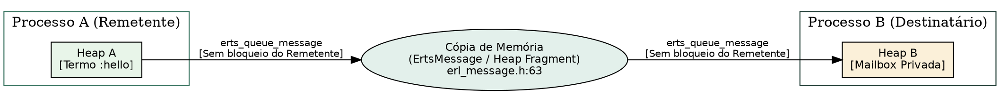
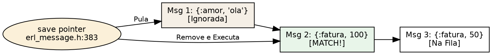
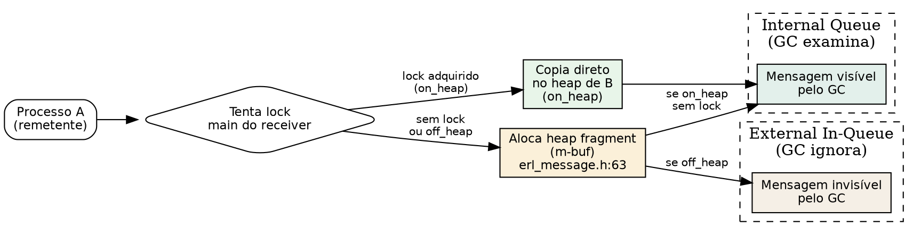

# Mensagens e mailbox

> "O ato de comunicação fundamental consiste em transmitir uma mensagem de uma fonte a um destinatário sem que ocorra modificação no conteúdo durante o tráfego."
> — Claude Shannon, *A Mathematical Theory of Communication*, 1948

## Objetivos de leitura

- Dominar a mecânica de passagem de mensagens assíncronas entre processos.
- Compreender a estrutura C `ErtsMessage` e a fila de sinais (`sig_qs`).
- Acompanhar o algoritmo do **Receive Seletivo (Selective Receive)** e a função do ponteiro `save`.
- Entender como a cópia de mensagens entre heaps privados preserva a imutabilidade e o isolamento.
- Medir a fila de mensagens (*mailbox size*) e simular buscas seletivas com `Process.info/2`.

> 💡 **Âncora Cognitiva — A Caixa de Correio e o Marcador `save`:** Pense na mailbox de um processo como uma caixa de correio física na entrada da sua casa. O carteiro (processo remetente) deposita cartas assincronamente sem esperar você abrir a porta. Quando você executa um `receive` com pattern matching (ex: buscando apenas mensagens no formato `{:fatura, valor}`), você começa lendo da primeira carta (`first`). Se a primeira carta for uma carta de amor `{:amor, texto}`, você não a descarta nem a devolve ao remetente! A VM move o ponteiro `save` (`erl_message.h:383`) para a próxima carta. Quando a fatura for encontrada, a carta de amor permanece guardada na caixa de correio na exata posição original!

## 1. Passagem de Mensagens Assíncrona: `send` sem Bloqueio

A base do modelo de atores na BEAM estabelece que o envio de mensagens (`PID ! msg` ou `send(PID, msg)`) é **estritamente não-bloqueante e assíncrono**.

Quando um Processo A envia uma mensagem para um Processo B:

1. O Processo A não pausa sua execução aguardando o Processo B ler ou processar o dado.
2. A VM aloca uma estrutura `ErtsMessage` (`otp/erts/emulator/beam/erl_message.h:63`).
3. O conteúdo da mensagem é copiado do heap do Processo A para a alocação de destino (ou alocado em um *heap fragment* se a trava do heap de B não puder ser adquirida de imediato).
4. A mensagem é inserida na fila de sinais (`sig_qs`) do Processo B via `erts_queue_message` (`erl_message.h:525`).



## 2. A Estrutura C `ErtsMessage` e a Mailbox

Na BEAM moderna, a mailbox de um processo é uma lista encadeada mantida na struct `Process` (`otp/erts/emulator/beam/erl_process.h:1043`), implementada através dos ponteiros declarados em `otp/erts/emulator/beam/erl_message.h:381-383`:

```c
struct ErtsMessage_ {
    ErtsMessage *next;           /* Ponteiro para a próxima mensagem */
    Eterm m[1];                  /* O valor/conteúdo do termo da mensagem */
};
```

`otp/erts/emulator/beam/erl_message.h:63-145` — a mailbox mantém três ponteiros essenciais para o gerenciamento de navegação:

```c
ErtsMessage *first;             /* Primeira mensagem na mailbox */
ErtsMessage **last;             /* Ponteiro para o fim da fila */
ErtsMessage **save;             /* Ponteiro de navegação para Selective Receive */
```

`otp/erts/emulator/beam/erl_message.h:381-383` — o papel de cada ponteiro:

- **`first`:** Aponta para a cabeça da fila de mensagens acumuladas.
- **`last`:** Aponta para a cauda onde novas mensagens enviadas via `erts_queue_message` são anexadas.
- **`save`:** Aponta para a mensagem atual em avaliação durante a execução de um bloco `receive`.

## 3. O Algoritmo do Receive Seletivo (*Selective Receive*)

Uma das funcionalidades mais poderosas do Elixir e do Erlang é a capacidade de realizar **pattern matching seletivo** na mailbox.

Quando um bloco `receive` é executado com um padrão específico:

```elixir
receive do
  {:prioridade, msg} -> msg
end
```

A VM executa o seguinte algoritmo em C:

1. Inicia a inspeção a partir do ponteiro `save` (que por padrão aponta para `first`).
2. Compara a mensagem atual com as cláusulas do `receive`.
3. **Se houver MATCH:** A mensagem é removida da lista, o ponteiro `save` é resetado para `first`, e o processo retoma a execução do código.
4. **Se NÃO houver MATCH:** O ponteiro `save` avança para a próxima mensagem (`msg->next`) e testa novamente.
5. **Se a mailbox terminar sem match:** O processo salva o estado do ponteiro `save`, entra em estado de espera (*waiting*) e cede o scheduler via `erts_schedule` até que uma nova mensagem chegue!



> ❓ **Não Existem Perguntas Idiotas**  
> **Leitor:** O que acontece se eu tiver 100.000 mensagens acumuladas na mailbox e fizer um `receive` seletivo que não encontra nenhuma mensagem compatível?  
> **Resposta:** Essa é a armadilha clássica de performance conhecida como *Selective Receive Penalty*! A BEAM terá que percorrer todas as 100.000 mensagens uma a uma em C. Se isso ocorrer frequentemente, a aplicação sofrerá degradação de CPU $O(N)$. A boa prática é sempre manter a mailbox curta ou tratar mensagens não casadas com uma cláusula genérica de fallback!

## 4. Unificação de Sinais: Mensagens vs. Sinais do Sistema

Na arquitetura moderna do ERTS (`otp/erts/emulator/beam/erl_proc_sig_queue.h`), as mensagens foram unificadas sob a infraestrutura geral de **Sinais de Processo (Process Signals)**.

Além de mensagens de dados normais, a fila de sinais transita:

- **Sinais de Saída (`EXIT`):** Gerados por crash de processos vinculados (`links`).
- **Sinais de Monitoramento (`DOWN`):** Notificações emitidas por `Process.monitor/1`.
- **Sinais de Desconexão / Unlink.**

Todos esses sinais utilizam a mesma semântica de concorrência não-bloqueante e são processados de forma limpa pelo runtime.

## 5. Experimentos: Observando a Mailbox no Terminal

Podemos enviar mensagens para um processo e inspecionar sua mailbox no REPL:

```console
$ erl -noshell -eval '
  P = self(),
  P ! {msg, 1},
  P ! {prioridade, 99},
  P ! {msg, 2},
  io:format("tamanho mailbox: ~p~n", [element(2, process_info(P, message_queue_len))]),
  receive {prioridade, Val} -> io:format("recebido seletivo: ~p~n", [Val]) end,
  io:format("tamanho apos receive: ~p~n", [element(2, process_info(P, message_queue_len))]),
  halt().'
tamanho mailbox: 3
recebido seletivo: 99
tamanho apos receive: 2
```

Observação: O `receive` extraiu a mensagem `{prioridade, 99}` do meio da fila via Selective Receive sem alterar a ordem de `{msg, 1}` e `{msg, 2}`.

## 6. Estratégias de Alocação: `on_heap` vs `off_heap`

A partir do Erlang/OTP 19, cada processo pode configurar como as mensagens enviadas a ele são alocadas, através da flag `message_queue_data`. A escolha impacta diretamente lock contention, uso de memória e comportamento do GC.



### `on_heap` (padrão)

O remetente tenta adquirir o **main lock** do processo destinatário. Se conseguir:
1. Aloca o termo da mensagem **diretamente no heap** do destinatário.
2. Insere a mensagem na **internal queue** (fila de mensagens "vistas").

Se **não conseguir** o lock (outro scheduler já está enviando para o mesmo destino):
1. Aloca um **heap fragment (m-buf)** — área de memória fora do heap.
2. Copia a mensagem para o m-buf.
3. Insere o m-buf na **internal queue**.

O garbage collector eventualmente copia as mensagens de m-bufs para o heap. Mensagens na internal queue são examinadas pelo GC — se ainda estão na mailbox (não recebidas), são consideradas *live* e promovidas ao old heap.

### `off_heap`

O remetente **nunca tenta o lock** do destinatário:
1. Sempre aloca um **heap fragment (m-buf)**.
2. Insere o m-buf na **external in-queue**.

O GC **ignora completamente** a external in-queue. Mensagens só saem de lá quando o processo as recebe via `receive`. Isso reduz lock contention mas aumenta o número de m-bufs alocados — e se o processo não drena a mailbox, os m-bufs acumulam sem que o GC os mova para o heap.

### Tuning prático

A flag `message_queue_data` é configurável por processo com `process_flag(message_queue_data, on_heap | off_heap)` ou globalmente com a flag de ERTS `+hmqd off_heap` na linha de comando:

```console
$ erl +hmqd off_heap -noshell -eval '
  io:format("off_heap global: ~p~n", [process_flag(message_queue_data, off_heap)]),
  halt().
'
off_heap global: off_heap
```

**Quando usar cada estratégia:**

| Cenário | Recomendação | Motivo |
| :--- | :--- | :--- |
| Producer-consumer balanceado | `on_heap` | Sem contenção de lock, alocação direta no heap é mais rápida e usa menos memória. |
| Receiver sobrecarregado | `off_heap` | Reduz lock contention; remetentes não disputam o main lock. |
| Mailbox profunda (milhares de msgs) | `off_heap` | Evita que mensagens não lidas sejam promovidas ao old heap pelo GC. |
| Baixa latência no sender | `off_heap` | Remetente nunca espera por lock — escreve direto no m-buf. |

> ❓ **Não Existem Perguntas Idiotas**  
> **Leitor:** Se `off_heap` é melhor para receivers sobrecarregados, por que não é o padrão?  
> **Resposta:** Porque `off_heap` aloca um m-buf **por mensagem**, enquanto `on_heap` pode reutilizar o espaço livre no heap. Se o receiver drena a mailbox rapidamente, `on_heap` é mais eficiente em memória e cache. O padrão `on_heap` é o *best guess* para o caso médio — sistemas reais devem medir ambos.

### Bate-papo à beira da lareira com o Ponteiro `save` (`erl_message.h`)

**Leitor:** Olá, ponteiro `save`! Como você se sente resgatando mensagens no meio da mailbox?  
**`save`:** Olá! Eu sou a bússola do `receive` seletivo! Quando o leitor procura apenas por um padrão específico (ex: `{:ok, res}`), eu avanço mansamente pela lista encadeada `ErtsMessage` (`erl_message.h:383`). Se a primeira mensagem não der match, eu coloco um marcador nela e passo para a próxima. O leitor pega o que precisa e nenhuma mensagem fica perdida!

## A Lente Multidisciplinar

> **Computacional / Teoria da Informação.** "O ato de comunicação fundamental consiste em transmitir uma mensagem de uma fonte a um destinatário sem alterar seu conteúdo." — Claude Shannon, *A Mathematical Theory of Communication*, 1948  
> *A passagem de mensagens assíncrona por cópia de memória na BEAM é a corporificação da teoria de Shannon: garante a preservação do conteúdo e a imutabilidade do estado dos atores (Armstrong, 2003).*

> **Sociológico / Teoria dos Sistemas.** "Sistemas autopoieticos comunicam-se exclusivamente através da seleção de mensagens, mantendo suas estruturas internas opacas ao meio externo." — Niklas Luhmann, *Soziale Systeme*, 1984  
> *O isolamento absoluto das mailboxes dos processos reflete a autopoiese de Luhmann: nenhum processo pode ler a memória direta de outro processo; a interação ocorre estritamente por mensagens assíncronas.*

> **Jurídico / Estoico.** "O envio de uma notificação formal produz efeitos no destinatário independentemente de sua ciência imediata." — H.L.A. Hart, *The Concept of Law*, 1961  
> *O envio não-bloqueante com `send` é a notificação jurídica formal: garante a entrega da mensagem na mailbox sem subordinar o tempo do remetente à vontade ou disponibilidade do destinatário (Knuth, 1968).*

## 30 Exercícios práticos e conceituais

### Bloco A — Questões Conceituais e Fundamentos (1–8)

1. **Explique o que é o Selective Receive e qual a função do ponteiro `save` na mailbox.**
2. **Qual a diferença entre `on_heap` e `off_heap` na flag `message_queue_data`?**
3. **Por que a Selective Receive Penalty ($O(N)$) é um risco de performance na BEAM?**
4. **Descreva a estrutura `ErtsMessage` e os três ponteiros da mailbox (`first`, `last`, `save`).**
5. **Como `on_heap` se relaciona com lock contention entre schedulers?**
6. **Qual o propósito de `off_heap` em cenários de receiver sobrecarregado?**
7. **Liste as etapas do envio de mensagem: da BIF `send` à inserção na fila de sinais.**
8. **O que aconteceria se a mailbox não tivesse o ponteiro `save` — como o `receive` funcionaria?**

### Bloco B — Análise de Código Fonte e Verificação `file:line` (9–16)

9. **Localize em `erl_message.h:63` a definição de `ErtsMessage`. Identifique os campos `next` e `m[1]`.**
10. **Encontre os ponteiros `first`, `last` e `save` na mailbox em `erl_message.h:381-383`.**
11. **Busque no código-fonte (`erl_process.c`) onde a flag `message_queue_data` é lida — como o scheduler decide entre alocar no heap ou em m-buf?**
12. **Identifique em `erl_proc_sig_queue.h` a struct da fila de sinais — como mensagens e sinais de sistema (`EXIT`, `DOWN`) compartilham a mesma infraestrutura?**
13. **Localize a função `erts_queue_message` em `erl_process.c` — ela sempre aloca um m-buf ou tenta o lock primeiro?**
14. **Compare as flags `ERTS_PROC_LOCK_MAIN` e `ERTS_PROC_LOCK_STATUS` usadas no envio de mensagens — em que situação cada uma é exigida?**
15. **Encontre em `erl_process.c` a função que implementa `process_flag(message_queue_data, ...)` — como ela altera a struct `Process`?**
16. **Localize em `erl_message.h` a macro `LINK_MESSAGE` — como um m-buf é linkado na internal vs external queue?**

### Bloco C — Experimentos Práticos (17–24)

17. **Execute um experimento que demonstre o Selective Receive: envie 3 mensagens para `self()`, receba a do meio e verifique as mensagens restantes.**
18. **Use `process_flag(message_queue_data, off_heap)` e meça o número de heap fragments (via `erlang:memory(system)`) antes e depois de enviar 10.000 mensagens.**
19. **Compare no REPL o `message_queue_len` antes e depois de um `receive` com cláusula coringa — o tamanho cai para 0?**
20. **Crie um exemplo mínimo que demonstre a Selective Receive Penalty: mailbox com 10.000 mensagens, `receive` que só casa na última.**
21. **Repita o experimento 17 com `+hmqd off_heap` como flag de ERTS — a saída difere do comportamento `on_heap` padrão?**
22. **Utilize `erlang:system_info(message_queue_data)` para verificar a estratégia de alocação padrão do seu runtime.**
23. **Escreva um teste que valide que `process_flag(message_queue_data, off_heap)` não altera a semântica de entrega de mensagens — apenas a alocação.**
24. **Simule o cenário onde dois schedulers enviam mensagens concorrentemente para o mesmo processo — meça a diferença de throughput entre `on_heap` e `off_heap`.**

### Bloco D — Pontes Cognitivas, Invariantes e Desafios de Arquitetura (25–30)

25. **Invariante: demonstre que `send` nunca bloqueia o remetente, independentemente da estratégia `message_queue_data`.**
26. **Ponte cognitiva: como o conceito de autopoiese de Luhmann (sistemas que se comunicam apenas por mensagens) se reflete na mailbox isolada de cada processo BEAM?**
27. **Desafio de arquitetura: se você pudesse redesenhar a mailbox para usar um buffer circular em vez de lista encadeada, quais seriam os trade-offs com Selective Receive?**
28. **Analise o trade-off entre `on_heap` (mensagens no heap, visíveis ao GC) e `off_heap` (mensagens em m-bufs, invisíveis ao GC) sob alta pressão de mailbox.**
29. **Ponte cognitiva: que metáfora do cotidiano melhor representa a diferença entre internal queue (GC varre) e external in-queue (GC ignora)?**
30. **Desafio: explique o que acontece em nível de VM quando um processo com `off_heap` recebe uma mensagem — desde a chegada do sinal até a cópia para o heap.**

## Resumo para memorização

> 🧠 **Mnemônico:** **S**end assíncrono, **E**rtsMessage, **L**ock, **E**xternal queue, **C**ópia, **T**uning → **SELECT**.

- **Envio Assíncrono Não-Bloqueante**: `send` insere a mensagem na mailbox do destinatário sem bloquear o remetente.
- **`ErtsMessage`**: Struct C que encoda a mensagem e mantém a lista ligada na mailbox (`erl_message.h:63`).
- **Ponteiro `save`**: Marcador de navegação usado no **Selective Receive** para pular mensagens sem match (`erl_message.h:383`).
- **Selective Receive Penalty**: Perigo de performance $O(N)$ ao varrer mailboxes gigantes.
- **`on_heap` (padrão)**: Remetente tenta lock do receiver; se consegue, escreve direto no heap. Se não, aloca m-buf na internal queue (GC examina).
- **`off_heap`**: Remetente sempre aloca m-buf na external in-queue (GC ignora). Menos lock contention, mais m-bufs.
- **Flag ERTS `+hmqd off_heap`**: Muda o padrão global para `off_heap` na inicialização da VM.
- **Unificação `sig_qs`**: Mensagens, `EXIT` e `DOWN` sob a mesma infraestrutura de sinais (`erl_proc_sig_queue.h`).

## Ver também

- [Capítulo 10 — Processos: o processo control block](CH-10.html)
- [Capítulo 12 — Timers e o timer wheel](CH-12.html)
- [Flashcards deste capítulo](FL-11.html)
- [Lógica de predicados deste capítulo](PL-11.html)
- [Grafo de conhecimento deste capítulo](KG-11.html)
- [Erlang Efficiency Guide — Processes and Messages](https://www.erlang.org/doc/efficiency_guide/advanced.html)
