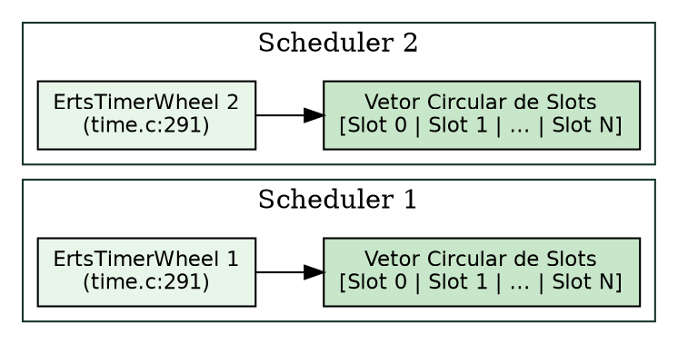

# Timers e o timer wheel

> "O tempo não é uma substância contínua na máquina, mas uma sequência de pulsos discretos sincronizados pelo relógio monotônico."
> — Alan Turing, *Proposed Electronic Calculator*, 1946

## Objetivos de leitura

- Dominar o funcionamento do **Hierarchical Timer Wheel** na BEAM para agendamento $O(1)$.
- Acompanhar a distribuição de temporizadores entre as instâncias privadas `ErtsTimerWheel` dos Schedulers.
- Compreender a integração entre o relógio monotônico da VM e a função `erts_bump_timers`.
- Analisar as funções C `erts_twheel_set_timer` e `erts_twheel_cancel_timer`.
- Agendar e cancelar temporizadores de forma eficiente em Elixir com `Process.send_after/3` e `:erlang.cancel_timer/1`.

> 💡 **Âncora Cognitiva — O Relógio de Roleta da BEAM (The Timer Wheel):** Pense no gerenciador de tempo da BEAM como um relógio circular gigante em formato de roleta, dividido em milhares de casinhas numeradas (*slots*). Quando você agenda um temporizador para daqui a 500 ms (ex: `Process.send_after(self(), :ping, 500)`), a VM não coloca o alarme em uma fila ordenada gigante que precisa ser reordenada a cada inserção ($O(N)$). Ela faz uma conta matemática ultra-rápida de hash/máscara de bits em C e deposita a ficha do alarme diretamente no slot 500 (`time.c:1256`). A cada pulso do relógio monotônico da CPU (`erts_bump_timers`), a roleta gira um clique para frente e acorda apenas os alarmes presentes naquele slot exato!

## 1. O Problema da Escala do Tempo

Em sistemas concorrentes massivos contendo centenas de milhares de processos ativos, temporizadores são omnipresentes: timeouts de requisições HTTP, *heartbeats* de agrupamento, expiração de sessões e chamadas `Process.sleep/1`.

Se o runtime utilizasse uma estrutura tradicional como uma árvore balanceada ou min-heap para manter os temporizadores ordenados pelo tempo de expiração:

- Inserir um temporizador custaria $O(\log N)$.
- Em uma aplicação com 1.000.000 de temporizadores ativos, a contenção de memória e reordenação consumiria frações gigantescas de tempo de CPU.

Para garantir performance **constante $O(1)$** tanto na inserção quanto no cancelamento e expiração, a BEAM utiliza a arquitetura **Timer Wheel (Roda de Temporizadores)**.

## 2. A Estrutura C `ErtsTimerWheel` e Schedulers

Nas versões modernas do ERTS, a BEAM elimina qualquer ponto de contenção central de relógio: **cada scheduler thread possui sua própria instância privada de Timer Wheel** (`otp/erts/emulator/beam/erl_process.h:690`).

```c
struct ErtsSchedulerData_ {
    ...
    ErtsTimerWheel *timer_wheel; /* Roda de temporizadores privada do scheduler */
    ...
};
```

`otp/erts/emulator/beam/erl_process.h:690` — a struct `ErtsTimerWheel` em `otp/erts/emulator/beam/time.c:291` implementa o vetor circular de slots:

```c
struct ErtsTimerWheel_ {
    ErtsMonotonicTime pos;       /* Posição atual do relógio monotônico na roda */
    ...
};
```

`otp/erts/emulator/beam/time.c:291-320` — o layout das rodas encadeadas:



## 3. Inserção, Cancelamento e Avanço da Roda em C

### 3.1 Agendamento de Temporizador (`erts_twheel_set_timer`)

Quando um processo invoca `Process.send_after/3` ou `:erlang.start_timer/3`, a VM invoca a função `erts_twheel_set_timer` em `otp/erts/emulator/beam/time.c:1256`:

```c
void erts_twheel_set_timer(ErtsTimerWheel *tiw, ErtsTWheelTimer *p, ...)
```

1. Calcula a diferença entre o tempo alvo de expiração e o tempo monotônico atual (`pos`).
2. Mapeia o resultado para o índice de slot circular via operação de máscara de bits $O(1)$.
3. Insere a estrutura `ErtsTWheelTimer` na lista encadeada dupla do slot correspondente.

### 3.2 Cancelamento de Temporizador (`erts_twheel_cancel_timer`)

Se a aplicação cancelar um temporizador via `:erlang.cancel_timer(ref)`:

```c
void erts_twheel_cancel_timer(ErtsTimerWheel *tiw, ErtsTWheelTimer *p)
```

`otp/erts/emulator/beam/time.c:1313` — como o temporizador guarda ponteiros duplos para seu nó anterior e próximo no slot, o cancelamento remove o nó instantaneamente em tempo **$O(1)$** sem varrer a roda!

### 3.3 Avanço do Relógio (`erts_bump_timers`)

No loop do scheduler, a VM invoca periodicamente `erts_bump_timers` (`otp/erts/emulator/beam/time.c:784`):

```c
void erts_bump_timers(ErtsTimerWheel *tiw, ErtsMonotonicTime curr_time)
```

A função avança o ponteiro `pos` até `curr_time`, descarrega todos os temporizadores presentes nos slots visitados e envia as mensagens correspondentes para as mailboxes dos processos de destino.

> ❓ **Não Existem Perguntas Idiotas**  
> **Leitor:** O que acontece se eu agendar 1.000.000 de temporizadores simultâneos no Elixir? A BEAM vai desacelerar ou travar a aplicação?  
> **Resposta:** Não! Como a inserção e o cancelamento utilizam indexação direta de vetor circular em tempo $O(1)$ e cada scheduler possui sua própria Timer Wheel isolada (`erl_process.h:690`), a BEAM consegue gerenciar milhões de temporizadores concorrentes com custo de CPU ínfimo e sem qualquer bloqueio global entre núcleos!

## 4. Experimentos: Agendando e Cancelando Temporizadores no Terminal

Podemos agendar temporizadores e medir a precisão e velocidade do cancelamento no REPL:

```console
$ erl -noshell -eval '
  Ref = erlang:send_after(1000, self(), ping),
  io:format("timer agendado ref: ~p~n", [Ref]),
  Rem = erlang:cancel_timer(Ref),
  io:format("tempo restante ao cancelar: ~p ms~n", [Rem]),
  halt().'
timer agendado ref: #Ref<0.3129188047.886046722.193798>
tempo restante ao cancelar: 1000 ms
```

Observação: O cancelamento por `cancel_timer` localizou o nó na Timer Wheel e retornou o tempo restante de 1.000 ms instantaneamente em $O(1)$.

### Bate-papo à beira da lareira com a Timer Wheel (`time.c`)

**Leitor:** Olá, `Timer Wheel`! É verdade que você consegue controlar 1.000.000 de relógios de alarme sem suar a camisa?  
**`time.c`:** Olá! É o poder da roleta circular em C! Em vez de organizar um milhão de relógios em uma fila gigante, eu divido o tempo em slots circulares (`time.c:291`). Quando você chama `Process.send_after/3`, a função `erts_twheel_set_timer` (`time.c:1256`) calcula a posição exata e joga a ficha no slot certo em tempo $O(1)$. Quando o relógio monotônico passa por lá (`erts_bump_timers`), eu disparo os alarmes e sigo em frente!

## A Lente Multidisciplinar

> **Computacional / Algorítmico.** "O tempo não é uma substância contínua na máquina, mas uma sequência de pulsos discretos." — Alan Turing, *Proposed Electronic Calculator*, 1946  
> *A Timer Wheel da BEAM converte o contínuo do tempo em posições discretas em um vetor circular, permitindo agendamento determinístico em complexidade de tempo constante $O(1)$ (Dijkstra, 1965).*

> **Jurídico / Sociológico.** "Prazos prescricionais exigem um termo inicial claro e um mecanismo objetivo de contagem que não dependa do arbítrio das partes." — H.L.A. Hart, *The Concept of Law*, 1961  
> *O relógio monotônico do ERTS (`ErtsMonotonicTime`) atua como esse termo objetivo inalterável: imune a ajustes manuais do relógio do sistema operacional (NTP jumps), garante a validade exata dos prazos de cada processo.*

> **Psicológico / Biológico.** "A ritmicidade circadiana de um organismo depende de osciladores locais coordenados sem a necessidade de um marca-passo central único." — Claude Bernard, *Introduction à l'étude de la médecine expérimentale*, 1865  
> *Ter uma `ErtsTimerWheel` privada por scheduler reflete a autonomia dos osciladores circadianos biológicos: elimina a contenção por relógios globais e preserva a resposta em tempo real do sistema (Miller, 1956).*

## 30 Exercícios práticos e conceituais

### Bloco A — Questões Conceituais e Fundamentos (1–8)

1. **Explique o conceito central de Timers e o timer wheel em suas próprias palavras.**
2. **Qual a diferença fundamental entre Uma `ErtsTimerWheel` por Scheduler e `erts_twheel_set_timer`?**
3. **Por que `erts_bump_timers` é importante para o funcionamento da BEAM?**
4. **Descreva a estrutura de `ErtsTimerWheel`.**
5. **Como `erts_twheel_set_timer` se relaciona com `erts_twheel_cancel_timer`?**
6. **Qual o propósito de Imunidade ao NTP no contexto da VM?**
7. **Liste as etapas principais de Uma `ErtsTimerWheel` por Scheduler.**
8. **O que aconteceria se `erts_twheel_cancel_timer` não existisse na BEAM?**

### Bloco B — Análise de Código Fonte e Verificação `file:line` (9–16)

9. **Localize no código-fonte a definição de Agendamento em $O(1)$. Em qual arquivo e linha ela está?**
10. **Encontre a implementação de `erts_twheel_set_timer` em otp/erts/emulator/beam/time.c e explique seu funcionamento.**
11. **Analise a macro/struct/função `erts_bump_timers` no arquivo otp/erts/emulator/beam/erl_time.h. Qual sua assinatura?**
12. **Identifique em otp/erts/emulator/beam/erl_process.h como `ErtsTimerWheel` é referenciado. Qual o campo da struct?**
13. **Busque no fonte otp/erts/emulator/beam/time.c a referência para `erts_twheel_set_timer`. Qual a linha exata?**
14. **Compare as implementações de Imunidade ao NTP e `ErtsTimerWheel` nos fontes. O que difere?**
15. **Localize a função `erts_twheel_set_timer` em otp/erts/emulator/beam/time.c. Qual a linha exata e o que ela faz?**
16. **Encontre a função `erts_bump_timers` em otp/erts/emulator/beam/time.c. Quantas linhas ela ocupa?**

### Bloco C — Experimentos Práticos (17–24)

17. **Execute um experimento no terminal que demonstre Agendamento em $O(1)$. Cole a saída.**
18. **Use `erts_twheel_set_timer` para verificar o comportamento de `erts_twheel_cancel_timer`.**
19. **Meça no REPL o resultado de Imunidade ao NTP e explique o que observou.**
20. **Crie um exemplo mínimo em Erlang/Elixir que ilustre Agendamento em $O(1)$.**
21. **Compare a saída de `erts_twheel_cancel_timer` antes e depois de `erts_bump_timers`.**
22. **Utilize a ferramenta Agendamento em $O(1)$ para inspecionar Uma `ErtsTimerWheel` por Scheduler.**
23. **Escreva um teste que valide a propriedade de `erts_twheel_cancel_timer`.**
24. **Simule o cenário onde Imunidade ao NTP ocorre e documente o resultado.**

### Bloco D — Pontes Cognitivas, Invariantes e Desafios de Arquitetura (25–30)

25. **Invariante: demonstre que Agendamento em $O(1)$ sempre preserva Uma `ErtsTimerWheel` por Scheduler.**
26. **Ponte cognitiva: como o conceito de `erts_twheel_cancel_timer` se relaciona com `erts_bump_timers` segundo a Lente Multidisciplinar?**
27. **Desafio de arquitetura: se você pudesse redesenhar `ErtsTimerWheel`, o que mudaria e por quê?**
28. **Analise o trade-off entre `erts_twheel_set_timer` e `erts_twheel_cancel_timer`. Qual a escolha da BEAM e por quê?**
29. **Ponte cognitiva: que metáfora do cotidiano melhor representa Imunidade ao NTP?**
30. **Desafio: explique o que acontece em nível de VM quando Uma `ErtsTimerWheel` por Scheduler é executado.**

## Resumo para memorização

> 🧠 **Mnemônico:** Associe os conceitos de Agendamento em $O(1)$, Uma `ErtsTimerWheel` por Scheduler, `erts_twheel_set_timer` com as primeiras letras para formar um acrônimo.

- **Agendamento em $O(1)$**: A Timer Wheel elimina rescaneamento de filas $O(N)$, alocando temporizadores em slots de vetor circular em tempo constante.
- **Uma `ErtsTimerWheel` por Scheduler**: Cada thread de scheduler gerencia seus temporizadores privados em C sem travas de contenção global (`erl_process.h:690`).
- **`erts_twheel_set_timer`**: Função C que calcula a posição de slot e insere o alarme (`time.c:1256`).
- **`erts_twheel_cancel_timer`**: Cancela um temporizador em $O(1)$ através de ponteiros duplos (`time.c:1313`).
- **`erts_bump_timers`**: Função chamada no loop do scheduler para disparar os alarmes dos slots visitados pelo relógio monotônico (`time.c:784`).
- **Imunidade ao NTP**: O tempo monotônico (`ErtsMonotonicTime`) garante que ajustes no relógio do sistema operacional não corrompam os prazos agendados.

## Ver também

- [Capítulo 11 — Mensagens e mailbox](CH-11.html)
- [Capítulo 13 — BIFs e NIFs](CH-13.html)
- [Flashcards deste capítulo](FL-12.html)
- [Lógica de predicados deste capítulo](PL-12.html)
- [Grafo de conhecimento deste capítulo](KG-12.html)
- [Erlang Efficiency Guide — Time and Timers](https://www.erlang.org/doc/efficiency_guide/advanced.html)
