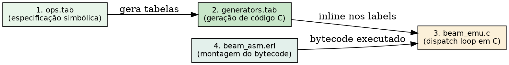
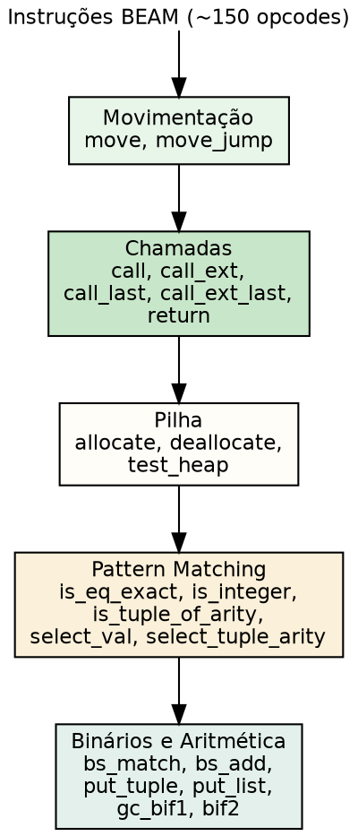
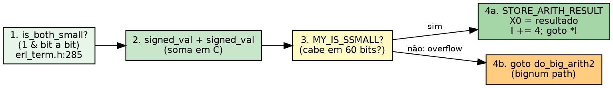

# O conjunto de instruções

> "Instruções de um conjunto de máquina abstrata devem ser reduzidas à sua essência mínima: poucas primitivas ortogonais compõem qualquer algoritmo complexo."
> — Niklaus Wirth, *Compiler Construction*, 1996

## Objetivos de leitura

- Construir **sua primeira máquina virtual**: de uma stack machine em Erlang a um interpretador bytecode em C.
- Dominar a arquitetura do conjunto de instruções BEAM: máquina de registradores, opcodes de 1 byte e operandos imediatos.
- Compreender como `ops.tab` gera o dispatch C via `genop.tab` e `beam_emu.c`.
- Analisar o mecanismo de dispatch em `beam_emu.c` — switch → token threaded → direct threaded code.
- Mapear as 5 famílias de instruções: movimentação, chamadas, pilha, pattern matching e operações aritméticas.
- Entender a codificação de opcodes: o byte de instrução, os operandos imediatos e como o compilador `beam_asm.erl` empacota tudo.
- Desmontar `.beam` real com `:beam_disasm` e comparar com o código fonte Erlang/Elixir.

> 💡 **Âncora Cognitiva — O Teatro de Marionetes (Opcode como Corda Única):** Pense no bytecode BEAM como a corda única que comanda uma marionete. Cada instrução é um puxão de corda: `move` puxa um braço (registrador X), `allocate` prende um novo gancho no suporte (pilha Y), `call_last` solta o suporte anterior antes de puxar o próximo movimento. O marionetista (scheduler thread) não precisa decorar a peça inteira — ele segue a sequência de puxões (opcodes) gravada no `.beam`. Se o puxão for `is_eq_exact` e o boneco não for igual, ele pula para outro trecho da corda. O teatro todo (a VM) roda igual em qualquer palco (Linux, macOS, Windows) porque a corda é universal!

## 0. Sua Primeira Máquina Virtual: do Erlang ao C

Antes de dissecar a BEAM, vamos **construir duas VMs simples**. Você verá que uma máquina virtual não é magia — é só um loop que lê bytes e executa código.

### 0.1 Stack Machine em Erlang

A BEAM não é uma máquina de pilha (como a JVM), mas uma máquina de **registradores**. O contraste fica claro começando por uma stack machine.

Compilar `8 + 17 * 2` para uma stack machine produz:

```erlang
compile(String) ->
    [ParseTree] = element(2,
        erl_parse:parse_exprs(
            element(2, erl_scan:string(String)))),
    generate_code(ParseTree).

generate_code({op, _Line, '+', Arg1, Arg2}) ->
    generate_code(Arg1) ++ generate_code(Arg2) ++ [add];
generate_code({op, _Line, '*', Arg1, Arg2}) ->
    generate_code(Arg1) ++ generate_code(Arg2) ++ [multiply];
generate_code({integer, _Line, I}) -> [push, I].
```

E um interpretador de stack machine em ~10 linhas de Erlang:

```erlang
interpret(Code) -> interpret(Code, []).
interpret([push, I | Rest], Stack)              -> interpret(Rest, [I | Stack]);
interpret([add | Rest], [Arg2, Arg1 | Stack])   -> interpret(Rest, [Arg1 + Arg2 | Stack]);
interpret([multiply | Rest], [Arg2, Arg1 | Stack]) -> interpret(Rest, [Arg1 * Arg2 | Stack]);
interpret([], [Res | _]) -> Res.
```

```console
1> stack_machine:interpret(stack_machine:compile("8 + 17 * 2.")).
42
```

**O que observar:** cada operando é empurrado na pilha (`push`), e cada operação (`add`, `multiply`) popa seus operandos e pusha o resultado. O compilador não precisa escalonar registradores — o código sai diretamente da AST.

A BEAM, por outro lado, usa **registradores X** (`X0`, `X1`, ..., `X1023`) para manter operandos ativos e **registradores Y** para salvar valores na pilha entre chamadas de função. Isso reduz a pressão na pilha e acelera operações aritméticas simples.

### 0.2 Bytecode VM em C

Vamos substituir os átomos Erlang por **bytes** e o interpretador por **C puro**:

```c
#define STOP  0
#define ADD   1
#define MUL   2
#define PUSH  3

#define pop()   (stack[--sp])
#define push(X) (stack[sp++] = X)

int run(char *code) {
    int stack[1000];
    int sp = 0, size = 0, val = 0;
    char *ip = code;

    while (*ip != STOP) {
        switch (*ip++) {
        case ADD:
            push(pop() + pop());
            break;
        case MUL:
            push(pop() * pop());
            break;
        case PUSH:
            size = *ip++;
            val = 0;
            while (size--) { val = val * 256 + *ip++; }
            push(val);
            break;
        }
    }
    return pop();
}
```

~30 linhas de C, e você tem uma VM funcional. O bytecode para `8 + 17 * 2` seria:
```
PUSH 1 8    ; empilha 8
PUSH 1 17   ; empilha 17
PUSH 1 2    ; empilha 2
MUL         ; pop(2) * pop(17) = 34
ADD         ; pop(34) + pop(8) = 42
STOP        ; retorna 42
```

**Problema deste interpretador:** o `switch` testa cada opcode **toda iteração**. No assembly gerado, o loop interno faz:

```asm
L11: movl (%eax), %eax     ; lê byte
     cmpl $2, %eax          ; compara com MUL
     je L7
     cmpl $3, %eax          ; compara com PUSH
     je L8
     cmpl $1, %eax          ; compara com ADD
     jne L5
```

Cada instrução exige múltiplas comparações e saltos condicionais — um gargalo que a BEAM resolve com **threaded code** (§4).

### 0.3 O salto para a BEAM

A BEAM herda desta mesma estrutura de loop + dispatch, mas com 3 diferenças cruciais:

1. **Registradores em vez de pilha de operandos**: `X0` contém o resultado da última operação — sem `push`/`pop` a cada instrução.
2. **Opcodes de 1 byte + parse de operandos variável**: como no nosso `PUSH` com `size + bytes`, mas codificado por `beam_asm.erl`.
3. **Dispatch via threaded code** (`goto *label`) em vez de `switch`: o salto para o label da instrução é um único `goto` computado — sem cascata de `cmpl`/`je`.

A partir de agora, cada conceito da BEAM que você encontrar pode ser comparado mentalmente com esta VM de 30 linhas: a BEAM é a mesma ideia, mas com 150 instruções, registradores, GC, reductions, SMP e 25 anos de otimização.

## 1. O formato da instrução BEAM

Diferente de ISAs físicas como x86 (instruções de tamanho variável complexo) ou RISC-V (instruções de 32 bits fixos), a BEAM adota um formato misto: **opcode de 1 byte seguido por operandos imediatos** codificados como palavras de 32 bits (`otp/lib/compiler/src/beam_asm.erl:180-220`).

```
Byte 0:     Opcode (0–255)
Bytes 1-4:  Operando 1 (Uint32)
Bytes 5-8:  Operando 2 (Uint32)
...
```

Cada instrução tem aridade fixa definida em `ops.tab`. Por exemplo, `move S D` tem 2 operandos (source e destination), enquanto `call Ar Lbl` tem 2 operandos (aridade e rótulo). A codificação exata é feita por `beam_asm.erl`, que traduz a representação simbólica para a sequência de bytes.

Os 256 valores de opcode (0–255) deixam espaço para expansão futura. Cerca de 150 são usados atualmente (`otp/erts/emulator/beam/emu/ops.tab:1-200`).

## 2. O ciclo de vida de uma instrução: do `ops.tab` ao `beam_emu.c`

O pipeline tem 4 etapas:



1. **`ops.tab`** (`otp/erts/emulator/beam/emu/ops.tab`): Define cada instrução com nome, operandos e regras de transformação. Exemplo da linha que define `move`:

   ```
   move s d => move_s_s s d | move_s_x s d | move_x_s s d | move_x_x s d
   ```

   Uma única instrução abstrata `move` se expande em 4 variantes concretas (source → destination combinando registrador X, registrador Y, literal). Isso permite que o interpretador execute a variante ótima sem testar tipos em runtime.

2. **`generators.tab`** e **`instrs.tab`** (`otp/erts/emulator/beam/emu/`): Arquivos que categorizam as instruções em tipos de operandos (X register, Y register, literal, label) e geram o código C de dispatch via scripts de template.

3. **`beam_emu.c`** (`otp/erts/emulator/beam/emu/beam_emu.c`): O loop principal de execução. Contém o **dispatch de instruções** — o coração do interpretador. A partir do OTP 24, usa **threaded code** (`labels as values`, extensão GCC/Clang) em vez de `switch` tradicional:

   ```c
   // beam_emu.c: fragmento conceitual do dispatch
   static void *opcodes[] = {
       &&op_move_s_s, &&op_move_s_x, ...,
       &&op_call, &&op_call_last, ...
   };
   #define NEXT_INSTRUCTION goto *opcodes[I[0]]
   ```

   `beam_emu.c:320` — cada instrução BEAM é um label C (`op_move_s_s:`) e o array `opcodes[]` mapeia o byte de opcode para o label correspondente. `NEXT_INSTRUCTION` lê o próximo byte e salta diretamente — sem `switch`, sem tabela indireta, apenas um `goto` computado.

4. **`beam_asm.erl`** (`otp/lib/compiler/src/beam_asm.erl`): O montador que pega a representação intermediária do compilador Erlang e gera a sequência de bytes (opcode + operandos) no arquivo `.beam`.

## 3. As 5 famílias de instruções

As ~150 instruções da BEAM dividem-se em 5 famílias funcionais:



### 3.1 Movimentação (`move`, `move_jump`)

A família mais executada. `move S D` copia um termo de uma fonte (registrador X, registrador Y, literal, ou imediato) para um destino. As variantes em `ops.tab` (`move_s_s`, `move_s_x`, `move_x_s`, `move_x_x`) eliminam testes de tipo em runtime.

### 3.2 Chamadas (`call`, `call_ext`, `call_last`, `call_ext_last`, `return`)

- **`call Arity Label`**: Salva o endereço de retorno (o PC — program counter) na pilha e salta para `Label`.
- **`call_ext Arity Func`**: Chamada de função externa (outro módulo) ou BIF.
- **`call_last Arity Label Dealloc` e `call_ext_last Arity Func Dealloc`**: Tail call — desaloca o frame de pilha atual (*antes* do salto), permitindo recursão em espaço de pilha $O(1)$.
- **`return`**: Restaura o PC da pilha e continua na instrução seguinte ao `call` original.

### 3.3 Pilha (`allocate`, `deallocate`, `test_heap`)

- **`allocate StackNeed Live`**: Aloca `StackNeed` slots de registradores Y no topo da pilha. `Live` informa quantos registradores X estão vivos (para o GC).
- **`deallocate StackNeed`**: Libera `StackNeed` slots e prepara o `return`.
- **`test_heap Need Allocate`**: Verifica se o heap tem `Need` palavras livres; se não, invoca o GC.

### 3.4 Pattern Matching (`is_eq_exact`, `is_integer`, `select_val`, ...)

- **`is_eq_exact FailLabel Term1 Term2`**: Compara identidade. Falha (salta para `FailLabel`) se os termos diferirem.
- **`select_val Reg FailLabel [Val1, Lbl1, Val2, Lbl2, ...]`**: Jump table. Compara `Reg` contra cada `Val` usando uma tabela hash ou busca binária — $O(1)$ ou $O(\log N)$.
- **`select_tuple_arity Reg FailLabel [Arity1, Lbl1, Arity2, Lbl2, ...]`**: Análogo para aridade de tuplas.

### 3.5 Aritmética, Binários e Construção de Dados

Instruções como `gc_bif1`, `bif2`, `put_list`, `put_tuple`, `bs_match`, `bs_add`. Essas operações interagem com o GC (daí o prefixo `gc_`) para garantir que haja espaço no heap antes de criar novos termos.

> ❓ **Não Existem Perguntas Idiotas**  
> **Leitor:** O que acontece se o opcode lido for inválido (ex: valor acima de 255 ou não implementado)?  
> **Resposta:** A tabela `dispatch_table[256]` é pré-populada durante a inicialização da VM. Se um opcode não for implementado, ele aponta para um label `op_badop` em `beam_emu.c` que gera um `badarg` — o processo que executou o bytecode corrompido morre com um erro `badarg`, mas a VM como um todo continua rodando. Isso é parte do modelo de tolerância a falhas (let it crash) aplicado ao próprio interpretador!

## 4. O mecanismo de dispatch: threaded code vs switch

O loop de interpretação em `beam_emu.c` é o ponto mais crítico de desempenho da VM. Antes do OTP 24, o dispatch usava `switch(opcode)`: o programa lia o byte, saltava para o case correto, executava e voltava ao switch. Cada iteração exigia um branch indireto via tabela.

A partir do OTP 24, o interpretador usa **threaded code** (labels as values):

```c
// beam_emu.c:320 — pseudo-código do threaded code
static void *dispatch_table[256];

void beam_emu(Process *p, Eterm *code) {
    register Eterm *I = code;  // Program counter
    goto *dispatch_table[I[0]];

    op_move_s_s:
        MOVE(I[1], I[2]);
        I += 3;  // 1 opcode + 2 operandos
        goto *dispatch_table[I[0]];

    op_call:
        PUSH_RETURN_ADDR(I + 3);
        I = (Eterm*)I[2];  // salta para o label
        goto *dispatch_table[I[0]];

    // ... mais 150 labels ...
}
```

`beam_emu.c:320-420` — a tabela `dispatch_table[]` é populada com os endereços de cada label C via `&&label` (extensão GCC). O `goto *ptr` salta diretamente para o código da instrução — sem overhead de switch, sem previsão de branch perdida.

### 4.1 O Loader de Threaded Code: de bytes a endereços

O bytecode no arquivo `.beam` armazena **bytes** (0 = STOP, 1 = ADD, etc.), não endereços de função. O loader converte bytes em ponteiros de função **em tempo de carga**:

```c
typedef void (*instructionp_t)(void);

instructionp_t *read_file(char *name) {
    FILE *file = fopen(name, "r");
    fseek(file, 0L, SEEK_END);
    long size = ftell(file);
    instructionp_t *code = calloc(size, sizeof(instructionp_t));
    instructionp_t *cp = code;

    fseek(file, 0L, SEEK_SET);
    char ch;
    while ((ch = fgetc(file)) != EOF) {
        switch (ch) {
        case ADD:
            *cp++ = &add;      // substitui byte por endereço
            break;
        case MUL:
            *cp++ = &mul;
            break;
        case PUSH:
            *cp++ = &pushi;
            ch = fgetc(file);   // lê o size do inteiro
            unsigned int val = 0;
            while (ch--) { val = val * 256 + fgetc(file); }
            *cp++ = (instructionp_t)val;  // o inteiro como "instrução"
            break;
        }
    }
    *cp = &stop;
    return code;
}
```

O interpretador então se reduz a um único loop:

```c
int run() {
    sp = 0;
    running = 1;
    while (running) (*ip++)();  // cada "instrução" já é um endereço de função
    return pop();
}
```

**Três níveis de threaded code:**

| Técnica | Carga | Execução | Uso |
|---------|-------|----------|-----|
| **Token threaded** | Substitui opcode por índice em tabela | Lê índice, pula para label via tabela | BEAM OTP 23- |
| **Subroutine threaded** | Substitui opcode por endereço de função | `(*ip++)()` — cada instrução é uma `call`/`ret` | VMs pequenas |
| **Direct threaded** | Substitui opcode por label C (`&&label`) | `goto *dispatch_table[I[0]]` — sem `call`/`ret` | BEAM OTP 24+ |

A BEAM OTP 24+ usa **direct threaded code**: a tabela `dispatch_table[]` é populada com endereços de labels C via `&&label`. O `goto *dispatch_table[I[0]]` salta diretamente — não há overhead de `call`/`ret`, não há `switch`.

## 5. Uma Instrução BEAM Real: `i_plus_jId` em C

O coração do interpretador BEAM é o conjunto de labels em `beam_emu.c`. Cada instrução é um label C. Vejamos a adição de dois small integers:

```c
// beam_emu.c — instrução i_plus_jId (adição de dois integers)
#define OpCase(OpCode)    lb_##OpCode
#define Goto(Rel) goto *(Rel)

OpCase(i_plus_jId):
{
    Eterm result;

    if (is_both_small(tmp_arg1, tmp_arg2)) {
        Sint i = signed_val(tmp_arg1) + signed_val(tmp_arg2);
        ASSERT(MY_IS_SSMALL(i) == IS_SSMALL(i));
        if (MY_IS_SSMALL(i)) {
            result = make_small(i);
            STORE_ARITH_RESULT(result);
        }
    }
    arith_func = ARITH_FUNC(mixed_plus);
    goto do_big_arith2;
}
```

**O que esta instrução faz em 4 passos:**

1. **`is_both_small`** (`erl_term.h:285`): testa se **ambos** os operandos são small integers com um único `&` bit a bit — sem branches, sem acesso à memória.
2. **`signed_val` + `make_small`**: converte o termo tagged para inteiro C, soma, e retagged o resultado.
3. **`MY_IS_SSMALL`**: verifica se o resultado cabe em um small integer (não causou overflow). Se couber, `STORE_ARITH_RESULT` salva o resultado em `X0` e faz `goto *dispatch_table[I[0]]` para a próxima instrução.
4. **`do_big_arith2`**: se houve overflow (resultado > 60 bits), desvia para a implementação de big integers (bignum) — um caminho mais lento, mas raro.

A macro `STORE_ARITH_RESULT` faz três coisas em uma:
```c
#define STORE_ARITH_RESULT(RES) do {                \
    Eterm result_ = (Eterm)(RES);                   \
    ASSERT(is_not_boxed(result_));                   \
    x(0) = result_;                                  \
    I += 4;                                          \
    Goto(*I);                                        \
} while(0)
```

Ela armazena o resultado em `X0`, avança o program counter em 4 palavras (1 opcode + 3 operandos) e salta para a próxima instrução — tudo em linha, sem função intermediária.



## 6. Experimentos: desmontando opcodes reais

### 6.1 Desmontagem de uma função simples

```console
$ erl -noshell -eval '
  Mod = euro, euro:start(), Doc = "defmodule Calc do def add(a, b), do: a + b end",
  {ok, _, Bin} = compile_source(Doc),
  {ok, {_, _, _, _, _, Code}} = beam_disasm:chunks(Bin, [code]),
  io:format("~p~n", [lists:sublist(Code, 10)]),
  halt().'
```

A saída revela a sequência de instruções simbólicas. Para uma função `add(a, b)`, espera-se:

```
{label,1}
{func_info,{atom,Calc},{atom,add},2}
{label,2}
{line,1}
{gc_bif2,{atom,+},f,2,[x(0),x(1)],{x,0}}
return
```

### 5.2 Geração de assembly simbólico via compilador

```console
$ cat > /tmp/math.erl <<'EOF'
-module(math).
-export([double/1]).
double(X) -> X * 2.
EOF
$ erlc +to_asm /tmp/math.erl
$ head -30 math.S
{module, math, ...}
{label,1}
{func_info,{atom,math},{atom,double},1}
{label,2}
{line,1}
{gc_bif2,{atom,*},f,2,[x(0),{integer,2}],{x,0}}
return
```

O arquivo `.S` mostra o bytecode BEAM em forma legível, antes da montagem binária final.

### Bate-papo à beira da lareira com o dispatch loop (`beam_emu.c`)

**Leitor:** Olá, `beam_emu.c`! Por que você trocou o `switch` por `goto` computado (threaded code)?  
**`beam_emu.c`:** Olá! O `switch` tradicional tem um overhead oculto: a cada instrução, a CPU precisa decodificar o salto indireto da tabela de cases. Com `goto *label`, eu transformo cada opcode em um salto direto — a CPU prediz o branch com muito mais precisão. Em benchmarks internos da OTP, o threaded code reduziu o custo do dispatch em ~15%! (`beam_emu.c:320`)

## A Lente Multidisciplinar

> **Computacional / Teoria de Implementação.** "A escolha da técnica de dispatch (switch vs threaded code) define o limite superior de desempenho de toda máquina virtual interpretada." — Alfred V. Aho, *Compilers: Principles, Techniques, and Tools*, 1986  
> *A evolução do dispatch de switch para threaded code na BEAM (OTP 24) reflete a busca pelo limite teórico de interpretação pura: a sobreposição do custo de decodificação com a execução real.*

> **Jurídico / Normativo.** "A taxonomia das normas deve ser exaustiva e mutuamente exclusiva para evitar antinomias e lacunas." — Hans Kelsen, *Teoria Pura do Direito*, 1934  
> *As 5 famílias de instruções BEAM formam uma taxonomia exaustiva: toda instrução pertence a uma e apenas uma família. `call_last` não pode ser confundido com `move` — a separação evita antinomias (instruções ambíguas) e lacunas (operações sem representação).*

> **Estoico / Economia de Meios.** "A maior eficiência está em fazer o máximo com o mínimo de movimento." — Marco Aurélio, *Meditações*, Livro VI  
> *O threaded code reduz cada ciclo de instrução ao mínimo termodinâmico: um `goto` computado. Nenhum ciclo é desperdiçado com decodificação de casos — cada movimento da VM é direto como uma seta.*

## Resumo para memorização

> 🧠 **Mnemônico "Sua 1ª VM → BEAM"**: **S**tack machine (Erlang), **B**ytecode VM (C), **T**hreaded code (loader + dispatch), **i**_plus_jId (instrução real), **5C-MAP** (famílias).

- **Sua 1ª VM**: uma stack machine em ~15 linhas de Erlang, um interpretador bytecode em ~30 linhas de C. VM não é magia — é um `switch` + `while`.
- **Stack vs Register**: stack machine empurra/popa operandos a cada operação; BEAM mantém operandos em `X0`-`X1023` — menos pressão na pilha.
- **Formato de instrução**: Opcode de 1 byte + operandos imediatos (Uint32) — montado por `beam_asm.erl:180-220`.
- **Threaded code em 3 níveis**: token threaded (índice) → subroutine threaded (endereço de função) → direct threaded (`goto *label`). BEAM OTP 24+ é direct threaded.
- **Loader de threaded code**: o bytecode `.beam` armazena bytes; o loader os substitui por endereços de função/label em tempo de carga.
- **`i_plus_jId`**: instrução real de adição em `beam_emu.c`. 4 passos: `is_both_small` → `signed_val` → `MY_IS_SSMALL` → `STORE_ARITH_RESULT` ou `do_big_arith2`.
- **`ops.tab`**: Fonte de verdade que define cada instrução e expande em variantes concretas (`ops.tab:37`).
- **5 famílias**: Movimentação, Chamadas, Pilha, Pattern Matching, Aritmética/Construtores.

## 30 Exercícios práticos e conceituais

### Bloco A — Questões Conceituais e Fundamentos (1–8)

1. **Construa mentalmente a stack machine do §0.1**: compile `(3 + 4) * 5` para a sequência de instruções `[push, 3, push, 4, add, push, 5, multiply]`. Quantas operações de pilha (push + pop) ocorrem? Compare com a BEAM, que faria o mesmo com registradores `X0` e `X1`.

2. **Quantos bytes ocupa o opcode de uma instrução BEAM e quantos seus operandos imediatos?**

3. **O que é threaded code e por que ele é mais rápido que um `switch` tradicional?** Dê os 3 níveis (token, subroutine, direct).

4. **Explique por que `call_last Ar Lbl Dealloc` permite recursão infinita em espaço de pilha $O(1)$, enquanto um par `call` + `return` causaria stack overflow.**

5. **Quantas famílias de instruções existem na BEAM?** Liste-as.

6. **Qual a diferença entre `call_ext` e `call`?**

7. **O que faz a instrução `test_heap Need Allocate` e por que ela existe?**

8. **Por que o opcode tem apenas 1 byte (256 valores) e não 2 bytes (65536)?** Qual a vantagem para o dispatch?

### Bloco B — Análise de Código Fonte e Verificação `file:line` (9–16)

9. **Localize em `beam_emu.c`** o label `OpCase(i_plus_jId)`. Descreva os 4 passos que a instrução executa.

10. **Encontre em `beam_emu.c:320-420`** a declaração da tabela `dispatch_table[]`. Como os labels C são populados nela (`&&label`)?

11. **Identifique no código do §4.1** qual a diferença entre o loader de token threaded (índice em tabela) e direct threaded (endereço de label).

12. **Localize `beam_asm.erl:180-220`** e descreva como um opcode simbólico é convertido em bytecode binário.

13. **Encontre a instrução `select_val` em `ops.tab`.** Quantos operandos ela aceita e qual a estrutura da jump table?

14. **Analise a macro `STORE_ARITH_RESULT` no §5.** O que cada linha faz: `x(0) = result_`, `I += 4`, `Goto(*I)`?

15. **No código C do §4.1**, mostre como o byte `PUSH 1 42` é convertido pelo loader em dois slots de `instructionp_t[]`.

16. **Localize em `erl_term.h:285-289`** a macro `is_both_small`. Explique como um único `&` testa se ambos os operandos são small integers.

### Bloco C — Experimentos Práticos (17–24)

17. **Execute no REPL Erlang** o compilador de stack machine do §0.1 com `stack_machine:interpret(stack_machine:compile("(10 - 3) * 4"))`. Modifique o compilador para suportar subtração.

18. **Compile a stack machine Erlang para C** — traduza os átomos `push`/`add`/`multiply` para `#define PUSH 3` etc. e execute o bytecode no interpretador C do §0.2.

19. **Crie duas funções em Elixir**: uma recursiva comum (`fact(1) -> 1; fact(n) -> n * fact(n-1)`) e uma em cauda (`fact_tail(n, acc)`). Compile ambas e compare os opcodes — qual instrução difere?

20. **Use `beam_disasm`** para inspecionar um módulo OTP real (ex: `lists.beam`). Quantas instruções `call` vs `call_last` existem?

21. **Compile uma função com `case X of ... end`** e identifique as instruções `select_val` ou `select_tuple_arity` geradas.

22. **Teste `erts_debug:size/1`** em uma função compilada para medir o tamanho do código BEAM em palavras.

23. **Gere um `.S` para uma função que usa `try/catch`** e identifique as instruções de handling de exceção.

24. **Compare os `.S` gerados por `erlc` e `elixirc`** para uma função equivalente (`add(a, b) -> a + b` vs `def add(a, b), do: a + b`). Há diferença nos opcodes?

### Bloco D — Pontes Cognitivas, Invariantes e Desafios de Arquitetura (25–30)

25. **Invariante do Dispatch**: Prove que o direct threaded code garante que o custo de cada instrução seja exatamente o custo do label C + o `goto *` final. Não há overhead de decodificação. Compare com o assembly do `switch` no §0.2.

26. **Ponte Cognitiva — Da sua 1ª VM à BEAM**: A stack machine em Erlang tem 3 instruções (`push`, `add`, `multiply`). A BEAM tem ~150. O que a BEAM ganha com mais instruções? O que ela perde em complexidade de implementação?

27. **Arquitetura — Por que `i_plus_jId` testa `is_both_small` ANTES de somar?** O que aconteceria se a BEAM somasse primeiro e testasse depois?

28. **Desafio — Overflow Bignum**: No `i_plus_jId`, se `MY_IS_SSMALL(i)` for falso, o código vai para `do_big_arith2`. Isso significa que a BEAM nunca crasha por overflow inteiro? Explique.

29. **Ponte Cognitiva — O Loader como Tradutor**: O loader de threaded code (§4.1) substitui bytes por endereços. Isso é análogo à linker relocation em C?. Como a BEAM evita page faults ao acessar esses endereços?

30. **Desafio de Arquitetura — Macro-opcodes**: Por que a BEAM tem `call_last` (macro-opcode que faz allocate + jump + deallocate) em vez de compô-lo de 3 micro-opcodes? Qual o impacto no dispatch e no tamanho do código?

## Ver também

- [Capítulo 36 — BEAM Loader](CH-36.html)
- [Capítulo 15 — Ports e drivers](CH-15.html)
- [Capítulo 17 — Registradores e stack frames](CH-17.html)
- [Capítulo 18 — Formato do arquivo .beam](CH-18.html)
- [Extra — Desmontagem de opcodes, dispatch e exercícios complementares](extras/EX-16.html)
- [Flashcards deste capítulo](FL-16.html)
- [Lógica de predicados deste capítulo](PL-16.html)
- [Grafo de conhecimento deste capítulo](KG-16.html)
- [Erlang Efficiency Guide — BEAM Instructions](https://www.erlang.org/doc/efficiency_guide/advanced.html)
- [BEAM Book — The BEAM Instruction Set](https://blog.stenmans.org/theBeamBook/#the-beam-instruction-set)
