# O compilador Erlang de ponta a ponta

> "Um compilador moderno não é um tradutor monolítico direto, mas sim um pipeline encadeado de transformações refinadas sobre representações intermediárias."
> — Alfred V. Aho, *Compilers: Principles, Techniques, and Tools*, 1986

## Objetivos de leitura

- Dominar o pipeline de compilação Erlang do módulo `compile` (`compile.erl:1763`).
- Compreender as 5 representações intermediárias (IRs): **AST**, **Core Erlang**, **Kernel Erlang**, **BEAM SSA** e **Bytecode**.
- Acompanhar a geração de Core Erlang via `v3_core.erl` e o flattening em Kernel Erlang.
- Entender a otimização em **BEAM SSA** (Static Single Assignment em `beam_ssa.erl`).
- Executar passagens intermediárias de compilação no terminal gerando arquivos `.core`, `.S` e de depuração.

> 💡 **Âncora Cognitiva — A Linha de Montagem da Fábrica Automotiva (As Passagens do Compilador):** Pense no compilador Erlang (`compile.erl:1763`) como uma esteira industrial de fabricação de veículos de alta precisão. Na entrada da fábrica entra a matéria-prima bruta (o código-fonte `.erl`). A primeira estação molda a lataria (**Erlang AST**); a segunda instala o chassi unificado sem firulas sintáticas (**Core Erlang / `cerl`**); a terceira simplifica a fiação e aplana a estrutura (**Kernel Erlang / `v3_kernel`**); a quarta aplica a robótica de alta precisão alocando registradores imutáveis (**BEAM SSA / Static Single Assignment**); e a estação final acopla o motor e carimba a placa no contêiner (**Assembler & Chunks IFF / `.beam`**). Nenhuma estação precisa saber tudo; cada uma faz apenas uma transformação perfeita!

## 1. O Pipeline de Compilação em 5 Estágios

A compilação em Erlang/OTP é orquestrada pelas funções em `otp/lib/compiler/src/compile.erl`. Em vez de converter texto em opcodes em uma única etapa, o compilador divide o processo em 5 estágios progressivos:

```dot O Pipeline de Compilação Erlang (compile.erl)
digraph compiler_pipeline {
  rankdir=LR;
  node [shape=box, style=rounded, fontname=Helvetica, fontsize=11];
  edge [fontname=Helvetica, fontsize=10];

  src [label="Código Erlang (.erl)\n/ Elixir AST", style=filled, fillcolor="#e8f5e9"];
  ast [label="1. Erlang AST\n(erl_parse.yrl / abstr_passes)", style=filled, fillcolor="#c8e6c9"];
  core [label="2. Core Erlang\n(v3_core.erl / sys_core_fold)", style=filled, fillcolor="#c8e6c9"];
  kernel [label="3. Kernel Erlang\n(v3_kernel.erl)", style=filled, fillcolor="#fffdf7"];
  ssa [label="4. BEAM SSA\n(beam_ssa.erl / beam_ssa_opt)", style=filled, fillcolor="#fbf0d9"];
  beam [label="5. Bytecode .beam\n(beam_asm.erl / IFF Chunks)", style=filled, fillcolor="#e3f0eb"];

  src -> ast -> core -> kernel -> ssa -> beam;
}
```



### 1.1 Estágio 1: Erlang AST (Abstract Format)

- **Entrada:** Texto do arquivo `.erl` ou tokens do scanner.
- **Passagens (`abstr_passes` em `compile.erl:1783`):** Parsing via `erl_parse.yrl`, linter (`erl_lint`), expansão de macros e de *parse transforms*.
- **Propósito:** Representar a estrutura gramatical original com número de linhas e tipos.

### 1.2 Estágio 2: Core Erlang (`cerl`)

- **Entrada:** Erlang AST.
- **Passagens (`core_passes` em `compile.erl:1813` / `v3_core.erl`):** Remoção de todo o açúcar sintático.
- **Propósito:** No Core Erlang, constructs como `if`, `comprehensions` e `guards` são reduzidos a expressões universais `case` e `let`. É uma linguagem funcional pura e estritamente tipada usada para otimizações globais (`sys_core_fold`).

### 1.3 Estágio 3: Kernel Erlang (`v3_kernel`)

- **Entrada:** Core Erlang.
- **Passagens (`kernel_passes` em `compile.erl:1842`):** Conversão de escopos funcionais aninhados para uma sequência plana de comandos (*flat IR*).
- **Propósito:** Converte a decisão de pattern matching em árvores de decisão simples e prepara as variáveis para registradores.

### 1.4 Estágio 4: BEAM SSA (Static Single Assignment)

- **Entrada:** Kernel Erlang.
- **Passagens (`beam_ssa` / `beam_ssa_opt` em `otp/lib/compiler/src/beam_ssa.erl`):** Transformação em formulário **SSA** (Atribuição Única Estática).
- **Propósito:** Cada variável é atribuída exatamente **uma única vez**. Permite otimizações avançadas como eliminação de código morto, propagate de tipos, alocação de registradores $X$/$Y$ e reordenação de instruções antes da emissão de bytecode!

### 1.5 Estágio 5: Assembler e Geração `.beam`

- **Entrada:** Representação BEAM SSA otimizada.
- **Passagens (`asm_passes` em `compile.erl:1889` / `beam_asm.erl`):** Tradução dos blocos SSA para os opcodes numéricos finais de `ops.tab` e gravação do contêiner IFF `.beam`.

> ❓ **Não Existem Perguntas Idiotas**  
> **Leitor:** O que é a representação SSA (Static Single Assignment) em `beam_ssa.erl` e por que ela revolucionou o compilador Erlang/OTP a partir da versão OTP 22?  
> **Resposta:** No formulário SSA, uma variável nunca muda de valor. Se uma variável `X` for modificada em dois caminhos de um `if`, o compilador cria `X_1` e `X_2` e unifica o resultado em uma instrução $\phi$ (phi-node). Isso permitiu ao compilador analisar o fluxo de dados com facilidade matemática, reduzindo o tempo de execução e habilitando o motor JIT (OTP 24+) a gerar código de máquina ARM/x86 de altíssima performance!

## 2. Experimentos: Gerando Arquivos Intermediários no Terminal

Podemos instruir o compilador Erlang a interromper a compilação em qualquer um dos 5 estágios e emitir os arquivos intermediários legíveis usando flags de compilação:

### 2.1 Gerando Core Erlang (`.core`)

```console
$ erl -noshell -eval '
  compile:file("otp/lib/stdlib/src/erl_eval.erl", [to_core, binary]),
  halt().'
```

Isso gera o arquivo `erl_eval.core` no diretório corrente, mostrando a representação em Core Erlang sem açúcar sintático.

### 2.2 Gerando Código Assembly BEAM (`.S`)

```console
$ erl -noshell -eval '
  compile:file("otp/lib/stdlib/src/erl_eval.erl", [to_asm, binary]),
  halt().'
```

Isso gera o arquivo `erl_eval.S`, exibindo os opcodes BEAM simbólicos (`label`, `allocate`, `move`, `call_ext`) antes da montagem final do contêiner `.beam`!

### Bate-papo à beira da lareira com o Compilador Erlang (`compile.erl`)

**Leitor:** Olá, `compile.erl`! Por que você precisa de tantas passagens intermediárias como AST, Core, Kernel e SSA antes de gerar o bytecode?  
**`compile.erl`:** Olá! É a estratégia de dividir para conquistar! Tentar traduzir o código-fonte direto para opcodes em C geraria um compilador monstruoso e propenso a bugs. Em vez disso, a minha passagem `v3_core` limpa a sintaxe; a `v3_kernel` aplana as estruturas; e o `beam_ssa` (`beam_ssa.erl`) otimiza a alocação de registradores com precisão matemática. Quando chego na etapa final (`beam_asm`), o bytecode sai perfeito e ultrarrápido!

## A Lente Multidisciplinar

> **Computacional / Teoria de Compiladores.** "Um compilador moderno não é um tradutor monolítico direto, mas sim um pipeline encadeado de transformações refinadas sobre representações intermediárias." — Alfred V. Aho, *Compilers: Principles, Techniques, and Tools*, 1986  
> *A arquitetura de passagens em `compile.erl:1763` é a expressão clássica da teoria de Aho: modulariza o compilador em IRs ortogonais (Knuth, 1968).*

> **Jurídico / Sociológico.** "Processos administrativos dividem-se em fases instrutórias delimitadas para que cada instância avalie apenas a matéria de sua competência específica." — H.L.A. Hart, *The Concept of Law*, 1961  
> *O pipeline do compilador espelha essas fases instrutórias: a passagem de linter avalia sintaxe; a passagem SSA avalia otimização de variáveis; e a passagem final monta o pacote final sem interferência cruzada (Weber, 1922).*

> **Estoico / Organização.** "Divide cada dificuldade no maior número possível de partes, para que cada fração seja resolvida com leveza e clareza." — Sêneca, *Cartas a Lucílio*, Carta 71  
> *A subdivisão do compilador em mais de 20 passagens refinadas reflete a sabedoria estoica: resolve problemas complexos de otimização em etapas simples e isoladas (Brooks, 2010).*

## 30 Exercícios práticos e conceituais

### Bloco A — Questões Conceituais e Fundamentos (1–8)

1. **Explique o conceito central de O compilador Erlang de ponta a ponta em suas próprias palavras.**
2. **Qual a diferença fundamental entre Erlang AST e Core Erlang (`cerl`)?**
3. **Por que BEAM SSA (`beam_ssa`) é importante para o funcionamento da BEAM?**
4. **Descreva a estrutura de Core Erlang (v3_core).**
5. **Como Kernel Erlang (v3_kernel) se relaciona com BEAM SSA (beam_ssa)?**
6. **Qual o propósito de O Pipeline de Compilação em 5 Estágios no contexto da VM?**
7. **Liste as etapas principais de Erlang AST.**
8. **O que aconteceria se Kernel Erlang (`v3_kernel`) não existisse na BEAM?**

### Bloco B — Análise de Código Fonte e Verificação `file:line` (9–16)

9. **Localize no código-fonte a definição de `compile.erl`. Em qual arquivo e linha ela está?**
10. **Encontre a implementação de Core Erlang (`cerl`) em otp/lib/compiler/src/compile.erl e explique seu funcionamento.**
11. **Analise a macro/struct/função BEAM SSA (`beam_ssa`) no arquivo otp/lib/compiler/src/beam_ssa.erl. Qual sua assinatura?**
12. **Identifique em otp/lib/compiler/src/v3_core.erl como Core Erlang (v3_core) é implementado. Quais os parâmetros?**
13. **Busque no fonte otp/lib/compiler/src/compile.erl a referência para Kernel Erlang (v3_kernel). Qual a linha exata?**
14. **Compare as implementações de `to_core` e `to_asm` e Core Erlang (v3_core) nos fontes. O que difere?**
15. **Localize a constante Kernel Erlang (v3_kernel) em otp/lib/compiler/src/compile.erl. Qual o valor numérico e o que ele representa?**
16. **Encontre a função/macro Bytecode (beam_asm) em otp/lib/compiler/src/beam_ssa.erl. Quantas linhas ela ocupa?**

### Bloco C — Experimentos Práticos (17–24)

17. **Execute um experimento no terminal que demonstre `compile.erl`. Cole a saída.**
18. **Use Core Erlang (`cerl`) para verificar o comportamento de Kernel Erlang (`v3_kernel`).**
19. **Meça no REPL o resultado de `to_core` e `to_asm` e explique o que observou.**
20. **Crie um exemplo mínimo em Erlang/Elixir que ilustre Erlang AST.**
21. **Compare a saída de BEAM SSA (beam_ssa) antes e depois de Bytecode (beam_asm).**
22. **Utilize a ferramenta `compile.erl` para inspecionar Erlang AST.**
23. **Escreva um teste que valide a propriedade de Kernel Erlang (`v3_kernel`).**
24. **Simule o cenário onde `to_core` e `to_asm` ocorre e documente o resultado.**

### Bloco D — Pontes Cognitivas, Invariantes e Desafios de Arquitetura (25–30)

25. **Invariante: demonstre que `compile.erl` sempre preserva Erlang AST.**
26. **Ponte cognitiva: como o conceito de Kernel Erlang (`v3_kernel`) se relaciona com BEAM SSA (`beam_ssa`) segundo a Lente Multidisciplinar?**
27. **Desafio de arquitetura: se você pudesse redesenhar Core Erlang (v3_core), o que mudaria e por quê?**
28. **Analise o trade-off entre Kernel Erlang (v3_kernel) e BEAM SSA (beam_ssa). Qual a escolha da BEAM e por quê?**
29. **Ponte cognitiva: que metáfora do cotidiano melhor representa O Pipeline de Compilação em 5 Estágios?**
30. **Desafio: explique o que acontece em nível de VM quando Erlang AST é executado.**

## Resumo para memorização

> 🧠 **Mnemônico:** Associe os conceitos de `compile.erl`, Erlang AST, Core Erlang (`cerl`) com as primeiras letras para formar um acrônimo.

- **`compile.erl`**: Módulo orquestrador do compilador Erlang/OTP contendo a definição de todas as passagens (`compile.erl:1763`).
- **Erlang AST**: Primeira representação abstrata gerada pelo parser (`erl_parse.yrl`), preservando informações de sintaxe e linha.
- **Core Erlang (`cerl`)**: Linguagem funcional intermediária pura e unificada que remove açúcar sintático (`v3_core.erl`).
- **Kernel Erlang (`v3_kernel`)**: Representação aplanada (*flat IR*) que simplifica árvores de decisão de pattern matching.
- **BEAM SSA (`beam_ssa`)**: Formato de Atribuição Única Estática introduzido no OTP 22 que otimiza variáveis e viabilizou o motor JIT.
- **`to_core` e `to_asm`**: Flags do compilador Erlang para inspecionar os arquivos intermediários `.core` e `.S`.

## Ver também

- [Capítulo 19 — Dissecando .beam na prática](CH-19.html)
- [Capítulo 21 — Do Elixir ao Erlang AST](CH-21.html)
- [Capítulo 22 — Compilando Elixir para .beam](CH-22.html)
- [Flashcards deste capítulo](FL-20.html)
- [Lógica de predicados deste capítulo](PL-20.html)
- [Grafo de conhecimento deste capítulo](KG-20.html)
- [Erlang Efficiency Guide — Compiler Passes](https://www.erlang.org/doc/efficiency_guide/advanced.html)
