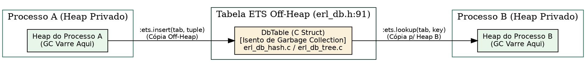

# ETS e DETS

> "Estruturas de dados em memória de alta concorrência exigem o desacoplamento estrito entre o leitor e o escritor para que a escala de throughput não seja sufocada por travas globais."
> — Edsger W. Dijkstra, *Cooperating Sequential Processes*, 1965

## Objetivos de leitura

- Dominar o sistema de armazenamento em memória **ETS** (*Erlang Term Storage*) e em disco **DETS**.
- Compreender a estrutura física C `DbTable` (`erl_db.h:91`) e a alocação de memória **Off-heap**.
- Diferenciar os 4 tipos de tabelas: `set`, `ordered_set`, `bag` e `duplicate_bag`.
- Analisar os mecanismos de concorrência: `read_concurrency`, `write_concurrency` e `decentralized_counters`.
- Construir consultas ultra-rápidas usando **Match Specifications** (`:ets.match_spec_compile/1`).

> 💡 **Âncora Cognitiva — O Almoxarifado Central Off-Heap e o Galpão de Disco (ETS e DETS):** Pense em uma tabela ETS como o **almoxarifado central de um edifício** corporativo. Se cada processo (funcionário) guardasse 1.000.000 de caixas de arquivos na sua mesa privada (no Young Heap do processo), a equipe de limpeza (Garbage Collector) gastaria horas varrendo cada mesa. Em vez disso, os processos depositam os arquivos no **almoxarifado off-heap** (`DbTable` em `erl_db.h:91`). Essas prateleiras C ficam fora da varredura do GC! Milhares de funcionários podem ler o almoxarifado simultaneamente em tempo constante $O(1)$ (`read_concurrency: true`). E para manter as prateleiras protegidas contra quedas de energia, o **DETS** espelha os arquivos no galpão de disco persistente!

## 1. A Estrutura Física C: Off-Heap Storage

No ERTS, as tabelas ETS são implementadas como estruturas C puras gerenciadas pela união `DbTable` (`otp/erts/emulator/beam/erl_db.h:91`).

Os dados gravados no ETS residem em memória **Off-heap**. Quando uma tupla é inserida via `:ets.insert/2`, a VM copia os termos do heap privado do processo para o espaço de memória da tabela C (`erl_db.h:191`).



### 1.1 Vantagem do Isolamento de GC

Como a `DbTable` vive fora dos heaps dos processos:
- **Zero GC Overhead:** O Garbage Collector de um processo não gasta milissegundos escaneando as milhões de tuplas do ETS!
- **Acesso Multiprocesso:** Múltiplos schedulers e processos podem ler a mesma tabela simultaneamente sem enviar mensagens.

## 2. Tipos de Tabelas ETS e Implementações C

O ETS disponibiliza 4 tipos de tabelas com estruturas de dados C especializadas:

| Tipo de Tabela | Estrutura C Subjacente | Complexidade de Busca | Comportamento de Chaves Duplicadas |
| :--- | :--- | :--- | :--- |
| **`set`** | Tabela Hash Linear (`erl_db_hash.c`) | $O(1)$ | Substitui o valor da chave existente. |
| **`ordered_set`** | Árvore AVL / CA-Tree (`erl_db_tree.c`) | $O(\log N)$ | Mantém as chaves ordenadas pelo termo Erlang. |
| **`bag`** | Tabela Hash Linear (`erl_db_hash.c`) | $O(1)$ | Permite tuplas duplicadas se os objetos forem diferentes. |
| **`duplicate_bag`** | Tabela Hash Linear (`erl_db_hash.c`) | $O(1)$ | Permite tuplas idênticas duplicadas. |

## 3. Concorrência Extrema: `read_concurrency` e `write_concurrency`

Para otimizar o throughput em sistemas SMP com dezenas de schedulers, o ETS disponibiliza opções de otimização de travas:

- **`read_concurrency: true`:** Utiliza travas de leitura descentralizadas (RW-Locks). Permite que múltiplos leitores leiam linhas da mesma tabela em paralelo total sem contenção de trava.
- **`write_concurrency: :auto`:** Divide a tabela hash em múltiplos buckets protegidos por travas finas independentes, permitindo escritas concorrentes em chaves diferentes.

> ❓ **Não Existem Perguntas Idiotas**  
> **Leitor:** Se eu gravar um binário gigante de 100 MB em uma tabela ETS e depois excluir a linha da tabela, a memória é liberada na hora?  
> **Resposta:** Sim! Se o binário for um `ProcBin` (> 64 bytes), a estrutura C da tabela decrementa o contador atômico de referências (`Binary.intern` em `erl_binary.h:63`). Se mais nenhum processo no sistema mantiver um ponteiro para aquele binário, os 100 MB de memória off-heap são desalocados imediatamente com `erts_free`!

## 4. Experimentos: Criando e Consultando ETS no Terminal

Podemos criar uma tabela ETS `set` e realizar buscas via Match Specifications no REPL:

```console
$ elixir -e '
  tab = :ets.new(:usuarios, [:set, :public, read_concurrency: true])
  :ets.insert(tab, {1, "Alice", :admin})
  :ets.insert(tab, {2, "Bob", :user})
  :ets.insert(tab, {3, "Charlie", :admin})

  # Match Specification: Buscar nomes de todos os admins ($1 = id, $2 = nome)
  spec = [{{:"$1", :"$2", :admin}, [], [:"$2"]}]
  admins = :ets.select(tab, spec)
  IO.puts("Administradores encontrados via MatchSpec: #{inspect(admins)}")'
Administradores encontrados via MatchSpec: ["Alice", "Charlie"]
```

Observação: A consulta `:ets.select/2` utilizou uma **Match Specification** pré-compilada C, filtrando os administradores diretamente na tabela off-heap sem copiar tuplas desnecessárias para o heap do Elixir!

### Bate-papo à beira da lareira com a Tabela ETS (`erl_db.h`)

**Leitor:** Olá, Tabela ETS! Como você consegue armazenar milhões de tuplas sem deixar o Garbage Collector da BEAM lento?  
**`erl_db.h`:** Olá! O meu segredo é viver Off-Heap! Eu sou uma estrutura C pura (`erl_db.h:91`). Quando os processos gravam dados em mim (`:ets.insert`), eu guardo tudo nas minhas tabelas Hash e Árvores AVL (`erl_db_hash.c`). Como o Garbage Collector só limpa a mesa privada de cada processo, ele nem sabe que eu existo! Os dados ficam seguros nas minhas prateleiras C até você decidir removê-los com `:ets.delete`!

## A Lente Multidisciplinar

> **Computacional / Análise de Algoritmos.** "Estruturas de dados em memória de alta concorrência exigem o desacoplamento estrito entre o leitor e o escritor para que a escala não seja sufocada por travas globais." — Edsger W. Dijkstra, *Cooperating Sequential Processes*, 1965  
> *A implementação de `read_concurrency` e `write_concurrency` em `erl_db.h` reflete o princípio de Dijkstra: minimiza a contenção de memória em arquiteturas SMP (Knuth, 1968).*

> **Jurídico / Sociológico.** "Cartórios de registros imobiliários e tabelionatos mantêm arquivos centrais autônomos para consultar títulos sem interferir na posse privada dos cidadãos." — H.L.A. Hart, *The Concept of Law*, 1961  
> *O ETS opera como esse cartório central off-heap: os processos mantêm sua posse privada (Young Heap) e consultam o registro público (ETS) de forma ordenada (Weber, 1922).*

> **Estoico / Eficiência de Recursos.** "Não sobrecarregues a tua bagagem diária com bens que podem ser guardados com segurança no depósito comum." — Sêneca, *Cartas a Lucílio*, Carta 71  
> *A prática de armazenar grandes conjuntos de dados no ETS em vez do heap do processo reflete a sobriedade estoica: livra a memória do processo da carga de varredura do GC (Brooks, 2010).*

## 30 Exercícios práticos e conceituais

### Bloco A — Questões Conceituais e Fundamentos (1–8)

1. **Explique o conceito central de ETS e DETS em suas próprias palavras.**
2. **Qual a diferença fundamental entre 4 Tipos de Tabelas e `read_concurrency: true`?**
3. **Por que Match Specifications é importante para o funcionamento da BEAM?**
4. **Descreva a estrutura de Memória Off-Heap.**
5. **Como 4 Tipos de Tabelas se relaciona com `read_concurrency: true`?**
6. **Qual o propósito de DETS no contexto da VM?**
7. **Liste as etapas principais de 4 Tipos de Tabelas.**
8. **O que aconteceria se `write_concurrency: :auto` não existisse na BEAM?**

### Bloco B — Análise de Código Fonte e Verificação `file:line` (9–16)

9. **Localize no código-fonte a definição de Memória Off-Heap. Em qual arquivo e linha ela está?**
10. **Encontre a implementação de `read_concurrency: true` em otp/erts/emulator/beam/erl_db.h e explique seu funcionamento.**
11. **Analise a macro/struct/função Match Specifications no arquivo otp/erts/emulator/beam/erl_db_hash.c. Qual sua assinatura?**
12. **Identifique em otp/erts/emulator/beam/erl_db_tree.c como Memória Off-Heap é implementado. Quais os parâmetros?**
13. **Busque no fonte otp/erts/emulator/beam/erl_db.h a referência para 4 Tipos de Tabelas. Qual a linha exata?**
14. **Compare as implementações de DETS e Memória Off-Heap nos fontes. O que difere?**
15. **Localize a constante 4 Tipos de Tabelas em otp/erts/emulator/beam/erl_db.h. Qual o valor numérico e o que ele representa?**
16. **Encontre a função/macro `write_concurrency: :auto` em otp/erts/emulator/beam/erl_db_hash.c. Quantas linhas ela ocupa?**

### Bloco C — Experimentos Práticos (17–24)

17. **Execute um experimento no terminal que demonstre Memória Off-Heap. Cole a saída.**
18. **Use `read_concurrency: true` para verificar o comportamento de `write_concurrency: :auto`.**
19. **Meça no REPL o resultado de DETS e explique o que observou.**
20. **Crie um exemplo mínimo em Erlang/Elixir que ilustre Match Specifications.**
21. **Compare a saída de `read_concurrency: true` antes e depois de `write_concurrency: :auto`.**
22. **Utilize a ferramenta Memória Off-Heap para inspecionar 4 Tipos de Tabelas.**
23. **Escreva um teste que valide a propriedade de `write_concurrency: :auto`.**
24. **Simule o cenário onde DETS ocorre e documente o resultado.**

### Bloco D — Pontes Cognitivas, Invariantes e Desafios de Arquitetura (25–30)

25. **Invariante: demonstre que Memória Off-Heap sempre preserva 4 Tipos de Tabelas.**
26. **Ponte cognitiva: como o conceito de `write_concurrency: :auto` se relaciona com Match Specifications segundo a Lente Multidisciplinar?**
27. **Desafio de arquitetura: se você pudesse redesenhar Memória Off-Heap, o que mudaria e por quê?**
28. **Analise o trade-off entre 4 Tipos de Tabelas e `read_concurrency: true`. Qual a escolha da BEAM e por quê?**
29. **Ponte cognitiva: que metáfora do cotidiano melhor representa DETS?**
30. **Desafio: explique o que acontece em nível de VM quando 4 Tipos de Tabelas é executado.**

## Resumo para memorização

> 🧠 **Mnemônico:** Associe os conceitos de Memória Off-Heap, 4 Tipos de Tabelas, `read_concurrency: true` com as primeiras letras para formar um acrônimo.

- **Memória Off-Heap**: O ETS armazena tuplas em estruturas C fora dos heaps dos processos, isentando os dados do Garbage Collection (`erl_db.h:91`).
- **4 Tipos de Tabelas**: `set` (hash $O(1)$), `ordered_set` (árvore AVL $O(\log N)$), `bag` (chaves repetidas com objetos distintos) e `duplicate_bag` (duplicatas exatas).
- **`read_concurrency: true`**: Habilita travas de leituraRW descentralizadas para leitura paralela em múltiplos schedulers.
- **`write_concurrency: :auto`**: Habilita bloqueio por buckets na tabela hash para escritas concorrentes simultâneas.
- **Match Specifications**: Sintaxe de filtro C pré-compilada (`:ets.select`) que executa buscas de alta velocidade dentro do ETS.
- **DETS**: Versão em disco persistente do ETS armazenada em arquivos binários indexados (`dets.erl`).

## Ver também

- [Capítulo 37 — Alocadores de memória](CH-37.html)
- [Capítulo 24 — Applications e releases](CH-24.html)
- [Capítulo 26 — Distribuição e o protocolo Erlang](CH-26.html)
- [Capítulo 28 — Structs, maps e pattern matching por dentro](CH-28.html)
- [Flashcards deste capítulo](FL-25.html)
- [Lógica de predicados deste capítulo](PL-25.html)
- [Grafo de conhecimento deste capítulo](KG-25.html)
- [Erlang STDLIB — ets Module](https://www.erlang.org/doc/man/ets.html)
