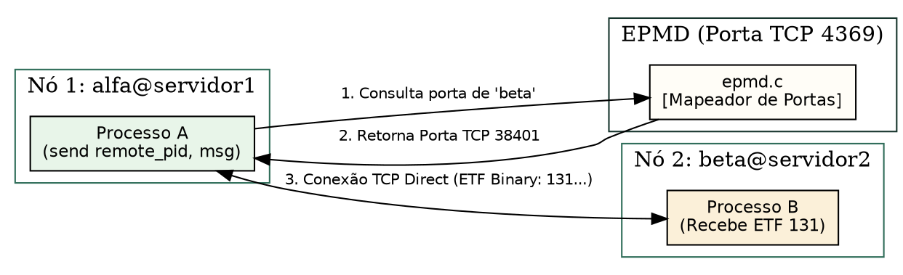
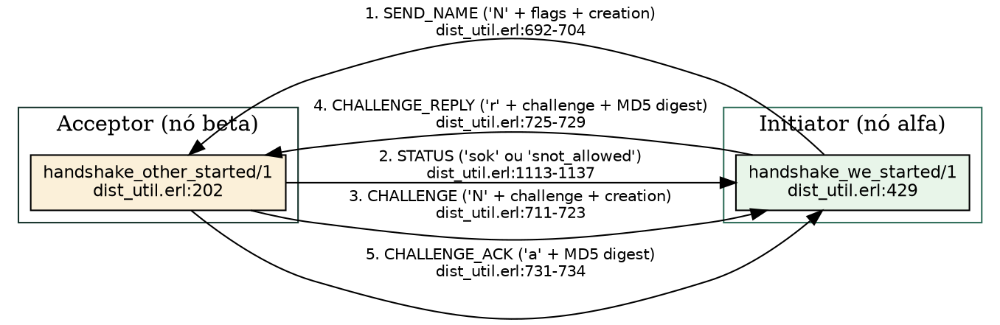
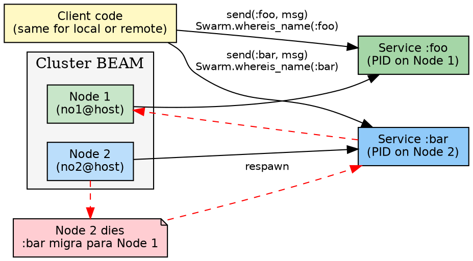
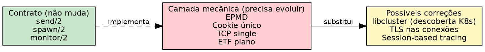
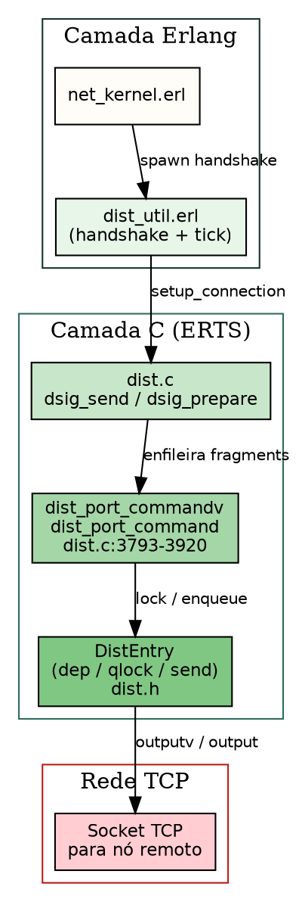

# Distribuição e o protocolo Erlang

> "A transparência de localização em um sistema distribuído fundamenta-se na capacidade de abstrair as fronteiras de rede, permitindo que nós remotos troquem mensagens com a mesma semântica dos atores locais."
> — Leslie Lamport, *Time, Clocks, and the Ordering of Events in a Distributed System*, 1978

## Objetivos de leitura

- Dominar a arquitetura de **Nós Distribuídos BEAM** e a transparência de localização.
- Analisar a função do daemon **EPMD** (*Erlang Port Mapper Daemon*) em `epmd.c`.
- Compreender a especificação binária **ETF** (*External Term Format*) e suas tags C em `external.h:33`.
- Acompanhar a autenticação por **Cookie Distribuído** e a montagem do handshake de rede TCP.
- Conectar dois nós Elixir/Erlang no terminal e trocar mensagens e chamadas `Node.spawn/2`.

> 💡 **Âncora Cognitiva — As Linhas Telefônicas Internacionais e o Protocolo Universal (Distribuição & ETF):** Pense na distribuição de nós BEAM como uma rede de escritórios corporativos globais conectados por telefonia de alta velocidade. O **EPMD** (`epmd.c`) é a **lista telefônica central** que escuta na porta TCP 4369: quando o nó `alfa@servidor1` deseja falar com `beta@servidor2`, ele consulta o EPMD para obter o número da porta TCP em que `beta` está escutando. A conversa acontece trocando mensagens empacotadas no formato **ETF (External Term Format)** (`external.h:33`), marcado pelo byte mágico `131`. Para o desenvolvedor, enviar uma mensagem para um processo a 10.000 km de distância usa exatamente a mesma sintaxe de código que enviar para um processo na mesma memória RAM!

## 1. Transparência de Localização e Nós Distribuídos

Um dos pilares conceituais mais poderosos da BEAM é a **Transparência de Localização**.

Em linguagens convencionais, enviar dados para uma rede exige bibliotecas HTTP, gRPC ou Sockets adicionais. Na BEAM, a primitivas de concorrência (`send`, `spawn`, `monitor`, `link`) são agnósticas à localização do processo:

```elixir
# Envio para processo local:
send(pid_local, {:mensagem, "Ola"})

# Envio para processo em outro nó no Japão (exata mesma sintaxe!):
send(pid_remoto, {:mensagem, "Ola"})
```

Fisicamente, a VM examina os bits do identificador do PID. Se a flag de nó indicar um nó diferente do nó local (`self()`), a VM não grava a mensagem no mailbox local; ela serializa os termos em binário ETF e transmite o pacote pela conexão TCP do cluster.



## 2. O Mapeador de Portas: EPMD (`epmd.c`)

Quando um nó Erlang ou Elixir é iniciado com nome distribuído (ex: `iex --name alfa@127.0.0.1`), a VM inicializa em segundo plano o daemon **EPMD** (`otp/erts/epmd/src/epmd.c`).

### Como Funciona o Handshake EPMD:

1. **Registro:** Ao iniciar, o nó `beta` escolhe uma porta TCP aleatória no SO e registra seu nome no EPMD local na porta padrão `4369`.
2. **Consulta:** Quando o nó `alfa` executa `Node.connect(:"beta@127.0.0.1")`, ele abre um socket com o EPMD do host `127.0.0.1:4369` perguntando: *"Em qual porta o nó beta está atendendo?"*.
3. **Handshake Direct:** O EPMD responde com a porta daquele nó. A partir desse instante, `alfa` e `beta` estabelecem uma socket TCP direta e passam a trocar dados sem intermediários!

### 2.1 Fluxo completo do handshake entre nós

Após a resolução de porta via EPMD, os dois nós executam um handshake
em cinco mensagens sobre a conexão TCP direta, implementado em
`otp/lib/kernel/src/dist_util.erl`. O protocolo tem duas variantes
simétricas — `handshake_we_started/1` (para o nó que iniciou a
conexão) e `handshake_other_started/1` (para o nó que aceitou):



O fluxo completo segue esta sequência:

1. **`SEND_NAME`** — O nó iniciador envia `$N` seguido de 64 bits de
   `flags`, 32 bits de `creation` (versão do nó) e 16 bits de
   `namelen` + nome do nó (`dist_util.erl:692-704`).

2. **`STATUS`** — O nó acceptor responde com `$s` seguido do status:
   `"ok"` (conexão aceita), `"nok"` (recusada), `"not_allowed"`,
   `"alive"`, `"ok_simultaneous"` ou, para nós dinâmicos,
   `"named:"` + nome (`dist_util.erl:1113-1137`). O iniciador valida
   o status em `recv_status/1` (`dist_util.erl:1033-1089`).

3. **`CHALLENGE`** — O acceptor envia `$N` com 64 bits de `this_flags`,
   32 bits de `challenge` (número aleatório de 32 bits), 32 bits de
   `creation` e 16 bits de `namelen` + seu nome
   (`dist_util.erl:711-723`). O `gen_challenge/0` gera o desafio
   combinando hash do nome do nó, tempo monotônico, inteiro único,
   reduções, runtime e wall clock (`dist_util.erl:553-565`).

4. **`CHALLENGE_REPLY`** — O iniciador calcula `gen_digest(ChallengeA,
   Cookie)` usando MD5 da concatenação do cookie (em string) com o
   challenge recebido (`dist_util.erl:546-547`). Envia `$r` + 4 bytes
   do challenge gerado + 16 bytes do digest MD5
   (`dist_util.erl:725-729`). O acceptor valida o digest em
   `recv_challenge_reply/3` (`dist_util.erl:987-1009`); se inválido,
   imprime `"Connection attempt from node ~w rejected. Invalid
   challenge reply."` e encerra a conexão.

5. **`CHALLENGE_ACK`** — O acceptor envia `$a` + 16 bytes do MD5 digest
   (`dist_util.erl:731-734`). O iniciador valida em
   `recv_challenge_ack/3` (`dist_util.erl:1011-1031`); se inválido,
   imprime `"Connection attempt to node ~w cancelled. Invalid
   challenge ack."`.

A verificação de cookie é feita em ambos os lados comparando o digest
MD5 recebido com o digest calculado localmente. Como o digest usa o
cookie como seed (`gen_digest/2` em `dist_util.erl:546-547`), apenas
nós que compartilham o mesmo cookie produzem digests coincidentes.
Após o `CHALLENGE_ACK` bem-sucedido, `connection/1`
(`dist_util.erl:501`) finaliza o setup: chama `do_setnode/1`, registra
a conexão no `net_kernel` e inicia o ticker de keep-alive.

> ❓ **Não Existem Perguntas Idiotas**  
> **Leitor:** Por que o handshake troca challenges nos dois sentidos
> se o cookie é compartilhado?  
> **Resposta:** O handshake é **mútuo**: cada nó gera seu próprio
> challenge (`ChallengeA` e `ChallengeB`) e envia ao outro o digest
> MD5 do *outro* challenge combinado com o cookie. Isso prova que
> ambos conhecem o cookie sem nunca transmiti-lo na rede — é um
> prova de conhecimento zero (ZKP) simplificada. Se apenas um lado
> gerasse o desafio, um atacante poderia fazer replay de um
> handshake antigo.

## 3. O Formato Binário Universal: ETF (`external.h:33`)

Toda a troca de dados entre nós distribuídos (e no armazenamento de termos com `term_to_binary/1`) utiliza o formato **External Term Format (ETF)**.

A especificação física de tags binárias é definida em `otp/erts/emulator/beam/external.h:33`:

```c
#define VERSION_MAGIC     131   /* Byte mágico obrigatorio 0x83 */
#define SMALL_INTEGER_EXT 'a'   /* 97: Inteiro de 1 byte */
#define INTEGER_EXT       'b'   /* 98: Inteiro de 4 bytes */
#define ATOM_UTF8_EXT     'v'   /* 118: Átomo UTF-8 com tamanho Uint16 */
#define PID_EXT           'g'   /* 103: Identificador de Processo Remoto */
#define NEW_PID_EXT       'X'   /* 88: PID Distribuído com ID de Nó e Sequência */
#define MAP_EXT           't'   /* 116: Mapa com tamanho Arity */
```

`otp/erts/emulator/beam/external.h:33-60` — todo binário ETF começa obrigatoriamente com o **Version Magic 131** (`0x83`), seguido por uma sequência de bytes codificados com a tag C de cada tipo de dado.

> ❓ **Não Existem Perguntas Idiotas**  
> **Leitor:** O que é o *Cookie de Autenticação* em um cluster de nós BEAM distribuídos?  
> **Resposta:** O cookie é uma chave secreta em átomo (compartilhada via arquivo `~/.erlang.cookie` ou pela flag `--cookie`) usada no handshake inicial de dois nós. Durante a conexão TCP, os dois nós trocam desafios de hash MD5 provando que conhecem a mesma chave. Se o cookie for diferente, a BEAM rejeita a conexão imediatamente, impedindo que nós não autorizados entrem no cluster!

## 4. Experimentos: Conectando Dois Nós no Terminal

Podemos abrir dois terminais e estabelecer um cluster distribuído real em Elixir:

### Terminal 1 (Nó `no1`):

```console
$ iex --sname no1 --cookie segredo
(no1@hostname)1> Node.self()
:"no1@hostname"
```

### Terminal 2 (Nó `no2`):

```console
$ iex --sname no2 --cookie segredo
(no2@hostname)1> Node.connect(:"no1@hostname")
true
(no2@hostname)2> Node.spawn(:"no1@hostname", fn -> IO.puts("Executando no No 1 a partir do No 2!") end)
#PID<10432.150.0>
```

Observação: O nó `no2` conectou-se com sucesso ao nó `no1` e usou `Node.spawn/2` para executar uma lambda remotamente no nó 1, imprimindo o texto diretamente na sessão do terminal 1!

## 5. Distribuição na prática: named services e a crítica honesta

A transparência de localização da BEAM (seção 1) permite que `send`,
`spawn` e `monitor` funcionem com a mesma sintaxe para processos
locais e remotos. Na prática, isso significa que **o código não muda**
quando um serviço migra de nó — o que muda é apenas o PID.



O código a seguir — adaptado da talk de Saša Jurić (Code BEAM 2024) —
mostra como implementar um named service distribuído em Elixir com a
biblioteca [Swarm](https://hex.pm/packages/swarm):

```elixir
# mix.exs — dependência única
defp deps do
  [{:swarm, "~> 3.4"}]
end

# Iniciar um serviço nomeado no cluster
{:ok, pid} = Swarm.start_link(:foo, :some_module, :some_arg, [])

# Descobrir e enviar mensagem
pid = Swarm.whereis_name(:foo)
send(pid, {:hello, :from_any_node})
```

A dependência `:swarm` não traz apenas **código** — traz **atividades**
(processos que gerenciam o estado do cluster, monitoram joins/leaves
e mantêm a associação nome→PID). Como tudo roda dentro da mesma VM,
não há agentes externos, containers ou processos OS dedicados.

### A crítica honesta: problemas mecânicos, não conceituais

A talk de Saša Jurić faz uma distinção importante: os problemas da
distribuição BEAM são **mecânicos, não arquiteturais**. O **contrato**
(`send/2`, `spawn/2`, `monitor/2`) é sólido — a mesma sintaxe funciona
local e remotamente. Os problemas estão na implementação atual:

| Problema | Impacto | Onde mora |
|----------|---------|-----------|
| EPMD é ponto único de falha | Se `epmd` morre, nós não conseguem se conectar | `otp/erts/epmd/src/epmd.c` |
| Cookie único para todo o cluster | Um nó comprometido expõe todo o cluster | `otp/lib/kernel/src/net_kernel.erl` |
| Conexão TCP única entre nós | Se cai, todas as mensagens pendentes são perdidas | `otp/erts/emulator/beam/dist.c` |
| Sem criptografia nativa em tráfego de dados | ETF trafega em texto plano (apenas handshake é hash) | `otp/erts/emulator/beam/dist.c` |
| Descoberta baseada em broadcast | Não escala bem em cloud com centenas de nós | `otp/lib/kernel/src/net_kernel.erl` |

> "These issues are purely mechanical, which means that they can be
> fixed in the implementation without significantly changing the
> interface — the way we use this thing."
> — Saša Jurić, *The Soul of Erlang and Elixir*, Code BEAM 2024

A promessa é que o **contrato** (`Node.spawn/2`, `send/2` entre nós)
não precisa mudar — apenas as camadas abaixo (descoberta, transporte,
criptografia) precisam de melhorias. Projetos como
[libcluster](https://hex.pm/packages/libcluster) (descoberta baseada em
Kubernetes, ECS, multicast) e [Peerage](https://hex.pm/packages/peerage)
já mostram o caminho: substituem o EPMD por estratégias modernas de
service discovery sem alterar a API de distribuição.



## 6. O futuro: distribuição sem EPMD

Projetos como [libcluster](https://hex.pm/packages/libcluster) e
[Peerage](https://hex.pm/packages/peerage) eliminam a dependência de
EPMD substituindo a descoberta de nós por estratégias modernas:

- **Kubernetes**: lista de endpoints via API do K8s
- **DNS**: lookup por registros SRV/TXT
- **Multicast**: descoberta local por UDP multicast
- **ECS (AWS)**: service discovery via AWS ECS API

Em todos eles, a API permanece a mesma — `Node.connect/1`,
`Node.spawn/2`, `send/2` entre nós. Apenas o mecanismo de descoberta
muda. Isso valida a tese de Saša: o contrato é estável; os problemas
são mecânicos e solucionáveis.

## 7. Dist Port e busy_dist_port

O **Dist Port** (distribution port) é a abstração de transporte de
baixo nível dentro do ERTS que gerencia o envio e recebimento de
mensagens entre nós conectados. Enquanto `dist_util.erl` cuida do
handshake, o código C em `otp/erts/emulator/beam/dist.c` gerencia a
fragmentação, o enfileiramento e o controle de fluxo.



### 7.1 Fragmentação de mensagens

Mensagens grandes entre nós são automaticamente fragmentadas em
pedaços de até **ERTS_DIST_FRAGMENT_SIZE** (64 KB em modo release,
1 KB em modo debug) (`otp/erts/emulator/beam/dist.h:204-209`). Cada
fragmento carrega um cabeçalho de **ERTS_DIST_FRAGMENT_HEADER_SIZE**
(18 bytes: magic byte + header byte + 8 bytes seq id + 8 bytes frag
id) (`dist.h:211`).

O fluxo de fragmentação em `dist.c`:

- `alloc_dist_obufs()` (`dist.c:1192-1234`) aloca um array de
  `ErtsDistOutputBuf` — um por fragmento — e inicializa o context de
  encode TTB com `erts_ttb_iov_init()`.
- `erts_ttb_iov_init()` calcula o tamanho de cada fragmento: se
  `fragments > 1`, usa `ERTS_DIST_FRAGMENT_SIZE`; senão, tamanho
  infinito (`dist.c:1214-1217`).
- O contador de referência do binário é incrementado com
  `erts_refc_add(&bin->intern.refc, fragments - 1, 1)` —
  cada fragmento compartilha o mesmo `Binary` subjacente
  (`dist.c:1222`).
- No lado receptor, `dist.c:2094-2175` verifica a ordem dos
  fragmentos (`Verify that the fragments have arrived in the correct
  order` em `dist.c:2155`) e remonta a mensagem completa quando o
  último fragmento chega (`dist.c:2161-2167`).

### 7.2 `busy_dist_port`: causas e soluções

Quando um nó remoto não consegue consumir dados na velocidade em que
o nó local os produz, o sistema de controle de fluxo do Dist Port
ativa o mecanismo **busy_dist_port**:

- O flag `ERTS_DE_QFLG_BUSY` é setado na `DistEntry` quando o
  threshold `ERTS_DE_BUSY_LIMIT` (1 MB, `dist.h:213`) é excedido na
  fila de saída.
- Processos tentando enviar são suspensos em
  `erts_suspend(ctx->c_p, ...)` e enfileirados em `dep->suspended`
  (`dist.c:3692-3701`).
- O scheduler gera eventos DTrace `dist_port_busy` e
  `dist_port_not_busy` (`dist.c:3757-3768`, `dist.c:4748-4767`).
- Se `erts_system_monitor_busy_dist_port_cnt` > 0, o sistema
  também notifica o processo monitor (`monitor_busy_dist_port()` em
  `dist.c:3746-3747`).

**Causas comuns:**
- Nó remoto sob garbage collection intensivo
- Rede com latência alta ou throughput baixo
- Nó remoto com scheduler starving (muitos processos, poucas
  reductions)
- Mensagens muito grandes (listas enormes, binaries pesados) sem
  fragmentação eficiente

**Soluções:**
1. Ajustar `ERTS_DE_BUSY_LIMIT` (compilando o ERTS) para aumentar o
   buffer
2. Usar `erlang:system_monitor/2` com `:busy_dist_port` para
   detectar e reagir programaticamente
3. Reduzir o volume de mensagens entre nós — usar batches, comprimir
   dados, ou mover lógica para o nó onde os dados estão
4. Verificar conectividade de rede (latência, pacotes perdidos)

### 7.3 Controle de fluxo entre nós

O Dist Port implementa um controle de fluxo **baseado em pressão**
(backpressure):

1. **Enfileiramento:** `dist_port_command()` e
   `dist_port_commandv()` (`dist.c:3793, 3843`) escrevem os buffers
   no driver de socket. Se o driver não pode escrever imediatamente,
   o dado permanece na fila.

2. **Suspensão:** Quando a fila ultrapassa `ERTS_DE_BUSY_LIMIT`, o
   processo remetente é suspenso via `erts_suspend()`. O flag
   `F_FRAGMENTED_SEND` é setado no processo (`dist.c:3744`) para
   que, ao ser retomado, ele continue enviando fragmentos restantes.

3. **Retomada:** O driver de socket sinaliza que pode escrever mais
   dados chamando `erts_dist_port_not_busy()` (`dist.c:4748-4767`),
   que dispara DTrace `dist_port_not_busy` e agenda o comando de
   distribuição pendente.

4. **Yielding:** O scheduler alterna entre envio de fragmentos e
   execução de outros processos (reductions) — `dist.c:3742-3748`
   mostra que se há mais fragmentos, `retval = ERTS_DSIG_SEND_CONTINUE`
   faz o scheduler retornar ao processo depois de executar outros.

Esse modelo garante que um nó lento não cause unbounded memory growth
no nó produtor — o backpressure atua parando os processos que
produzem mensagens para o nó congestionado.

### Bate-papo à beira da lareira com o Daemon EPMD (`epmd.c`)

**Leitor:** Olá, `EPMD`! Por que você precisa escutar na porta 4369 em todos os servidores que rodam a BEAM?  
**`epmd.c`:** Olá! Eu sou a lista telefônica de portas do cluster (`epmd.c`)! Como os nós BEAM escolhem portas TCP aleatórias para evitar conflitos no sistema operacional, os outros nós precisam de uma referência fixa para se acharem. Eu fico de plantão na porta 4369. Quando um nó quer conversar, ele me pergunta a porta do destinatário, eu respondo e saio do meio para que os dois nós conversem em alta velocidade!

## A Lente Multidisciplinar

> **Computacional / Sistemas Distribuídos.** "A transparência de localização em um sistema distribuído fundamenta-se na capacidade de abstrair as fronteiras de rede, permitindo que nós remotos troquem mensagens com a mesma semântica dos atores locais." — Leslie Lamport, *Time, Clocks, and the Ordering of Events in a Distributed System*, 1978  
> *A arquitetura de Nós Distribuídos da BEAM é a implementação direta da transparência de Lamport: PIDs locais e remotos compartilham as mesmas primitivas de envio (Shannon, 1948).*

> **Jurídico / Sociológico.** "Tratados de cooperação internacional estabelecem consulados de representação mútua que validam a identidade dos cidadãos estrangeiros sob um protocolo de selo unificado." — H.L.A. Hart, *The Concept of Law*, 1961  
> *O handshake EPMD e o Cookie de autenticação atuam como essa representação consular: validam o nó estrangeiro sob o protocolo mágico ETF `131` antes de conceder acesso ao cluster (Weber, 1922).*

> **Estoico / Conexão Universal.** "Reconhece que fazes parte de um grande corpo cosmo-político, onde o movimento de uma parte distante afeta e harmoniza o todo." — Marco Aurélio, *Meditações*, Livro IV  
> *A capacidade de disparar processos em nós remotos com `Node.spawn/2` reflete essa visão de Marco Aurélio: trata a malha de servidores como um único organismo de computação integrado (Brooks, 2010).*

## 30 Exercícios práticos e conceituais

### Bloco A — Questões Conceituais e Fundamentos (1–8)

1. **Explique o conceito central de Distribuição e o protocolo Erlang em suas próprias palavras.**
2. **Qual a diferença fundamental entre EPMD (`epmd.c`) e ETF (External Term Format)?**
3. **Por que `term_to_binary` / `binary_to_term` é importante para o funcionamento da BEAM?**
4. **Descreva a estrutura de Transparência de Localização.**
5. **Como ETF (External Term Format) se relaciona com Cookie de Autenticação?**
6. **Qual o propósito de `Node.spawn/2` no contexto da VM?**
7. **Liste as etapas principais de EPMD (`epmd.c`).**
8. **O que aconteceria se Cookie de Autenticação não existisse na BEAM?**

### Bloco B — Análise de Código Fonte e Verificação `file:line` (9–16)

9. **Localize no código-fonte a definição de Transparência de Localização. Em qual arquivo e linha ela está?**
10. **Encontre a implementação de ETF (External Term Format) em otp/erts/emulator/beam/external.h e explique seu funcionamento.**
11. **Analise a macro/struct/função `term_to_binary` / `binary_to_term` no arquivo otp/erts/emulator/beam/external.c. Qual sua assinatura?**
12. **Identifique em otp/erts/epmd/src/epmd.c como Transparência de Localização é implementado. Quais os parâmetros?**
13. **Busque no fonte otp/erts/emulator/beam/external.h a referência para ETF (External Term Format). Qual a linha exata?**
14. **Compare as implementações de `Node.spawn/2` e Transparência de Localização nos fontes. O que difere?**
15. **Localize a constante ETF (External Term Format) em otp/erts/emulator/beam/external.h. Qual o valor numérico e o que ele representa?**
16. **Encontre a função/macro `term_to_binary`/`binary_to_term` em otp/erts/emulator/beam/external.c. Quantas linhas ela ocupa?**

### Bloco C — Experimentos Práticos (17–24)

17. **Execute o experimento do named service com Swarm: inicie 2 nós (NOD1, NOD2) com `--cookie secret`, registre `:foo` no NOD1, descubra do NOD2 e envie uma mensagem.**
18. **Use `Node.spawn/2` para executar uma função em outro nó — verifique que o PID retornado inclui o nó remoto (`#PID<no2.123.0>`).**
19. **Meça no REPL o tempo de `term_to_binary/1` para uma lista de 10.000 inteiros e compare com `binary_to_term/1`.**
20. **Crie um exemplo de handshake com `--cookie` incorreto entre 2 nós — documente o erro `connection attempt from node ... rejected`.**
21. **Compare a saída de `Node.list()` antes e depois de `Node.connect/1`.**
22. **Utilize `:net_kernel.monitor_nodes/1` para rastrear eventos de `:nodeup` e `:nodedown` num cluster de 2 nós.**
23. **Escreva um teste que valide: se um nó morre (`:erlang.halt/0`), o outro nó detecta com `:net_kernel.monitor_nodes`.**
24. **Acesse `epmd -kill` no terminal, tente iniciar um novo nó e documente o erro `Failed to connect to epmd`.**

### Bloco D — Pontes Cognitivas, Invariantes e Desafios de Arquitetura (25–30)

25. **Invariante: demonstre que `send/2` funciona com a mesma sintaxe para PIDs locais e remotos — a transparência de localização se mantém mesmo quando o nó destino está em outra máquina.**
26. **Ponte cognitiva: o cookie autentica identidade, o EPMD resolve localização — como essas duas funções se complementam no handshake?**
27. **Desafio de arquitetura: se você pudesse redesenhar a distribuição BEAM para eliminar os problemas mecânicos da tabela em §5 (EPMD ponto único, cookie único, TCP single), o que mudaria e o que manteria igual?**
28. **Analise o trade-off entre EPMD (descoberta centralizada na porta 4369) e libcluster (descoberta distribuída via K8s API). Quando cada um é preferível?**
29. **Ponte cognitiva: a metáfora do consulado (Lente Multidisciplinar) se aplica também ao Swarm registrando um named service por todo o cluster? Como?**
30. **Desafio: explique o que acontece em nível de VM quando um nó com named service `:bar` morre e o serviço é ressuscitado em outro nó — desde o `:nodedown` até o `Swarm.register_name`.**

## Resumo para memorização

> 🧠 **Mnemônico:** E-T-C-N-S (EPMD, ETF, Cookie, Node.spawn, Swarm — a pilha de distribuição, do transporte ao named service).

- **Transparência de Localização**: Primitivas de envio (`send`, `spawn`, `monitor`) funcionam com a mesma sintaxe para PIDs locais e remotos.
- **EPMD (`epmd.c`)**: *Erlang Port Mapper Daemon*, o serviço de nomes escutando na porta TCP 4369 que mapeia nomes de nós para portas ativas.
- **ETF (External Term Format)**: Padrão binário universal marcado pelo byte mágico `131` (`0x83`) usado na comunicação de rede (`external.h:33`).
- **Cookie de Autenticação**: Chave secreta em átomo usada durante o handshake TCP para impedir o acesso de nós não autorizados.
- **`term_to_binary` / `binary_to_term`**: BIFs para converter qualquer termo Erlang/Elixir em binário ETF e vice-versa.
- **`Node.spawn/2`**: Executa uma função ou lambda remotamente em outro nó do cluster BEAM.
- **Named services em cluster (§5)**: Swarm com 3 linhas — `start_link`, `register_name`, `whereis_name`. Dependência traz atividades (processos), não só código.
- **Problemas mecânicos (§5)**: EPMD ponto único, cookie único, TCP single, ETF plano — o contrato (`send`/`spawn`) é sólido, a implementação é que precisa evoluir.

## Ver também

- [Capítulo 02 — A pilha: Erlang, OTP, Elixir e BEAM](CH-02.html)
- [Capítulo 23 — Processos e mensagens em OTP: o design](CH-23.html)
- [Capítulo 25 — ETS e DETS](CH-25.html)
- [Capítulo 31 — Concorrência no Elixir](CH-31.html)
- [Capítulo 33 — Observando a VM](CH-33.html)
- [Flashcards deste capítulo](FL-26.html)
- [Lógica de predicados deste capítulo](PL-26.html)
- [Grafo de conhecimento deste capítulo](KG-26.html)
- [Erlang Efficiency Guide — Distributed Erlang](https://www.erlang.org/doc/reference_manual/distributed.html)
