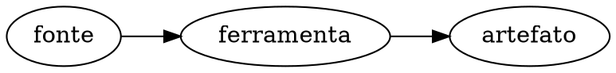

# Título do capítulo

> "Epígrafe única cirúrgica de impacto (Estoica ou Multidisciplinar)." — Autor, *Obra*, Ano

## Objetivos de leitura

- Entender X (Elixir/Erlang -> BEAM -> C)
- Verificar Y com experimento no terminal
- Citar Z `otp/.../arquivo.c:123`

## 1. Primeira seção (Divulgação Progressiva)

Explicação conceitual no nível do Elixir/Erlang. Prosa em PT-BR; termos técnicos (scheduler, run queue, mailbox, reduction, garbage collector) em inglês.

```elixir
# Código Elixir ou Erlang demonstrando a abstração de alto nível
```

Transição para a infraestrutura física em C do ERTS:

```c
/* Trecho real de otp/ com citação file:line */
```

`otp/erts/emulator/beam/erl_process.c:100` — explicação minuciosa.

Figura obrigatória (regra de ouro 7): toda seção que descreve fluxo, estrutura ou relação ganha um diagrama Graphviz em bloco ```dot:



Experimento prático no terminal validando o comportamento:

```console
$ erl -noshell -eval 'io:format("~p~n", [erlang:system_info(otp_release)]), halt().'
"29"
```

## A Lente Multidisciplinar

> **Cognitivo / Computacional.** "Citação..." — Herbert A. Simon / Alan Turing, *Obra*, 1950  
> *Síntese das conexões conceituais...*

> **Sociológico / Jurídico.** "Citação..." — Max Weber / Hans Kelsen, *Obra*, 1960  
> *Síntese das conexões organizacionais e normativas...*

## 30 Exercícios práticos e conceituais

### Bloco A — Questões Conceituais e Fundamentos (1–8)

1. **Pergunta conceitual 1**: ...
2. **Pergunta conceitual 2**: ...
3. **Pergunta conceitual 3**: ...
4. **Pergunta conceitual 4**: ...
5. **Pergunta conceitual 5**: ...
6. **Pergunta conceitual 6**: ...
7. **Pergunta conceitual 7**: ...
8. **Pergunta conceitual 8**: ...

### Bloco B — Análise de Código Fonte e Verificação `file:line` (9–16)

9. **Análise de fonte 1**: ...
10. **Análise de fonte 2**: ...
11. **Análise de fonte 3**: ...
12. **Análise de fonte 4**: ...
13. **Análise de fonte 5**: ...
14. **Análise de fonte 6**: ...
15. **Análise de fonte 7**: ...
16. **Análise de fonte 8**: ...

### Bloco C — Experimentos Práticos (17–24)

17. **Experimento 1**: ...
18. **Experimento 2**: ...
19. **Experimento 3**: ...
20. **Experimento 4**: ...
21. **Experimento 5**: ...
22. **Experimento 6**: ...
23. **Experimento 7**: ...
24. **Experimento 8**: ...

### Bloco D — Pontes Cognitivas, Invariantes e Desafios de Arquitetura (25–30)

25. **Ponte cognitiva 1**: ...
26. **Ponte cognitiva 2**: ...
27. **Invariante 1**: ...
28. **Desafio de arquitetura 1**: ...
29. **Desafio de arquitetura 2**: ...
30. **Desafio de arquitetura 3**: ...

## Resumo para memorização

- Bullet 1...
- Bullet 2...
- Bullet 3...
- Bullet 4...
- Bullet 5...

## Ver também

- [Flashcards deste capítulo](FL-__ID__.html)
- [Lógica de predicados deste capítulo](PL-__ID__.html)
- [Grafo de conhecimento deste capítulo](KG-__ID__.html)
- [Documentação oficial](https://www.erlang.org/doc)
