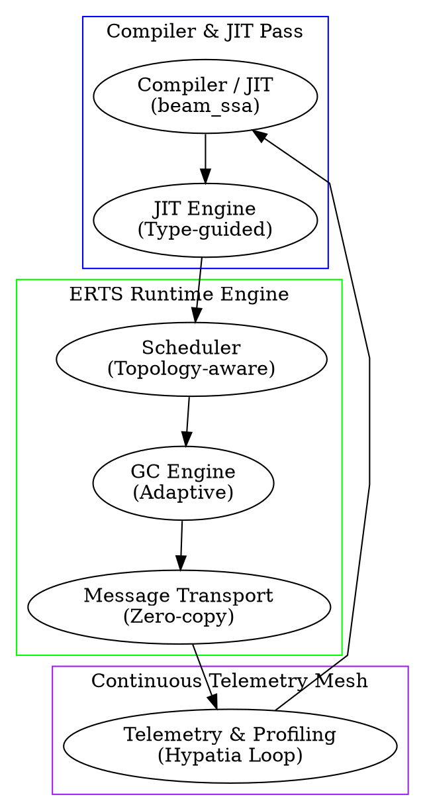

# Hypatia — Cross-Layer Self-Optimizing Architecture for the BEAM

> *"Truth is so precious that she should always be attended by a bodyguard of lies."* — Winston Churchill  

> **About the Author.** Matheus de Camargo Marques. This document presents an original thesis proposal outlining a cross-layer feedback VM architecture named **Hypatia**.

---

## Abstract

The BEAM Virtual Machine completes four decades of incremental evolution. Each internal subsystem — scheduler, garbage collector, compiler, JIT, memory allocator, distribution protocol — was designed with minimal cross-boundary communication. This thesis proposes the **Cross-Layer Architecture**, named **Hypatia**, where type information, execution telemetry profiles, inter-process communication graphs, and hardware topology form a continuous feedback loop across all VM execution layers.

Named in honor of Hypatia of Alexandria (c. 350–415 AD), who synthesized mathematics, astronomy, and philosophy in an era of knowledge fragmentation.

