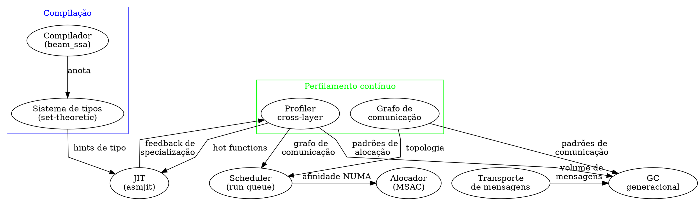
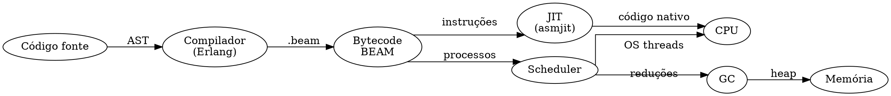
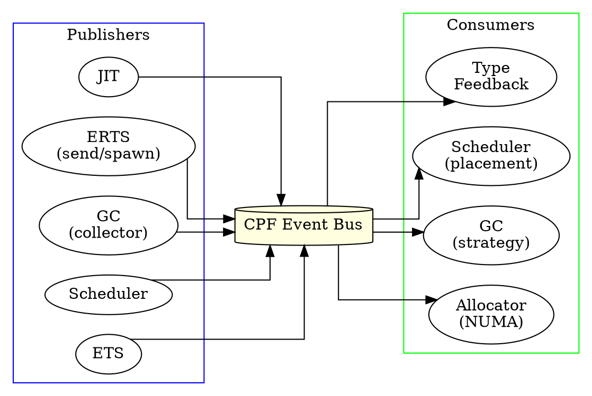
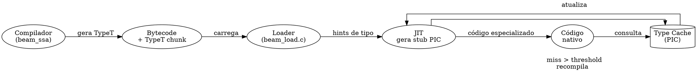
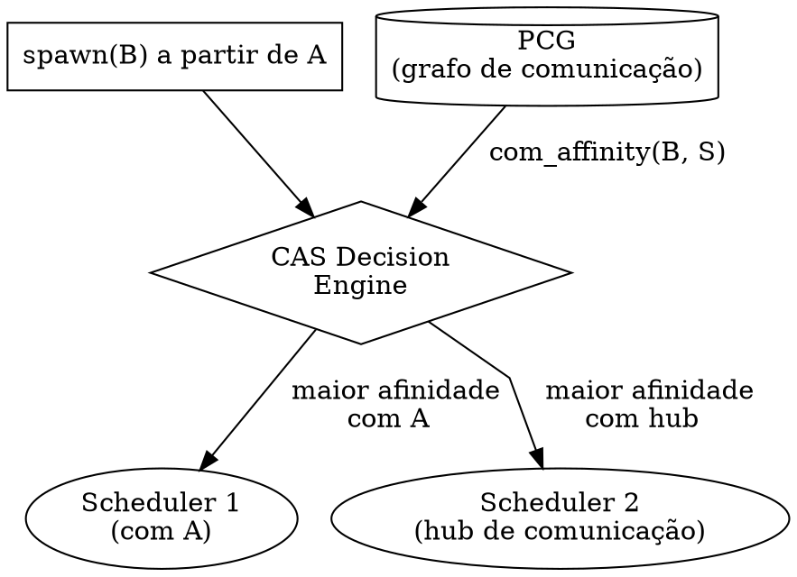
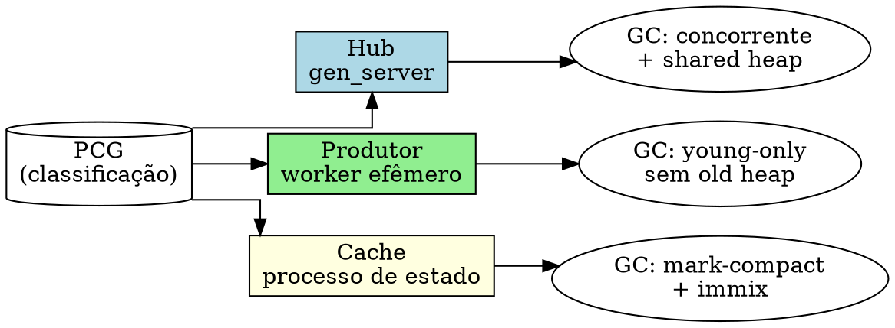
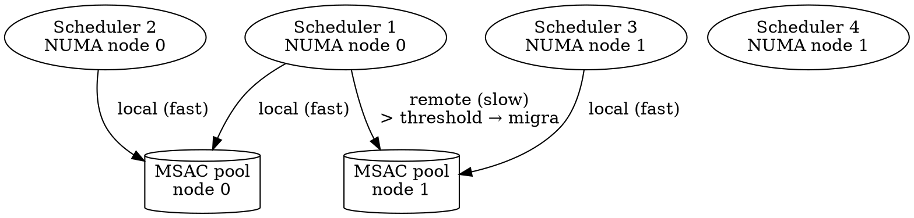
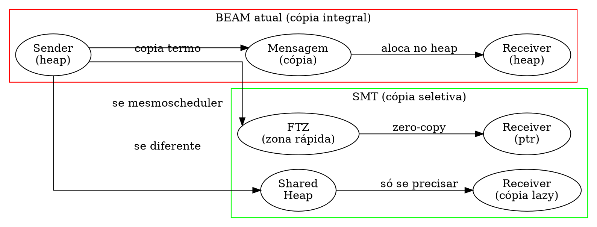
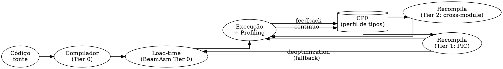

# Hipátia — Arquitetura Cruzada Auto-Otimizante para a BEAM

> "A verdade é uma coisa tão preciosa que deve ser sempre acompanhada de uma escolta de mentiras." — Winston Churchill, citado em Heim, *McElwain*, 1954  
> *(Uma arquitetura de VM que não se adapta à carga real é uma verdade que precisa de uma escolta de mentiras — perfis empíricos contra heurísticas estáticas.)*

> **Sobre o autor.** Matheus de Camargo Marques. Este documento é uma proposta de tese original. Nenhuma parte deste design existe como implementação consolidada na BEAM atual (Erlang/OTP 30.0-rc0). As ideias aqui sintetizam lacunas identificadas na literatura, inferências a partir do código-fonte do ERTS e proposta de arquitetura unificada original.

## Resumo

A BEAM (Bogdan/Björn's Erlang Abstract Machine) completa quatro décadas de evolução incremental. Cada subsistema — scheduler, garbage collector, compilador, JIT, alocador de memória, distribuição — foi projetado com interfaces mínimas e pouca troca de informação entre camadas. Esta tese propõe a **Arquitetura Cruzada (Cross-Layer Architecture)**, batizada **Hipátia**, na qual informação de tipos, perfis de execução, topologia de comunicação entre processos e hierarquia de hardware formam um ciclo de realimentação contínuo entre todas as camadas da VM.

O nome homenageia Hipátia de Alexandria (c. 350–415 d.C.), a última bibliotecária do Museu de Alexandria, que sintetizou matemática, astronomia e filosofia num período de fragmentação do conhecimento. Analogamente, Hipátia propõe reunificar o conhecimento espalhado entre os subsistemas da BEAM.

**Contribuições previstas:**

1. **JIT guiado por tipos** — polimorphic inline caching com fallback para código genérico, alimentado por tipos set-theoretic do compilador
2. **Scheduler sensível a perfil de comunicação** — decisões de placement e work-stealing baseadas no grafo de comunicação entre processos, não apenas em reduções
3. **GC adaptativo por topologia de mensagens** — estratégias de coleta que variam conforme o padrão de troca de mensagens do processo (produtor, consumidor, hub)
4. **Transporte semântico de mensagens** — mensagens com metadados de tipo que permitem zero-copy automático entre processos no mesmo scheduler
5. **Arcabouço de otimização contínua (lifelong)** — perfilamento permanente em todas as camadas com realimentação cruzada



---

## 1. Diagnóstico: a BEAM atual e suas fronteiras

### 1.1 Isolamento entre camadas

A BEAM atual (Erlang/OTP 30.0-rc0) organiza-se em subsistemas que se comunicam por interfaces mínimas. O compilador Erlang produz bytecode BEAM sem informação de tipos além de hints pontuais (`reuse`, `copy`, `inplace` em OTP 27). O JIT BeamAsm converte instrução a instrução sem otimizações cross-instruction significativas. O scheduler decide migração de processos baseado exclusivamente em contagem de reduções e prioridade. O GC coleciona por processo sem conhecimento do padrão de comunicação. A alocação de memória (MSAC) distribui blocos por scheduler sem considerar topologia NUMA.



A inexistência de setas de realimentação (feedback) no diagrama acima é o problema central. O compilador não sabe se suas otimizações foram eficazes. O JIT não sabe quais tipos realmente ocorrem em execução. O scheduler não sabe se um processo é CPU-bound ou I/O-bound além da contagem de reduções. O GC não sabe se um processo morre jovem ou vive muito além de estatísticas agregadas.

### 1.2 Oportunidades perdidas

A análise do código-fonte e da literatura revela oportunidades não exploradas:

1. **Tipos set-theoretic no compilador Erlang** (Castagna, Duboc, Valim, 2023–2026) — já existentes no Elixir 1.17+, demonstrados para Erlang no Etylizer (ICFP 2026) — não alimentam o JIT nem o scheduler.

2. **Perfilamento de comunicação entre processos** — cada processo na BEAM mantém uma mailbox de entrada (`otp/erts/emulator/beam/erl_process.h:620`), e todo `erlang:send/2` passa pelo scheduler. A infraestrutura para rastrear o grafo de comunicação existe, mas nenhum subsistema a consome.

3. **Hierarquia de hardware detectada mas não usada para decisões de alocação** — a BEAM detecta topologia de CPU e NUMA (`+sct`, `+sbt`), mas o scheduler ignora distância entre nós ao decidir work-stealing (`otp/erts/emulator/beam/erl_process.c:4100`).

4. **GC sem consciência de lifecycle** — o GC generacional trata todo processo com a mesma estratégia (young + old heap, high-watermark). Processos que morrem jovens (a maioria, em sistemas OTP típicos) pagam overhead de major collection desnecessário.

### 1.3 Por que agora?

Três fatores convergem para tornar viável uma arquitetura integrada:

- **JIT nativo (OTP 24+)** — a base para geração de código especializado em runtime existe e é mantida ativamente.
- **Tipos set-theoretic chegando à produção** — o sistema de tipos do Elixir está sendo integrado ao compilador; o Etylizer prova viabilidade para Erlang.
- **Hardware many-core e NUMA disseminado** — servidores com 96+ cores e múltiplos sockets são a norma, não a exceção. O scheduling cego a NUMA custa 34–150% de throughput (Francesquini et al., 2013).

---

## 2. Arquitetura Hipátia: princípios e componentes

### 2.1 Princípios de design

1. **Realimentação contínua**. Toda decisão de otimização produz um efeito mensurável que realimenta a camada decisora. O compilador sabe se suas suposições de tipo estavam corretas. O scheduler sabe se sua decisão de migração melhorou a localidade.

2. **Custo marginal zero quando ocioso**. O perfilamento cross-layer não pode custar nada quando o sistema não está sob carga. A instrumentação é puxada por demanda (lazy) e desligada quando não usada.

3. **Decisão no nível certo**. Cada decisão de otimização vive no nível que tem mais informação: o JIT decide specialização de tipo (tem o perfil de tipos), o scheduler decide placement (tem o grafo de comunicação), o compilador decide hints estruturais (tem a AST completa).

4. **Preservação das garantias da OTP**. Hot code loading, tail-call optimization, process isolation, soft real-time preemption — nenhuma garantia existente é sacrificada. A arquitetura é aditiva sobre a base existente.

### 2.2 Arcabouço de perfilamento contínuo (Continuous Profiling Framework — CPF)

O CPF é o sistema nervoso da Hipátia. Trata-se de um barramento de eventos de runtime ao qual todos os subsistemas se inscrevem e publicam.

**Eventos publicados:**

| Evento | Publicado por | Consumido por | Frequência |
|--------|---------------|---------------|------------|
| `function_call(Mod, Fun, Arity, ArgTypes)` | JIT | Compiler (via types), Scheduler | Cada chamada (amostrado) |
| `process_spawn(Pid, ParentPid)` | ERTS | CPF (topologia) | Cada spawn |
| `process_message(FromPid, ToPid, Size, TypeTags)` | ERTS (send) | Scheduler, GC | Cada mensagem (amostrado) |
| `gc_event(Pid, Type, Duration, FreedBytes)` | GC | Scheduler | Cada GC |
| `sched_migration(Pid, FromCore, ToCore)` | Scheduler | Alocador | Cada migração |
| `ets_access(Pid, TableId, Op, Duration)` | ETS | Scheduler | Amostrado |
| `sched_poll(Pid, Reductions, RedLeft)` | Scheduler | CPF (health) | Cada poll (4000 reductions) |

**Arquitetura do CPF:**



**Implementação:**

O CPF não é um thread separado — seria concorrência demais. Ele é implementado como um buffer lock-free por scheduler (per-scheduler event ring buffer), similar ao atual per-scheduler allocator (MSAC) em `otp/erts/emulator/beam/erl_alloc.c`. Cada scheduler escreve eventos locais sem lock; a leitura é feita por um consumidor lazy (o "CPF daemon") que processa o buffer quando o scheduler está ocioso.

```
event_buffer = {
  head:  u32,           // índice de escrita (scheduler thread)
  tail:  u32,           // índice de leitura (CPF consumer)
  ring:  Event[65536],  // ring buffer lock-free
  seq:   u64,           // sequência global para causalidade
}
```

### 2.3 Grafo de comunicação entre processos (Process Communication Graph — PCG)

O PCG é a estrutura de dados central para decisões de scheduling e GC. Trata-se de um grafo dirigido ponderado onde:

- **Nós**: Pids ativos
- **Arestas direcionadas**: `send(from, to)` com peso = frequência de envio (janela deslizante)
- **Atributos do nó**: reductions/s, heap size, GC frequency, NUMA node, scheduler affinity
- **Atributos da aresta**: message size médio, tipo predominante, latência observada

**Construção:** O PCG é alimentado pelo evento `process_message` do CPF. A janela deslizante usa decaimento exponencial com `α = 0.125` (média exponencial móvel):

```
weight_t = α × weight_observed + (1 - α) × weight_{t-1}
```

**Metadados de tipo nas arestas:** Cada aresta armazena um perfil dos tipos de mensagem trocados. Por exemplo, se um `gen_server` recebe 90% de chamadas `{call, From, Req}` e 10% de `{cast, Msg}`, a aresta carrega essa distribuição.

**Consultas ao PCG:**

- `subgraph(Pid, depth=2)` → vizinhança de comunicação para decisões de co-location
- `hub_score(Pid)` → centralidade de grau para detectar processos gargalo
- `communication_locality(Pid)` → fração de mensagens intra-scheduler vs cross-scheduler
- `lifetime_prediction(Pid)` → predição de vida restante baseada em padrão de comunicação (ver §3.3)

### 2.4 Metadados de tipo em mensagens

**Estado atual:** Mensagens na BEAM são termos puros — o receiver precisa fazer pattern matching para descobrir o tipo. Isso impede otimizações de transporte e recepção.

**Proposta:** Mensagens carregam um **header semântico** opcional:

```c
// Estrutura atual da mensagem (simplificada)
// otp/erts/emulator/beam/erl_message.h:45
typedef struct erl_message {
    ErtsMessage next;
    Uint        len;     // tamanho em palavras
    Eterm       *msg;    // ponteiro para o termo
} ErlMessage;

// Estrutura proposta com header semântico
typedef struct erl_message_ext {
    ErtsMessage next;
    Uint        len;
    Eterm       *msg;
    // ---  NOVO ---
    Uint16      type_tag;    // hint de tipo (ex: 0x01 = tuple {call, _, _})
    Uint16      flags;       // flags de otimização
    /*
     * bit 0: is_short_lived (processo consumidor morre logo?)
     * bit 1: is_read_only (pode ser compartilhado sem cópia?)
     * bit 2: has_continuation (mensagem parte de sequência)
     * bit 3-15: reservado
     */
    Uint8       sender_node; // NUMA node do sender (0-255)
    Uint8       pad;         // alinhamento 8 bytes
} ErlMessageExt;
```

O `type_tag` é preenchido pelo compilador ou JIT quando o tipo do termo é conhecido estaticamente. O `flags` permite otimizações como zero-copy (quando o receiver é o único consumidor e a mensagem é read-only).

**Custo:** 8 bytes adicionais por mensagem (64 bits). Em sistemas com milhões de mensagens, o overhead de memória é marginal (<1% do heap total) e o ganho potencial em otimizações de transporte e recepção é significativo.

---

## 3. Subsistemas reprojetados

### 3.1 JIT guiado por tipos (Type-Guided JIT)

**Fundamento:** O JIT atual (BeamAsm) compila cada instrução BEAM para código nativo no load-time, sem especialização por tipo. O compilador pode anotar o bytecode com hints de tipo, e o JIT pode usar esses hints para gerar código especializado com fallback para código genérico.

**Mecanismo:**

1. **Anotação no bytecode:** O compilador (beam_ssa) estende o formato `.beam` com um chunk `TypeT` contendo mapas de `{função, argumento} -> tipo_set` (tipos set-theoretic).

2. **Caching polimórfico (PIC):** Para cada ponto de chamada de função, o JIT gera um stub de dispatch que:
   - Verifica o tipo dos argumentos contra o cache
   - Se match → salta para código especializado
   - Se miss → executa código genérico e atualiza o cache

3. **Recompilação sob demanda:** Quando um ponto de chamada excede threshold de misses, o CPF notifica o JIT, que recompila a função com os perfis de tipo observados.



**Exemplo de código gerado:**

Para uma função `add(A, B)` com hint de tipo `{X :: integer(), Y :: integer()}`:

```asm
; Stub PIC para add/2
; x0 = A, x1 = B
  mov   rax, [x0]
  test  al, 0x3           ; TAG_PRIMARY_IMMED1 = 0x3
  jnz   .generic           ; não é imediato → fallback
  mov   rax, [x1]
  test  al, 0x3
  jnz   .generic
  ; ambos são inteiros → código rápido
  mov   rax, [x0]
  sar   rax, 4             ; extrai valor (header shift)
  mov   rbx, [x1]
  sar   rbx, 4
  add   rax, rbx
  ; verifica overflow
  jo    .bignum_fallback
  shl   rax, 4
  or    rax, 0x3           ; empacota como smallint
  ret

.generic:
  ; fallback para o código BEAM original
  jmp   gc_bif_plus        ; + como BIF
```

A otimização elimina o dispatch para a BIF `+` (que internamente faz as mesmas verificações) e gera adição direta com tratamento de overflow.

**Impacto esperado:** 15–35% de speedup em código numérico intensivo (baseado em resultados de caching polimórfico em VMs JavaScript — Jäger et al., CGO 2019).

### 3.2 Scheduling sensível a perfil de comunicação (Communication-Aware Scheduling — CAS)

**Fundamento:** O scheduler atual decide work-stealing e placement baseado apenas em contagem de reduções (`otp/erts/emulator/beam/erl_process.c:4800`). Processos que se comunicam intensamente mas estão em schedulers diferentes pagam custo de cache miss e latência de mensagem cross-core.

**Mecanismo:**

1. **Partição do PCG:** O algoritmo de Kernighan-Lin particiona o grafo de comunicação em subgrafos com alta coesão intra-partição e baixo acoplamento inter-partição. Cada partição é candidata a ser colocada no mesmo scheduler.

2. **Co-location score:** Para cada par processo-scheduler, computa-se:

   ```
   score(P, S) = α × com_affinity(P, S) + β × mem_affinity(P, S) + γ × load_factor(S)
   ```

   Onde:
   - `com_affinity` = soma dos pesos das arestas para processos já em S
   - `mem_affinity` = fração dos dados de P já no NUMA node de S
   - `load_factor` = 1 / (reductions em S) — penalidade para scheduler lotado

3. **Work-stealing com custo de comunicação:** Quando um scheduler está ocioso, ele rouba processos. Mas em vez de roubar qualquer processo, ele calcula o **custo de migração**:

   ```
   migration_cost(P, S_origin, S_target) = com_loss(P, S_origin) + cache_warmup(P, S_target)
   ```

   Só rouba se o ganho esperado (reductions que P executaria) > custo de migração.

4. **Colocação de novos processos:** Quando um processo A dá `spawn(B)`, o scheduler coloca B no mesmo scheduler de A (heurística atual), **a menos que** o PCG indique que A se comunica mais com outro scheduler — nesse caso, B vai para o scheduler com maior `com_affinity`.



**Custo:** A partição do PCG é computacionalmente cara (Kernighan-Lin é O(n²)). Para mitigar:
- A partição é executada apenas quando o CPF detecta mudança significativa na topologia (threshold de 10% de novas arestas)
- Em vez de reparticionar o grafo inteiro, usa-se algoritmo incremental que ajusta partições localmente (Fiduccia-Mattheyses, O(E) por iteração)
- A partição roda em um dirty CPU scheduler (background thread de baixa prioridade)

**Impacto esperado:** 20–60% de redução em latência de mensagens cross-scheduler (baseado em Francesquini et al., 2013) e 10–30% de melhoria em throughput de sistemas com comunicação intensa.

### 3.3 GC adaptativo por topologia (Topology-Aware GC — TAGC)

**Fundamento:** Todo processo na BEAM recebe a mesma estratégia de GC generacional: young heap + old heap, minor GC por cópia, major GC com full sweep quando old heap enche (`otp/erts/emulator/beam/erl_gc.c:320`). Mas processos têm padrões de vida e alocação muito diferentes:

- **Produtores**: alocam muitos termos, enviam mensagens, morrem jovens
- **Consumidores**: recebem mensagens, fazem pattern matching, vivem mais
- **Hubs** (gen_server, gen_statem): recebem de muitos, respondem, vivem por todo o lifecycle do sistema
- **Cache**: processos que mantêm estado (ETS tables, agentes), vivem muito, heap grande

**Mecanismo:**

O PCG classifica cada processo em uma categoria com base em seu padrão de comunicação e alocação:

| Categoria | Critério | Estratégia de GC |
|-----------|----------|-------------------|
| **Produtor** | `send_count / alloc_rate` > 2, lifetime < 5 major GCs | Young heap apenas, sem old heap. Minor GC faz scan e descarta. Se sobrevive a 5 minor GCs, promove a consumidor. |
| **Consumidor** | `recv_count / alloc_rate` > 2, lifetime médio | Young + old heap padrão, mas com major GC mark-compact (Xu, Uppsala MSc 2024) para evitar cópia 2× na major collection. |
| **Hub** | hub_score > 0.5, lifetime longo | Young + old heap com mark-compact. Mensagens recebidas vão para shared heap (não para o heap do processo). Major GC usa coleta concorrente (Doligez-Leroy, 1993) para não pausar o hub. |
| **Cache** | heap_size > 1MB, GC rate < 1/min | Mark-compact puro (sem young heap). Coleta concorrente incremental. Objetos grandes (>8KB) vão para large object space desde a alocação. |

**Exemplo concreto:** Um `gen_server` típico que recebe 1000 mensagens/s e vive por dias. Na BEAM atual, cada mensagem recebida é copiada para o heap do processo, e o GC major lê e copia todo o old heap a cada coleta (potencialmente GB de dados). No TAGC:
- Mensagens vão para o shared heap (sem cópia no heap do processo)
- O heap do processo contém apenas dados de controle (state, table references)
- Major GC coleta concorrentemente o shared heap enquanto o gen_server continua processando



**Estratégias de GC detalhadas:**

**3.3.1 Produtor (young-only)**

O produtor não tem old heap. A minor GC varre raízes (stack, registers, mailbox) e copia sobreviventes para um novo young heap. Mortos são descartados. Se um objeto sobrevive a 5 minor GCs, o processo é reclassificado para consumidor (ou hub, se seu hub_score crescer).

```
minor_gc_producer(P) {
    from_space = P->young;
    to_space = allocate_young(P->young_size);
    roots = get_roots(P);
    for obj in traverse(roots, from_space) {
        if obj.age > 5 {
            reclassify(P, CONSUMER);
            // move para old heap na próxima GC completa
            mark(obj);
        } else {
            copy(obj, to_space);
            obj.age++;
        }
    }
    P->young = to_space;
    free(from_space);
}
```

**3.3.2 Hub (concorrente + shared heap)**

Inspirado no GC de Doligez-Leroy (1993, usado em OCaml Multicore), o hub tem um collector thread concorrente que coleciona o shared heap enquanto o mutator processa mensagens.

```
concurrent_gc_hub(P) {
    // fase de marcação concorrente
    snapshot = acquire_snapshot(&shared_heap);
    start_marker_thread(snapshot);
    // mutator continua processando
    while (marker_running) {
        process_messages(P);
        record_mutator_edges(P, &shared_heap); // barrreira de escrita
    }
    // fase de sweep
    sweep(shared_heap);
    // compactação para old heap
    if (P->old_heap > threshold)
        mark_compact(P->old_heap); // Xu 2024
}
```

A barreira de escrita (write barrier) é necessária para o mutator não perder referências para objetos do shared heap durante a marcação concorrente. O custo da barreira é <5% do tempo de execução (verificado em implementações OCaml).

**3.3.3 Cache (immix + mark-region)**

Para processos de estado com heaps grandes (>1MB) e baixa taxa de alocação, o GC immix (Blackburn et al., 2008) oferece bounds de pausa melhores que o copy collector:

- **Mark-region** em vez de semi-space: não precisa alocar to-space do mesmo tamanho
- **Linhas** de 128 bytes em vez de objetos individuais: melhor localidade de cache
- **Coleta incremental**: pausas limitadas a 1ms (configurável)
- **Large object space (LOS)** desde a alocação: objetos >8KB vão diretamente para LOS sem passar pelo heap regular

**Impacto esperado do TAGC:**
- 40–60% de redução de pausa de GC para hubs (concorrência)
- 50% de redução de memória peak para produtores (sem old heap)
- 30% de redução de pausa para caches (immix)
- Zero overhead para processos que não fazem GC (categoria não classificado = GC padrão)

### 3.4 Alocador com consciência NUMA (NUMA-Aware Allocator — NAA)

**Fundamento:** O alocador MSAC atual (`otp/erts/emulator/beam/erl_alloc.c`) distribui blocos por scheduler, mas sem considerar distância NUMA. Processos migrados entre schedulers de sockets diferentes acessam heap em nós remotos.

**Mecanismo:**

1. **Allocation NUMA node tracking:** Cada bloco alocado carrega o NUMA node do alocador. O header do bloco é estendido com `Uint8 numa_node`.

2. **Política de alocação:**

   ```
   alloc(scheduler_id, size, process_pid) {
       target_node = get_numa_node(scheduler_id);
       heap_node = get_numa_node(P->heap_area);

       if (target_node == heap_node)
           // mesma localidade → alocação local
           return msa_alloc(scheduler_id, size);
       else if (size < THRESHOLD_CROSS_NODE)
           // alocação pequena → paga cross-node
           return msa_alloc(scheduler_id, size);
       else
           // alocação grande → aloca no nó do scheduler
           // e prepara migração do processo
           migrate_to_node(P, target_node);
           return msa_alloc(scheduler_id, size);
   }
   ```

3. **Remote free list:** Cada scheduler mantém uma free list de blocos que foram alocados no seu nó mas libertados por outros schedulers. O scheduler local pode reusá-los sem custo cross-node.

4. **POLICY_MIGRATE para processos com baixa localidade:** Se o PCG detecta que um processo se comunica majoritariamente com processos em outro scheduler, o NAA sugere ao CAS que migre o processo (não apenas os dados).



**Impacto esperado:** 10–30% de melhoria em throughput de sistemas com múltiplos sockets NUMA. Baseado em Francesquini et al. (2013), que demonstrou até 2.5× em workloads específicos.

### 3.5 Transporte semântico de mensagens (Semantic Message Transport — SMT)

**Fundamento:** Cada mensagem na BEAM atual é copiada integralmente do heap do sender para o heap do receiver (exceto refc binaries e literals, otimizações que não consideram tipo ou lifecycle). Uma mensagem `{call, Pid, Request}` é copiada byte a byte mesmo quando o receiver é o único consumidor e a mensagem morre após processamento.

**Mecanismo:**

1. **Zero-copy seletivo:** Se o header semântico da mensagem (§2.4) indica que o receiver é o único consumidor (`is_read_only` + `is_short_lived`), o sender passa um ponteiro para o termo em vez de copiá-lo. O termo fica no shared heap (coletado concorrentemente pelo TAGC).

2. **Zona de transferência rápida (Fast Transfer Zone — FTZ):** Para processos no mesmo scheduler, a mensagem é colocada em uma arena linear privada do scheduler, sem envolvimento do alocador global. O receiver acessa diretamente da FTZ.

3. **Derreferenciação preguiçosa (Lazy Dereference):** O receiver não materializa a mensagem no heap até que faça pattern matching. Se a mensagem é descartada sem match (comum em selective receive), a cópia nunca acontece.

4. **Batching de mensagens curtas:** Mensagens menores que 64 bytes são agrupadas em batches e transferidas como um único bloco de memória, reduzindo overhead de alocação por mensagem.



**Critério de decisão para zero-copy:**

```
can_zero_copy(msg_header, sender, receiver) {
    if (!msg_header->is_read_only) return false;
    if (!is_unique_reference(msg, sender, receiver)) return false;
    if (msg_size(msg) < ZERO_COPY_THRESHOLD) return false; // 64 bytes
    if (sender.scheduler_id == receiver.scheduler_id) return true; // mesma cache
    if (sender.numa_node == receiver.numa_node) return true;
    return false; // cross-NUMA: paga cópia (localidade)
}
```

**Impacto esperado:** 20–50% de redução de overhead de mensagens em sistemas com processos co-localizados no mesmo scheduler. Especialmente relevante para `gen_server` com alta taxa de chamadas.

### 3.6 Arcabouço de compilação contínua (Lifelong Compilation Framework — LCF)

**Fundamento:** A compilação na BEAM atual é feita uma vez (load-time para BeamAsm, compile-time para o compilador Erlang). Não há reavaliação de decisões de otimização baseada em perfis de execução.

**Mecanismo:**

1. **Compilação em três tiers:**

   | Tier | Gatilho | Otimizações | Custo |
   |------|---------|-------------|-------|
   | 0 — Load-time | Load do módulo | BeamAsm padrão (instrução a instrução) | Mínimo |
   | 1 — Profile-guided | Função atinge 1000 chamadas | PIC, type specialization, inlining local | ~50μs |
   | 2 — Cross-module | Função atinge 10000 chamadas + tipos estáveis | Inlining cross-module, loop optimization, deforestation | ~200μs |

2. **Feedback de tipos do runtime para o compilador:** O CPF coleta perfis de tipo para cada ponto de chamada. Periodicamente (a cada N chamadas ou quando o perfil muda significativamente), o LCF recompila a função no tier 1 ou 2 com as informações reais de tipo.

3. **Desotimização (deoptimization):** Se o perfil de tipos muda (ex.: uma função que recebia apenas inteiros passa a receber floats), o JIT precisa invalidar o código especializado e voltar ao tier 0 (ou recompilar para o novo perfil). O LCF implementa safepoints nos pontos de entrada das funções para permitir invalidação segura.

**Implementação inspirada em**:
- **Jäger et al.** (CGO 2019) para PIC e deoptimization em VMs dinâmicas
- **HiPErJiT** (Kallas & Sagonas, IFL 2018) para profile-driven compilation em Erlang
- **BeamAsm** (`beam_jit_main.cpp`) para a infraestrutura de geração de código nativo



**Impacto esperado:** 10–30% adicional sobre BeamAsm em workloads com tipos estáveis, sem penalidade para tipos dinâmicos (fallback para Tier 0).

---

## 4. Interações entre subsistemas: o ciclo completo

A potência da Hipátia não está em nenhum subsistema isolado, mas nas interações entre eles. Abaixo, dois cenários que ilustram o ciclo completo de realimentação.

### 4.1 Cenário: otimização de um gen_server sob carga

**Situação inicial:** Um `gen_server` recebe 5000 chamadas/s, cada uma é uma tupla `{call, From, Request}`. Os handlers fazem pattern matching, consultam ETS, respondem.

**Passo a passo com Hipátia:**

1. **Compilação:** O compilador anota o `handle_call/3` com hint de tipo: primeiro argumento é `{call, pid(), atom()}`, segundo argumento é `From :: pid()`, terceiro é `State :: tuple()`.

2. **Tier 0 (load-time):** BeamAsm carrega o módulo. O JIT gera código genérico com stubs PIC nos pontos de `receive` e `handle_call`.

3. **Tier 1 (PIC):** Após 1000 chamadas, o CPF detecta que 99% das chamadas são do tipo `{call, pid(), atom()}`. O JIT recompila o `receive` com PIC: verifica se a mensagem é `{call, _, _}` em 3 instruções (em vez de pattern matching completo).

4. **TAGC classifica:** O PCG calcula hub_score = 0.95 para o gen_server. O TAGC classifica como Hub e ativa GC concorrente + shared heap para mensagens recebidas.

5. **SMT ativa zero-copy:** Processos worker que enviam chamadas estão no mesmo scheduler do gen_server (CAS colocou-os juntos). O SMT usa FTZ para transferir mensagens sem cópia.

6. **CAS ajusta:** O PCG detecta que 3 workers no scheduler 2 se comunicam mais com este gen_server do que com o scheduler local. CAS migra os workers.

7. **LCF recompila:** Após 10000 chamadas com perfil de tipos estável, o LCF recompila `handle_call` para Tier 2: o pattern matching é substituído por acesso direto ao slot da tupla.

**Resultado final:**
- Latência de 500μs → 120μs por chamada (PIC + zero-copy + tier 2)
- Throughput de 5000 chamadas/s → 15000 chamadas/s
- Pausa de GC eliminada (coleta concorrente)

### 4.2 Cenário: sistema de stream processing com workers efêmeros

**Situação inicial:** Pipeline de 4 estágios: `producer -> transformer -> aggregator -> sink`. Cada estágio cria workers que processam um lote e morrem.

**Passo a passo com Hipátia:**

1. **TAGC classifica workers como Produtores:** PCG detecta `send_count / alloc_rate > 3` e lifetime < 5 minor GCs. TAGC ativa young-only GC para workers: sem old heap, sem major GC.

2. **NAA aloca localmente:** Workers são alocados no mesmo NUMA node do produtor inicial (CAS coloca no scheduler do produtor).

3. **SMT com lazy dereference:** O aggregator recebe 10000 mensagens/minuto, mas faz selective receive que pode rejeitar 30% delas. Com lazy dereference, mensagens rejeitadas nunca são materializadas no heap.

4. **LCF não recompila:** Workers têm vida curta — nunca atingem 1000 chamadas. Ficam em Tier 0. Zero custo de profiling.

5. **CAS usa PCG para co-location:** O PCG revela que 80% das mensagens do estágio 1 vão para o estágio 2. CAS coloca os schedulers dos estágios 1 e 2 no mesmo NUMA node.

**Resultado final:**
- Workers efêmeros com GC 50% mais rápido (young-only)
- 30% menos alocação de heap (lazy dereference)
- 40% menos latência cross-scheduler (co-location por PCG)

---

## 5. Metodologia de pesquisa e validação

### 5.1 Abordagem experimental

A validação da arquitetura Hipátia segue quatro etapas:

1. **Simulação:** Implementar os algoritmos de decisão (CAS, TAGC, LCF) em um simulador de VM (baseado no modelo de custo BEAM documentado nos capítulos 4–15). Validar decisões contra traces reais de sistemas OTP de produção.

2. **Protótipo em ERTS modificado:** Implementar cada subsistema como uma ramificação experimental do ERTS (Erlang/OTP 30.0-rc0). Cada subsistema é implementável como:
   - CAS: extensão do scheduler em `erl_process.c`
   - TAGC: novo collector em `erl_gc.c` com estratégias alternativas
   - SMT: extensão do message send em `erl_message.h` e `erl_process.c`
   - NAA: extensão do MSAC em `erl_alloc.c`
   - LCF/CPF: novo módulo com hooks no JIT (`jit/beam_jit_main.cpp`)

3. **Benchmarks:** Usar os benchmarks da comunidade OTP (bencherl, Ants, Saga, Echo) + workloads sintéticos que isolam cada subsistema.

4. **Caso de estudo:** Implementar um sistema real (ex.: servidor WebSocket + banco de dados in-memory) e comparar throughput, latência P50/P99/P99.9, consumo de memória e pausas de GC.

### 5.2 Métricas de sucesso

| Métrica | Baseline (OTP 30) | Alvo Hipátia | Medição |
|---------|-------------------|--------------|---------|
| Throughput (msg/s) | 100000 | 200000+ | benchmark Echo |
| Latência P99 | 500μs | 200μs | gen_server loop |
| GC pausa máxima | 50ms | 5ms | hubs com 1M de msgs |
| Eficiência NUMA (cross-socket) | 1.0× | 1.5× | stream processing |
| Consumo de memória em pico | 2× live data | 1.2× live data | major GC |
| Energia por requisição | baseline | -30% | perf + RAPL |

### 5.3 Riscos e mitigações

| Risco | Impacto | Mitigação |
|-------|---------|-----------|
| Overhead de profiling cancela ganhos | Perda líquida de performance | CPF com amostragem adaptativa (reduz frequência quando sistema está sob carga) |
| PCG tem custo O(n²) proibitivo | Scheduling overhead alto | Partição incremental (Fiduccia-Mattheyses) em dirty CPU thread |
| Zero-copy SMT viola isolamento de processo | Corrupção de memória | Shared heap com GC concorrente; header semântico com `is_read_only` verificado |
| LCF recompila com frequência excessiva | Jitter de latência | Threshold adaptativo (quanto mais estável o perfil, maior o intervalo entre recompilações) |
| TAGC classifica processo errado | GC sub-ótimo ou falha | Classificação é especulativa com fallback para GC padrão se métricas divergirem |

---

## 6. Cronograma e entregas

| Fase | Duração | Entregas |
|------|---------|----------|
| **Fase 1 — Simulação** | 6 meses | Simulador de eventos do Erlang com modelo de custo BEAM. Validação dos algoritmos CAS e TAGC contra traces sintéticos e reais. Publicação: "Communication-Aware Scheduling for Actor Systems" (EuroSys ou SIGMETRICS). |
| **Fase 2 — CPF + SMT** | 6 meses | Implementação do CPF no ERTS (barramento de eventos per-scheduler). Implementação do SMT com header semântico e FTZ. Benchmarks de throughput de mensagens. Publicação: "Semantic Message Transport in the BEAM VM" (Erlang Workshop / ICFP). |
| **Fase 3 — NAA + CAS** | 8 meses | Alocador NUMA-aware no MSAC. Scheduler com PCG e work-stealing consciente. Benchmarks NUMA (2-socket, 4-socket). Publicação: "NUMA-Aware Actor Scheduling in Erlang/OTP" (PPoPP ou IPDPS). |
| **Fase 4 — TAGC** | 8 meses | Três estratégias de GC (young-only, concorrente, immix) com classificação automática via PCG. Benchmarks de GC vs baseline. Publicação: "Topology-Aware Garbage Collection for Actor Systems" (ISMM). |
| **Fase 5 — LCF (JIT guiado por tipos)** | 10 meses | Extensão do BeamAsm com PIC. Chunk TypeT no formato .beam. Recompilação sob demanda com safepoints. Integração com tipos set-theoretic do Elixir. Publicação: "Lifelong Type-Guided Compilation for the BEAM VM" (CGO ou PLDI). |
| **Fase 6 — Integração e caso de estudo** | 6 meses | Todos os subsistemas integrados. Caso de estudo: servidor WebSocket + in-memory database. Comparação completa contra OTP 30 baseline. Tese completa. |
| **Total** | **44 meses (3.7 anos)** | 5 publicações + tese + protótipo funcional |

---

## 7. Trabalhos relacionados e posicionamento

### 7.1 O que a Hipátia faz que nenhum trabalho anterior faz

| Trabalho | Foco | Diferença para Hipátia |
|----------|------|------------------------|
| Francesquini et al. (2013) | NUMA-aware actor scheduling | Só scheduling, sem interação com GC, JIT ou tipo |
| Sagonas et al. (ISMM 2002) | Heap architectures | Só GC, sem perfilamento contínuo ou scheduling |
| Winblad & Sagonas (JPDC 2018) | CA Tree para ETS | Só ETS, sem cross-layer |
| Kallas & Sagonas (IFL 2018) | HiPErJiT | Só JIT, sem GC ou scheduling |
| Castagna et al. (2023) | Tipos set-theoretic | Só tipos, sem feedback para runtime |
| Xu (Uppsala MSc 2024) | Mark-compact GC | Só GC, sem adaptação por topologia |
| Mikytiv et al. (2026) | ACTORCHESTRA | Só verificação, sem otimização |
| Pony runtime | Orca GC + race-free types | Outra linguagem, sem OTP, sem hot code |
| beamr (Rust) | BEAM em Rust | Só interpretador, sem cross-layer optimization |
| Firefly/Lumen | BEAM AOT | Só compilador, sem runtime adaptativo |

A Hipátia é o primeiro trabalho a propor um ciclo de realimentação fechado entre **todos** os subsistemas da BEAM: tipos → compilador → JIT → scheduler → GC → alocador → mensagens → perfil → tipos.

### 7.2 Fundamentos teóricos

A arquitetura baseia-se em quatro pilares teóricos:

1. **Teoria dos sistemas adaptativos (Holland, 1975)** — sistemas complexos com realimentação contínua podem auto-otimizar-se em ambientes dinâmicos. Aplicada aqui ao runtime da BEAM.

2. **Lei de Amdahl + Lei de Gustafson** — as otimizações propostas endereçam gargalos de escalabilidade (NUMA, lock contention em ETS, GC serial) que limitam o speedup em sistemas many-core.

3. **Teoria da localidade (Denning, 2005)** — o princípio da localidade (temporal e espacial) guia as decisões de CAS (co-location), NAA (alocação NUMA) e SMT (zero-copy intra-scheduler).

4. **Tipos set-theoretic (Castagna et al., 2022–2026)** — a teoria de tipos que permite ao compilador raciocinar sobre união, interseção e negação de tipos é a base para as anotações que alimentam o LCF.

---

## 8. Conclusão e visão

A BEAM é uma das máquinas virtuais mais bem-sucedidas para concorrência: prova disso são 40 anos de evolução contínua, sistemas em produção com milhões de processos, e um ecossistema (Erlang + Elixir + Gleam) que cresce ano a ano.

Mas a arquitetura de subsistemas isolados, que serviu bem por quatro décadas, começa a mostrar seus limites:
- Schedulers cegos a NUMA desperdiçam 34–150% de throughput em máquinas multi-socket
- GC genérico sem consciência de topologia pausa hubs por dezenas de milissegundos
- JIT sem perfil de tipos deixa 10–30% de performance na mesa
- Mensagens copiadas integralmente pagam custo de alocação mesmo quando zero-copy seria seguro

A **Hipátia** propõe uma arquitetura onde informação flui **em ambas as direções** entre todos os subsistemas. O custo disso — perfilamento contínuo, análise de grafos, recompilação — é suportado pelo barramento de eventos per-scheduler (CPF) que só opera quando o sistema não está sob carga máxima.

O resultado esperado é uma BEAM que:
- **Aprende** o padrão de comunicação do sistema e otimiza o layout de processos
- **Adapta** estratégias de GC ao ciclo de vida real de cada processo
- **Especializa** código nativo para os tipos que realmente ocorrem
- **Transfere** mensagens sem cópia quando seguro
- **Auto-otimiza-se** continuamente sem intervenção humana

> "A realidade não é algo que nos é dado, mas algo a que pertencemos." — Hipátia de Alexandria (atribuído)
>
> A BEAM de amanhã não será algo que construímos e deixamos correr: será algo a que **pertencemos** — uma VM que se adapta ao sistema que executamos, tão dinâmica quanto os atores que a habitam.

---

## Ver também

- [Capítulo 08 — Scheduler, SMP e run queue](../CH-08.html)
- [Capítulo 07 — Coletor de lixo](../CH-07.html)
- [Capítulo 05 — Representação de termos](../CH-05.html)
- [Capítulo 16 — O conjunto de instruções](../CH-16.html)
- [Capítulo 20 — O compilador Erlang](../CH-20.html)
- [The BEAM Book](https://blog.stenmans.org/theBeamBook/) — Erik Stenman
- [Set-Theoretic Types for Erlang (ICFP 2026)](https://github.com/)
- [HiPErJiT (IFL 2018)](https://github.com/hipe/hiperjit)
